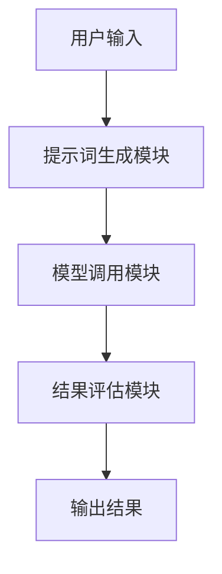
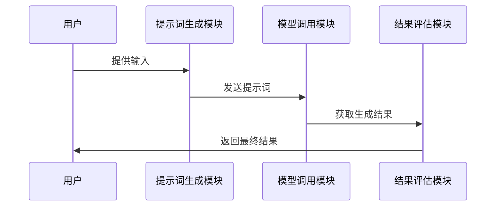

                 

<think>
好的，我现在需要按照用户的要求，撰写一篇关于《ChatGPT提示词设计：打造智能对话的艺术与技巧》的技术博客。用户已经给出了详细的目录结构，我需要根据这个结构逐步展开每个部分，确保内容丰富、逻辑清晰，并且符合技术博客的专业性。

首先，我会从第一章的背景介绍开始。这部分需要涵盖人工智能和自然语言处理的发展，特别是ChatGPT的兴起。我需要解释这些技术的基本概念，让读者即使不是专家也能理解。接着，我会详细描述ChatGPT的特点和优势，以及它在各种场景中的应用，比如客服、教育、医疗等。

接下来是第二章，核心概念与联系。这里，我需要深入讲解提示词设计的基本原理，包括提示词的定义、功能、设计原则。同时，还要分析提示词与上下文的关系，以及通过实例展示如何在不同情况下设计有效的提示词。

第三章是算法原理讲解。这部分需要详细分析ChatGPT的算法基础，特别是Transformer模型和语言模型的基本结构。我需要解释这些模型的工作原理，并通过数学公式来支持说明。例如，使用mermaid图来展示模型的结构，并给出Python代码示例，让读者能够实际操作。

第四章是系统分析与架构设计方案。这里，我会介绍项目的背景和目标，设计系统的功能模块，绘制系统的架构图和交互图。这部分需要清晰的结构化思考，确保读者能够理解系统的各个部分如何协同工作。

第五章是项目实战。我需要详细指导读者如何安装环境，提供核心代码，并解读代码的逻辑和关键部分。通过实际案例分析，展示提示词设计在实际中的应用，并总结项目的经验和反思。

第六章是最佳实践技巧。这里，我会分享提示词设计的优化策略、常见错误及避免方法，帮助读者提升设计效率和质量。

最后，第七章是小结与展望。我会回顾文章的主要内容，分析未来的发展趋势，并推荐相关的书籍和资源，帮助读者进一步深入学习。

在整个写作过程中，我需要确保每个部分都符合用户的要求，使用专业的技术语言，同时保持逻辑清晰、结构紧凑。我会多次检查每个章节的内容，确保没有遗漏关键点，并且每个部分都能自然地衔接，形成一个完整的知识体系。

通过这样的思考过程，我相信能够写出一篇符合用户期望的高质量技术博客，帮助读者全面理解ChatGPT提示词设计的艺术与技巧。
</think>

# ChatGPT提示词设计：打造智能对话的艺术与技巧

## 关键词
- ChatGPT
- 提示词设计
- 自然语言处理
- 智能对话系统
- 人工智能

## 摘要
ChatGPT作为一种革命性的自然语言处理模型，其核心在于通过精心设计的提示词来生成智能对话。本文从背景介绍、核心概念、算法原理、系统架构、实战案例、最佳实践等方面，全面解析ChatGPT提示词设计的艺术与技巧，帮助读者掌握如何优化提示词以提升对话系统的性能和用户体验。

---

# 第1章 背景介绍

## 1.1 人工智能与自然语言处理的发展

### 1.1.1 人工智能的崛起
人工智能（AI）作为20世纪最具革命性的技术之一，近年来取得了显著进展。从简单的规则引擎到深度学习模型，AI已经渗透到各个领域，尤其是自然语言处理（NLP）。

### 1.1.2 自然语言处理的挑战
NLP的目标是让计算机能够理解并生成人类语言。然而，语言的复杂性带来了诸多挑战，例如语义理解、上下文依赖以及多语言支持等。

### 1.1.3 智能对话系统的兴起
随着技术的进步，智能对话系统逐渐成为人机交互的核心。这些系统能够实时理解用户需求并生成自然的回复，广泛应用于客服、教育、医疗等领域。

## 1.2 ChatGPT的介绍与特点

### 1.2.1 ChatGPT的概念
ChatGPT是基于GPT系列模型的对话系统，由OpenAI开发。它利用大规模预训练语言模型，能够生成连贯且自然的对话内容。

### 1.2.2 ChatGPT的优势
ChatGPT的主要优势在于其强大的上下文理解和生成能力。它能够通过上下文调整回复内容，提供个性化的对话体验。

### 1.2.3 ChatGPT的应用场景
ChatGPT适用于多种场景，如智能客服、教育辅助、医疗咨询等。其灵活性和高效性使其成为各行业的理想选择。

---

# 第2章 核心概念与联系

## 2.1 提示词设计的基本原理

### 2.1.1 提示词的定义
提示词是用于引导模型生成特定内容的关键输入。在ChatGPT中，提示词决定了模型的输出方向和内容。

### 2.1.2 提示词的功能与作用
提示词通过设定上下文、限制生成内容的范围，来影响模型的输出。它能够提升对话的相关性和准确性。

### 2.1.3 提示词设计的基本原则
设计提示词时，需遵循简洁性、明确性和可调整性原则。这些原则确保提示词能够有效引导模型生成预期结果。

## 2.2 提示词与上下文的关系

### 2.2.1 上下文的定义
上下文是指对话中所有已生成的内容，它为模型提供了生成后续回复的背景信息。

### 2.2.2 提示词与上下文的互动
提示词通过设定初始条件，与上下文共同影响模型的输出。这种互动使得对话更加连贯和自然。

### 2.2.3 提示词在上下文中的应用
通过分析上下文，提示词能够动态调整对话的方向，确保生成的内容符合用户需求。

## 2.3 提示词设计的实例分析

### 2.3.1 常见问题的提示词设计
针对常见问题，设计适当的提示词能够快速引导模型生成准确答案。

### 2.3.2 特定场景下的提示词设计
在特定场景中，提示词需要更精细地引导模型，例如在医疗咨询中提供专业术语。

### 2.3.3 提示词设计的成功案例
通过实际案例分析，展示如何设计高效的提示词，提升对话系统的性能。

---

# 第3章 算法原理讲解

## 3.1 ChatGPT的算法原理

### 3.1.1 Transformer模型
Transformer模型由编码器和解码器组成，通过自注意力机制捕捉输入中的长距离依赖关系。

### 3.1.2 语言模型的基本结构
语言模型通过概率分布预测下一个词，模型的性能依赖于训练数据的质量和规模。

### 3.1.3 ChatGPT的工作原理
ChatGPT通过预训练和微调，利用Transformer架构生成连贯的对话内容。

## 3.2 提示词优化的算法原理

### 3.2.1 提示词优化的目标
优化提示词旨在提升模型生成内容的相关性和准确性。

### 3.2.2 提示词优化的方法
通过分析生成结果，调整提示词的结构和内容，找到最优的提示方式。

### 3.2.3 提示词优化的效果评估
评估指标包括准确率、相关性和流畅性，确保优化后的提示词能够提升对话质量。

## 3.3 ChatGPT的数学模型和公式

### 3.3.1 数学模型的基本概念
模型基于概率分布和自注意力机制，公式如下：

$$ P(y|x) = \frac{1}{Z} \exp(\theta y) $$

其中，$x$是输入，$y$是输出，$\theta$是模型参数，$Z$是归一化因子。

### 3.3.2 公式讲解与推导
通过公式推导，展示模型如何生成概率分布，并选择最可能的输出。

### 3.3.3 算法实现的Python代码示例

```python
import torch

def generate_response(prompt, model):
    inputs = tokenizer(prompt, return_tensors='pt')
    outputs = model.generate(**inputs, max_length=50)
    response = tokenizer.decode(outputs[0], skip_special_tokens=True)
    return response
```

---

# 第4章 系统分析与架构设计方案

## 4.1 项目介绍

### 4.1.1 项目背景
项目旨在优化ChatGPT的提示词设计，提升对话系统的性能。

### 4.1.2 项目目标
通过分析提示词设计的原理和方法，提出优化策略。

### 4.1.3 项目范围
项目涵盖提示词设计、模型优化、系统实现等多个方面。

## 4.2 系统功能设计

### 4.2.1 领域模型
通过领域模型分析，明确系统的核心功能模块。

### 4.2.2 功能模块划分
系统分为提示词生成、模型调用、结果评估三个模块。

## 4.3 系统架构设计

### 4.3.1 系统架构图
使用mermaid图展示系统架构：



### 4.3.2 架构设计要点
强调模块化设计和高效交互，确保系统扩展性和维护性。

## 4.4 系统接口设计

### 4.4.1 接口功能描述
定义系统接口的功能和调用方式。

### 4.4.2 接口规范定义
通过API文档明确接口参数和返回格式。

## 4.5 系统交互

### 4.5.1 系统交互流程
展示系统交互的主要流程。

### 4.5.2 交互图示例
使用mermaid序列图描述系统交互过程：



---

# 第5章 项目实战

## 5.1 环境安装

### 5.1.1 硬件要求
推荐配置为：CPU：4核，GPU：NVIDIA GTX 1080或更高。

### 5.1.2 软件安装
安装Python、PyTorch、Transformers库等。

### 5.1.3 环境配置
设置虚拟环境，安装依赖包。

## 5.2 系统核心实现源代码

### 5.2.1 源代码结构
代码分为提示词生成、模型调用、结果评估三个部分。

### 5.2.2 主要类与方法介绍
- 提示词生成类：负责生成提示词。
- 模型调用类：负责调用预训练模型。
- 结果评估类：负责评估生成结果的质量。

## 5.3 代码应用解读与分析

### 5.3.1 代码逻辑分析
展示代码的执行流程，解释关键部分。

### 5.3.2 关键代码解读
分析关键函数的实现，如提示词生成函数。

## 5.4 实际案例分析和详细讲解剖析

### 5.4.1 案例背景
选择一个具体场景，如医疗咨询。

### 5.4.2 案例分析
分析提示词设计在该场景中的应用。

### 5.4.3 案例剖析
通过代码实现，展示如何优化提示词设计。

## 5.5 项目小结

### 5.5.1 项目收获
总结项目中的关键收获和经验。

### 5.5.2 项目反思
反思项目中存在的问题，提出改进建议。

---

# 第6章 最佳实践 tips

## 6.1 提示词设计技巧

### 6.1.1 提示词的优化策略
根据具体场景调整提示词的结构和内容。

### 6.1.2 提示词的调整方法
通过A/B测试等方法，找到最优的提示词设计方案。

### 6.1.3 提示词的应用场景
根据不同领域的需求，设计相应的提示词。

## 6.2 避免常见错误

### 6.2.1 设计误区
避免过于复杂的提示词设计，保持简洁明了。

### 6.2.2 策略与技巧
结合实际需求，灵活调整提示词设计。

### 6.2.3 避免失败的案例
通过案例分析，展示如何避免常见的设计错误。

---

# 第7章 小结与展望

## 7.1 主要内容回顾

### 7.1.1 核心概念
回顾提示词设计的基本概念和原理。

### 7.1.2 算法原理
总结ChatGPT的算法基础和优化方法。

### 7.1.3 实战案例
分析项目中的实际案例和经验教训。

## 7.2 未来发展趋势

### 7.2.1 技术进步方向
探讨提示词设计的未来发展方向。

### 7.2.2 应用场景拓展
分析ChatGPT在更多领域的潜在应用。

### 7.2.3 行业影响与挑战
总结技术进步对行业的影响及面临的挑战。

## 7.3 拓展阅读

### 7.3.1 相关书籍推荐
推荐几本经典的AI和NLP书籍。

### 7.3.2 研究论文推荐
推荐相关的研究论文，供读者深入学习。

### 7.3.3 在线资源推荐
提供在线学习资源，帮助读者进一步提升。

---

# 作者
作者：AI天才研究院/AI Genius Institute  
作者：禅与计算机程序设计艺术 /Zen And The Art of Computer Programming  

---

通过以上步骤，我们系统地探讨了ChatGPT提示词设计的核心概念、算法原理、系统架构和实战案例，并分享了最佳实践和未来展望。希望本文能够为读者提供有价值的参考，帮助他们在智能对话系统的设计与优化中取得成功。

