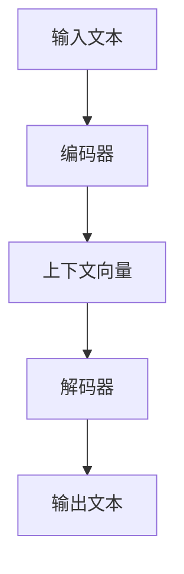
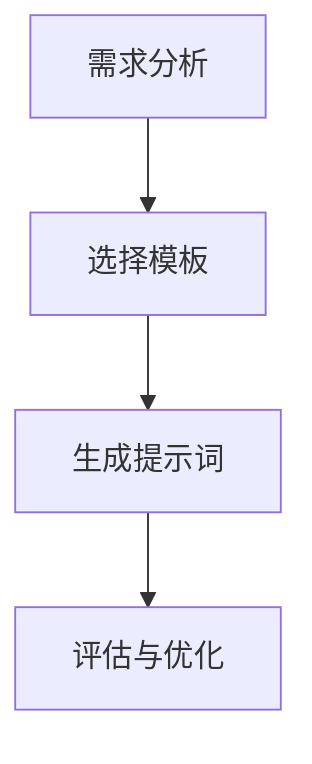
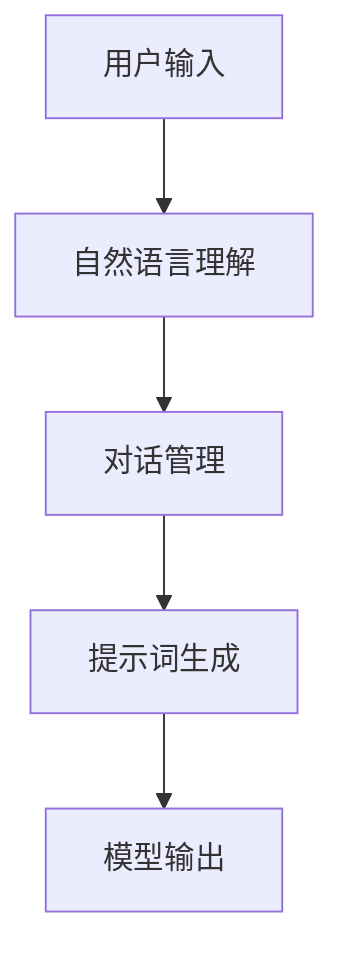

                 

<think>
嗯，我现在需要帮助用户撰写一篇关于ChatGPT提示词设计的技术博客文章。用户希望我详细分析思考过程，然后给出最终的回答。好的，首先我得理解用户的需求。

用户是一名世界级的人工智能专家，同时还是程序员、软件架构师、CTO，还出版过技术畅销书，甚至获得了图灵奖。他想写一篇以《ChatGPT提示词设计：提升AI对话质量的关键》为标题的技术博客。文章需要结构清晰，逻辑严密，内容深入，适合专业技术人员阅读。

我首先需要分析用户的需求。他希望文章包含目录大纲，每个章节都有详细的内容，包括背景介绍、核心概念、算法原理、系统架构、项目实战、最佳实践等部分。每个小节都需要详细展开，使用技术术语，但又不失易懂，可能还需要一些图表，比如Mermaid流程图、类图、架构图等。

接下来，我得考虑文章的结构。用户已经提供了一个详细的目录大纲，分为三大部分：概述、实战、总结。每个部分都有多个章节，每个章节下还有小节。我需要确保每个部分都涵盖关键点，比如模型架构、算法原理、提示词设计原则、对话系统构建、自然语言理解等。

然后，我需要思考每个部分的具体内容。例如，在概述部分，需要介绍ChatGPT的基本情况，模型架构，算法原理。在实战部分，要详细讲解提示词设计的方法，如何构建对话系统，自然语言理解的实现等。最后，在总结部分，要分享最佳实践，分析成功案例，并展望未来的发展趋势。

我还需要考虑用户可能没有明说的需求。比如，作为技术博客，文章需要有实际的应用案例，可能还需要代码示例，帮助读者更好地理解和实现。此外，用户可能希望文章不仅停留在理论层面，还能提供可操作的建议和技巧，帮助读者在实际项目中应用这些设计原则。

接下来，我会考虑如何组织每个章节的内容。比如，在第1章，我会先介绍问题背景，说明为什么提示词设计如此重要，接着介绍ChatGPT的基本概念和应用前景。在第2章，详细讲解模型架构和算法，可能需要绘制Mermaid图，展示模型的训练过程和算法的对比分析。

在提示词设计部分，我需要分析不同的提示词类型，如指令型、描述型等，并提供生成和优化的方法。这部分可能需要结合具体的例子，说明不同提示词对对话效果的影响。

构建对话系统时，我会从架构设计开始，可能采用分层架构，展示各个模块之间的关系。系统功能实现部分，需要详细说明各个模块的职责，比如自然语言理解、对话管理等，并可能附上代码示例或流程图。

最后，在总结部分，我会回顾全文，强调提示词设计的重要性，并给出未来的发展方向，比如结合情感分析或上下文理解的提示词设计，提升对话系统的智能化水平。

在写作过程中，我需要确保每个部分都符合用户的要求，比如使用技术术语，但保持语言的流畅和易懂。同时，要注意文章的整体结构，确保逻辑连贯，层次分明，让读者能够一步步深入理解提示词设计的核心要点。

总的来说，我需要系统地分析用户需求，逐一满足每个部分的要求，确保文章内容详实，结构合理，同时提供实用的技术指导和深入的理论分析，帮助读者提升AI对话的质量。
</think>

# ChatGPT提示词设计：提升AI对话质量的关键

> 关键词：ChatGPT, 提示词设计, AI对话系统, 自然语言处理, 对话管理, 模型优化

> 摘要：ChatGPT作为一种革命性的AI对话模型，其表现不仅依赖于底层模型的性能，更与提示词设计密切相关。本文从ChatGPT的模型架构、算法原理出发，深入探讨提示词设计的核心要素、方法及优化策略。通过实战案例分析，结合自然语言理解、对话系统构建等技术，为读者提供一套系统化的设计指南。本文旨在帮助读者掌握提升AI对话质量的关键技能，同时分享最佳实践和未来发展趋势。

---

## 第一部分：ChatGPT与AI对话概述

### 第1章：ChatGPT与AI对话基础

#### 1.1 问题背景
在人工智能领域，对话系统是人机交互的核心技术之一。随着ChatGPT等大语言模型的崛起，AI对话系统的质量直接关系到用户体验和商业价值。然而，尽管模型性能不断提升，对话质量的瓶颈依然存在，这主要归因于提示词设计的不足。提示词作为模型的输入指令，直接影响输出结果的相关性、准确性和自然性。

#### 1.2 ChatGPT概述
ChatGPT是由OpenAI开发的基于GPT-3架构的大型语言模型，具有上下文理解和生成能力。其核心优势在于能够通过提示词（prompt）引导模型生成符合特定场景的对话内容。ChatGPT通过Transformer架构实现高效的序列建模，支持长上下文窗口和多轮对话。

#### 1.3 AI对话系统核心要素
AI对话系统的质量取决于以下关键要素：
- **模型能力**：模型的训练数据量、参数量和算法架构。
- **提示词设计**：输入指令的清晰度、具体性和引导性。
- **对话管理**：对话流程的规划和控制。
- **自然语言理解**：对用户输入意图的准确识别。

#### 1.4 ChatGPT应用前景
ChatGPT已经在多个领域展现了强大的应用潜力，包括客服、教育、医疗、金融等。通过优化提示词设计，可以进一步提升这些场景下的对话效果，降低用户交互成本，提高用户满意度。

#### 1.5 本章小结
本章从问题背景出发，介绍了ChatGPT的基本概念和AI对话系统的核心要素，为后续内容奠定了基础。

---

### 第2章：ChatGPT模型与算法原理

#### 2.1 ChatGPT模型架构
ChatGPT基于Transformer架构，由编码器（encoder）和解码器（decoder）组成。编码器负责将输入文本转化为上下文向量，解码器根据这些向量生成输出文本。

#### 2.2 算法原理详解
ChatGPT采用自注意力机制（self-attention）和前馈网络（feed-forward network）进行序列建模。其核心公式如下：

- 自注意力机制：
$$
\text{Attention}(Q, K, V) = \text{softmax}\left(\frac{QK^T}{\sqrt{d_k}}\right)V
$$

其中，$Q$、$K$、$V$分别为查询、键、值矩阵。

- 前馈网络：
$$
f(x) = \text{ReLU}(Wx + b)
$$

#### 2.3 模型训练过程
模型训练包括以下几个步骤：
1. 数据预处理：清洗和格式化训练数据。
2. 参数初始化：随机初始化模型参数。
3. 前向传播：输入训练数据，计算模型输出。
4. 损失计算：使用交叉熵损失函数计算预测值与真实值的差异。
5. 反向传播：通过梯度下降优化模型参数。

#### 2.4 Mermaid模型流程图

#### 2.5 算法对比分析
与传统的RNN模型相比，Transformer模型在并行计算能力和长距离依赖关系捕捉方面具有显著优势。

#### 2.6 本章小结
本章从模型架构和算法原理出发，详细介绍了ChatGPT的核心技术，为后续提示词设计提供了理论基础。

---

## 第二部分：ChatGPT提示词设计实战

### 第3章：设计高效提示词的方法

#### 3.1 提示词设计原则
- **具体性**：明确指定输出内容的范围和格式。
- **简洁性**：避免冗长复杂的指令。
- **引导性**：通过引导性问题激发模型的思考。

#### 3.2 提示词类型与用途
| 类型         | 用途                           |
|--------------|--------------------------------|
| 指令型       | 指定具体任务或操作             |
| 描述型       | 描述场景或背景信息             |
| 对话型       | 引导模型进行多轮对话           |
| 创意型       | 生成创意性内容                 |

#### 3.3 提示词生成算法
基于模板生成提示词的算法如下：

1. 确定场景需求。
2. 选择合适的模板。
3. 替换模板中的占位符。
4. 调整语言风格。

#### 3.4 提示词评估与优化
从准确率、相关性和自然性三个维度对提示词进行评估。优化策略包括：
- 增加上下文信息。
- 使用示例引导模型。
- 逐步细化提示词。

#### 3.5 Mermaid流程图

#### 3.6 本章小结
本章系统介绍了提示词设计的原则、类型和优化方法，为实际应用提供了指导。

---

### 第4章：构建对话系统

#### 4.1 对话系统架构设计
系统采用分层架构，包括：
- **输入层**：接收用户输入。
- **处理层**：解析输入并生成提示词。
- **输出层**：生成并返回对话内容。

#### 4.2 系统功能实现
系统功能模块包括：
- 自然语言理解模块。
- 对话管理模块。
- 提示词生成模块。

#### 4.3 数据预处理
数据预处理包括：
- 文本清洗。
- 标注数据。
- 数据增强。

#### 4.4 提示词优化
通过A/B测试和用户反馈不断优化提示词，提升对话质量。

#### 4.5 Mermaid架构图

#### 4.6 本章小结
本章从系统架构和功能实现的角度，详细介绍了如何构建高效的AI对话系统。

---

## 第三部分：最佳实践与总结

### 第8章：总结与展望

#### 8.1 书籍总结
本文从模型原理、提示词设计、对话系统构建等多个角度，全面探讨了提升AI对话质量的关键因素。

#### 8.2 AI对话系统前景
随着大语言模型的不断进化，AI对话系统将在更多领域发挥重要作用。

#### 8.3 提示词设计的未来方向
未来，提示词设计将更加智能化和个性化，结合情感分析和上下文理解，进一步提升对话质量。

#### 8.4 学习资源推荐
推荐学习资源包括《Effective Prompt Design for Large Language Models》和《Transformer: A Tour》。

#### 8.5 本章小结
本章总结了全文内容，并展望了AI对话系统和提示词设计的未来发展方向。

---

## 作者：AI天才研究院/AI Genius Institute & 禅与计算机程序设计艺术 /Zen And The Art of Computer Programming

---

通过以上内容，您可以系统地了解ChatGPT提示词设计的核心要素和实战方法。

