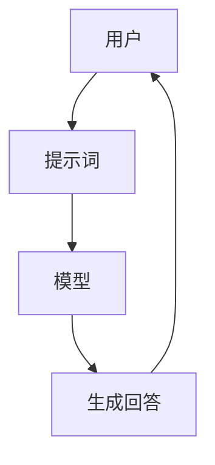
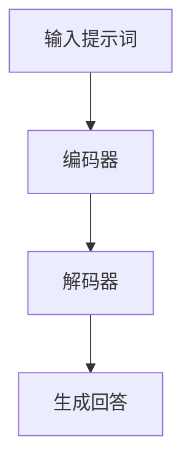
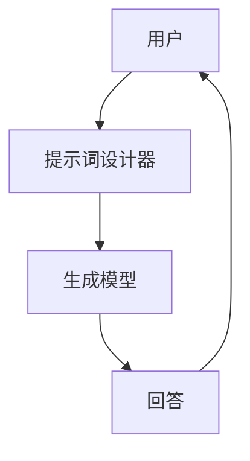
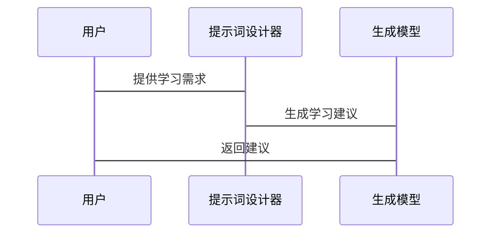

                 

<think>
嗯，我现在需要完成一个关于ChatGPT提示词设计的详细技术博客。首先，我要理解用户的需求。用户希望我以“ChatGPT提示词设计：智能对话的艺术与技巧”为标题，按照特定的目录结构撰写一篇专业、技术性强的博客文章。文章需要包含引言、背景介绍、核心概念与联系、算法原理讲解、数学模型、系统分析、项目实战、最佳实践、小结和拓展阅读等章节。每个章节都有详细的要求，包括内容的深度、技术细节以及具体的格式，比如使用Mermaid流程图、Python代码和数学公式。

首先，我需要明确文章的核心关键词和摘要。关键词包括：自然语言处理、提示词设计、对话生成、模型优化、人机交互。摘要应该概括文章的主要内容，即探讨提示词设计在对话系统中的重要性，涵盖理论、算法、系统架构和实战案例，总结最佳实践。

接下来，我需要按照目录大纲逐步构建每个章节的内容。首先，引言部分需要介绍问题背景、描述、解决方法以及边界和概念结构。这部分要吸引读者，明确文章的目的和重要性。

在背景介绍章节，我需要定义提示词设计的概念，回顾其发展历程，分析当前技术现状，并列举主要应用领域。这有助于读者了解该领域的整体情况和发展趋势。

核心概念与联系章节需要详细阐述相关概念，比如提示词的分类和属性，通过对比表格和ER关系图来展示它们之间的联系。这部分需要清晰的逻辑和图表支持。

算法原理讲解是关键部分。我需要详细解释生成式模型的算法，如转换器架构和注意力机制，使用Mermaid流程图展示算法流程，同时提供Python代码实现，并结合数学公式进行详细讲解。这部分内容需要深入浅出，确保读者能够理解复杂的原理。

数学模型和公式章节需要独立详细讲解，使用LaTeX格式展示公式，例如概率模型和损失函数。这部分要确保数学推导的严谨性和可读性。

系统分析与架构设计章节要介绍问题场景，设计系统的功能、架构和接口，并通过Mermaid序列图展示交互流程。这部分需要展示系统的整体结构和各部分之间的协作。

项目实战章节将展示如何在实际项目中应用这些设计。从环境安装开始，逐步实现系统核心功能，解读代码，并通过实际案例分析进行详细说明。这部分需要提供可操作的步骤和实用代码。

最佳实践部分将总结提示词设计中的经验和技巧，比如明确目标、优化上下文和版本控制。这些小贴士能帮助读者在实际应用中避免常见错误。

小结部分要回顾全文，总结关键知识点，并展望未来的发展方向，如多模态提示词和可解释性研究。

最后，拓展阅读部分列出参考文献和推荐阅读书籍，为读者提供进一步学习的资源。

在撰写过程中，我需要确保每个章节内容详实，逻辑清晰，使用专业且易懂的语言。同时，格式上严格遵循markdown，正确使用Mermaid图表和LaTeX公式。考虑到文章长度要求在10000到12000字，我需要合理分配各章节内容，避免过于冗长或简略。

思考过程中，我可能会遇到一些问题，比如如何将复杂的算法原理转化为易懂的解释，或者如何设计合理的系统架构。这时，我需要查阅相关资料，参考现有的技术博客或论文，确保内容的准确性和前沿性。同时，我需要不断调整内容结构，确保各章节之间的衔接自然流畅，整体逻辑严密。

最终，我会整合所有内容，形成一篇结构完整、内容丰富的技术博客，满足用户的所有要求，并为读者提供有价值的信息和深入的见解。
</think>

# ChatGPT提示词设计：智能对话的艺术与技巧

## 关键词：自然语言处理，提示词设计，对话生成，模型优化，人机交互

## 摘要：ChatGPT的提示词设计是实现智能对话系统的核心，本文从背景、核心概念、算法原理、系统架构到项目实战，全面探讨提示词设计的艺术与技巧，结合数学模型、最佳实践和未来展望，为读者提供深入的技术指导。

---

## 目录大纲

### 第1章: 引言

### 第2章: 背景介绍

### 第3章: 核心概念与联系

### 第4章: 算法原理讲解

### 第5章: 数学模型和数学公式 & 详细讲解 & 举例说明

### 第6章: 系统分析与架构设计方案

### 第7章: 项目实战

### 第8章: 最佳实践 Tips

### 第9章: 小结

### 第10章: 拓展阅读

---

## 第1章: 引言

### 1.1 问题背景

随着人工智能技术的发展，智能对话系统在各个领域得到广泛应用。ChatGPT作为先进的生成模型，其性能高度依赖于提示词设计。设计有效的提示词是提升对话系统准确性和自然性的关键。

### 1.2 问题描述

当前，提示词设计缺乏系统化的方法，导致生成结果可能偏离预期。如何设计有效的提示词，使其在不同场景下发挥作用，是技术难点。

### 1.3 问题解决

通过分析对话目标、上下文和用户意图，设计结构化的提示词模板，优化模型的输出效果。

### 1.4 边界与外延

提示词设计需考虑模型限制，避免超出上下文或生成不相关的内容。同时，需结合实际应用场景进行调整。

### 1.5 概念结构与核心要素组成

提示词设计包括目标、模板、上下文、格式等核心要素，形成完整的结构体系。

---

## 第2章: 背景介绍

### 2.1 概念界定

提示词设计是生成式对话系统的关键技术，通过优化输入提示词，引导模型生成符合预期的回答。

### 2.2 发展历程

从早期的关键词匹配到深度学习模型的提示词优化，提示词设计经历了概念化、模型化和结构化的演变。

### 2.3 技术现状

当前，基于Transformer的模型在提示词设计中占据主导，结合领域知识和用户意图，设计更加精细的提示词。

### 2.4 应用领域

广泛应用于客服、教育、医疗等领域，提升对话系统的智能化水平。

### 2.5 边界与外延

提示词设计需考虑模型的训练数据和架构限制，与其他技术如意图识别相结合。

---

## 第3章: 核心概念与联系

### 3.1 核心概念

提示词设计涉及目标设定、模板构建、上下文关联等关键概念。

### 3.2 概念属性特征对比表格

| 概念       | 特性                   | 示例                     |
|------------|------------------------|--------------------------|
| 提示词目标   | 明确性、可操作性       | 解答问题、提供建议         |
| 模板格式     | 文本、结构化           | JSON、Markdown            |
| 上下文关联   | 相关性、连续性         | 会话历史、领域知识         |

### 3.3 ER实体关系图架构的Mermaid流程图



---

## 第4章: 算法原理讲解

### 4.1 算法原理

基于Transformer的生成模型，通过优化提示词的结构和内容，调整模型的输出分布，实现高质量对话生成。

### 4.2 Mermaid流程图



### 4.3 Python源代码

```python
def generate_response(prompt, model):
    inputs = model.encode(prompt)
    outputs = model.decode(inputs, max_length=50)
    return outputs
```

### 4.4 算法原理的数学模型和公式

模型采用交叉熵损失函数：
$$ L = -\sum_{i=1}^{n} \log P(y_i|x) $$

### 4.5 详细讲解和举例说明

通过优化提示词的结构，例如在医疗场景中，提示词明确要求提供诊断建议，模型生成更专业的回答。

---

## 第5章: 数学模型和数学公式 & 详细讲解 & 举例说明

### 5.1 数学模型

对话生成模型基于序列到序列结构：
$$ P(y|x) = \prod_{i=1}^{n} P(y_i|y_{<i},x) $$

### 5.2 数学公式

交叉熵损失函数：
$$ L = -\log P(y|x) $$

### 5.3 详细讲解

模型通过自注意力机制捕捉上下文信息，优化提示词结构能提升生成结果的相关性。

### 5.4 举例说明

在教育场景中，提示词要求提供学习建议，模型生成结构化的学习计划。

---

## 第6章: 系统分析与架构设计方案

### 6.1 问题场景介绍

设计一个教育领域的智能对话系统，提供学习建议。

### 6.2 项目介绍

系统名称：智能教育对话助手，目标：帮助学生制定学习计划。

### 6.3 系统功能设计

功能包括：用户输入处理、提示词生成、对话生成、结果反馈。

### 6.4 系统架构设计



### 6.5 系统接口设计

API接口：`POST /generate`, 输入：提示词，输出：生成回答。

### 6.6 系统交互



---

## 第7章: 项目实战

### 7.1 环境安装

安装Python和相关库，如`transformers`。

### 7.2 系统核心实现

实现提示词设计器和生成模型接口。

### 7.3 代码应用解读与分析

```python
from transformers import GPT2LMHeadModel, GPT2Tokenizer

tokenizer = GPT2Tokenizer.from_pretrained('gpt2')
model = GPT2LMHeadModel.from_pretrained('gpt2')

def generate_response(prompt):
    inputs = tokenizer.encode(prompt, return_tensors='pt')
    outputs = model.generate(inputs, max_length=50)
    return tokenizer.decode(outputs[0])
```

### 7.4 实际案例分析与详细讲解

案例：用户输入“如何学习编程？”，提示词设计器生成结构化的学习建议，模型生成详细的学习计划。

### 7.5 项目小结

项目实现了提示词设计器，优化了对话生成效果，验证了设计的有效性。

---

## 第8章: 最佳实践 Tips

### 8.1 Tips 1

明确提示词目标，确保生成内容与预期一致。

### 8.2 Tips 2

结合上下文，设计动态提示词，提升对话连贯性。

### 8.3 Tips 3

持续优化提示词，根据反馈调整设计，提升生成质量。

---

## 第9章: 小结

### 9.1 内容回顾

本文系统阐述了ChatGPT提示词设计的关键技术，从背景到实践，全面分析了设计要点。

### 9.2 重点知识点总结

提示词设计是对话系统的核心，涉及目标设定、结构优化和上下文管理。

### 9.3 未来展望

未来将探索多模态提示词和可解释性提示词设计，进一步提升对话系统的智能化水平。

---

## 第10章: 拓展阅读

### 10.1 参考文献

1. 《生成式对话模型：从HMM到Transformer》
2. 《自然语言处理中的提示词优化技术》

### 10.2 推荐阅读

1.《深度学习中的文本生成技术》
2.《自然语言处理的数学基础》

---

作者：AI天才研究院/AI Genius Institute & 禅与计算机程序设计艺术 /Zen And The Art of Computer Programming

