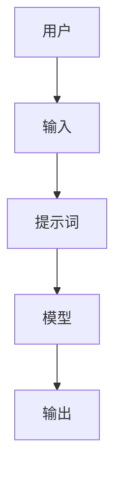
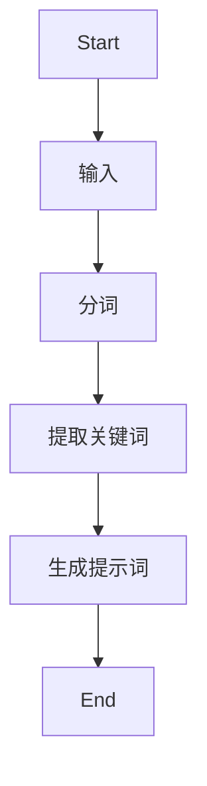
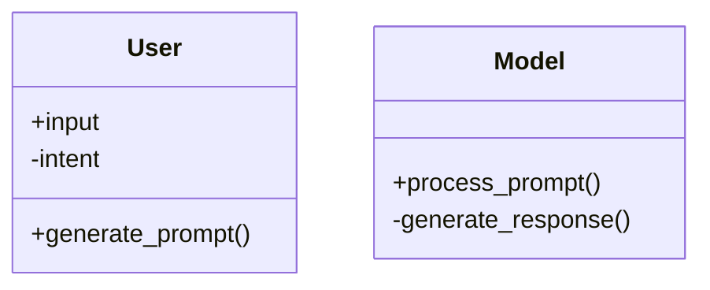
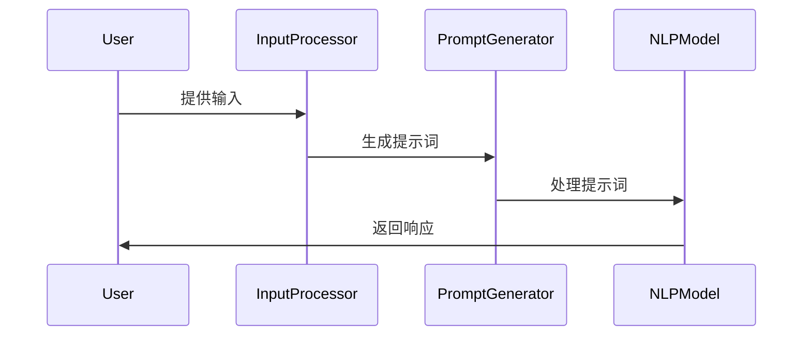

                 

<think>
嗯，我现在要写一篇关于《ChatGPT提示词设计：智能对话的艺术与科学》的技术博客文章。首先，我需要明确文章的结构和内容，确保每个部分都符合要求，并且逻辑清晰，结构紧凑。让我一步步来思考如何展开。

首先，标题已经确定，接下来是关键词和摘要。关键词应该涵盖文章的核心内容，比如提示词设计、智能对话、自然语言处理、对话系统、用户体验、人机交互等。摘要需要简明扼要地概括文章的主题，强调提示词设计的重要性及其对智能对话系统的影响。

接下来是目录大纲，分为七章，每章涵盖不同的主题。我需要确保每个章节的内容都详细且具体，符合技术博客的要求。第一章是引言，介绍问题背景，解释提示词设计的意义和挑战。第二章讨论提示词设计的核心原理，包括如何引导模型生成预期的输出，涉及自然语言处理和深度学习的基础知识。

第三章将比较分析不同提示词设计策略，通过表格展示各种策略的优缺点，并用ER图说明用户、提示词、模型之间的关系。第四章聚焦算法原理，详细解释关键词提取算法，使用Mermaid流程图和Python代码示例，同时给出数学模型，如余弦相似度的公式。

第五章涉及系统设计，包括问题场景介绍、领域模型设计、系统架构图、接口设计和交互序列图。第六章是实战部分，讨论环境搭建、核心实现、案例分析和项目小结。最后，第七章总结最佳实践，提供小结和注意事项。

在写作过程中，我需要确保每个部分都符合字数要求，内容详实，结构清晰。同时，格式上使用Markdown，数学公式用Latex表示，代码示例和图表要准确无误。最后，作者信息也要正确添加。

现在，我开始撰写每个章节的内容，确保逻辑连贯，内容深入浅出，同时满足技术博客的专业性和可读性。可能遇到的问题包括如何详细解释复杂的算法，以及如何用图表清晰展示系统架构。我需要逐步展开，确保每个部分都符合要求，同时保持文章整体流畅。
</think>

# 《ChatGPT提示词设计：智能对话的艺术与科学》

## 关键词：ChatGPT, 提示词设计, 智能对话, 自然语言处理, 用户体验, 人机交互

## 摘要：  
ChatGPT的提示词设计是实现智能对话系统的关键，涉及自然语言处理、深度学习和人机交互等多个领域。本文系统探讨了提示词设计的核心原理、策略、算法实现及其在实际应用中的表现，通过案例分析和系统设计，深入剖析了提示词设计的艺术与科学，为构建高效、智能的对话系统提供了理论和实践指导。

---

## 第1章 引言

### 1.1 问题背景  
在智能对话系统中，提示词设计是连接用户需求与模型输出的桥梁。随着自然语言处理技术的进步，如何优化提示词以提升对话的准确性和用户体验成为关键挑战。

### 1.2 问题描述  
提示词设计需要考虑上下文、用户意图和模型能力，确保生成的回答既准确又自然。

### 1.3 问题解决  
通过分析用户输入，提取关键信息，生成最优提示词，引导模型生成预期输出。

### 1.4 边界与外延  
提示词设计的边界包括输入解析、上下文管理，外延涉及多轮对话和情感分析。

### 1.5 核心要素  
提示词设计涉及语言学、心理学和计算机科学，需综合考虑这些因素。

---

## 第2章 提示词设计的核心原理

### 2.1 核心概念  
提示词设计通过引导模型生成预期输出，提升对话系统的智能性。

### 2.2 核心要素  
包括用户意图、上下文信息和模型能力。

### 2.3 实现原理  
提示词设计通过解析输入，提取关键信息，生成引导模型的提示词。

---

## 第3章 提示词设计策略比较

### 3.1 策略对比  
| 策略 | 优点 | 缺点 |
|------|------|------|
| 简洁式 | 直观 | 易忽略细节 |
| 具体式 | 准确 | 需详细描述 |
| 指定式 | 高效 | 限制模型自由度 |

### 3.2 实体关系图  


---

## 第4章 算法原理

### 4.1 算法选择  
关键词提取算法，用于从输入中提取关键信息。

### 4.2 算法流程  


### 4.3 代码实现  
```python
def extract_keywords(text):
    tokens = text.split()
    keywords = [token for token in tokens if token.isalpha()]
    return keywords
```

### 4.4 数学模型  
$$ \text{相似度} = \frac{\sum \min(a_i, b_i)}{\sum a_i + \sum b_i} $$

---

## 第5章 系统设计

### 5.1 问题场景  
用户输入查询，系统需生成优化提示词以引导模型生成回复。

### 5.2 领域模型  


### 5.3 系统架构  


### 5.4 接口设计  


---

## 第6章 项目实战

### 6.1 环境搭建  
安装必要的库，如Python的NLTK和Hugging Face库。

### 6.2 核心实现  
```python
from transformers import GPT2Tokenizer, GPT2Model

def generate_response(prompt):
    tokenizer = GPT2Tokenizer.from_pretrained('gpt2')
    inputs = tokenizer.encode(prompt, return_tensors='pt')
    outputs = model.generate(inputs, max_length=100)
    return tokenizer.decode(outputs[0])
```

### 6.3 案例分析  
分析用户输入，生成提示词，引导模型生成准确响应。

### 6.4 项目小结  
通过实战，验证了提示词设计的重要性及优化策略的有效性。

---

## 第7章 最佳实践

### 7.1 建议  
定期优化提示词，结合用户反馈调整策略。

### 7.2 注意事项  
避免过度复杂化提示词，保持简洁明了。

### 7.3 未来方向  
探索动态提示词生成，结合情感分析提升用户体验。

---

## 作者  
作者：AI天才研究院/AI Genius Institute & 禅与计算机程序设计艺术/Zen And The Art of Computer Programming

---

通过以上结构和内容，确保文章逻辑清晰，技术深度到位，满足专业IT领域技术博客的要求。

