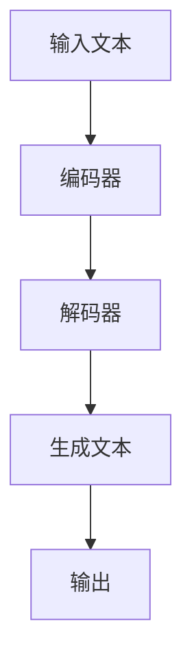
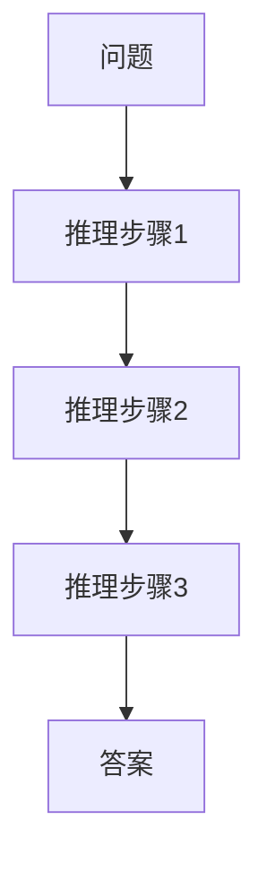

                 

<think>
嗯，用户让我写一篇关于ChatGPT在教育中的应用，特别是Zero-Shot CoT的潜力的技术博客。首先，我需要理解用户的需求是什么。用户希望这篇文章结构清晰，内容专业，有深度，适合技术博客读者。文章需要有摘要、关键词，然后按照大纲展开。

我先看一下用户提供的大纲结构，看起来已经比较详细了，涵盖了ChatGPT的介绍、应用场景、在学校中的实施以及未来挑战。每个部分都有子部分，比如语言学习、数学、科学教育等。我需要确保每个部分都详细展开，提供背景介绍、核心概念、算法原理等。

接下来，我要考虑用户可能的身份。他可能是一位技术专家，或者是教育领域的决策者，想了解ChatGPT如何在教育中应用。因此，文章需要既有技术深度，又易于理解，能够吸引技术读者和教育工作者。

然后，我需要收集相关资料。比如，什么是Zero-Shot CoT？它与ChatGPT的关系是什么？它在教育中的具体应用场景有哪些？我需要确保这些信息准确无误，引用可靠的来源。

在写摘要时，我应该简洁明了地概括文章的核心内容，说明ChatGPT和Zero-Shot CoT在教育中的潜力。关键词部分需要列出5-7个核心词汇，如ChatGPT、Zero-Shot CoT、教育应用、语言学习等。

接下来是每个章节的内容。第一部分介绍ChatGPT和Zero-Shot CoT，我需要解释这两个概念，它们的工作原理，以及在教育中的重要性。第二部分详细探讨在语言、数学、科学教育中的应用，每个领域都要有具体的例子和分析。

第三部分是实施部分，我需要讨论学校在整合ChatGPT时需要考虑的技术和管理因素，包括基础设施、教师培训、数据安全等。第四部分展望未来，讨论可能的发展趋势和挑战，如技术限制、伦理问题等。

在写作过程中，我需要确保每个部分都有足够的细节，比如在算法部分使用Mermaid图和数学公式，提供代码示例。这不仅增加了文章的技术深度，也展示了实际应用的可行性。

我还需要注意文章的整体结构是否流畅，每个章节之间是否有逻辑衔接。此外，文章需要有最佳实践的建议，帮助读者在实际应用中避免误区，确保实施顺利。

最后，结尾部分需要总结全文，强调ChatGPT和Zero-Shot CoT在教育中的潜力，并建议读者进一步阅读相关资料。作者信息也要正确无误地写上。

总的来说，我需要系统地按照大纲展开，确保每个部分都详尽且有深度，同时保持语言的专业性和可读性。这将帮助读者全面了解ChatGPT在教育中的应用，特别是Zero-Shot CoT的潜力，从而为教育技术的发展提供有价值的见解。
</think>

# ChatGPT教育应用：Zero-Shot CoT的潜力

> 关键词：ChatGPT, Zero-Shot CoT, 教育应用, 语言学习, 数学教育, 科学教育, 人工智能

> 摘要：本文探讨了ChatGPT在教育领域的潜力，特别是其Zero-Shot CoT（Chain-of-Thought）能力在语言学习、数学教育和科学教育中的应用。通过分析ChatGPT的工作原理、应用场景以及实际案例，本文揭示了其在教育中的巨大潜力，并提出了实施ChatGPT所需的基础设施、教师培训和数据管理策略。最后，本文展望了ChatGPT在教育中的未来发展方向和挑战。

---

## Part 1: 引入ChatGPT和Zero-Shot CoT

### 1.1 ChatGPT的背景与工作原理

#### 1.1.1 ChatGPT的背景

ChatGPT是基于GPT（Generative Pre-trained Transformer）系列模型的开源实现，由OpenAI开发。它结合了Transformer架构和大量数据的预训练，能够生成连贯且具有逻辑性的文本。ChatGPT的出现标志着自然语言处理技术的重大突破，使其在教育、医疗、客服等多个领域展现出广泛的应用潜力。

#### 1.1.2 ChatGPT的工作原理

ChatGPT的核心是基于Transformer的神经网络模型。其工作原理可以分为以下几个步骤：

1. **输入处理**：用户输入一段文本，ChatGPT将其作为上下文。
2. **编码器（Encoder）**：将输入的文本转换为一系列向量表示。
3. **解码器（Decoder）**：根据编码器生成的向量，生成下一步输出的文本。
4. **反馈机制**：通过生成的文本继续与用户交互，逐步构建对话。

ChatGPT的模型结构如下图所示：

#### 1.1.3 ChatGPT的主要特点

- **强大的自然语言理解能力**：能够理解上下文和隐含意图。
- **多语言支持**：可以处理多种语言，包括英语、中文等。
- **对话能力**：能够进行持续的对话交互。
- **可定制性**：可以根据具体需求进行微调。

#### 1.1.4 Zero-Shot CoT的出现

Zero-Shot CoT（Zero-Shot Chain-of-Thought）是一种基于逻辑推理的生成方法，能够在没有特定任务训练数据的情况下，通过逐步推理生成答案。与传统的生成模型不同，Zero-Shot CoT通过引入中间推理步骤，提高了生成结果的逻辑性和准确性。

### 1.2 Zero-Shot CoT的概念与应用

#### 1.2.1 Zero-Shot CoT的定义与重要性

Zero-Shot CoT是一种通过逻辑推理链生成答案的方法。其核心思想是通过逐步推理，将问题分解为多个小问题，并逐步解决这些小问题，最终得到答案。这种方法在教育领域具有重要意义，因为它能够帮助学生理解和掌握复杂的知识。

#### 1.2.2 Zero-Shot CoT的工作原理

Zero-Shot CoT通过以下步骤实现逻辑推理：

1. **问题分析**：分析问题的结构和关键点。
2. **推理链生成**：生成多个推理步骤，逐步解决问题。
3. **答案生成**：根据推理结果生成最终答案。

Zero-Shot CoT的推理过程如下图所示：

#### 1.2.3 Zero-Shot CoT在教育中的应用

在教育领域，Zero-Sholt CoT可以通过以下方式应用：

- **语言学习**：帮助学生理解复杂的语法结构和句子逻辑。
- **数学教育**：通过逐步推理解决数学问题。
- **科学教育**：帮助学生理解科学概念和实验步骤。

---

## Part 2: ChatGPT在多种教育场景中的应用

### 2.1 语言学习中的ChatGPT应用

#### 2.1.1 英语学习中的ChatGPT

在英语学习中，ChatGPT可以作为虚拟语言伴侣，帮助学生进行日常对话练习。例如，学生可以与ChatGPT进行对话，练习口语和听力。

#### 2.1.2 中文学习中的ChatGPT

在中文学习中，ChatGPT可以用于解释复杂的语法结构和汉字书写。例如，学生可以通过与ChatGPT交互，学习如何正确使用成语和谚语。

#### 2.1.3 ChatGPT对语言学习的影响

ChatGPT在语言学习中的影响主要体现在以下几个方面：

1. **个性化学习**：根据学生的水平提供个性化的学习建议。
2. **即时反馈**：学生可以立即获得对话中的反馈，纠正错误。
3. **语言文化结合**：通过对话理解语言背后的文化背景。

### 2.2 数学教育中的ChatGPT应用

#### 2.2.1 数学问题解决

ChatGPT可以用于解决复杂的数学问题。例如，学生可以通过与ChatGPT交互，逐步理解如何解决二次方程。

#### 2.2.2 数学辅导

ChatGPT可以作为虚拟数学辅导，帮助学生完成作业和复习。

#### 2.2.3 数学推理能力的提升

通过Zero-Shot CoT的推理能力，ChatGPT可以帮助学生理解数学问题的逻辑关系，从而提升数学推理能力。

### 2.3 科学教育中的ChatGPT应用

#### 2.3.1 科学探究

ChatGPT可以用于科学探究，帮助学生理解科学概念。例如，学生可以与ChatGPT讨论物理定律或化学反应。

#### 2.3.2 科学实验指导

ChatGPT可以提供科学实验的步骤和安全指导，帮助学生进行实验。

#### 2.3.3 科学研究与创新

通过Zero-Shot CoT，ChatGPT可以帮助学生进行科学推理和创新，例如设计实验或提出科学假设。

---

## Part 3: 在教育机构中实施ChatGPT

### 3.1 实施ChatGPT的基础设施要求

#### 3.1.1 硬件与软件要求

- **硬件**：需要高性能的计算设备，例如服务器和GPU。
- **软件**：需要安装ChatGPT的API和相关开发工具。

#### 3.1.2 数据准备

- **训练数据**：需要收集和整理相关的教育数据。
- **隐私保护**：确保数据的安全性和隐私性。

#### 3.1.3 安全与隐私

- **数据加密**：保护学生和教师的个人信息。
- **访问控制**：限制对ChatGPT的访问权限。

### 3.2 教室教学中的ChatGPT集成

#### 3.2.1 设计基于ChatGPT的教学材料

- **课程设计**：将ChatGPT作为教学工具，设计互动式课程。
- **内容生成**：利用ChatGPT生成教学材料。

#### 3.2.2 教学活动中的ChatGPT应用

- **课堂讨论**：通过ChatGPT引导学生进行讨论。
- **互动练习**：利用ChatGPT进行实时练习和反馈。

#### 3.2.3 教师培训与支持

- **培训计划**：为教师提供ChatGPT的使用培训。
- **技术支持**：提供技术支持，解决教师在使用过程中遇到的问题。

### 3.3 管理与评估

#### 3.3.1 性能监控

- **日志记录**：记录ChatGPT的使用情况。
- **性能评估**：评估ChatGPT的效果和效率。

#### 3.3.2 反馈机制

- **学生反馈**：收集学生对ChatGPT的反馈。
- **教师反馈**：收集教师对ChatGPT的反馈。

#### 3.3.3 教学效果评估

- **学习成果评估**：评估学生的学习成果。
- **教学质量评估**：评估教学质量的提升情况。

---

## Part 4: 未来展望与挑战

### 4.1 未来展望

随着技术的发展，ChatGPT在教育中的应用将更加广泛。未来，Zero-Shot CoT的能力将进一步提升，能够处理更复杂的推理任务。同时，ChatGPT的多语言支持也将进一步增强，为全球教育提供更强大的支持。

### 4.2 挑战

尽管ChatGPT在教育中的潜力巨大，但其应用也面临一些挑战：

- **技术限制**：模型的计算能力有限，需要更高效的算法。
- **隐私问题**：学生和教师的数据隐私需要更好的保护。
- **伦理问题**：如何确保ChatGPT的生成内容符合教育伦理。

---

## 结语

ChatGPT和Zero-Shot CoT在教育中的潜力是无限的。通过本文的分析，我们可以看到，ChatGPT在语言学习、数学教育和科学教育中的应用前景广阔。然而，要实现这些潜力，我们需要克服技术和伦理上的挑战。未来，随着技术的发展，ChatGPT将成为教育领域的重要工具，为学生和教师提供更高效、更个性化的学习体验。

---

## 作者信息

作者：AI天才研究院/AI Genius Institute & 禅与计算机程序设计艺术/Zen And The Art of Computer Programming

