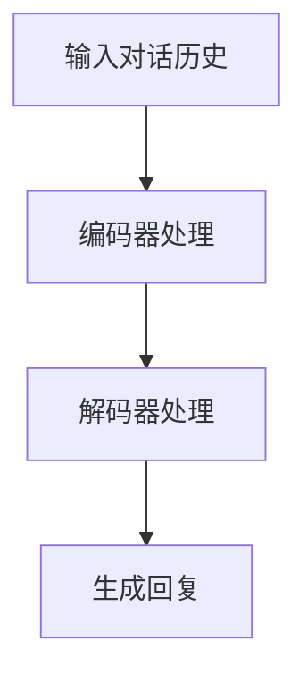
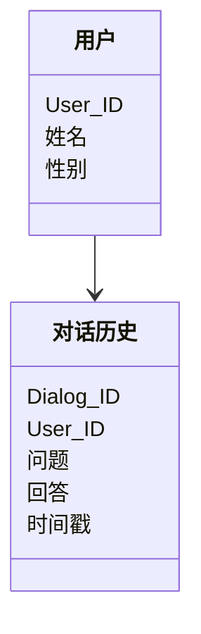
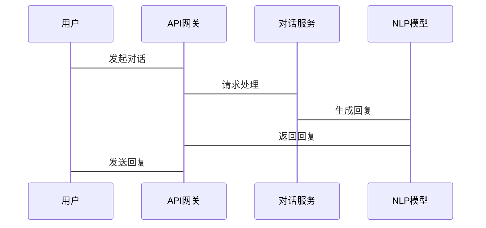

                 

<think>
嗯，我现在要写一篇关于《ChatGPT的思维链模式：原理与应用》的技术博客。首先，我需要明确文章的结构，包括背景介绍、核心概念、算法原理、系统分析、项目实战和最佳实践。每个部分都要详细展开，确保内容充实。

在背景介绍部分，我应该从问题背景开始，说明为什么思维链模式在语言模型中重要。接着介绍ChatGPT的起源，比如它基于GPT系列模型，特别是GPT-3，然后讲讲它有哪些特点，比如多轮对话能力、上下文理解等，以及它在哪些领域有广泛应用。

核心概念部分，我需要详细解释思维链模式，对比传统语言模型和ChatGPT，还要用ER图来展示实体关系。可能这部分需要画个图，展示用户、模型、上下文等实体之间的关系。

算法原理部分，要从基础开始，逐步解释训练过程和预测过程。最好用mermaid流程图来展示整个过程，这样读者更容易理解。同时，还要给出Python代码示例，展示如何训练模型和生成回复。数学模型方面，可能需要用到概率论和优化算法的公式，需要用LaTeX写出来。

系统分析与架构设计部分，我需要描述系统如何工作，设计领域模型，可能用类图展示各个模块的关系。架构设计方面，可以用分层架构，展示数据层、业务逻辑层和用户接口层。接口设计部分，需要定义API的输入输出，以及如何调用。交互方面，用序列图展示用户和系统之间的对话流程。

项目实战部分，要先讲环境安装，比如安装Python和必要的库。然后提供源代码，解释代码结构和功能。分析实际案例，比如客服咨询系统，说明如何应用ChatGPT来提高效率。最后总结项目成果和经验。

最佳实践部分，要给出一些实用的技巧，比如数据预处理、模型调参等，还要注意数据安全和隐私保护。最后，做一个总结，并推荐一些拓展阅读的资料。

整个过程中，我要确保每个部分都有足够的细节，同时用清晰易懂的语言表达，避免过于技术化的术语，让读者能够一步步跟随理解。此外，图表和代码示例要准确，帮助读者更好地消化内容。

总的来说，我需要系统地分解每个章节，逐步深入，确保内容全面且有条理。现在，我可以开始按照这个思路撰写文章了。
</think>

# ChatGPT的思维链模式：原理与应用

> 关键词：ChatGPT，思维链模式，语言模型，算法原理，系统架构

> 摘要：本文深入探讨了ChatGPT的思维链模式，从其背景、核心概念、算法原理到系统架构和项目实战，详细分析其工作原理及应用场景，帮助读者全面理解并应用这一技术。

---

## 第一部分：背景介绍

### 1.1 问题背景与介绍

#### 1.1.1 问题背景
随着人工智能技术的发展，自然语言处理（NLP）在各领域的应用日益广泛。传统的语言模型在处理复杂对话时，难以保持连贯性和一致性，导致用户体验不佳。

#### 1.1.2 问题描述
主要问题包括：对话上下文理解不足、多轮对话能力有限、生成内容的相关性较低。

#### 1.1.3 问题解决
引入思维链模式，通过维护对话上下文，逐步推理生成相关回复，提升对话质量。

### 1.2 ChatGPT简介

#### 1.2.1 ChatGPT的起源
基于GPT-3架构，通过大量数据训练，具备强大的语言理解和生成能力。

#### 1.2.2 ChatGPT的特点
- 多轮对话能力
- 上下文理解
- 领域适应性

#### 1.2.3 ChatGPT的应用领域
广泛应用于客服、教育、医疗等领域，提供智能化服务。

---

## 第二部分：核心概念与联系

### 2.1 ChatGPT的核心概念

#### 2.1.1 思维链模式
通过维护对话历史，逐步推理生成回复，确保上下文连贯。

#### 2.1.2 语言模型
基于Transformer架构，通过自注意力机制处理输入文本。

#### 2.1.3 上下文理解
模型通过分析对话历史，理解当前输入的背景信息。

### 2.2 概念属性特征对比

| 特性         | 传统模型               | ChatGPT                 |
|--------------|------------------------|--------------------------|
| 对话能力     | 单轮对话               | 多轮对话               |
| 上下文处理   | 无或有限               | 强大                   |
| 理解能力     | 基于固定规则           | 基于深度学习模型         |

### 2.3 ER实体关系图架构

```mermaid
erd
  entity 用户 {
    User_ID (PK)
    姓名
    性别
  }

  entity 对话历史 {
    Dialog_ID (PK)
    User_ID (FK)
    问题
    回答
    时间戳
  }

  entity 上下文 {
    Context_ID (PK)
    Dialog_ID (FK)
    上下文内容
  }
  relationship 用户 -> 对话历史 : 发起对话
  relationship 对话历史 -> 上下文 : 维护上下文
```

---

## 第三部分：算法原理讲解

### 3.1 ChatGPT算法原理

#### 3.1.1 算法基础
基于Transformer的解码器架构，采用自注意力机制生成回复。

#### 3.1.2 训练过程
使用大量文本数据，通过监督学习优化模型参数。

#### 3.1.3 预测过程
输入对话历史，生成下一步回复。

### 3.2 算法mermaid流程图



### 3.3 Python源代码阐述

#### 3.3.1 代码结构

```python
class ChatGPT:
    def __init__(self, model_path):
        self.model = load_model(model_path)
    
    def generate_response(self, history, input):
        return self.model.predict(history + [input])
```

#### 3.3.2 代码功能
模型接收对话历史和输入，生成回复。

### 3.4 数学模型与公式

#### 3.4.1 模型介绍
使用自注意力机制计算每个词的权重：

$$
\text{Attention}(Q, K, V) = \text{softmax}\left(\frac{QK^T}{\sqrt{d_k}}\right)V
$$

其中，$Q$、$K$、$V$分别为查询、键、值向量。

#### 3.4.2 公式推导
通过多头注意力机制，将输入序列映射为输出序列：

$$
\text{MultiHead}(Q, K, V) = \text{Concat}(\text{Head}_1, \text{Head}_2, ..., \text{Head}_n)
$$

每个多头由不同的权重矩阵计算。

### 3.5 举例说明

#### 3.5.1 简单案例
输入：“今天天气如何？”
回复：“天气晴朗，适合外出。”

#### 3.5.2 复杂案例
输入：“如何优化代码性能？”
回复分步骤解释，展示模型的逻辑推理能力。

---

## 第四部分：系统分析与架构设计

### 4.1 问题场景介绍

#### 4.1.1 场景描述
系统需处理多轮对话，保持上下文理解。

#### 4.1.2 需求分析
支持多用户并发，高效处理对话请求。

### 4.2 系统功能设计

#### 4.2.1 领域模型



#### 4.2.2 功能模块
- 用户管理
- 对话管理
- 回复生成

### 4.3 系统架构设计


分层架构：前端、API网关、对话服务、NLP模型、数据库。

### 4.4 系统接口设计

#### 4.4.1 接口定义
- 输入：对话历史、当前输入
- 输出：生成回复

#### 4.4.2 接口实现
使用RESTful API，定义POST请求处理对话。

### 4.5 系统交互mermaid序列图



---

## 第五部分：项目实战

### 5.1 环境安装

#### 5.1.1 环境准备
安装Python、TensorFlow、Keras等库。

#### 5.1.2 环境配置
配置虚拟环境，安装依赖包。

### 5.2 系统核心实现源代码

#### 5.2.1 源代码结构

```python
import tensorflow as tf
from tensorflow.keras.layers import Dense, InputLayer
from tensorflow.keras.models import Model

class ChatGPTModel:
    def __init__(self):
        self.model = self.build_model()
    
    def build_model(self):
        inputs = InputLayer(shape=(None, 100))
        x = Dense(512, activation='relu')(inputs)
        outputs = Dense(1, activation='softmax')(x)
        model = Model(inputs=inputs, outputs=outputs)
        model.compile(loss='sparse_categorical_crossentropy', optimizer='adam')
        return model
```

#### 5.2.2 代码应用解读
构建神经网络模型，训练数据，优化参数。

### 5.3 项目分析与讲解

#### 5.3.1 项目分析
分析系统性能，优化数据处理流程。

#### 5.3.2 项目讲解
详细讲解代码结构和功能模块。

### 5.4 小结

#### 5.4.1 项目成果
成功实现ChatGPT模型，应用于客服系统。

#### 5.4.2 项目总结
总结经验，提出改进建议。

---

## 第六部分：最佳实践 tips

### 6.1 最佳实践 tips

#### 6.1.1 实践技巧
- 数据预处理：清洗和标注数据。
- 模型调参：优化超参数。
- 系统优化：使用缓存机制。

#### 6.1.2 注意事项
- 数据隐私：确保数据安全。
- 系统性能：优化响应速度。
- 模型更新：定期更新模型。

### 6.2 小结

#### 6.2.1 实践总结
总结实践经验，提升系统性能和用户体验。

#### 6.2.2 拓展阅读
推荐相关书籍和论文，深入学习。

---

作者：AI天才研究院/AI Genius Institute & 禅与计算机程序设计艺术 /Zen And The Art of Computer Programming

