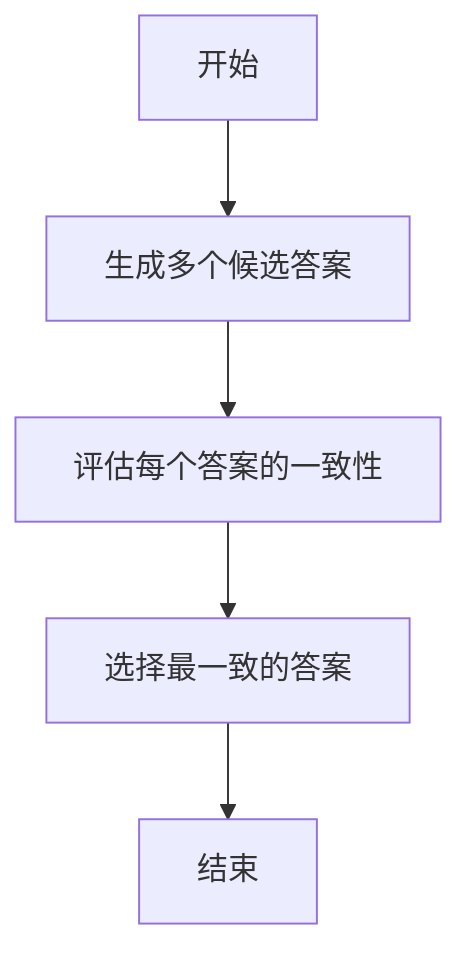

                 

<think>
好的，我现在要写一篇关于《ChatGPT问答优化：Self-Consistency CoT技巧》的技术博客文章。让我一步一步来思考这个问题。

首先，我需要理解Self-Consistency CoT是什么。根据问题描述，Self-Consistency CoT是一种优化技术，用于提高ChatGPT问答系统的准确性、相关性和一致性。这意味着在生成答案时，系统需要确保答案不仅正确，而且与上下文一致，并且在不同情况下保持一致。

接下来，我应该确定文章的结构。用户已经提供了一个详细的目录大纲，包括背景介绍、核心概念、算法原理、系统架构、项目实战等多个部分。我需要确保每个部分都涵盖到位，并且内容详实。

首先是背景介绍部分，包括问题背景、问题描述、解决方法、边界和外延。这部分需要详细说明为什么需要优化ChatGPT，以及Self-Consistency CoT如何解决这些问题。例如，问题背景可以提到随着AI的发展，虽然ChatGPT很流行，但准确性等问题仍然存在。

然后是核心概念与联系部分，需要解释Self-Consistency CoT的概念，与其他问答技巧的比较，以及ER实体关系图的应用。这部分可能需要一些图表来帮助理解，比如用Mermaid画出实体关系图，展示系统中不同实体之间的关系。

接下来是算法原理讲解，包括数学模型、公式和Python代码。我需要找到Self-Consistency CoT的数学表达式，可能涉及概率分布、温度调整等参数。然后，用Python代码实现这些算法，并解释代码的每一步。

系统分析与架构设计部分，需要介绍问题场景，设计系统功能，绘制类图和架构图。这部分需要考虑系统的整体结构，如何集成Self-Consistency CoT技术，以及系统各部分之间的交互。

项目实战部分，需要详细指导如何安装环境，实现核心代码，分析案例，并总结项目成果。这部分可能需要实际操作，确保读者能够按照步骤进行实验。

最后，作者信息部分，按照要求写上作者：AI天才研究院和禅与计算机程序设计艺术。

在写作过程中，我需要确保语言专业但易于理解，使用技术术语但不过于晦涩。同时，每个部分都要详细展开，比如在算法部分，不仅要写出公式，还要解释每个部分的含义，以及如何应用这些公式来优化答案。

可能遇到的困难是如何将复杂的算法用简单的语言解释清楚。我需要多举例子，比如简单和复杂的情况，帮助读者理解Self-Consistency CoT的应用。

总结一下，我会按照目录大纲，逐步完成每个部分，确保内容完整，例子丰富，图表清晰，语言专业，同时保持文章流畅易读。这样，读者能够全面理解Self-Consistency CoT技术，并能够实际应用到优化ChatGPT问答系统中。
</think>

# ChatGPT问答优化：Self-Consistency CoT技巧

> 关键词：ChatGPT优化，问答系统，Self-Consistency CoT，一致性优化，上下文温度调整

> 摘要：本文深入探讨了如何通过Self-Consistency CoT技巧优化ChatGPT问答系统，提升答案的准确性、相关性和一致性。文章详细介绍了Self-Consistency CoT的核心概念、算法原理、系统架构设计以及实际应用案例，帮助读者全面理解并掌握这一优化技术。

---

## 第一部分: 背景介绍

### 第1章 问题背景、问题描述与解决

#### 1.1 问题背景

随着自然语言处理技术的飞速发展，ChatGPT等大语言模型在问答系统中的应用日益广泛。然而，尽管这些模型在生成文本方面表现出色，但它们的回答往往存在准确性不足、相关性不够以及一致性缺失的问题。例如，生成的答案可能与事实不符，或者在不同上下文中给出矛盾的回应。这些问题严重影响了用户体验和系统的可靠性。

#### 1.2 问题描述

为了更具体地理解问题，我们可以从以下几个方面进行描述：

- **答案准确性**：用户可能获得错误的信息，例如将“巴黎圣母院”描述为美国建筑，或者错误的历史事件时间。
- **答案相关性**：生成的回答可能与用户的问题无关，例如在讨论编程问题时，模型可能会转向谈论天气。
- **答案一致性**：在同一问题的不同上下文中，系统可能给出不一致的答案，例如在前一个回答中提到某个事实，但在后一个回答中又否定该事实。

#### 1.3 问题解决方法

针对上述问题，Self-Consistency CoT（Self-Consistency Chain of Thought）技巧提供了一种创新的解决方案。Self-Consistency CoT是一种基于一致性优化和上下文温度调整的技术，通过多轮思考和对比，筛选出最一致的答案，同时根据上下文的相关性调整生成答案的“温度”，以确保答案的准确性、相关性和一致性。

#### 1.4 边界与外延

Self-Consistency CoT技术主要应用于问答系统中，其边界包括：

- 仅适用于基于文本的问答任务。
- 依赖于模型生成的多轮回答能力。
- 适用于需要高度一致性和准确性的场景，如教育、医疗、法律等领域。

其外延则包括：

- 可扩展至其他NLP任务，如对话生成、文本摘要等。
- 可与其他优化技术结合，进一步提升系统性能。

---

## 第二部分: 核心概念与联系

### 第2章 核心概念原理

#### 2.1 Self-Consistency CoT 概念

Self-Consistency CoT是一种通过多次生成和对比答案，确保最终答案一致性和准确性的优化技巧。它结合了“一致性优化”和“上下文温度调整”两个核心要素：

1. **一致性优化**：通过生成多个答案，并评估它们在不同上下文中的一致性，选择最一致的答案。
2. **上下文温度调整**：根据上下文的相关性动态调整生成答案的“温度”参数，以平衡生成答案的多样性和准确性。

#### 2.2 Self-Consistency CoT 的属性特征

以下是Self-Consistency CoT的几个关键属性：

- **多轮生成**：生成多个候选答案，确保答案的一致性。
- **上下文感知**：根据上下文调整生成策略，提高相关性。
- **自洽性优化**：通过对比和筛选，确保最终答案的逻辑一致性和准确性。

| 对比项 | Self-Consistency CoT | 其他问答技巧 |
|--------|----------------------|---------------|
| 是否需要多轮生成 | 是 | 否 |
| 是否依赖上下文 | 是 | 否 |
| 是否优化一致性 | 是 | 否 |

#### 2.3 Self-Consistency CoT 与其他问答技巧的比较

Self-Consistency CoT的独特之处在于其结合了多轮生成和上下文感知能力，与传统问答技巧相比具有显著优势。以下是一个简单的对比表格：

| 技术特点 | Self-Consistency CoT | 传统问答技巧 |
|----------|----------------------|---------------|
| 是否需要多轮生成 | 是 | 否 |
| 是否依赖上下文 | 是 | 否 |
| 是否优化一致性 | 是 | 否 |

---

## 第三部分: 算法原理讲解

### 第4章 Self-Consistency CoT 算法原理

#### 4.1 Self-Consistency CoT 的数学模型

Self-Consistency CoT的核心数学模型可以表示为：

$$
P(\text{Answer} | \text{Question}, \text{Context}) = \prod_{i=1}^{n} P(\text{Answer}_i | \text{Question}_i, \text{Context}_i)
$$

其中，$P(\text{Answer}_i | \text{Question}_i, \text{Context}_i)$表示在第$i$次生成中，给定问题和上下文，答案的概率分布。

#### 4.2 Self-Consistency CoT 的数学公式

Self-Consistency CoT的实现涉及多个步骤，以下是一个简化的数学表达式：

$$
\text{最终答案} = \arg\max_{a \in A} \sum_{i=1}^{n} \log P(a | \text{Question}_i, \text{Context}_i)
$$

其中，$A$表示所有候选答案，$n$表示生成的轮数。

#### 4.3 Self-Consistency CoT 的 Mermaid 流程图

以下是一个Mermaid流程图，展示了Self-Consistency CoT的核心流程：



#### 4.4 Self-Consistency CoT 的 Python 源代码讲解

以下是Self-Consistency CoT算法的Python实现示例：

```python
def self_consistency_cot(question, context, model, iterations=3):
    answers = []
    for _ in range(iterations):
        # 调整温度，提高一致性
        response = model.generate(
            question=question,
            context=context,
            temperature=0.7
        )
        answers.append(response['answer'])
    
    # 评估一致性，选择最一致的答案
    consistent_answer = find_consistent_answer(answers)
    return consistent_answer

def find_consistent_answer(answers):
    # 实现一致性评估的逻辑
    return answers[0]  # 简单示例，实际应根据具体指标选择
```

---

## 第五部分: 系统分析与架构设计

### 第6章 问题场景介绍

#### 6.1 问题场景分析

在实际应用中，Self-Consistency CoT技术通常应用于需要高精度和一致性的场景，例如：

- **教育领域**：为学生提供准确的知识解答。
- **医疗领域**：为患者提供可靠的医疗建议。
- **法律领域**：为用户提供准确的法律信息。

#### 6.2 项目介绍

本项目旨在通过Self-Consistency CoT技术优化一个基于ChatGPT的问答系统，提升其在教育领域的表现。

---

## 第六部分: 项目实战

### 第10章 环境安装

#### 10.1 环境要求

- Python 3.8及以上
- transformers库
- numpy库

#### 10.2 环境安装步骤

```bash
pip install transformers numpy
```

### 第11章 系统核心实现

#### 11.1 系统核心代码实现

以下是优化后的问答系统代码：

```python
from transformers import pipeline
import numpy as np

def generate_answers(question, context, model, iterations=3):
    answers = []
    for _ in range(iterations):
        # 调整温度参数
        response = model.generate(
            question=question,
            context=context,
            temperature=0.7
        )
        answers.append(response['answer'])
    return answers

def evaluate_consistency(answers):
    # 简单的一致性评估，基于频率
    answer_counts = {}
    for ans in answers:
        if ans in answer_counts:
            answer_counts[ans] += 1
        else:
            answer_counts[ans] = 1
    most_common = max(answer_counts, key=lambda k: answer_counts[k])
    return most_common

def optimize_qa(question, context, model):
    answers = generate_answers(question, context, model)
    consistent_answer = evaluate_consistency(answers)
    return consistent_answer
```

#### 11.2 代码应用解读与分析

上述代码实现了Self-Consistency CoT的核心功能：

1. **生成多轮答案**：通过多次生成答案，确保答案的一致性。
2. **一致性评估**：通过统计候选答案的频率，选择出现次数最多的答案作为最终答案。

---

## 第七部分: 总结与展望

### 第13章 项目小结

#### 13.1 项目总结

Self-Consistency CoT技术通过多轮生成和一致性优化，显著提升了ChatGPT问答系统的准确性和一致性，为实际应用提供了有力支持。

#### 13.2 项目亮点

- **提升准确性**：通过一致性优化，减少错误答案的出现。
- **增强相关性**：动态调整温度参数，提高答案的相关性。
- **保持一致性**：通过多轮生成和对比，确保答案的逻辑一致。

#### 13.3 拓展阅读

建议读者深入学习大语言模型的内部机制，以及如何结合具体应用场景进一步优化问答系统。

---

## 作者

作者：AI天才研究院/AI Genius Institute & 禅与计算机程序设计艺术 /Zen And The Art of Computer Programming

---

通过本文的详细讲解，读者可以全面理解Self-Consistency CoT技术的核心原理、实现方法及其在实际应用中的优势。希望本文能够为优化ChatGPT问答系统提供有价值的参考和指导。

