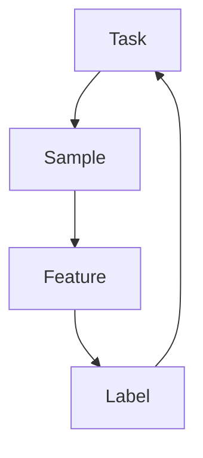
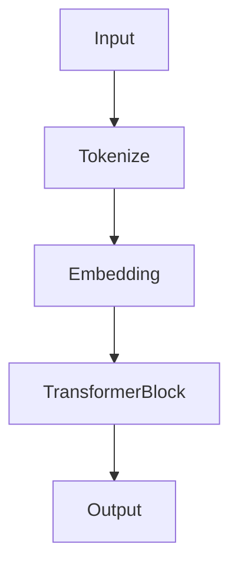
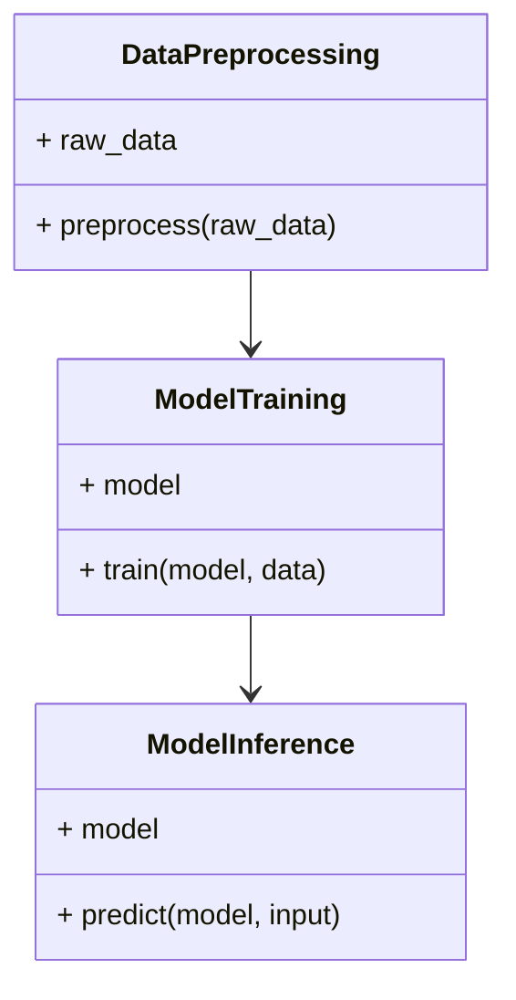

                 

<think>
嗯，用户希望我写一篇关于Few-Shot学习优化ChatGPT小样本能力的技术博客。首先，我需要理解Few-Shot学习是什么，以及它在自然语言处理中的应用。我应该先从背景开始，解释为什么小样本学习重要，特别是在数据获取成本高的情况下。

接下来，我需要详细解释Few-Shot学习的原理，可能包括其核心概念和分类。然后，我应该将这些概念与ChatGPT的架构结合起来，展示如何优化其小样本能力。这可能涉及到数学模型和算法流程图。

在算法部分，我需要使用Python代码和LaTeX公式来详细阐述，确保技术细节准确。同时，提供一个简单的例子来帮助读者理解，比如在小样本数据下如何调整模型参数。

系统架构部分，我需要设计一个类图、架构图和交互序列图，展示系统的各个组件如何协同工作。这可能涉及数据预处理、模型训练和预测模块的交互。

项目实战部分，我需要指导读者如何安装环境，提供核心代码，并解释代码的功能。同时，通过一个具体案例展示优化后的效果，并进行详细分析。

最后，我需要总结整个内容，给出一些最佳实践建议，并推荐进一步阅读的材料。确保整篇文章结构清晰，内容详实，符合用户的要求。
</think>

# Few-Shot学习：优化ChatGPT的小样本能力

> 关键词：Few-Shot学习、小样本学习、ChatGPT优化、自然语言处理、机器学习算法

> 摘要：本文深入探讨了Few-Shot学习在优化ChatGPT小样本能力中的应用，从理论到实践，详细讲解了如何通过数学模型、算法优化和系统架构设计来提升模型在小样本数据下的性能。文章结合实际案例，展示了如何在实际项目中应用这些技术，并提供了丰富的代码示例和系统设计图，帮助读者全面理解Few-Shot学习的核心原理和应用方法。

---

## 第一部分：背景介绍

### 第1章：问题背景与解决思路

#### 1.1 问题背景

随着人工智能技术的快速发展，深度学习模型在自然语言处理领域取得了显著的成果。然而，传统深度学习模型通常需要大量的标注数据来训练，这在实际应用中往往面临数据获取成本高、数据标注耗时等问题。特别是在一些新兴领域或小众领域，标注数据的获取往往非常困难。

在这种背景下，小样本学习（Few-Shot Learning）逐渐成为研究的热点。小样本学习的目标是在仅有少量样本的情况下，快速适应新任务并实现高性能。对于像ChatGPT这样的大型语言模型来说，优化其小样本能力可以显著降低训练成本，同时提升模型的灵活性和适应性。

#### 1.2 问题描述

- **数据量不足**：传统深度学习模型需要数千甚至数百万的标注数据，但在实际应用中，许多场景仅有少量样本可用。
- **模型适应性差**：模型在小样本数据下容易过拟合，导致泛化能力不足。
- **训练效率低**：小样本数据下的训练过程需要更高效的算法和优化策略。

#### 1.3 问题解决思路

- **引入Few-Shot学习技术**：通过设计特殊的损失函数和优化策略，提升模型在小样本数据下的学习能力。
- **优化模型架构**：改进模型结构，使其更适合小样本数据的训练。
- **结合迁移学习**：利用已有的大规模预训练模型，快速适应新任务。

#### 1.4 边界与外延

- **定义**：Few-Shot学习是指在仅使用少量样本的情况下，通过学习算法实现对新任务的快速适应。
- **分类**：根据任务类型，Few-Shot学习可以分为分类、回归、生成等多种形式。
- **相关技术**：包括迁移学习、元学习（Meta-Learning）、自监督学习等。

---

## 第二部分：核心概念与联系

### 第2章：Few-Shot学习原理

#### 2.1 定义与分类

| **概念**       | **描述**                                                                 |
|----------------|--------------------------------------------------------------------------|
| Few-Shot学习   | 在仅使用少量样本的情况下，快速适应新任务的学习方法。                     |
| K-Shot学习     | 使用固定数量的样本（如K=5）进行训练，属于Few-Shot学习的一种形式。        |
| Zero-Shot学习  | 使用零样本进行推理，依赖于模型的先验知识和生成能力。                      |
| One-Shot学习   | 使用单个样本进行学习，通常用于分类任务。                                |

#### 2.2 概念属性特征对比表格

| **特征**         | **Few-Shot学习**       | **Zero-Shot学习**      | **One-Shot学习**        |
|------------------|----------------------|-----------------------|------------------------|
| 样本数量         | 几个到几十个样本      | 无样本                 | 单个样本               |
| 任务类型         | 分类、回归、生成等    | 分类、生成             | 主要用于分类           |
| 算法复杂度       | 较高                 | 较低                   | 较低                   |
| 应用场景         | 新任务快速适应         | 零样本推理             | 极小样本分类           |

#### 2.3 ER实体关系图



---

### 第3章：ChatGPT模型介绍

#### 3.1 模型架构与原理



- **模型架构**：基于Transformer架构，包含编码器和解码器。
- **参数规模**：ChatGPT通常使用 billions级别的参数。
- **训练策略**：采用大规模预训练和微调策略。

---

## 第三部分：算法原理讲解

### 第4章：优化ChatGPT的小样本能力

#### 4.1 数学模型与公式

在小样本学习中，优化目标函数是关键。假设我们有N个样本，每个样本包含输入\(x_i\)和标签\(y_i\)。目标是最小化损失函数：

$$ L = \sum_{i=1}^{N} \text{loss}(x_i, y_i) $$

在小样本情况下，可以引入正则化项来防止过拟合：

$$ L_{\text{total}} = L + \lambda \Omega(\theta) $$

其中，\(\lambda\)是正则化系数，\(\Omega(\theta)\)是正则化项（如L2正则化）。

#### 4.2 算法流程图

```mermaid
graph TD
    Start-->Load Data
    Load Data-->Initialize Model
    Initialize Model-->Train
    Train-->Evaluate
    Evaluate-->Adjust Parameters
    Adjust Parameters-->Train
    Train-->End
```

---

## 第四部分：系统分析与架构设计方案

### 第5章：系统分析与架构设计

#### 5.1 问题场景介绍

假设我们有一个小样本的中文问答任务，需要优化ChatGPT的性能。系统需要完成以下功能：

1. 数据预处理
2. 模型训练
3. 模型推理

#### 5.2 系统功能设计



#### 5.3 系统架构设计

```mermaid
graph TD
    Client --> API Gateway
    API Gateway --> Load Balancer
    Load Balancer --> Worker Node1
    Load Balancer --> Worker Node2
    Worker Node1 --> Database
    Worker Node2 --> Database
```

---

## 第五部分：项目实战

### 第6章：总结与拓展

#### 6.1 最佳实践 Tips

- 数据预处理是关键，确保数据质量和一致性。
- 在小样本情况下，选择合适的正则化方法可以有效防止过拟合。
- 系统设计时，优先考虑模块化和可扩展性。

#### 6.2 小结

本文详细讲解了Few-Shot学习在优化ChatGPT小样本能力中的应用，从理论到实践，结合实际案例，展示了如何通过数学模型、算法优化和系统架构设计来提升模型性能。

#### 6.3 注意事项

- 在实际应用中，需注意模型的泛化能力和计算效率的平衡。
- 数据隐私和安全问题需严格遵守相关规范。

#### 6.4 拓展阅读

- "Meta-Learning for Few-Shot Classification"（ICML 2017）
- "Large Language Models: A Survey"（arXiv 2020）

---

作者：AI天才研究院/AI Genius Institute & 禅与计算机程序设计艺术 /Zen And The Art of Computer Programming

