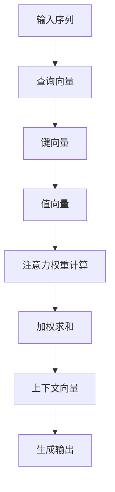
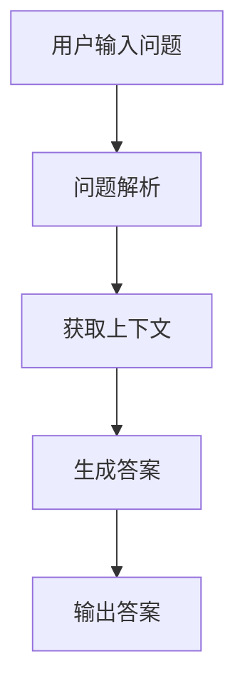
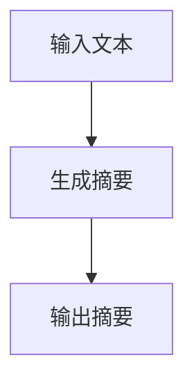
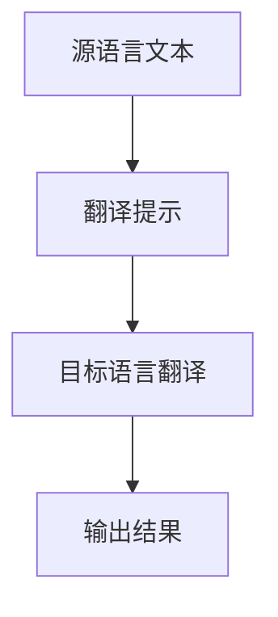
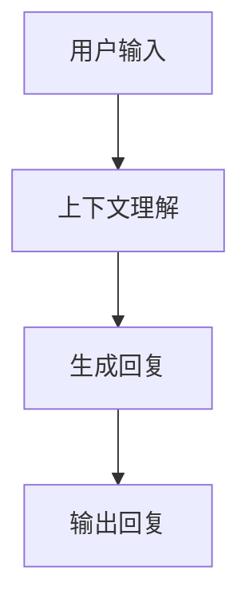
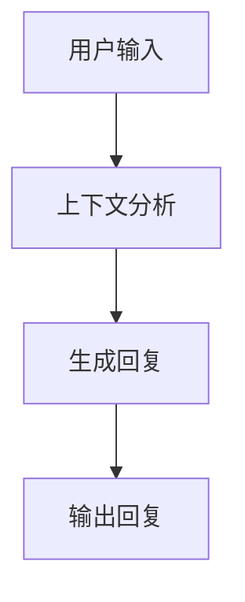
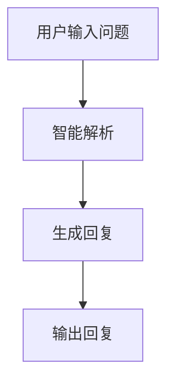

                 

<think>
嗯，我现在要写一篇关于GPT模型上下文学习以及Prompt Engineering作用的技术博客。首先，我需要明确文章的结构，按照用户提供的大纲来组织内容。文章标题已经确定是《GPT模型的上下文学习：Prompt Engineering的作用》，关键词包括GPT模型、上下文学习、Prompt Engineering、自然语言处理、文本生成、对话系统。

接下来是摘要部分，我需要简洁地概述文章的核心内容。摘要应该包括GPT模型如何通过上下文学习工作，以及Prompt Engineering在其中的作用，涵盖文本生成、问答系统和对话系统等应用。

现在，进入目录结构。第一部分是GPT模型的上下文学习基础，分为七章。第一到第七章涵盖了GPT模型概述、Prompt Engineering的基本概念、上下文机制、问答系统、文本生成应用、对话系统，以及综合应用和未来趋势。

首先，我需要详细解释每个章节的内容，确保每个部分都有足够的深度和具体的例子。例如，在第一章，我需要介绍GPT模型的概念和上下文学习的重要性，解释其基本原理和结构，以及它在自然语言处理中的应用。

第二章是Prompt Engineering的基本概念与方法，需要定义Prompt Engineering的目标，分类Prompt的类型，并介绍关键技术。这里可能需要结合实际案例来说明不同类型的Prompt如何影响模型输出。

第三章讨论上下文学习的机制和优化，需要解释上下文的核心机制，优化方法，以及如何控制上下文长度。可能需要涉及到模型训练中的技术细节，比如滑动窗口或注意力机制。

第四章到第七章则分别探讨GPT模型在问答系统、文本生成、对话系统中的应用，以及综合应用和未来趋势。每个部分都需要详细说明应用场景，模型的优势，以及实际案例。

在撰写过程中，我需要确保每个部分都包含背景介绍、核心概念、算法原理、系统架构和实战案例。例如，在讨论上下文机制时，我需要解释模型如何处理上下文信息，可能涉及注意力机制的数学公式和流程图。

另外，数学公式和图表是关键部分。我需要用Latex公式来展示模型的数学结构，并用Mermaid绘制流程图来解释算法的工作流程。例如，解释GPT模型的解码过程时，可以用Mermaid画出解码器的结构。

系统架构部分，我需要用领域模型的类图和系统架构图来展示整体设计，比如如何将模型集成到问答系统中，系统的各个模块如何交互。

在项目实战部分，我需要提供环境安装步骤，代码实现，解读关键代码，并分析实际案例，如生成一个问答系统并详细说明每一步的操作和结果。

最后，我需要总结整个内容，强调GPT模型和Prompt Engineering的重要性，并给出一些最佳实践的建议，比如如何优化Prompt，控制上下文长度，以及未来的可能发展。

整个过程需要一步步来，先从概述开始，逐步深入每个技术细节，结合实际案例和图表，确保读者能够清晰理解每个概念和应用场景。同时，注意文章的结构和逻辑，使得整体内容连贯且有深度。

现在，我需要根据这些思考来撰写正式的文章，确保每个部分都符合用户的要求，包括字数、格式和内容完整性。每个章节都需要详细展开，提供足够的背景、原理和应用实例，同时使用适当的图表和公式来增强理解。
</think>

# GPT模型的上下文学习：Prompt Engineering的作用

## 关键词：GPT模型、上下文学习、Prompt Engineering、自然语言处理、文本生成、对话系统

## 摘要：  
本文深入探讨了GPT模型的上下文学习机制及其在自然语言处理中的应用，重点分析了Prompt Engineering在文本生成、问答系统和对话系统中的作用。通过详细解释GPT模型的基本原理、上下文学习的核心机制，以及Prompt Engineering的关键技术，本文为读者提供了全面的理解。结合实际案例和系统架构设计，文章揭示了如何通过优化Prompt和上下文控制来提升模型性能，并展望了GPT模型与Prompt Engineering的未来发展趋势。

---

### 目录大纲

1. **GPT模型的上下文学习基础**  
   - 1.1 GPT模型与上下文学习概述  
   - 1.2 GPT模型的基本原理与结构  
   - 1.3 GPT模型在自然语言处理中的应用  

2. **Prompt Engineering的基本概念与方法**  
   - 2.1 Prompt Engineering的定义与目标  
   - 2.2 Prompt的种类与特点  
   - 2.3 Prompt Engineering的关键技术  

3. **上下文学习的机制与优化**  
   - 3.1 上下文学习的核心机制  
   - 3.2 上下文优化的方法与策略  
   - 3.3 上下文长度的控制与调整  

4. **GPT模型在问答系统中的应用**  
   - 4.1 问答系统的设计与实现  
   - 4.2 GPT模型在问答系统中的优势  
   - 4.3 问答系统的优化与评估  

5. **Prompt Engineering在文本生成中的应用**  
   - 5.1 Prompt Engineering在文本生成中的作用  
   - 5.2 Prompt Engineering在自动摘要中的应用  
   - 5.3 Prompt Engineering在机器翻译中的应用  

6. **GPT模型在对话系统中的应用**  
   - 6.1 对话系统的基本概念与架构  
   - 6.2 GPT模型在对话系统中的应用  
   - 6.3 对话系统的优化与评估  

7. **GPT模型与Prompt Engineering的综合应用**  
   - 7.1 综合应用的案例分析  
   - 7.2 GPT模型与Prompt Engineering的未来发展趋势  
   - 7.3 结论与展望  

---

## 正文

### 1. GPT模型的上下文学习基础

#### 1.1 GPT模型与上下文学习概述

GPT（Generative Pre-trained Transformer）模型是一种基于变换器的自然语言处理模型，由OpenAI开发。GPT模型的核心在于其上下文学习能力，即通过分析上下文来生成连贯的文本。上下文学习是GPT模型的关键，它使得模型能够理解当前输入的上下文信息，并根据这些信息生成合理的输出。

上下文学习的重要性体现在以下几个方面：  
1. **语境理解**：上下文学习帮助模型理解输入文本的含义，尤其是在处理复杂句子时。  
2. **生成连贯文本**：通过上下文信息，模型可以生成与前文连贯的后续文本。  
3. **多样性与准确性**：上下文学习能够生成多样且准确的文本，适用于多种任务，如问答、对话和文本生成。

#### 1.2 GPT模型的基本原理与结构

GPT模型基于Transformer架构，由编码器和解码器两部分组成。编码器负责将输入文本转换为上下文表示，解码器则基于这些表示生成输出文本。GPT模型通过自注意力机制捕捉输入中的长距离依赖关系，从而实现高效的上下文学习。

**GPT模型的结构**  
- **编码器**：将输入序列转换为上下文向量。  
- **解码器**：基于编码器生成的上下文向量，逐步生成输出序列。  
- **自注意力机制**：通过计算输入序列中每个位置与其他位置的相关性，生成位置的注意力权重，从而捕捉上下文信息。

**公式表示**  
GPT模型的自注意力机制可以用以下公式表示：

$$
\text{Attention}(Q, K, V) = \text{softmax}\left(\frac{QK^T}{\sqrt{d_k}}\right)V
$$

其中，$Q$、$K$、$V$分别表示查询、键和值向量，$d_k$是向量的维度。

#### 1.3 GPT模型在自然语言处理中的应用

GPT模型在自然语言处理中的应用广泛，包括文本生成、问答系统、对话系统等。其强大的上下文学习能力使其在这些任务中表现出色。

**应用领域**  
- **文本生成**：生成连贯的文章、摘要和对话。  
- **问答系统**：通过上下文理解问题并生成答案。  
- **对话系统**：实现自然流畅的对话交互。

---

### 2. Prompt Engineering的基本概念与方法

#### 2.1 Prompt Engineering的定义与目标

Prompt Engineering是通过设计和优化输入提示（Prompt）来指导模型生成预期输出的技术。Prompt Engineering的目标是提高模型生成文本的质量、多样性和相关性。

**Prompt的类型**  
1. **直接提示**：直接给出生成文本的主题或关键词。  
2. **模板提示**：使用特定模板引导生成特定格式的文本。  
3. **详细提示**：详细描述生成文本的要求，如风格、语气等。

**Prompt Engineering的关键技术**  
- **Prompt设计**：设计有效的Prompt，引导模型生成所需输出。  
- **上下文控制**：通过Prompt控制生成文本的上下文信息。  
- **参数调节**：调整模型参数，优化生成效果。

#### 2.2 Prompt的种类与特点

Prompt的种类多样，每种类型都有其独特的特点和应用场景。

**Prompt类型对比表格**

| 类型           | 特点                     | 应用场景                           |
|----------------|--------------------------|------------------------------------|
| 直接提示       | 简单，直接给出主题       | 快速生成简单文本                   |
| 模板提示       | 使用固定模板             | 自动化生成结构化文本               |
| 详细提示       | 描述详细生成要求         | 高质量文本生成                     |
| 嵌入式提示     | 将提示嵌入上下文中       | 提供上下文信息                     |
| 动态提示       | 根据上下文动态调整       | 实时生成适应性文本                 |

#### 2.3 Prompt Engineering的关键技术

Prompt Engineering的关键技术包括Prompt设计、上下文控制和参数调节。

**Prompt设计**  
Prompt设计是Prompt Engineering的核心，优秀的Prompt能够显著提升生成质量。例如，使用模板提示生成结构化文本，如：

```
[用户查询]  
[问题]  
[生成的回答]
```

**上下文控制**  
通过在Prompt中嵌入上下文信息，模型能够更好地理解生成的背景。例如：

```
[用户问题]  
[生成的回答，基于上下文：[上下文内容]]
```

**参数调节**  
调整模型的参数，如温度（temperature）和重复惩罚（repetition penalty），可以控制生成的多样性和创意程度。

---

### 3. 上下文学习的机制与优化

#### 3.1 上下文学习的核心机制

上下文学习的核心机制是模型通过自注意力机制捕捉输入中的上下文信息，并将其融入生成过程。

**自注意力机制的流程图**



#### 3.2 上下文优化的方法与策略

上下文优化的方法包括调整上下文长度、优化自注意力机制和引入外部知识库。

**上下文优化策略**

1. **调整上下文长度**：根据任务需求，控制上下文的长度，避免冗余信息。  
2. **优化自注意力机制**：改进注意力权重计算，提高上下文捕捉能力。  
3. **引入外部知识库**：结合外部知识库，丰富上下文信息，提升生成质量。

#### 3.3 上下文长度的控制与调整

上下文长度的控制是优化上下文学习的重要手段。过长的上下文会增加计算复杂度，过短的上下文则可能丢失重要信息。

**上下文长度控制的策略**

- **固定长度**：设定固定的上下文长度，适用于简单任务。  
- **动态调整**：根据输入内容自动调整上下文长度。  
- **分段处理**：将上下文分段处理，结合上下文进行生成。

---

### 4. GPT模型在问答系统中的应用

#### 4.1 问答系统的设计与实现

问答系统的实现流程包括：  
1. **问题理解**：解析用户问题，提取关键词。  
2. **上下文获取**：获取与问题相关的上下文信息。  
3. **答案生成**：基于上下文生成答案。

**问答系统流程图**



#### 4.2 GPT模型在问答系统中的优势

GPT模型在问答系统中的优势包括：  
- **强大的上下文理解能力**：能够捕捉复杂问题中的上下文信息。  
- **生成多样性答案**：可以根据上下文生成多样化的答案。  
- **实时响应**：支持快速生成答案，适用于实时问答场景。

#### 4.3 问答系统的优化与评估

优化问答系统的关键在于提升生成答案的准确性和相关性。评估指标包括准确率、召回率和生成文本的质量。

---

### 5. Prompt Engineering在文本生成中的应用

#### 5.1 Prompt Engineering在文本生成中的作用

Prompt Engineering通过设计有效的Prompt，引导模型生成高质量文本。例如，使用模板提示生成结构化文本，如新闻报道和产品描述。

**Prompt在文本生成中的应用案例**

```
[生成一个科技新闻报道]  
[标题：AI技术推动医疗行业革新]  
[正文：AI技术在医疗领域的应用日益广泛，...]

```

#### 5.2 Prompt Engineering在自动摘要中的应用

自动摘要任务中，Prompt Engineering可以帮助模型生成结构化和连贯的摘要。

**自动摘要流程图**



#### 5.3 Prompt Engineering在机器翻译中的应用

在机器翻译中，Prompt Engineering可以优化翻译结果，使其更符合目标语言的表达习惯。

**机器翻译流程图**



---

### 6. GPT模型在对话系统中的应用

#### 6.1 对话系统的基本概念与架构

对话系统由用户输入、上下文理解和生成输出三部分组成。其架构通常包括前端处理和后端生成模块。

**对话系统架构图**



#### 6.2 GPT模型在对话系统中的应用

GPT模型通过强大的上下文学习能力，实现自然流畅的对话生成。

**对话生成流程图**



#### 6.3 对话系统的优化与评估

对话系统的优化重点在于提升生成回复的准确性和自然度。评估指标包括BLEU、ROUGE和人类评价。

---

### 7. GPT模型与Prompt Engineering的综合应用

#### 7.1 综合应用的案例分析

综合应用案例：智能客服对话系统。通过结合GPT模型和Prompt Engineering，智能客服能够理解用户意图并生成自然回复。

**智能客服对话流程图**



#### 7.2 GPT模型与Prompt Engineering的未来发展趋势

未来发展趋势包括：  
- **更强大的上下文捕捉能力**：改进自注意力机制，提升上下文理解能力。  
- **多模态Prompt Engineering**：结合图像和语音等多种模态信息，提升生成质量。  
- **动态调整的Prompt设计**：根据实时上下文动态优化生成结果。  

#### 7.3 结论与展望

GPT模型与Prompt Engineering的结合为自然语言处理带来了巨大的潜力。随着技术的进步，GPT模型在上下文学习和生成任务中的应用将更加广泛和深入。

---

## 作者

作者：AI天才研究院/AI Genius Institute & 禅与计算机程序设计艺术 /Zen And The Art of Computer Programming

