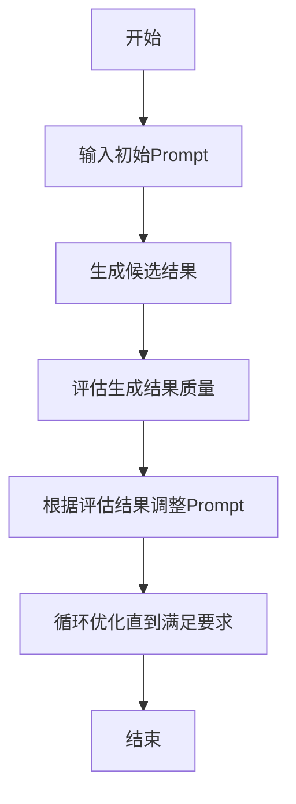

                 

<think>
嗯，用户让我写一篇关于“LLM prompt交互式优化平台”的技术博客，看起来挺复杂的。首先，我需要理解这个主题。LLM是大型语言模型，比如GPT这样的。Prompt优化指的是如何通过调整提示词来让模型生成更准确或有用的结果。交互式优化平台可能是一个让用户可以实时调整和优化这些提示词的工具或系统。

用户要求文章结构清晰，逻辑严密，用专业的技术语言，但又要易懂。首先，我得先规划一下文章的结构。根据用户提供的大纲，文章分为四部分：背景与概述、算法原理与设计、项目实战、最佳实践与总结。

在背景部分，我需要介绍人工智能和语言模型的发展，然后说明为什么prompt优化很重要，以及交互式平台的必要性。这部分需要让读者明白问题背景和问题的重要性。

接下来是核心概念，要定义LLM、prompt优化和交互式平台，解释它们之间的关系，可能还需要画个ER图或者流程图来展示。

算法原理部分，我得详细讲解LLM的工作原理，prompt优化的流程，以及相关的数学模型。这部分可能需要用mermaid流程图来展示算法步骤，还要写出数学公式，比如损失函数的优化过程。

系统架构设计需要分析系统需求，设计功能模块，然后用类图和架构图来展示。这部分可能比较复杂，需要考虑前后端的交互，数据存储等。

项目实战部分，要手把手教读者搭建平台，选择工具，实现核心功能，并进行性能优化。案例分析也很重要，通过实际案例展示平台的应用。

最后，总结最佳实践，给出注意事项，推荐拓展阅读。这部分要让读者在实际应用中少走弯路，提高效率。

现在，我得确保每个章节都有足够的细节，比如环境准备、工具选择、代码实现等。可能需要包括一些具体的代码示例，让读者能跟着操作。

另外，用户特别强调要使用markdown格式，数学公式用latex，图表用mermaid。我需要在写作时注意这些格式的正确使用，确保文章的可读性和专业性。

最后，作者信息部分也要写上，这样文章看起来更完整。

总的来说，我需要一步步来，先规划好每个部分的内容，然后逐步展开，确保每个细节都到位，满足用户的要求。
</think>

```markdown
# LLM Prompt交互式优化平台

> 关键词：LLM, Prompt优化, 交互式平台, 人工智能, 系统架构, 算法原理, 项目实战

> 摘要：本文详细探讨了LLM（大型语言模型）与Prompt优化的结合，介绍了交互式优化平台的背景、核心概念、算法原理、系统架构设计、项目实战及最佳实践。通过系统化的分析和具体的案例，展示了如何利用LLM优化Prompt，提升交互式平台的性能和用户体验。

---

## 第一部分：背景与概述

### 第1章：LLM与Prompt优化背景

#### 1.1 人工智能与语言模型的发展
人工智能（AI）技术的飞速发展，推动了语言模型（LM）从简单规则驱动到深度学习驱动的转变。近年来，大型语言模型（LLM），如GPT-3、GPT-4和PaLM，凭借其强大的生成能力和理解能力，成为自然语言处理（NLP）领域的焦点。这些模型通过海量数据的训练，能够理解和生成人类语言，应用场景涵盖文本生成、机器翻译、问答系统、对话系统等。

#### 1.2 Prompt优化的重要性
在LLM的实际应用中，Prompt（提示词）起到了至关重要的作用。优化Prompt不仅能够提升生成结果的质量，还能减少不必要的计算开销，提高效率。然而，Prompt的优化并非易事，它需要结合具体的业务场景和用户需求，通过多次试验和调整来找到最优解。因此，如何高效地优化Prompt，成为了提升LLM应用效果的核心挑战之一。

#### 1.3 交互式优化平台的必要性
为了应对Prompt优化的挑战，交互式优化平台应运而生。这种平台能够提供实时的Prompt调整、生成结果的可视化反馈，以及历史数据的分析功能。通过交互式优化平台，用户可以快速迭代Prompt，找到最优的参数组合，从而显著提升LLM的应用效果。

---

### 第2章：核心概念与联系

#### 2.1 LLM的定义与特性
大型语言模型（LLM）是指基于Transformer架构训练的深度神经网络模型，具有以下特性：
- **大规模训练数据**：通常使用万亿级参数的训练数据。
- **上下文理解能力**：能够理解上下文关系，生成连贯的文本。
- **多任务通用性**：可以在多种NLP任务上进行微调，适应不同的应用场景。

#### 2.2 Prompt优化的概念与原理
Prompt优化是指通过调整提示词的结构、语气和内容，使得LLM生成的结果更符合用户预期。其核心原理包括：
- **语义理解**：优化Prompt的语义，使其更贴近目标输出。
- **参数调优**：通过调整温度、top-k等参数，控制生成结果的多样性和相关性。

#### 2.3 交互式优化平台的功能架构
交互式优化平台的功能架构包括以下几个关键模块：
- **Prompt编辑器**：提供可视化界面，支持用户编辑和调整Prompt。
- **生成结果展示**：实时展示生成结果，并支持多版本对比。
- **反馈与优化建议**：根据生成结果提供优化建议，帮助用户调整Prompt。

---

## 第二部分：算法原理与设计

### 第3章：LLM算法原理

#### 3.1 LLM的工作原理
LLM的核心工作原理基于Transformer模型，包括编码器（Encoder）和解码器（Decoder）两部分。编码器将输入文本转换为上下文向量，解码器根据这些向量生成输出文本。

#### 3.2 Prompt优化的算法流程
Prompt优化的算法流程如下：



#### 3.3 算法分析与数学模型
LLM的生成过程通常采用交叉熵损失函数（Cross-Entropy Loss）进行优化。损失函数定义如下：

$$ L = -\sum_{i=1}^{n} \log p(y_i|x) $$

其中，\( p(y_i|x) \) 是模型生成第 \( i \) 个词的概率。

---

### 第4章：系统架构与设计

#### 4.1 系统需求分析
交互式优化平台的主要需求包括：
- 实时生成与反馈
- 多版本Prompt对比
- 自动生成优化建议

#### 4.2 系统功能设计
系统功能设计包括以下几个模块：
- **用户界面**：提供友好的Prompt编辑和生成结果展示界面。
- **生成引擎**：集成LLM模型，支持实时生成。
- **优化模块**：根据生成结果提供优化建议。

#### 4.3 系统架构设计
系统架构采用微服务架构，主要组件包括：
- **前端服务**：负责用户交互和界面展示。
- **后端服务**：负责业务逻辑处理和LLM调用。
- **数据存储**：存储用户数据和生成历史。

#### 4.4 系统接口设计
系统接口设计包括：
- **Prompt编辑接口**：支持Prompt的创建、修改和删除。
- **生成接口**：根据Prompt生成文本。
- **优化建议接口**：返回优化建议。

---

## 第三部分：项目实战

### 第5章：搭建交互式优化平台

#### 5.1 环境准备与工具选择
- **开发环境**：建议使用Python 3.8及以上版本。
- **工具选择**：推荐使用Flask或Django框架搭建Web应用，结合Streamlit进行交互式界面开发。

#### 5.2 平台核心实现
- **Prompt编辑器**：使用JavaScript和HTML实现交互式编辑界面。
- **生成引擎**：集成开源LLM库，如Hugging Face的Transformers库。

#### 5.3 平台性能优化
- **缓存机制**：对高频访问的Prompt进行缓存，提升响应速度。
- **并行计算**：利用多线程或分布式计算优化生成过程。

### 第6章：实战案例分析

#### 6.1 案例一：智能客服系统
通过优化Prompt，智能客服系统能够更准确地理解用户意图，生成更符合场景的回复。

#### 6.2 案例二：在线教育平台
优化Prompt可以提升课程推荐的精准度，提高用户体验。

#### 6.3 案例三：企业内部分享平台
通过优化Prompt，企业分享平台能够更高效地生成会议纪要和工作报告。

---

## 第四部分：最佳实践与总结

### 第7章：最佳实践与优化策略

#### 7.1 最佳实践总结
- **明确业务目标**：在优化Prompt之前，明确业务目标和用户需求。
- **数据驱动优化**：通过数据分析和反馈，持续优化Prompt。
- **结合领域知识**：结合具体领域的知识，制定针对性的优化策略。

#### 7.2 注意事项与风险提示
- **数据隐私**：注意数据的隐私和安全问题。
- **计算资源**：确保有足够的计算资源支持实时生成和优化。

#### 7.3 拓展阅读与未来展望
- **相关技术**：推荐阅读《Transformer: A Tour》和《Attention Is All You Need》。
- **未来展望**：随着LLM技术的不断发展，交互式优化平台将更加智能化和自动化。

---

## 作者

作者：AI天才研究院/AI Genius Institute & 禅与计算机程序设计艺术 /Zen And The Art of Computer Programming
```

