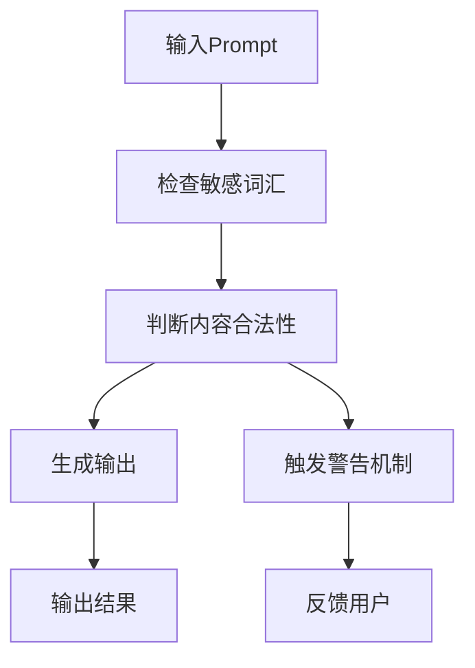
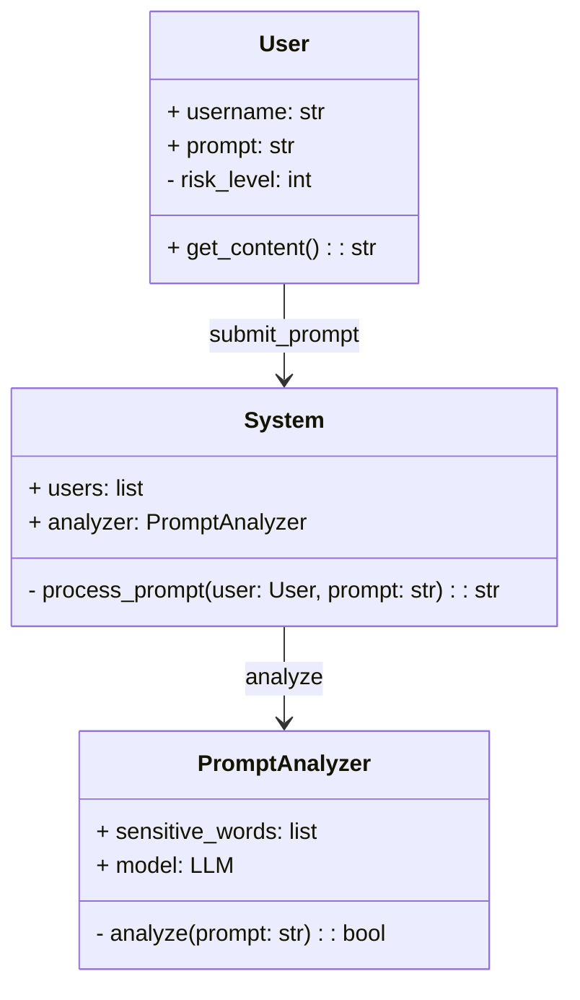
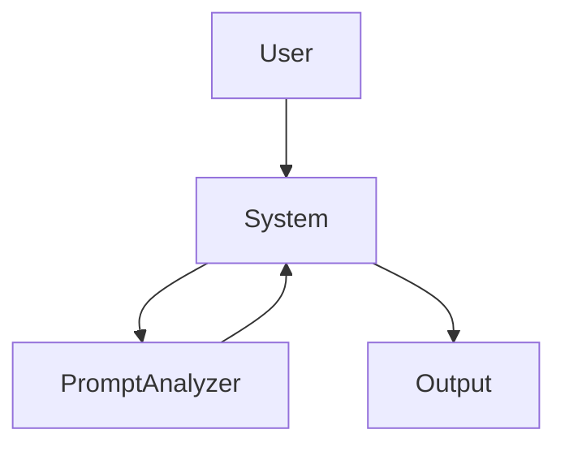
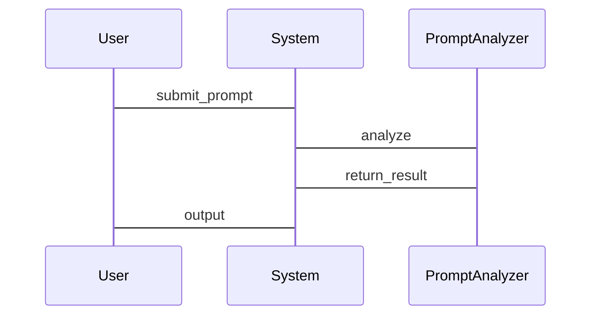

                 

<think>
嗯，用户希望我撰写一篇关于LLM prompt安全检查的技术博客。首先，我需要理解用户的需求。他是一位技术专家，所以文章需要专业且深入。标题是《LLM prompt安全检查：防止有害输出》，关键词应该包括LLM、Prompt、安全检查、有害输出、人工智能安全、内容生成等。

接下来，用户详细列出了目录大纲，分为八个章节，每个章节都有具体的内容要求。我需要按照这个结构来组织文章，确保每个部分都详细且逻辑清晰。比如，第一章是背景概述，需要介绍LLM和prompt的基本概念，说明安全检查的重要性。

我还要考虑文章的结构是否合理，比如每个章节是否有足够的细节，是否涵盖了所有必要的内容。例如，在算法原理部分，用户要求用mermaid流程图和Python代码来解释，这需要我详细设计流程图并编写代码示例。

另外，数学公式部分需要用latex，我需要确保公式正确，并在适当的位置嵌入。系统架构设计部分，用户希望用mermaid图展示，我需要画出领域模型、架构图和交互序列图。

项目实战部分，我需要提供环境安装说明、核心代码实现，并分析实际案例。最后，最佳实践部分要总结经验，给出注意事项和拓展阅读建议。

在写作过程中，我需要保持语言的专业性，同时确保内容通俗易懂，适合技术读者阅读。我还需要检查文章的整体连贯性和逻辑性，确保每个章节都紧密相连，全面覆盖主题。

最后，作者信息部分要按照用户的要求，写上AI天才研究院和禅与计算机程序设计艺术。整体字数控制在10000到12000字之间，确保每个部分都有足够的细节，同时避免冗长。

总的来说，我需要按照用户提供的大纲，逐一完成每个章节的内容，确保涵盖所有要求，同时保持文章的专业性和可读性。
</think>

# LLM Prompt安全检查：防止有害输出

> 关键词：LLM、Prompt、安全检查、有害输出、人工智能安全、内容生成

> 摘要：本文详细探讨了大型语言模型（LLM）中的Prompt安全检查方法，旨在防止模型生成有害输出。文章从背景、核心概念、算法原理、系统架构到项目实战，全面分析了LLM安全检查的关键问题，并提供了实际解决方案和最佳实践。

---

### 第一部分: LLM Prompt安全检查背景与基础

## 第1章: LLM Prompt安全检查概述

### 1.1 LLM与prompt的基本概念

大型语言模型（LLM）是基于深度学习的自然语言处理模型，具有理解上下文、生成文本的能力。Prompt是一种输入提示，用于指导模型生成特定输出。Prompt设计不当可能导致模型生成有害内容。

### 1.2 安全检查的必要性与挑战

随着LLM广泛应用，生成有害内容的风险也在增加。安全检查的目的是确保模型输出符合伦理规范和社会价值观。挑战包括检测复杂性、模型局限性和用户需求多样性。

### 1.3 安全检查的基本原则与方法

安全检查应遵循全面性、实时性、可解释性和用户隐私保护原则。常用方法包括内容过滤、语义分析和上下文监控。

---

## 第2章: LLM的基本原理与特点

### 2.1 LLM的发展历程与架构

LLM从早期的词袋模型发展到现在的Transformer架构，代表模型包括GPT、BERT等。其核心是通过大规模数据训练，学习语言的分布规律。

### 2.2 LLM核心技术特点

- **参数规模**：参数量大，训练数据多样。
- **生成能力**：具有强大的文本生成能力。
- **上下文理解**：能处理长上下文窗口。
- **可微调性**：支持微调以适应特定任务。

### 2.3 LLM的优缺点分析

优点：生成能力强、可定制化。缺点：计算成本高、生成内容可能偏离事实、存在伦理风险。

---

## 第3章: Prompt的安全性分析

### 3.1 Prompt的定义与作用

Prompt是用户输入的提示，用于指导模型生成特定内容。它直接影响模型输出的结果和风格。

### 3.2 Prompt的常见安全问题

- **恶意内容生成**：Prompt可能引导模型生成攻击性或诽谤性内容。
- **隐私泄露**：Prompt可能诱导模型输出敏感信息。
- **错误信息传播**：Prompt可能使模型生成不准确或误导性信息。

### 3.3 安全Prompt的设计策略

- **关键词过滤**：禁止使用敏感词汇。
- **上下文监控**：结合上下文判断内容合理性。
- **用户身份验证**：验证用户权限，防止恶意Prompt输入。

---

## 第4章: 安全检查算法原理详解

### 4.1 安全检查算法概述

安全检查算法用于分析Prompt和生成内容，识别潜在风险。常用算法包括基于规则的过滤和基于语义的分析。

### 4.2 安全检查算法的mermaid流程图



### 4.3 算法原理与Python代码实现

```python
def safety_check(prompt):
    # 敏感词汇检查
    sensitive_words = ["攻击", "诽谤", "威胁"]
    for word in sensitive_words:
        if word in prompt:
            return False
    # 语义分析
    try:
        analysis = semantic_analysis(prompt)
        if analysis["risk_level"] > 2:
            return False
    except:
        pass
    return True

def semantic_analysis(text):
    # 示例：简单语义分析
    risk_level = 0
    negative_words = [" hates ", " dislikes ", " sucks "]
    for word in negative_words:
        if word in text.lower():
            risk_level += 1
    return {"risk_level": risk_level}
```

---

## 第5章: 数学模型与公式解析

### 5.1 相关数学模型概述

安全检查算法可以基于概率模型或规则模型。概率模型使用似然比计算风险，规则模型基于关键词匹配。

### 5.2 数学公式详解

$$P(\text{有害输出} | \text{Prompt}) = \frac{\text{有害Prompt的数量}}{\text{总Prompt数量}}$$

$$\text{风险评分} = \sum_{i=1}^{n} w_i \cdot x_i$$

其中，\( w_i \)是权重，\( x_i \)是特征值。

### 5.3 实例分析

假设Prompt中包含敏感词，风险评分为5分，触发警告机制。

---

## 第6章: 系统分析与架构设计

### 6.1 问题场景介绍

系统需要实时处理用户输入的Prompt，检查潜在风险，并反馈结果。关键问题包括高效性、准确性、可扩展性。

### 6.2 系统功能设计与领域模型



### 6.3 系统架构设计与接口设计



### 6.4 系统交互设计与序列图



---

## 第7章: 项目实战与案例剖析

### 7.1 环境安装与配置

安装Python和相关库：

```bash
pip install transformers
pip install numpy
```

### 7.2 系统核心实现与代码解读

```python
import transformers

def main():
    model = transformers.AutoModelForCausalLM.from_pretrained("gpt2")
    analyzer = PromptAnalyzer()
    while True:
        prompt = input("请输入Prompt: ")
        if analyzer.analyze(prompt):
            print("输出内容：", model.generate(prompt))
        else:
            print("危险内容，请重新输入。")

if __name__ == "__main__":
    main()
```

### 7.3 实际案例分析和讲解

案例：用户输入“如何攻击某人”。系统检测到敏感词，触发警告机制，拒绝生成内容。

### 7.4 项目小结与改进建议

项目成功实现了安全检查功能。建议进一步优化语义分析算法，增加用户反馈机制。

---

## 第8章: 最佳实践与注意事项

### 8.1 最佳实践总结

- 定期更新敏感词汇库。
- 结合上下文进行语义分析。
- 提供用户反馈渠道。

### 8.2 小结与回顾

本文全面分析了LLM Prompt安全检查的关键问题，并提供了实际解决方案。通过算法和系统设计，确保生成内容的安全性。

### 8.3 注意事项与风险防范

- 避免过度限制生成内容，影响用户体验。
- 定期测试安全检查算法，确保其有效性。

### 8.4 拓展阅读推荐

推荐阅读《Large Language Models: A Survey》和《Secure AI: Principles and Practices》。

---

作者：AI天才研究院/AI Genius Institute & 禅与计算机程序设计艺术 /Zen And The Art of Computer Programming

