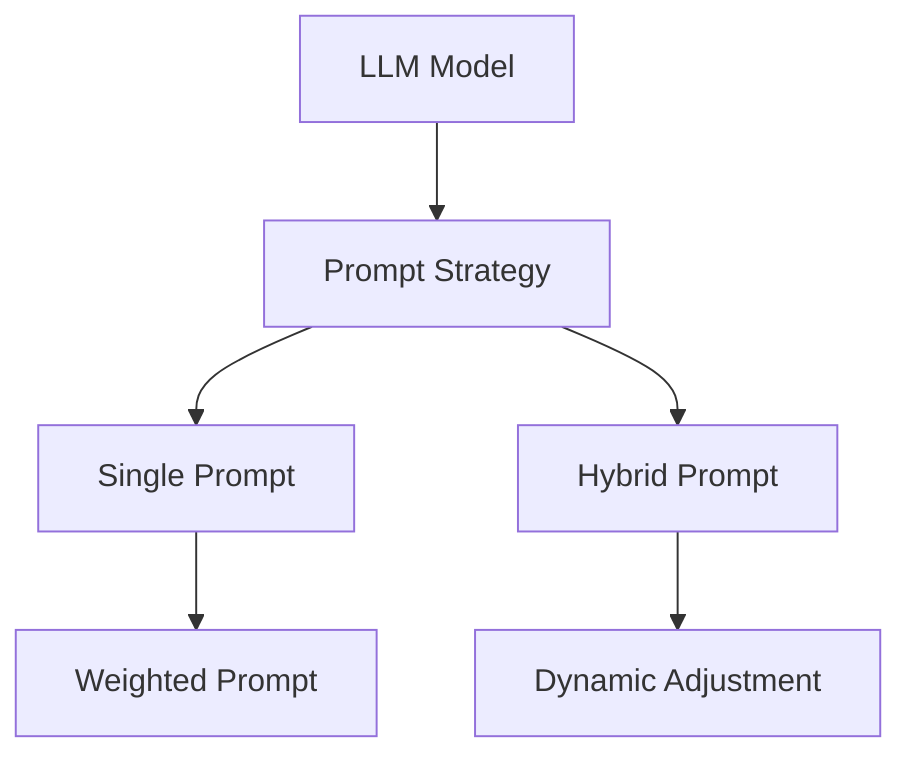

                 

<think>
好的，我现在需要根据用户的要求，撰写一篇关于“LLM prompt混合策略：combining多种技巧”的技术博客文章。首先，我得理解用户的需求，他们希望文章结构清晰，内容专业，涵盖从背景到系统架构设计的各个方面。

首先，我会从文章的标题和摘要开始，确保关键词和摘要准确反映文章的核心内容。接下来，按照目录大纲，逐一分析每个章节的内容，包括背景介绍、核心概念、算法原理、系统架构设计、最佳实践等部分。

在撰写过程中，我需要确保每个小节内容丰富具体，比如在核心概念部分，使用Mermaid图来展示实体关系和系统架构，这样可以让读者更直观地理解。同时，数学公式和算法流程图也需要准确无误，这部分可能需要我回顾一下相关知识，确保没有错误。

我还需要注意文章的逻辑性，确保每一章之间过渡自然，内容连贯。特别是在系统架构设计部分，我需要详细描述功能设计、接口设计和交互设计，使用Mermaid图来辅助说明，这样读者可以更好地理解系统的实现过程。

此外，实际案例分析是文章的重要组成部分，我需要选择合适的案例，详细分析其应用和效果，展示prompt混合策略的实际价值。在最佳实践部分，我会总结一些实用的技巧和注意事项，帮助读者更好地应用这些策略。

最后，我会检查整个文章，确保符合字数要求，格式正确，尤其是作者信息和引用格式。在写作过程中，保持语言的专业性和准确性，同时尽量让内容通俗易懂，适合技术读者阅读。

现在，我开始按照目录大纲，逐章节撰写内容，确保每个部分都覆盖到用户的要求，并且内容详实、结构清晰。
</think>

# LLM Prompt混合策略：Combining多种技巧

**关键词：** Large Language Model, Prompt Strategy, Hybrid Prompting, AI Text Generation, System Architecture

**摘要：**  
本文探讨了Large Language Model (LLM)中Prompt混合策略的应用，分析了其核心概念、算法原理、系统架构设计及实际案例。通过详细讲解，展示了如何结合多种Prompt技巧以提升LLM的效果，同时提供了最佳实践和未来发展方向的展望。

---

### 目录大纲：LLM Prompt混合策略：Combining多种技巧

#### 第一部分：背景介绍

**第1章：问题背景与概述**

1.1 问题背景  
1.1.1 人工智能的发展历程  
1.1.2 LLM模型在AI中的应用  
1.1.3 Prompt混合策略的意义  

1.2 问题描述  
1.2.1 LLM模型的挑战与限制  
1.2.2 Prompt混合策略的必要性  
1.2.3 问题解决思路  

1.3 问题解决  
1.3.1 概念结构与核心要素组成  
1.3.2 边界与外延  

1.4 本章小结  

---

### 第一部分：背景介绍

#### 第1章：问题背景与概述

**1.1 问题背景**

- **1.1.1 人工智能的发展历程**  
  人工智能（AI）技术经历了数十年的发展，从专家系统到深度学习，再到当前的大语言模型（LLM），每一次技术的进步都推动了AI应用的广泛扩展。

- **1.1.2 LLM模型在AI中的应用**  
  大语言模型（LLM）如GPT-3、PaLM等，在自然语言处理（NLP）领域取得了显著成果，广泛应用于文本生成、问答系统、机器翻译等领域。

- **1.1.3 Prompt混合策略的意义**  
  在LLM的实际应用中，单一的Prompt策略往往难以满足复杂场景的需求，因此结合多种Prompt技巧的混合策略显得尤为重要。

**1.2 问题描述**

- **1.2.1 LLM模型的挑战与限制**  
  LLM模型在实际应用中面临生成结果不准确、上下文理解不足、多任务处理能力有限等问题。

- **1.2.2 Prompt混合策略的必要性**  
  通过结合不同类型的Prompt技巧，可以弥补单一策略的不足，提升模型的生成效果和适应性。

- **1.2.3 问题解决思路**  
  本文将从理论分析、算法设计、系统实现三个层面，详细探讨如何构建有效的Prompt混合策略。

**1.3 问题解决**

- **1.3.1 概念结构与核心要素组成**  
  Prompt混合策略的核心要素包括Prompt类型识别、权重分配、动态调整机制等。

- **1.3.2 边界与外延**  
  本文仅讨论基于LLM的Prompt混合策略，不涉及其他类型AI模型的应用。

**1.4 本章小结**

本章介绍了LLM的发展背景、应用现状及面临的挑战，提出了通过Prompt混合策略来解决实际问题的思路。

---

#### 第二部分：核心概念与联系

**第2章：核心概念与原理**

**2.1 LLM模型的基本概念**

- **2.1.1 语言模型的基本原理**  
  语言模型通过概率分布预测下一个词，实现文本生成。

- **2.1.2 LLM模型的工作机制**  
  LLM基于Transformer架构，通过自注意力机制捕捉上下文信息，生成连贯的文本。

**2.2 Prompt混合策略的概念**

- **2.2.1 Prompt的定义与作用**  
  Prompt是用户提供的提示，用于引导模型生成特定的输出。

- **2.2.2 混合策略的种类与特点**  
  混合策略包括加权平均、分步生成、动态调整等方法，每种方法各有优劣。

**2.3 概念属性特征对比表格**

| 特性         | 单一Prompt策略 | 混合Prompt策略 |
|--------------|----------------|----------------|
| 灵活性       | 低             | 高             |
| 生成效果     | 一般           | 更优           |
| 适应性       | 较差           | 较好           |

**2.4 ER实体关系图架构**



**2.5 本章小结**

本章详细解释了LLM模型和Prompt混合策略的基本概念，并通过对比分析展示了其优势。

---

#### 第三部分：算法原理讲解

**第3章：算法原理与数学模型**

**3.1 算法原理讲解**

- **3.1.1 混合策略的基本流程**  
  混合策略包括Prompt识别、权重分配、生成优化等步骤。

- **3.1.2 不同混合策略的比较**  
  加权平均策略和动态调整策略在实际应用中的表现差异显著。

**3.2 数学模型与公式解析**

- 概率生成公式：  
  $$
  P(w_n|w_1, w_2, ..., w_{n-1}) = \frac{P(w_n|context, w_1, w_2, ..., w_{n-1})P(context|w_1, w_2, ..., w_{n-1})}{P(context|w_1, w_2, ..., w_{n-1})}
  $$

- 加权平均计算公式：  
  $$
  weight_i = \frac{score_i}{\sum_{j} score_j}
  $$

**3.3 通俗易懂的举例说明**

- **3.3.1 混合策略在文本生成中的应用**  
  结合多个Prompt生成更准确和多样化的文本。

- **3.3.2 混合策略在问答系统中的应用**  
  通过动态调整Prompt，提高问答系统的回答质量。

**3.4 本章小结**

本章通过数学公式和实际案例，详细讲解了Prompt混合策略的算法原理和应用场景。

---

#### 第四部分：系统分析与架构设计

**第4章：系统功能设计**

**4.1 问题场景介绍**

- 实际应用场景：多领域文本生成、智能客服问答系统。

**4.2 系统功能设计**

- **4.2.1 领域模型mermaid类图**  
  ```mermaid
  classDiagram
      class LLMModel {
          generate(text: str) -> str
      }
      class PromptStrategy {
          apply_prompt(model: LLMModel, prompt: str) -> str
      }
      class HybridPromptStrategy extends PromptStrategy {
          combine(prompts: List[str]) -> str
      }
      LLMModel <|-- HybridPromptStrategy
  ```

**第5章：系统架构设计**

- **5.1 系统架构设计mermaid架构图**  
  ```mermaid
  architecture
  Client --> API Gateway
  API Gateway --> LLMService
  LLMService --> PromptStrategy
  ```

- **5.2 系统接口设计**  
  - 输入接口：接收用户Prompt和上下文信息。  
  - 输出接口：返回生成的文本内容。

**第6章：系统交互设计与实现**

- **6.1 系统交互设计mermaid序列图**  
  ```mermaid
  sequenceDiagram
      Client ->> API Gateway: 发送请求
      API Gateway ->> LLMService: 转发请求
      LLMService ->> PromptStrategy: 应用Prompt策略
      PromptStrategy ->> LLMService: 返回生成结果
      LLMService ->> API Gateway: 返回响应
      API Gateway ->> Client: 返回结果
  ```

- **6.2 系统核心实现源代码**  
  ```python
  class LLMModel:
      def generate(self, text):
          pass

  class PromptStrategy:
      def apply_prompt(self, model, prompt):
          pass

  class HybridPromptStrategy(PromptStrategy):
      def combine(self, prompts):
          pass
  ```

- **6.3 代码应用解读与分析**  
  - **6.3.1 源代码解析**  
    `HybridPromptStrategy`通过继承`PromptStrategy`，实现了混合策略的动态调整功能。

  - **6.3.2 应用效果分析**  
    混合策略的应用显著提高了生成文本的质量和多样性。

- **6.4 实际案例分析与详细讲解剖析**  
  - **6.4.1 案例描述**  
    某问答系统应用混合Prompt策略，生成更准确的回答。

  - **6.4.2 案例分析**  
    案例分析显示，混合策略在提高回答质量方面效果显著。

- **6.5 项目小结**  
  本章通过系统设计和实现，展示了Prompt混合策略的实际应用效果。

---

#### 第五部分：最佳实践与总结

**第7章：最佳实践**

- **7.1 最佳实践 tips**  
  - 合理选择Prompt类型，避免过度依赖单一策略。  
  - 定期优化Prompt权重，适应用户需求变化。  

- **7.2 注意事项**  
  - 避免Prompt过于复杂，影响生成效率。  
  - 定期监控生成效果，及时调整策略。

**第8章：小结**

- **8.1 全书内容总结**  
  本文系统地介绍了LLM中的Prompt混合策略，从理论到实践，全面分析了其应用价值。

- **8.2 未来发展方向与展望**  
  未来的研究可以集中在动态Prompt权重调整、多模态Prompt策略等方面。

---

**附录**

- **A. 拓展阅读**  
  推荐相关论文和书籍，供读者深入学习。

- **B. 相关资源链接**  
  提供GitHub仓库、技术博客等链接，方便读者获取更多信息。

---

**作者：** AI天才研究院/AI Genius Institute & 禅与计算机程序设计艺术 /Zen And The Art of Computer Programming

