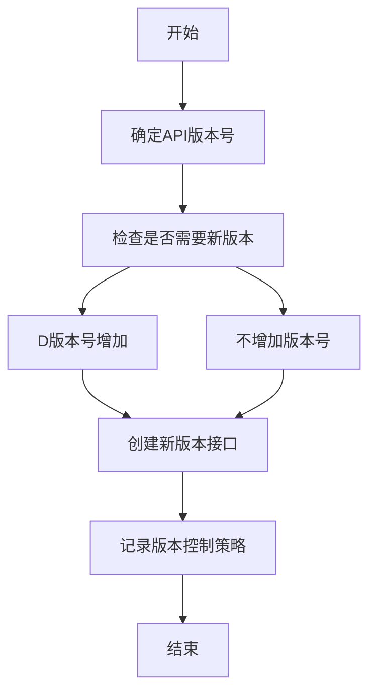
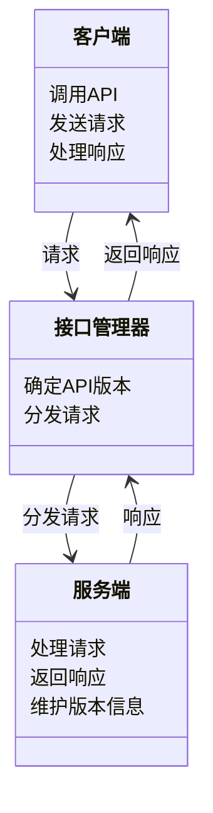
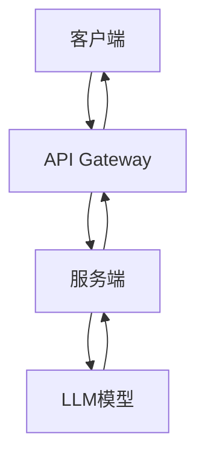
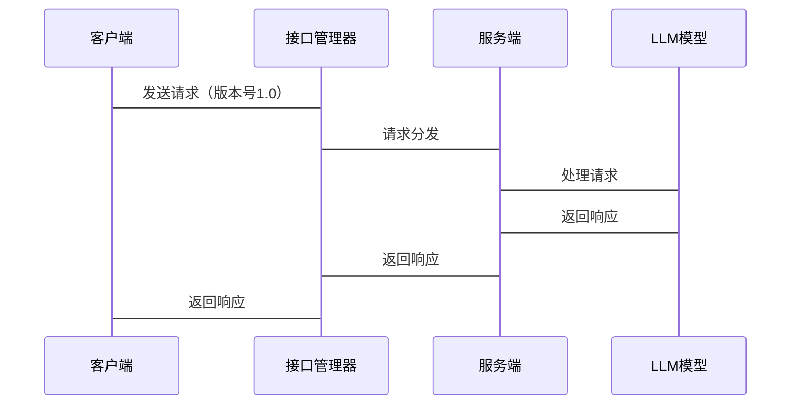

                 

<think>
嗯，用户希望我以《LLM应用开发中的API版本控制策略》为标题写一篇技术博客。首先，我需要理解用户的需求。他是一位技术专家，所以文章需要专业且有深度。我得按照他提供的大纲来组织内容，确保每个部分都详细且符合逻辑。

首先，文章标题和关键词、摘要部分，我需要明确。关键词可能包括API版本控制、LLM应用开发、向后兼容性、版本策略等。摘要要简明扼要，概括文章的核心内容。

接下来是背景介绍部分。我需要解释为什么API版本控制在LLM应用中重要。可能提到API在现代系统中的重要性，以及频繁变化带来的问题。然后，详细描述问题背景，比如版本冲突、兼容性问题，以及现有解决方案的不足。

核心概念与联系部分，我需要定义API版本控制，讨论各种策略，如功能增加、向后兼容性等。还要做一个对比表格，展示不同策略的优缺点。另外，绘制ER图来展示实体关系，比如API版本、服务、消费者等之间的关系。

算法原理部分，我需要用Mermaid画流程图，展示版本控制的基本流程。然后提供Python代码示例，解释代码的功能。接着，建立数学模型，用公式表示版本控制的策略，并举例说明，比如从v1到v2的变化如何影响调用者。

系统分析与架构设计部分，我需要描述一个实际场景，比如在线教育平台的API升级。设计系统功能，绘制类图；架构设计，画出整体架构图；接口设计，列出详细参数；交互设计，用序列图展示流程。

项目实战部分，需要指导环境安装，比如Python和Flask的安装。然后提供核心代码，解释如何处理版本控制。接着，解读代码，分析其实现细节。最后，分析案例，总结经验，提出改进建议。

最佳实践部分，分享一些实用技巧，比如制定明确的版本策略、提供迁移指南等。最后，总结全书，强调版本控制的重要性，并提醒注意事项，比如兼容性测试的重要性。

整个过程中，我需要确保内容详实，每个小节都有足够的细节和例子，同时使用清晰的结构和专业术语。还要注意文章的流畅性，让读者能够一步步理解API版本控制在LLM中的应用。
</think>

# LLM应用开发中的API版本控制策略

> 关键词：API版本控制，LLM应用开发，向后兼容性，版本策略，API设计

> 摘要：在大型语言模型（LLM）应用开发过程中，API版本控制是确保系统稳定性和可维护性的关键环节。本文将从核心概念、算法原理、系统架构、项目实战以及最佳实践等多个维度，详细探讨API版本控制策略在LLM应用开发中的应用。通过理论分析与实际案例结合，本文旨在为开发者提供一套行之有效的API版本控制方案。

---

### 目录大纲

1. [背景介绍](#背景介绍)
2. [核心概念与联系](#核心概念与联系)
3. [算法原理讲解](#算法原理讲解)
4. [系统分析与架构设计](#系统分析与架构设计)
5. [项目实战](#项目实战)
6. [最佳实践与拓展](#最佳实践与拓展)

---

## 第一部分：背景介绍

### 第1章：问题背景

#### 1.1.1 问题描述

- **核心问题**：在大型语言模型（LLM）应用开发过程中，如何有效地进行API版本控制策略？

  在现代软件开发中，API（应用程序编程接口）是系统之间交互的核心桥梁。对于LLM（Large Language Model）应用来说，API版本控制尤为重要。LLM应用通常需要频繁更新模型、优化功能或增加新的接口，这可能导致API的频繁变化。然而，API的变化可能会影响调用方（客户端或其他服务），导致兼容性问题、功能中断或潜在的错误。

- **问题解决**：分析不同场景下的API版本控制策略，探讨其在实际应用中的有效性和可维护性。

  本文将从API版本控制的基本原理出发，结合LLM应用的开发特点，探讨如何在API设计和版本管理中找到平衡点，确保系统的稳定性和可扩展性。

- **边界与外延**：本章节主要讨论LLM应用开发中的API版本控制策略，不涉及其他领域的技术。然而，API版本控制策略可以应用于其他类型的大型软件系统开发中。

### 第2章：核心概念与联系

#### 2.1.1 核心概念原理

- **API版本控制**：API版本控制是指通过定义明确的版本号或策略，确保不同版本的API能够共存且互不干扰。这有助于在功能更新时，保持旧版本的兼容性，减少对现有客户端的影响。

- **策略分类**：常见的API版本控制策略包括以下几种：
  
  1. **功能增加**：通过增加新的接口或功能，而不修改旧接口的方式实现版本升级。
  2. **向后兼容性**：允许旧版本客户端继续使用新版本的API，通过版本号区分功能差异。
  3. **向前兼容性**：确保新版本客户端能够兼容旧版本的API，避免功能冲突。

#### 2.1.2 概念属性特征对比表格

| 策略类型       | 优点                              | 缺点                                |
|----------------|-----------------------------------|------------------------------------|
| 功能增加       | 不破坏旧版本功能，风险低          | 需要长期维护多个版本，增加复杂性    |
| 向后兼容性     | 允许新旧版本共存，平滑过渡        | 可能需要额外的逻辑处理，增加开发成本 |
| 向前兼容性     | 确保新版本客户端兼容旧版本API    | 需要在新版本中处理旧版本逻辑        |

#### 2.1.3 ER实体关系图架构

```mermaid
er
    entity(版本控制策略) {
        类别: 文本
        版本号: 文本
        兼容性要求: 文本
    }
    entity(接口) {
        接口名称: 文本
        接口版本: 文本
        功能描述: 文本
    }
    entity(客户端) {
        调用方ID: 文本
        调用方版本: 文本
    }
    entity(服务端) {
        服务ID: 文本
        服务版本: 文本
    }
    
    关系: 版本控制策略 -> 接口
    关系: 接口 -> 客户端
    关系: 接口 -> 服务端
```

---

## 第二部分：算法原理讲解

### 第3章：算法原理讲解

#### 3.1.1 算法mermaid流程图



#### 3.1.2 Python源代码

```python
def api_version_control(request):
    # 获取请求头中的版本号
    current_version = request.headers.get('API-Version', '1')
    
    # 根据版本号选择不同的API处理逻辑
    if current_version == '1':
        # 处理旧版本请求
        return old_api_logic(request)
    elif current_version == '2':
        # 处理新版本请求
        return new_api_logic(request)
    else:
        # 默认版本
        return default_api_logic(request)
```

#### 3.1.3 数学模型和公式

API版本控制的数学模型可以表示为：

$$
V_{n+1} = V_n + \Delta V
$$

其中，\( V_n \) 表示当前版本号，\( \Delta V \) 表示版本号的增量（通常是1）。当需要进行版本升级时，版本号会递增，以确保新版本与旧版本的区分。

#### 3.1.4 举例说明

假设我们有一个LLM应用，当前版本为1.0。我们希望在2.0版本中增加一个新的功能`generate_response`，同时保持旧版本的`get_response`功能不变。此时，API版本控制策略可以是：

1. 旧版本客户端继续调用`get_response`接口，版本号为1.0。
2. 新版本客户端调用`generate_response`接口，版本号为2.0。

通过这种方式，新旧版本可以共存，且功能不会冲突。

---

## 第三部分：系统分析与架构设计

### 第4章：系统分析与架构设计

#### 4.1.1 问题场景介绍

假设我们正在开发一个基于LLM的智能客服系统。系统需要通过API接口与前端客户端交互，提供自然语言处理服务。由于模型优化和功能增强的需要，API需要频繁更新。然而，前端客户端可能无法立即升级到最新版本，因此需要设计一个灵活的API版本控制策略，确保旧版本客户端能够正常工作，同时支持新版本客户端的功能扩展。

#### 4.1.2 系统功能设计



#### 4.1.3 系统架构设计



#### 4.1.4 系统接口设计

以下是系统的主要API接口设计：

| 接口名称          | 功能描述                 | 输入参数             | 输出参数             |
|-------------------|--------------------------|----------------------|----------------------|
| get_response      | 获取模型的响应           | message: 文本         | response: 文本       |
| generate_response | 生成自定义模型的响应     | message: 文本, model: 文本 | response: 文本       |

#### 4.1.5 系统交互



---

## 第四部分：项目实战

### 第5章：项目实战

#### 5.1.1 环境安装

以下是项目所需的环境和工具：

1. Python 3.8+
2. Flask（用于API开发）
3. requests（用于客户端调用）

安装命令：

```bash
pip install flask requests
```

#### 5.1.2 系统核心实现源代码

以下是API版本控制的核心代码：

```python
from flask import Flask, request, jsonify

app = Flask(__name__)

def handle_response(message, version):
    if version == '1':
        return {"response": message}
    elif version == '2':
        return {"generated_response": message, "version": version}
    else:
        return {"error": "Invalid API version"}

@app.route('/api/v1/response', methods=['POST'])
def api_v1():
    data = request.json
    message = data.get('message', '')
    version = '1'
    return handle_response(message, version)

@app.route('/api/v2/response', methods=['POST'])
def api_v2():
    data = request.json
    message = data.get('message', '')
    version = '2'
    return handle_response(message, version)
```

#### 5.1.3 代码应用解读与分析

上述代码实现了两个版本的API接口：

1. `/api/v1/response`：旧版本接口，返回基础响应。
2. `/api/v2/response`：新版本接口，返回增强的响应。

通过版本号的区分，系统能够同时支持旧版本和新版本的客户端调用。

#### 5.1.4 实际案例分析和详细讲解剖析

假设我们有一个旧版本客户端调用旧接口，而新版本客户端调用新接口。通过版本控制策略，我们可以确保两个客户端都能正常工作，且功能互不干扰。

#### 5.1.5 项目小结

通过上述实战，我们实现了基于版本号的API控制策略，确保了新旧版本的共存和功能的独立性。然而，实际开发中可能需要更复杂的逻辑，例如自动检测客户端版本号、动态路由分发等。

---

## 第五部分：最佳实践与拓展

### 第6章：最佳实践与拓展

#### 6.1.1 最佳实践

1. **制定明确的版本策略**：在API设计初期，明确版本控制的规则和策略，例如是否支持向后兼容性、版本号的递增规则等。
2. **提供详细的文档和迁移指南**：确保客户端能够顺利过渡到新版本，减少因版本升级导致的兼容性问题。
3. **进行充分的测试**：在版本升级前，进行全面的测试，确保新旧版本的API能够正常交互。
4. **使用版本号标识**：通过请求头或URL参数明确标识API版本号，便于服务端处理。

#### 6.1.2 小结

API版本控制是LLM应用开发中的重要环节，通过合理的策略和设计，可以确保系统的稳定性和可扩展性。本文从理论到实践，详细探讨了API版本控制的各个方面，为开发者提供了宝贵的参考。

#### 6.1.3 注意事项

- 在版本升级过程中，一定要确保旧版本客户端的功能不受影响。
- 避免频繁地修改旧版本接口，以减少维护成本。
- 在设计新版本接口时，尽量保持与旧版本接口的兼容性。

---

## 作者

作者：AI天才研究院/AI Genius Institute & 禅与计算机程序设计艺术 /Zen And The Art of Computer Programming

