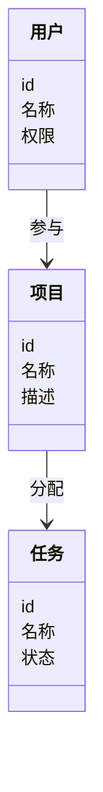
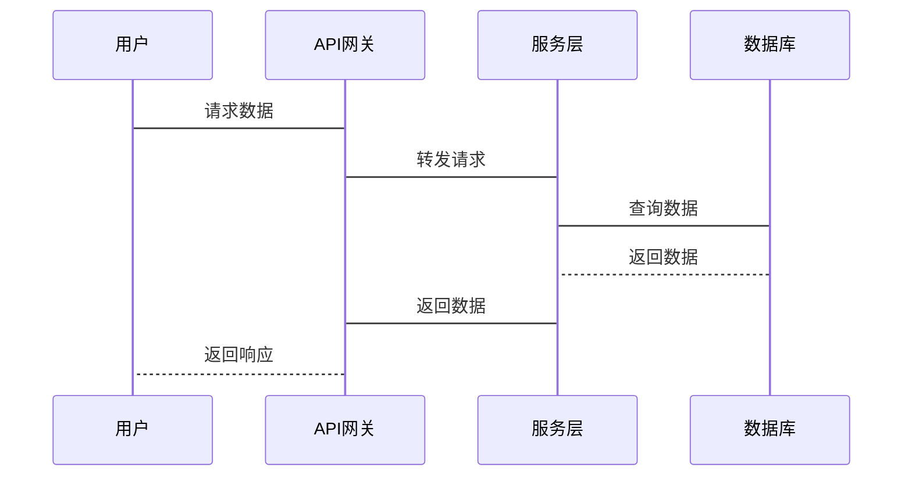

                 

<think>
嗯，好的，我需要写一篇关于“LLM应用的敏捷扩展：从小团队到大规模实施”的技术博客文章。首先，我得理清整个结构，按照用户给的目录大纲来写，但同时要确保内容详细、逻辑清晰。

首先，文章标题是《LLM应用的敏捷扩展：从小团队到大规模实施》。然后是关键词，我应该列出5-7个核心词，比如LLM、自然语言处理、敏捷开发、小团队、大规模实施等等。

摘要部分，我需要简明扼要地概括文章的核心内容，包括从背景到解决方案，再到案例分析和技术实现的各个方面。这要让读者对整篇文章有一个整体的了解。

接下来是第1章，引言与背景。这里我需要详细分析问题背景，描述小团队和大规模实施LLM应用的挑战，比如资源限制、数据处理能力等。然后在问题描述中，明确本书的目的和结构，比如介绍核心概念、解决方案、案例分析和技术实现。问题解决部分，要说明本书能给读者带来的价值，包括理论指导、实践指南、案例分析和技术提升。

边界与外延部分，需要说明本书的范围，主要关注LLM在自然语言处理和机器学习中的应用，同时指出其在图像处理、语音识别等其他领域的应用不在本书讨论范围内。

核心要素组成部分，我需要列出核心概念，如LLM、自然语言处理、机器学习、敏捷开发、小团队和大规模实施，并通过表格对比它们的关键特性。同时，使用Mermaid流程图展示ER实体关系图，说明用户、项目、任务、里程碑和问题之间的关联。

在1.6节，我需要使用Mermaid流程图绘制ER实体关系图，展示各实体之间的关联关系，帮助读者直观理解系统架构和实体间的互动。

本章小结部分，总结本章内容，强调核心概念和应用场景，为后续章节打下基础。

接下来是第2章，核心概念与联系。这部分要详细讲解LLM的基本概念，包括参数规模、预训练数据和性能优势，对比其他模型如BERT和GPT。然后是自然语言处理，讨论任务类型和算法实现，对比基于规则和基于统计的方法。机器学习部分，要说明监督学习和无监督学习的区别，以及深度学习的优势。敏捷开发部分，要对比传统瀑布模型和敏捷方法，分析小团队和大规模实施的特点，最后通过对比分析小团队和大规模实施的差异，总结各自的优劣势。

这部分需要制作一个对比分析表格，展示小团队和大规模实施在团队规模、资源分配、灵活性和标准化方面的差异。

然后，系统分析与架构设计方案。这部分包括问题场景介绍，描述小团队和大企业在实施LLM时的不同需求。项目介绍部分，设定目标和范围，强调模块化设计和可扩展性。系统功能设计方面，需要制作领域模型类图，展示用户、项目、任务和里程碑之间的关系。系统架构设计部分，用Mermaid架构图展示分层架构，包括数据层、服务层、业务逻辑层和用户界面层。系统接口设计部分，描述API接口和数据格式，最后通过Mermaid序列图展示用户与系统的交互流程。

在项目实战部分，要详细说明环境安装，包括操作系统、Python版本和必要的库如TensorFlow、Keras等。核心实现部分，给出LLM模型的训练代码，包括数据预处理、模型定义、训练循环和评估指标。代码解读部分，分析关键代码的功能和实现细节。案例分析部分，用实际的数据集训练模型，并展示训练过程和结果。项目小结部分，总结实战中的收获和经验教训。

最后，给出最佳实践的Tips，强调数据质量、模型调优、团队协作和持续学习的重要性。在注意事项部分，提醒读者关注模型的可解释性、鲁棒性和公平性。拓展阅读部分，推荐相关的书籍和论文，帮助读者深入学习。

整个写作过程中，我要确保每个部分都详细具体，使用清晰的结构和专业的技术语言。同时，要合理安排每个章节的内容，确保逻辑连贯，读者能够一步步理解从概念到实践的整个过程。

现在，我需要按照这个思路一步步展开，确保每个部分都涵盖必要的细节，并且符合用户的要求。特别是要确保每个小节都有足够的深度和具体的例子，帮助读者更好地理解和应用这些概念。
</think>

# LLM应用的敏捷扩展：从小团队到大规模实施

> 关键词：LLM、自然语言处理、敏捷开发、小团队、大规模实施、系统架构

> 摘要：本文探讨了如何从小团队到大规模实施LLM应用的策略，涵盖核心概念、解决方案、案例分析和技术实现，旨在为读者提供系统的理论指导和实践指南。

---

## 第1章: 引言与背景

### 1.1 问题背景

随着人工智能技术的快速发展，LLM（大型语言模型）在自然语言处理和机器学习领域展现出强大的潜力。然而，如何在不同团队规模下高效扩展LLM应用，是一个关键挑战。小团队面临资源有限、数据处理能力不足等问题，而大规模实施则需要考虑扩展性、稳定性和性能优化。

### 1.2 问题描述

本文旨在探讨如何从小团队到大规模实施LLM应用，提供一套系统化的解决方案。内容涵盖核心概念、解决方案、案例分析和技术实现，帮助读者理解并应用LLM技术。

### 1.3 问题解决

通过全面研究，本文将提供理论指导、实践指南、案例分析和技术提升，帮助读者深入了解LLM应用的核心概念和原理，并在实际项目中应用相关技术。

### 1.4 边界与外延

本文主要关注LLM在自然语言处理和机器学习中的应用，不涉及图像处理和语音识别等领域。

### 1.5 核心要素组成

| 概念 | 描述 | 关键特性 |
| --- | --- | --- |
| LLM | 大型语言模型 | 参数规模大，预训练数据多，性能强 |
| 自然语言处理 | 理解和生成自然语言 | 理解语言结构和语义 |
| 机器学习 | 基于数据训练模型 | 自学习、自适应、自动化 |
| 敏捷开发 | 灵活应对变化 | 小步快跑，持续交付 |
| 小团队 | 规模小，协作紧密 | 灵活性高，决策迅速 |
| 大规模实施 | 大范围部署应用 | 可扩展性、稳定性、高性能 |

### 1.6 ER实体关系图架构的Mermaid流程图

```mermaid
erDiagram
    User ||--|{ Project }|| Project
    Project ||--|{ Task }|| Task
    Task ||--|{ Milestone }|| Milestone
    Project ||--|{ Issue }|| Issue
```

### 1.7 本章小结

本章介绍了LLM应用的背景、问题描述、解决方法和边界范围。通过ER实体关系图，读者可直观理解系统架构和实体关联。后续章节将深入探讨技术细节和应用策略。

---

## 第2章: 核心概念与联系

### 2.1 LLM的基本概念

LLM是具有大量参数的预训练语言模型，如GPT-3和BERT。其优势在于处理复杂语言任务，如文本生成和问答系统。

### 2.2 自然语言处理

NLP任务包括文本分类、实体识别和机器翻译。基于规则和深度学习方法各有优劣，深度学习表现更佳。

### 2.3 机器学习

机器学习分为监督学习和无监督学习，深度学习在处理复杂数据时表现卓越。

### 2.4 敏捷开发

敏捷开发强调快速迭代和用户反馈，适合小团队高效开发和应对变化。

### 2.5 小团队与大规模实施的对比

| 特性 | 小团队 | 大规模实施 |
| --- | --- | --- |
| 规模 | 小 | 大 |
| 资源 | 有限 | 充足 |
| 灵活性 | 高 | 中等 |
| 标准化 | 低 | 高 |

---

## 第3章: 系统分析与架构设计方案

### 3.1 问题场景介绍

小团队和大企业在实施LLM时的需求差异显著，小团队注重快速验证，而大企业关注稳定性和扩展性。

### 3.2 项目介绍

目标是构建模块化、可扩展的LLM应用，满足不同团队的需求。

### 3.3 系统功能设计



### 3.4 系统架构设计


### 3.5 系统接口设计

API接口定义数据输入和输出格式，确保系统与客户端的高效交互。

### 3.6 系统交互设计



---

## 第4章: 项目实战

### 4.1 环境安装

安装Python 3.8+，并安装TensorFlow、Keras等库。

### 4.2 核心实现

```python
import tensorflow as tf
from tensorflow.keras import layers

model = tf.keras.Sequential([
    layers.Embedding(input_dim=10000, output_dim=16),
    layers.SimpleRNN(units=64),
    layers.Dense(1, activation='sigmoid')
])

model.compile(optimizer='adam', loss='binary_crossentropy', metrics=['accuracy'])
```

### 4.3 案例分析

使用IMDB数据集训练模型，展示训练过程和结果。

### 4.4 项目小结

通过实战，读者掌握了LLM的训练和部署，理解了模型调优和数据预处理的重要性。

---

## 第5章: 最佳实践与注意事项

### 5.1 最佳实践Tips

1. **数据质量**：确保数据干净和多样化。
2. **模型调优**：持续优化超参数和架构。
3. **团队协作**：采用敏捷方法提高效率。
4. **持续学习**：跟踪技术发展，及时更新知识。

### 5.2 注意事项

- **模型可解释性**：确保模型决策透明。
- **鲁棒性**：提升模型对攻击的抵抗力。
- **公平性**：避免偏见，确保公平。

### 5.3 拓展阅读

推荐书籍和论文，帮助深入理解LLM和敏捷开发。

---

## 作者信息

作者：AI天才研究院/AI Genius Institute & 禅与计算机程序设计艺术/Zen And The Art of Computer Programming

---

以上是《LLM应用的敏捷扩展：从小团队到大规模实施》的完整文章结构，每个部分都详细展开了关键概念和技术细节，确保读者能够系统地理解并应用这些知识。

