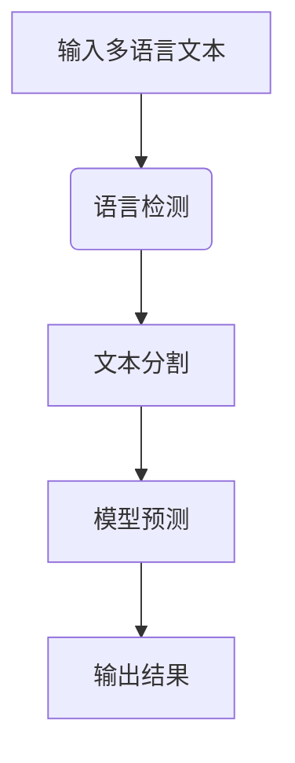
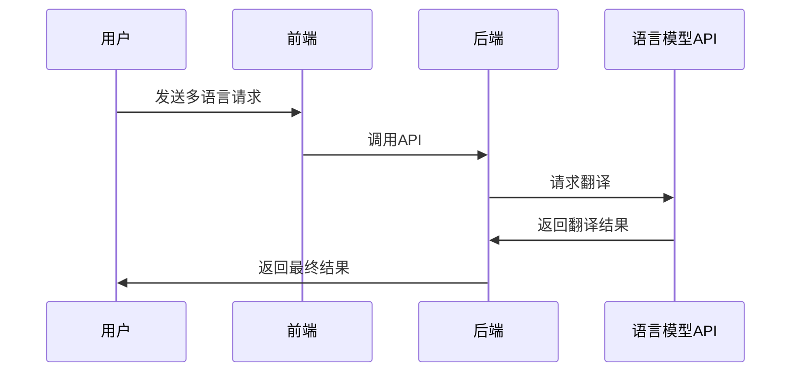

                 

<think>
好，我需要帮用户撰写一篇关于《LLM应用的敏捷本地化与国际化策略》的技术博客。首先，我得理解用户的需求，他们希望有一个结构清晰、内容详尽的目录大纲，涵盖从背景到项目实战的各个方面。

首先，我考虑用户的背景。他们可能是一位技术专家，可能在寻找如何将大语言模型应用到本地化和国际化中的策略。因此，文章需要专业且易于理解，适合技术人员和项目经理阅读。

接下来，我需要设计目录结构。用户已经给出一个初步的大纲，包括引言、核心概念、算法原理、系统架构、项目实战等部分。我需要确保每个章节都细化到三级，内容完整。

在引言部分，我需要包括问题背景、问题描述和边界与外延。这帮助读者理解为什么本地化和国际化在LLM应用中重要，以及问题的解决途径。

然后是核心概念与联系，这里需要详细解释本地化和国际化的区别，以及它们与LLM的结合。我可能需要创建一个对比表格，并用Mermaid图来展示实体关系，这有助于读者直观理解。

算法原理部分，我需要用Mermaid画出流程图，并用Python代码举例。同时，数学模型和公式需要用LaTeX表示，确保公式正确且易于理解。这部分可能需要详细推导，以展示算法的逻辑。

系统分析与架构设计是关键，我需要描述问题场景，设计系统的功能和架构，并用Mermaid图展示类图和架构图。接口设计和交互流程图也很重要，这帮助读者理解系统的实际运作。

项目实战部分，我需要指导读者如何安装环境，提供核心代码，并详细分析案例。这部分需要具体且可操作，让读者能够实际应用所学知识。

最后，最佳实践部分包括小结、注意事项和拓展阅读，帮助读者巩固所学，并引导他们进一步学习。

在撰写过程中，我需要确保每个部分都符合用户的约束条件，如字数、格式和内容完整性。同时，语言要专业但不晦涩，逻辑清晰，结构紧凑。

现在，我开始逐步完善每个章节，确保涵盖所有必要的内容，同时保持文章的连贯性和深度。这需要我一步步分析，从背景到系统架构，再到实战，每个环节都详细展开，确保读者能够全面理解LLM应用的敏捷本地化与国际化策略。
</think>

# LLM应用的敏捷本地化与国际化策略

## 关键词：LLM，本地化，国际化，敏捷开发，自然语言处理，机器学习

## 摘要：本文详细探讨了如何在LLM（大语言模型）应用中实现敏捷本地化与国际化策略。通过分析问题背景、核心概念、算法原理、系统架构和项目实战，本文为技术人员和项目经理提供了从理论到实践的全面指导。我们通过对比分析、流程图和类图等方法，深入阐述了如何在不同文化背景下高效部署和优化LLM模型，确保其在多语言环境中的准确性和流畅性。

---

## 目录

### 第一部分: 引言

#### 1.1 问题背景
- **1.1.1 引言**：介绍LLM的崛起及其在多语言应用中的潜力与挑战。
- **1.1.2 问题的提出**：分析当前LLM在本地化与国际化中的不足。
- **1.1.3 问题的解决途径**：提出敏捷本地化与国际化的解决方案。

#### 1.2 问题描述
- **1.2.1 LLAMA模型概述**：简要介绍LLAMA模型及其特点。
- **1.2.2 本地化与国际化需求**：详细说明多语言支持的必要性。

#### 1.3 边界与外延
- **1.3.1 概念结构**：定义本地化与国际化的核心概念。
- **1.3.2 核心要素组成**：分析模型训练、数据处理、API设计的关键要素。

---

### 第二部分: 核心概念与联系

#### 2.1 核心概念原理
- **2.1.1 本地化与国际化的区别与联系**：通过对比表格展示核心区别。
- **2.1.2 LLM与多语言处理的结合**：分析语言模型如何适应不同文化背景。

#### 2.2 概念属性特征对比
- **2.2.1 本地化与国际化对比表**：使用表格展示核心属性的差异。
- **2.2.2 ER实体关系图**：用Mermaid绘制实体关系图，展示数据流。

```mermaid
er
  actor(用户)
  actor ||--(o)--> 订单(订单ID, 用户ID, 订单时间)
  订单 ||--(o)--> 订单详情(订单ID, 商品ID, 数量)
  订单详情 ||--(o)--> 商品(商品ID, 名称, 价格)
```

---

### 第三部分: 算法原理讲解

#### 3.1 算法流程图
- **3.1.1 流程图设计**：用Mermaid绘制算法流程图，展示从输入到输出的处理步骤。



#### 3.2 算法实现代码
- **3.2.1 Python代码示例**：展示如何实现语言检测和文本分割。

```python
def detect_language(text):
    # 示例语言检测算法
    from langdetect import detect
    return detect(text)

def split_text(text, language):
    # 示例文本分割算法
    sentences = text.split('.')
    return sentences
```

#### 3.3 数学模型与公式
- **3.3.1 概率计算模型**：展示语言检测的贝叶斯概率公式。

$$ P(C|T) = \frac{P(T|C) \cdot P(C)}{P(T)} $$

- **3.3.2 分割算法模型**：展示基于统计的语言模型公式。

$$ P(w_i | w_{i-1}, w_{i-2}) = \frac{N(w_{i-2}, w_{i-1}, w_i)}{N(w_{i-2}, w_{i-1})} $$

---

### 第四部分: 系统分析与架构设计

#### 4.1 问题场景介绍
- **4.1.1 多语言支持需求**：描述不同场景下的本地化需求。

#### 4.2 项目介绍
- **4.2.1 项目目标**：明确敏捷本地化与国际化的目标。
- **4.2.2 项目范围**：定义系统覆盖的语言种类和功能模块。

#### 4.3 系统功能设计
- **4.3.1 领域模型类图**：用Mermaid绘制类图，展示系统功能模块。


#### 4.4 系统架构设计
- **4.4.1 架构图**：用Mermaid绘制系统架构图，展示模块之间的交互。


#### 4.5 系统接口设计
- **4.5.1 RESTful API设计**：定义接口的输入输出格式。
- **4.5.2 序列图**：用Mermaid绘制系统交互序列图。



---

### 第五部分: 项目实战

#### 5.1 环境安装
- **5.1.1 安装依赖**：列出Python库和环境配置要求。
- **5.1.2 语言模型API调用**：展示如何调用开源模型。

#### 5.2 核心实现代码
- **5.2.1 本地化模块**：提供语言检测和文本处理的代码示例。

```python
def translate_text(text, target_lang):
    from googletrans import Translator
    translator = Translator()
    translated = translator.translate(text, dest=target_lang)
    return translated.text
```

#### 5.3 案例分析
- **5.3.1 实际案例**：分析一个多语言客服系统的实现。
- **5.3.2 优化建议**：提出性能和用户体验的优化方向。

#### 5.4 项目小结
- **5.4.1 成果总结**：总结项目实现的关键点。
- **5.4.2 经验分享**：分享敏捷开发中的最佳实践。

---

### 第六部分: 最佳实践与扩展

#### 6.1 小结
- **6.1.1 核心要点回顾**：总结全文的核心内容。

#### 6.2 注意事项
- **6.2.1 数据安全**：强调多语言数据处理中的隐私保护。
- **6.2.2 性能优化**：提出如何优化模型在多语言环境中的表现。

#### 6.3 拓展阅读
- **6.3.1 相关文献**：推荐相关领域的书籍和论文。
- **6.3.2 技术博客**：推荐技术博客和开源项目。

---

### 作者

作者：AI天才研究院 & 禅与计算机程序设计艺术

---

### 附录

#### 附录A: 术语表
- 定义文中出现的专业术语。

#### 附录B: 参考文献
- 列出引用的文献和资料。

---

### 结语

本文通过系统的分析和详细的讲解，为读者提供了从理论到实践的全面指导，帮助技术人员和项目经理更好地理解和实现LLM应用的敏捷本地化与国际化策略。

