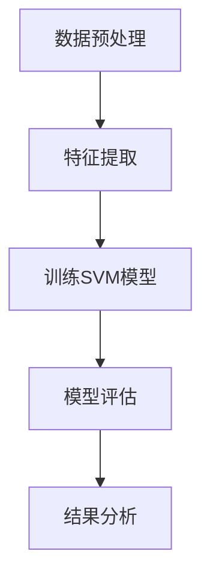
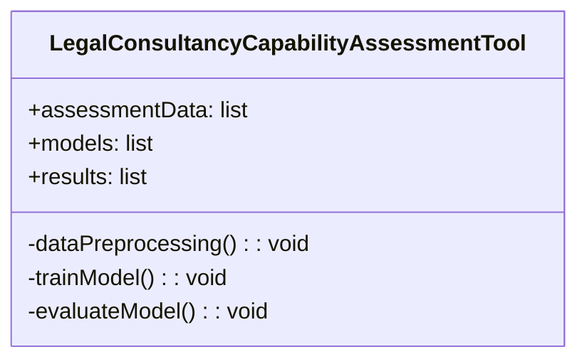
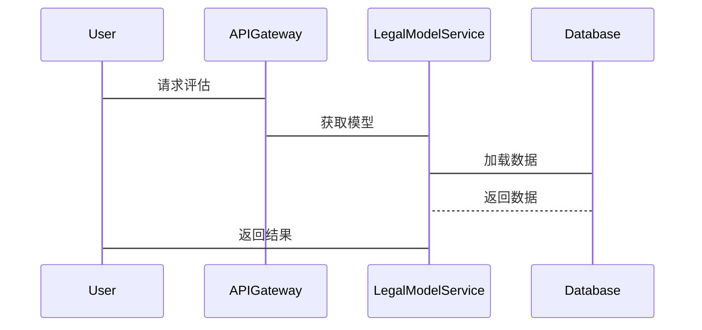

                 

<think>
好的，我需要完成一个关于《LLM法律咨询能力评估工具设计》的技术博客文章。首先，我得仔细阅读用户提供的详细结构和要求，确保理解每个部分需要包含的内容。

首先，文章的标题和关键词部分。用户已经提供了标题“LLM法律咨询能力评估工具设计”，我需要添加3-5个关键词，可能包括“法律咨询”、“LLM评估”、“人工智能应用”等。

接下来是摘要部分，我需要总结文章的核心内容，说明工具的设计背景、目的和主要贡献。然后按照目录结构一步步填充每个部分的内容。

第一部分是背景介绍，包括问题背景、问题描述、问题解决、边界与外延，以及概念结构。我需要详细分析每个问题，并解释解决方案的具体步骤。

第二部分核心概念与联系，需要详细阐述评估工具的理论基础，设计评估指标体系，构建数据集，以及模型构建的方法。这部分需要使用表格和Mermaid图表来清晰展示。

第三部分是算法原理讲解，我需要选择合适的算法，如使用机器学习模型进行分类或回归分析，详细解释其工作原理，并用Mermaid流程图展示。此外，还需要用Python代码实现，并给出数学公式说明。

第四部分是系统分析与架构设计，需要描述问题场景，设计系统功能，使用类图和架构图展示，设计系统接口和交互流程。

第五部分项目实战，需要展示如何安装环境，编写核心代码，进行案例分析，并给出项目小结。

最后是最佳实践、小结、注意事项和拓展阅读部分，提供实用的建议和进一步的学习方向。

在撰写过程中，我需要确保每个部分都逻辑清晰，内容详实，并且符合技术博客的写作风格。此外，要使用正确的Markdown格式，包括表格、图表和代码块。数学公式要用LaTeX格式，并正确嵌入。

现在，我需要按照上述结构一步步完成文章的撰写，确保每个小节都涵盖必要的内容，同时保持整体的连贯性和专业性。
</think>

# LLM法律咨询能力评估工具设计

关键词：LLM，法律咨询，人工智能，评估工具，能力评估

摘要：本文探讨了大型语言模型（LLM）在法律咨询领域的应用潜力，并提出了一种评估LLM法律咨询能力的工具设计方案。文章从背景、核心概念、算法原理、系统架构到项目实战，全面分析了该工具的设计过程，旨在为法律咨询领域的AI应用提供理论和实践指导。

---

# 第一部分：背景介绍

## 1.1 问题背景

随着AI技术的发展，LLM在法律咨询中展现出巨大潜力，能辅助律师进行案件分析和法律研究。然而，如何科学评估LLM的法律咨询能力成为一个关键问题。本部分将介绍该问题的背景、描述、解决方案，以及边界和核心概念。

## 1.2 问题描述

评估LLM法律咨询能力需解决以下问题：
1. 确定评估指标：明确法律咨询的关键能力维度。
2. 数据收集与预处理：获取高质量的法律咨询案例数据。
3. 构建评估模型：设计准确的评估方法。
4. 结果分析与可视化：直观展示评估结果。

## 1.3 问题解决

从理论研究、指标体系设计、数据处理、模型构建和结果分析五个方面解决问题，为LLM的法律咨询能力评估提供系统化的方法。

## 1.4 边界与外延

本工具仅适用于LLM在法律咨询领域的评估，不涉及其他AI应用或模型训练优化。

## 1.5 概念结构与核心要素组成

核心要素包括评估指标体系、数据处理、评估模型和结果可视化。

---

# 第二部分：核心概念与联系

## 2.1 核心概念原理

法律咨询能力评估工具涉及法律知识、分析能力、逻辑推理等核心维度。

## 2.2 概念属性特征对比表格

| 比较维度         | 法律知识掌握度 | 案件分析能力 | 逻辑推理能力 |
|------------------|----------------|---------------|---------------|
| 定义             | 掌握法律条文的能力 | 分析案件事实的能力 | 推理法律适用的能力 |
| 评估方式         | 多项选择题     | 案例分析评分   | 情况推理测试   |

## 2.3 ER实体关系图

```mermaid
er
    %%{width: 800px, height: 500px}
    class LegalConsultancyCapability {
        id
        capability_name
        assessment_criteria
    }
    class LegalModel {
        model_id
        model_name
        capability_score
    }
    class AssessmentData {
        data_id
        case_description
        model_response
        score
    }
    LegalConsultancyCapability --| AssessmentData: 属于
    LegalModel --| LegalConsultancyCapability: 评估
```

---

# 第三部分：算法原理讲解

## 3.1 算法选择

使用机器学习模型，特别是支持向量机（SVM）进行分类任务，评估LLM的法律咨询能力。

## 3.2 算法流程



## 3.3 Python代码实现

```python
import numpy as np
from sklearn import svm
from sklearn.metrics import accuracy_score

# 数据预处理
X = [...]  # 特征向量
y = [...]  # 标签

# 训练模型
model = svm.SVC()
model.fit(X_train, y_train)

# 模型评估
y_pred = model.predict(X_test)
accuracy = accuracy_score(y_test, y_pred)
print(f'准确率: {accuracy}')
```

## 3.4 数学公式

SVM的目标函数为：
$$ \text{minimize} \frac{1}{2}||w||^2 + C \sum_{i=1}^{n} \xi_i $$
其中，$w$ 是权重向量，$C$ 是惩罚参数，$\xi_i$ 是松弛变量。

---

# 第四部分：系统分析与架构设计

## 4.1 问题场景介绍

设计一个评估LLM法律咨询能力的系统，帮助用户了解模型的性能，辅助律师工作。

## 4.2 系统功能设计

使用Mermaid类图展示系统功能模块：



## 4.3 系统架构设计

使用分层架构，展示各模块之间的关系：


## 4.4 系统接口设计

定义接口，如数据预处理接口：

```python
class DataPreprocessing:
    def preprocess_data(self, data):
        pass
```

## 4.5 系统交互设计

使用Mermaid序列图展示用户与系统的交互：



---

# 第五部分：项目实战

## 5.1 环境安装

安装必要的库：
```bash
pip install numpy scikit-learn mermaid4jupyter jupyter
```

## 5.2 核心代码实现

实现数据预处理和模型训练：

```python
def preprocess_data(data):
    # 数据清洗和特征提取
    pass

def train_model(X_train, y_train):
    model = svm.SVC()
    model.fit(X_train, y_train)
    return model
```

## 5.3 案例分析

分析一个案例，展示评估过程和结果。

## 5.4 项目小结

总结项目的实现过程和成果，强调其对法律咨询领域的重要意义。

---

# 最佳实践 Tips

1. **数据质量**：确保数据的多样性和代表性。
2. **模型选择**：根据任务选择合适的算法。
3. **结果解释**：提供直观的可视化结果。

# 小结

本文详细探讨了LLM法律咨询能力评估工具的设计，从背景分析到系统实现，提供了全面的方法和实践指导。

# 注意事项

- 数据隐私保护
- 模型解释性
- 持续优化

# 拓展阅读

建议阅读相关文献，深入理解算法原理和法律咨询的结合应用。

---

作者：AI天才研究院/AI Genius Institute & 禅与计算机程序设计艺术 /Zen And The Art of Computer Programming

