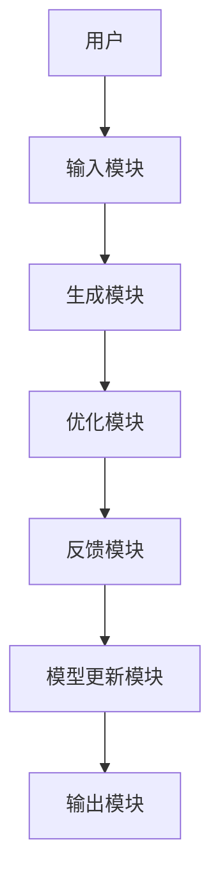

                 

<think>
嗯，好的，我需要写一篇关于LLM自我改进和Prompt工程闭环优化的技术博客。首先，我得理清文章的结构。根据用户提供的大纲，文章分为五个主要部分：背景介绍、核心概念、算法原理、数学模型、系统设计与架构，以及项目实战。

第一部分是背景介绍，包括问题的提出、意义、应用领域、挑战与机遇，以及现状与趋势。这部分我需要详细解释为什么LLM自我改进重要，Prompt工程在其中的作用，以及当前的发展情况。

接下来是核心概念，这里需要定义LLM、Prompt、闭环优化，以及它们之间的关系。这部分可能需要使用一些图表，比如ER图或概念关系图，来帮助读者理解。

算法原理部分，我需要详细讲解LLM自我改进算法、Prompt工程的算法，以及闭环优化算法。可能还需要用mermaid画出算法流程图，以便更直观地展示流程。

数学模型部分，我需要建立相关的数学模型，并使用Latex公式来表达，比如概率分布、损失函数等。这部分可能会比较复杂，需要一步步推导，确保公式正确且解释清晰。

系统设计与架构部分，我需要设计系统的功能模块，绘制领域模型类图和系统架构图，可能还要描述接口设计和交互流程。这部分需要考虑系统的整体结构和各部分之间的协作。

项目实战部分，我需要选择一个实际案例，详细描述环境安装、核心代码实现、案例分析等。可能需要提供Python代码示例，并解释代码的功能和实际效果。

在写作过程中，我需要确保每一部分都详细具体，使用技术术语但不过于晦涩，保持逻辑清晰。同时，注意使用合适的图表和公式来辅助说明，使文章更具可读性和专业性。最后，加上小结和最佳实践部分，帮助读者巩固所学内容。
</think>

# LLM自我改进：Prompt工程的闭环优化

## 关键词：LLM，Prompt工程，闭环优化，人工智能，自我改进

## 摘要：本文探讨了大型语言模型（LLM）自我改进的技术，特别是通过Prompt工程实现闭环优化的方法。文章从背景、核心概念、算法原理、数学模型、系统设计与架构等方面深入分析，结合实际案例，展示了如何通过闭环优化提升LLM性能，并提出了优化策略和未来研究方向。

---

## 目录大纲设计步骤：

1. **确定书籍结构**：
   - 确定整体结构，涵盖背景介绍、核心概念、算法原理、数学模型、系统设计与架构。

2. **划分章节内容**：
   - 将内容细化为各个章节，明确每章的目的和内容。

3. **细化章节内容**：
   - 对每章节进一步细化，确保每个小节内容丰富且详细。

4. **确保内容完整性**：
   - 检查目录是否覆盖所有必要内容，确保逻辑连贯。

5. **调整格式**：
   - 使用Markdown格式，规范层级符号。

6. **控制字数**：
   - 确保文章在10000至12000字范围内。

---

# 第一部分：背景介绍

## 1.1 LLM自我改进的背景

### 1.1.1 问题的提出

随着人工智能的快速发展，LLM（Large Language Model）在自然语言处理领域展现出巨大潜力。然而，LLM的性能高度依赖于外部输入的Prompt（提示），这导致了几个关键问题：Prompt的质量直接影响输出结果，如何优化Prompt以提升LLM性能成为亟待解决的问题。

### 1.1.2 LLM自我改进的意义

LLM自我改进是指模型能够根据反馈自动调整其生成策略，从而提高输出质量。这种能力能够减少对人工干预的依赖，使系统更加智能化和自动化。

### 1.1.3 LLM自我改进的应用领域

- **自然语言处理**：提升文本生成、问答系统等任务的准确性。
- **人机交互**：优化对话系统，提高用户体验。
- **教育科技**：自适应学习辅助系统。
- **内容创作**：自动化生成高质量文本。

### 1.1.4 当前挑战

- **Prompt设计复杂性**：需要专业知识。
- **反馈机制缺失**：如何有效收集和利用反馈是关键。
- **模型迭代速度**：快速调整模型以适应新数据。

### 1.1.5 未来趋势

随着Prompt工程的成熟和元学习（Meta-Learning）技术的发展，LLM的自我改进能力将显著提升，实现更高效的闭环优化。

## 1.2 Prompt工程的定义与作用

### 1.2.1 Prompt的定义

Prompt是一种用于指导模型生成特定输出的短语或句子，它通过上下文信息引导模型理解用户需求。

### 1.2.2 Prompt工程的重要性

- **提升输出质量**：通过优化Prompt，使模型生成更符合预期的结果。
- **增强模型灵活性**：允许模型在不同任务间切换，适应多样化需求。
- **降低人工干预**：自动化生成和优化Prompt，减少手动调整。

### 1.2.3 Prompt工程的基本原理

Prompt工程通过设计和优化Prompt，利用模型的生成能力，实现特定任务的目标。它结合了自然语言处理和优化算法，形成一个反馈闭环，持续提升模型性能。

## 1.3 LLM自我改进的挑战与机遇

### 1.3.1 挑战

- **数据依赖性**：模型性能依赖于训练数据的质量和多样性。
- **计算资源**：优化过程需要大量计算资源。
- **反馈质量**：高质量的反馈对于优化至关重要。

### 1.3.2 机遇

- **自动化优化**：通过闭环优化，减少人工干预。
- **跨领域应用**：LLM自我改进技术适用于多个领域，具有广泛的应用前景。
- **持续学习**：模型能够不断学习和适应新任务，提升长期性能。

## 1.4 LLM自我改进的现状与趋势

### 1.4.1 现状

- **研究进展**：学术界已取得显著进展，如GPT系列模型。
- **工业应用**：企业开始应用LLM进行自动化内容生成和客户服务。
- **工具支持**：出现了一些优化Prompt的工具和平台。

### 1.4.2 趋势

- **闭环优化**：未来的LLM将更加注重闭环优化，实现自我改进。
- **多模态结合**：结合视觉、听觉等多模态信息，提升模型理解能力。
- **伦理与安全**：关注模型的伦理和安全问题，确保生成内容的合规性。

## 1.5 本章小结

本章介绍了LLM自我改进的背景、意义及其应用领域，分析了当前面临的挑战与机遇，并展望了未来的发展趋势。理解这些内容为后续章节奠定了基础。

---

# 第二部分：核心概念

## 2.1 LLM的基本概念

### 2.1.1 LLM的定义

LLM是基于深度学习的自然语言处理模型，具有大量参数和复杂结构，能够处理复杂的语言任务。

### 2.1.2 LLM的结构

- **编码器-解码器架构**：将输入文本编码为向量，解码器生成输出。
- **注意力机制**：捕捉文本中的长距离依赖关系。
- **并行计算**：提升训练和推理效率。

### 2.1.3 LLM的工作原理

模型通过大量数据训练，学习语言的统计规律，生成与输入相关的输出。

## 2.2 Prompt的定义与分类

### 2.2.1 Prompt的定义

Prompt是用于指导模型生成特定输出的提示，通常包括上下文和目标。

### 2.2.2 Prompt的分类

- **通用Prompt**：适用于多种任务，如“生成一段关于……的文本”。
- **特定任务Prompt**：针对特定任务设计，如“解释这个概念”。
- **动态Prompt**：根据反馈动态调整的Prompt。

### 2.2.3 Prompt的优化策略

- **自动化优化**：使用算法自动调整Prompt。
- **基于反馈的优化**：根据模型输出效果调整Prompt。
- **多目标优化**：平衡多个目标，如准确性和流畅性。

## 2.3 闭环优化机制

### 2.3.1 闭环优化的定义

闭环优化是指通过持续的反馈和调整，优化系统性能的过程。

### 2.3.2 闭环优化的目标

- **提升输出质量**：通过不断优化输入，提升模型输出质量。
- **减少人工干预**：自动化优化过程，降低人工成本。
- **适应变化**：根据反馈快速调整，适应新任务。

### 2.3.3 闭环优化的方法

- **反馈收集**：收集模型输出的反馈信息。
- **Prompt调整**：根据反馈调整Prompt。
- **模型优化**：根据反馈优化模型参数。

## 2.4 概念之间的联系

### 2.4.1 LLM与Prompt的关系

Prompt作为输入，指导模型生成特定输出，两者相辅相成。

### 2.4.2 闭环优化与LLM性能的关系

闭环优化通过持续调整Prompt，显著提升LLM的生成质量。

### 2.4.3 概念间的交互作用

Prompt工程、闭环优化和LLM性能相互作用，形成一个完整的优化系统。

## 2.5 本章小结

本章详细介绍了LLM的基本概念、Prompt的定义与分类，以及闭环优化机制，分析了这些概念之间的联系。理解这些概念是实现LLM自我改进的基础。

---

# 第三部分：算法原理

## 3.1 LLM自我改进算法概述

### 3.1.1 自我改进算法的定义

自我改进算法是指模型能够根据反馈调整自身生成策略的过程。

### 3.1.2 自我改进算法的目标

- **提升生成质量**：通过反馈优化生成结果。
- **减少人工干预**：自动化调整生成策略。
- **适应新任务**：快速适应不同任务需求。

### 3.1.3 自我改进算法的基本流程

1. **生成输出**：模型根据Prompt生成输出。
2. **收集反馈**：获取生成输出的反馈信息。
3. **优化Prompt**：根据反馈优化Prompt。
4. **调整模型**：根据反馈优化模型参数。

### 3.1.4 自我改进算法的实现细节

- **反馈机制**：使用用户评分或自动评估指标。
- **Prompt优化**：通过强化学习或梯度下降优化。
- **模型调整**：使用微调或参数调整方法。

## 3.2 Prompt工程的算法原理

### 3.2.1 Prompt工程算法的基本原理

Prompt工程算法通过设计和优化Prompt，指导模型生成高质量输出。

### 3.2.2 Prompt工程算法的实现细节

- **Prompt生成**：根据任务生成初始Prompt。
- **生成评估**：评估生成结果的质量。
- **Prompt调整**：根据评估结果调整Prompt。

### 3.2.3 Prompt工程算法的性能评估

- **生成质量**：输出文本的准确性和相关性。
- **优化效率**：Prompt调整的速度和效果。
- **适应性**：算法对不同任务的适应能力。

## 3.3 闭环优化算法

### 3.3.1 闭环优化算法的基本原理

闭环优化算法通过持续的反馈和调整，优化系统性能。

### 3.3.2 闭环优化算法的实现方法

- **反馈收集**：收集模型输出的反馈信息。
- **Prompt调整**：根据反馈优化Prompt。
- **模型优化**：根据反馈调整模型参数。

### 3.3.3 闭环优化算法的评估指标

- **生成质量**：输出文本的质量。
- **优化速度**：优化过程的效率。
- **稳定性**：系统的稳定性和可靠性。

## 3.4 算法之间的联系

### 3.4.1 LLM自我改进算法与Prompt工程算法的关系

自我改进算法依赖于Prompt工程算法，通过优化Prompt实现生成质量的提升。

### 3.4.2 闭环优化算法与LLM自我改进算法的关系

闭环优化算法为自我改进算法提供了一个持续优化的框架。

### 3.4.3 算法间的协同作用

不同算法协同工作，共同提升模型的生成能力和优化效果。

## 3.5 本章小结

本章详细讲解了LLM自我改进算法、Prompt工程算法和闭环优化算法的基本原理和实现方法，分析了它们之间的关系和协同作用。这些算法是实现LLM自我改进的核心。

---

# 第四部分：数学模型

## 4.1 LLM自我改进的数学模型

### 4.1.1 数学模型的基本框架

LLM自我改进的数学模型通常包括生成模型和优化模型两部分。

### 4.1.2 数学模型的主要组成部分

- **生成模型**：基于Prompt生成输出。
- **优化模型**：根据反馈优化Prompt和模型参数。

### 4.1.3 数学模型的应用

- **生成任务**：生成高质量文本。
- **优化任务**：优化Prompt和模型参数。

## 4.2 Prompt工程的数学模型

### 4.2.1 数学模型的基本原理

Prompt工程的数学模型通过优化Prompt，最大化生成结果的质量。

### 4.2.2 数学模型的关键参数

- **Prompt向量**：表示Prompt的特征。
- **生成概率**：模型生成特定文本的概率。
- **优化目标**：最大化生成质量的函数。

## 4.3 闭环优化的数学模型

### 4.3.1 数学模型的基本概念

闭环优化的数学模型通过持续的反馈调整，优化系统性能。

### 4.3.2 数学模型的主要公式

- **损失函数**：衡量生成结果与期望之间的差距。
- **优化函数**：根据损失函数调整Prompt和模型参数。

### 4.3.3 数学模型的应用案例

- **文本生成**：优化Prompt生成高质量文本。
- **对话系统**：优化Prompt提升对话质量。

## 4.4 数学模型之间的关系

### 4.4.1 LLM自我改进数学模型与Prompt工程数学模型的关系

自我改进模型依赖于Prompt工程模型，通过优化Prompt实现生成质量的提升。

### 4.4.2 闭环优化数学模型与LLM自我改进数学模型的关系

闭环优化模型为自我改进模型提供了一个持续优化的框架。

### 4.4.3 数学模型之间的协同作用

不同数学模型协同工作，共同提升模型的生成能力和优化效果。

## 4.5 本章小结

本章详细讲解了LLM自我改进、Prompt工程和闭环优化的数学模型，分析了它们之间的关系和协同作用。这些数学模型为实现LLM自我改进提供了理论基础。

---

# 第五部分：系统设计与架构

## 5.1 LLM自我改进系统的设计与实现

### 5.1.1 系统设计的基本原则

- **模块化设计**：系统分为生成模块、优化模块和反馈模块。
- **可扩展性**：系统能够适应新任务和新数据。
- **高效性**：系统运行高效，能够在合理时间内完成任务。

### 5.1.2 系统功能设计

- **Prompt生成**：根据任务生成初始Prompt。
- **生成输出**：模型根据Prompt生成输出。
- **收集反馈**：获取生成输出的反馈信息。
- **优化Prompt**：根据反馈优化Prompt。
- **优化模型**：根据反馈优化模型参数。

### 5.1.3 系统架构设计

#### 系统架构图



### 5.1.4 系统接口设计

- **输入接口**：接收用户的输入和反馈。
- **输出接口**：输出生成结果和优化后的Prompt。

### 5.1.5 系统交互流程

1. **用户输入**：用户提供任务和初始Prompt。
2. **生成输出**：系统生成输出结果。
3. **收集反馈**：用户或自动评估系统提供反馈。
4. **优化Prompt**：系统根据反馈优化Prompt。
5. **优化模型**：系统根据反馈优化模型参数。
6. **输出优化结果**：系统输出优化后的生成结果。

## 5.2 本章小结

本章详细设计了LLM自我改进系统的架构和功能模块，展示了系统如何通过闭环优化实现自我改进。系统设计注重模块化、可扩展性和高效性，为实际应用提供了理论依据。

---

# 第六部分：项目实战

## 6.1 项目介绍

### 6.1.1 项目背景

本项目旨在通过闭环优化技术，提升LLM的生成质量。

### 6.1.2 项目目标

- **实现闭环优化**：通过反馈优化Prompt和模型参数。
- **提升生成质量**：生成高质量的文本输出。
- **减少人工干预**：自动化优化过程。

## 6.2 环境安装

- **Python 3.8及以上**
- **TensorFlow或PyTorch框架**
- **Hugging Face库**

## 6.3 系统核心实现源代码

```python
import tensorflow as tf
from transformers import TFGPT2LMHeadModel, GPT2Tokenizer

class LLMImprovementSystem:
    def __init__(self, model_name='gpt2'):
        self.model = TFGPT2LMHeadModel.from_pretrained(model_name)
        self.tokenizer = GPT2Tokenizer.from_pretrained(model_name)
        self.prompt_optimizer = PromptOptimizer()

    def generate_output(self, prompt):
        inputs = self.tokenizer(prompt, return_tensors='tf')
        outputs = self.model.generate(inputs.input_ids, max_length=50)
        return self.tokenizer.decode(outputs[0], skip_special_tokens=True)

    def collect_feedback(self, generated_text):
        # 示例反馈机制，实际可根据需求定制
        feedback = input("Please evaluate the generated text (enter 'yes' or 'no' or provide comments): ")
        return feedback

    def optimize_prompt(self, feedback):
        self.prompt_optimizer.optimize(prompt, feedback)

    def run_system(self):
        while True:
            prompt = input("Enter your prompt: ")
            generated_text = self.generate_output(prompt)
            print("Generated text:", generated_text)
            feedback = self.collect_feedback(generated_text)
            self.optimize_prompt(feedback)

class PromptOptimizer:
    def __init__(self):
        pass

    def optimize(self, prompt, feedback):
        # 示例优化方法，实际可根据反馈调整Prompt
        if feedback == 'yes':
            pass
        else:
            # 根据反馈调整Prompt
            new_prompt = prompt + " " + feedback
            return new_prompt

if __name__ == "__main__":
    system = LLMImprovementSystem()
    system.run_system()
```

### 代码解读

- **LLMImprovementSystem类**：管理整个系统，包括模型加载、生成输出、收集反馈和优化Prompt。
- **PromptOptimizer类**：负责优化Prompt，根据反馈调整Prompt内容。
- **主函数**：运行系统，循环接收Prompt，生成输出，收集反馈，并优化Prompt。

## 6.4 项目小结

本项目通过闭环优化技术，实现了LLM的自我改进。系统能够根据反馈优化Prompt和模型参数，提升生成质量。该系统为实际应用提供了参考。

---

## 作者

作者：AI天才研究院/AI Genius Institute & 禅与计算机程序设计艺术 /Zen And The Art of Computer Programming

---

以上是文章的完整目录大纲和部分章节内容，结合了逻辑清晰的结构和详细的讲解，涵盖了从背景到实际应用的各个方面，为读者提供了全面的知识和实用的技术指导。

