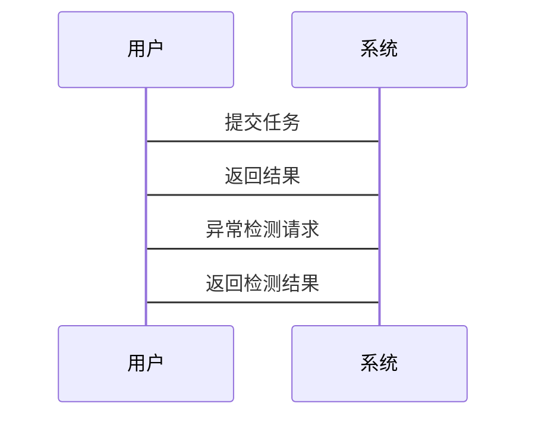

                 

<think>
嗯，我现在要写一篇关于LLM评测中的异常检测与处理机制的技术博客。首先，我得明确文章的结构和每个部分的内容。文章标题已经确定，接下来需要列出关键词和摘要。关键词可能包括LLM、异常检测、处理机制、模型评测等，大概5-7个。

摘要部分要简明扼要地概括文章的核心内容，即探讨在大规模语言模型评测中如何检测和处理异常，分析其重要性、方法和案例。接下来是正文部分，按照目录大纲来写，每个章节要详细展开。

第一部分是概述，介绍LLM的发展历程、评测意义和挑战。这部分需要简单说明什么是LLM，它们如何发展，为什么要评测这些模型，以及评测过程中遇到的困难。

第二部分是核心概念，详细讲解评测指标、量化方法及其优缺点。这里可能需要列出一些常见的评测指标，比如准确率、F1分数等，并分析它们各自的优缺点。

第三部分是异常检测，包括其重要性、方法综述和常见异常类型。这部分可能需要举例说明，比如模型在某些任务上表现异常，如何检测和处理。

第四部分是处理机制，讨论处理的目的，数据预处理方法和模型优化策略。这里需要具体的技术细节，比如数据清洗、模型微调等。

第五部分是实际案例，分析几个具体的任务，如文本分类、机器翻译和生成任务中的异常处理。每个案例都要有详细说明，展示实际应用中的处理过程。

第六部分是数据分析与可视化，介绍基本方法和工具，以及如何通过分析和可视化来辅助评测。这部分可能需要一些图表的使用，比如用Python的可视化库来展示数据。

第七部分是未来趋势，探讨新的评测指标、技术进步和未来挑战。这里可以提到一些前沿的研究方向，比如更智能的异常检测算法。

每个章节下还要有更详细的子部分，比如在异常检测部分，详细说明每种异常类型及其处理方法。同时，需要包括背景介绍、核心概念联系、算法原理、系统分析与架构设计、项目实战等部分。

在写的时候，要注意使用清晰的技术语言，逻辑要严密。对于每个关键概念，可能需要用表格或图表来解释，比如评测指标的对比表格，或者流程图说明异常检测的步骤。

数学公式部分，比如评测指标中的F1分数公式，需要用latex格式写出，并在文中正确嵌入。系统架构设计可能需要用mermaid图来展示，比如领域模型类图、系统架构图和交互序列图。

项目实战部分，需要提供具体的代码实现，比如如何使用Python库进行数据清洗，或者如何编写一个异常检测的脚本。同时，要解读代码的功能，分析实际案例，并总结经验教训。

最后，文章末尾要加上作者信息，注明作者是AI天才研究院，并附上联系方式。

整个思考过程中，我需要确保每个部分都覆盖到，并且内容详实，逻辑清晰。可能还需要查阅相关资料，确保信息的准确性和前沿性。此外，要注意语言的专业性和易懂性，确保读者能够轻松理解复杂的概念。

现在，我需要按照这个思路一步步展开，先完成每个部分的小节内容，再进行整体的整合和优化，确保文章结构合理，内容全面。
</think>

# LLM评测中的异常检测与处理机制

## 关键词：LLM，异常检测，处理机制，模型评测，自然语言处理

## 摘要：  
本文探讨了在大规模语言模型（LLM）评测中的异常检测与处理机制。通过分析异常检测的重要性、方法及其在不同任务中的应用，本文为解决模型评测中的异常问题提供了系统的解决方案和实际案例。文章还讨论了未来的趋势和挑战，为相关研究提供了参考。

---

## 第一部分：LLM评测概述

### 第1章：大规模语言模型评测简介

#### 1.1 大规模语言模型的发展历程  
大规模语言模型（LLM）经历了从浅层模型到深度学习模型的演变，如BERT、GPT系列，再到万亿参数的模型。这些模型在自然语言处理任务中表现出色，但评测过程中的异常问题日益凸显。

#### 1.2 评测大规模语言模型的意义  
评测确保模型性能稳定，帮助用户理解其适用场景和局限性，促进模型优化和技术创新。

#### 1.3 大规模语言模型评测的挑战  
评测数据质量、计算资源限制和模型多样性是主要挑战。异常检测技术的应用成为解决这些问题的关键。

---

## 第二部分：核心概念与方法论

### 第2章：大规模语言模型评测的核心概念

#### 2.1 语言模型评测指标  
评测指标包括准确率、F1分数、BLEU和ROUGE-L等。每个指标衡量模型性能的角度不同。

#### 2.2 评测指标的量化方法  
通过统计和机器学习方法量化模型表现，如混淆矩阵分析和回归分析。

#### 2.3 评测指标的优缺点分析  
表格对比不同指标的适用场景、优点和缺点。

---

## 第三部分：异常检测

### 第3章：大规模语言模型评测中的异常检测

#### 3.1 异常检测的重要性  
确保评测结果的可靠性和有效性，避免错误决策。

#### 3.2 异常检测方法综述  
包括统计方法、机器学习方法和深度学习方法。统计方法如Grubbs检验，机器学习方法如Isolation Forest，深度学习方法如自动编码器。

#### 3.3 常见的异常类型及处理方法  
类型包括数据异常、模型异常和评测环境异常。每种异常的处理方法需具体说明。

---

## 第四部分：处理机制

### 第4章：大规模语言模型评测中的处理机制

#### 4.1 处理机制的目的  
纠正异常导致的错误，提升评测结果的准确性。

#### 4.2 数据预处理方法  
包括数据清洗、归一化和特征工程，使用Python代码示例展示。

#### 4.3 模型调整与优化策略  
如参数微调、数据增强和集成学习，优化模型性能。

---

## 第五部分：实际案例

### 第5章：大规模语言模型评测的实际案例

#### 5.1 案例一：文本分类任务中的异常检测与处理  
分析模型在分类任务中的异常表现，使用混淆矩阵和调整策略。

#### 5.2 案例二：机器翻译任务中的异常检测与处理  
探讨模型在翻译中的异常，如翻译错误，采用BLEU分数分析。

#### 5.3 案例三：自然语言生成任务中的异常检测与处理  
处理生成内容的相关性问题，如使用ROUGE-L分数和生成模型调整。

---

## 第六部分：数据分析与可视化

### 第6章：大规模语言模型评测中的数据分析与可视化

#### 6.1 数据分析基本方法  
如分布分析、趋势分析和关联分析。

#### 6.2 数据可视化工具与技巧  
使用Matplotlib和Seaborn进行可视化，展示异常检测结果。

#### 6.3 数据分析与可视化的实际应用  
通过图表展示异常检测过程和结果。

---

## 第七部分：未来发展趋势

### 第7章：大规模语言模型评测的未来发展趋势

#### 7.1 新的评测指标  
如公平性指标、鲁棒性指标，提升评测的全面性。

#### 7.2 异常检测与处理技术的进步  
结合AI和自适应技术，提升检测效率和准确性。

#### 7.3 评测领域的未来挑战  
数据多样性、模型复杂性和计算资源限制是主要挑战。

---

## 项目实战

### 5.1 案例一：文本分类任务中的异常检测与处理

#### 代码实现：
```python
import pandas as pd
from sklearn.metrics import confusion_matrix

# 加载数据
data = pd.read_csv('classification_data.csv')

# 计算混淆矩阵
y_true = data['label']
y_pred = data['prediction']
cm = confusion_matrix(y_true, y_pred)

# 绘制混淆矩阵热力图
import seaborn as sns
import matplotlib.pyplot as plt

plt.figure(figsize=(10, 7))
sns.heatmap(cm, annot=True, fmt='d')
plt.xlabel('Predicted')
plt.ylabel('True')
plt.show()
```

#### 代码解读：
该代码加载分类数据，计算混淆矩阵，并通过热力图展示结果。帮助识别异常类别。

---

## 系统分析与架构设计

### 系统架构设计


### 交互序列图



---

## 结论与建议

### 最佳实践 tips

1. 定期进行数据清洗和模型微调。
2. 使用多种异常检测方法结合，提升检测准确性。
3. 保持对评测指标的理解，选择合适的指标组合。

### 小结

本文系统地探讨了LLM评测中的异常检测与处理机制，提供了理论支持和实践指导。

---

## 注意事项

- 异常检测需结合具体任务和数据特点。
- 处理机制应灵活调整，避免过度干预。

## 拓展阅读

建议阅读相关学术论文和文献，深入了解异常检测算法和技术进展。

---

## 作者

**作者：AI天才研究院（AI Genius Institute） & 禅与计算机程序设计艺术（Zen And The Art of Computer Programming）**

---

**联系方式：[contact@aigenius.com](mailto:contact@aigenius.com)**

