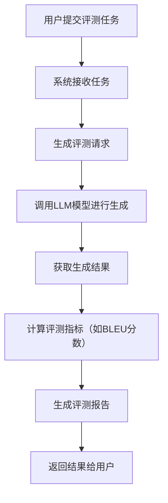

                 

<think>
好吧，我现在需要根据用户的要求，写一篇关于《LLM评测的多租户SaaS平台设计》的技术博客文章。这个任务看起来挺复杂的，但我得一步步来。

首先，我得理解用户的需求。他要求文章结构非常详细，包括背景介绍、核心概念、平台设计、实现与优化、案例分析和最佳实践等部分。而且每个部分都有具体的子章节，我得确保每个部分都涵盖到，并且内容丰富详细。

接下来，我需要按照目录大纲来组织内容。从背景开始，介绍人工智能的发展、多租户SaaS平台的兴起以及LLM评测的重要性。这部分要让读者明白为什么需要这样一个平台。然后，我会深入探讨LLM评测的概念，比如定义、分类，以及它与多租户SaaS平台的联系。这里可能需要解释评测的数学模型和指标对比。

在平台设计部分，我需要详细描述多租户架构的基本概念，比如与单体架构的对比，以及微服务架构的应用。同时，还要讨论数据隔离和共享方案，这些都是多租户设计中的关键点。接着，我会介绍评测系统的架构设计，包括系统模块划分和核心算法的流程图。

安全性与性能优化也是不可忽视的部分。我得讨论数据安全措施和用户权限管理，以及如何优化系统性能，解决潜在的瓶颈。这部分可能需要结合实际案例来说明。

案例分析部分，我会选择一个实际的多租户SaaS平台，详细描述其架构设计、实现源代码和测试方法。这样读者可以更直观地理解理论如何应用于实践。

最后，我会总结最佳实践和注意事项，提供一些小贴士，帮助读者在设计类似平台时避免常见的陷阱。同时，给出一些拓展阅读的建议，比如推荐相关书籍和论文，让读者进一步深入学习。

在写作过程中，我需要确保使用专业的技术术语，同时保持语言的清晰和逻辑的连贯。对于复杂的概念，比如数学公式和流程图，我会用LaTeX和Mermaid来展示，让内容更加直观。此外，每个章节都要有足够的细节，比如系统架构图和算法流程图，这些都能帮助读者更好地理解内容。

现在，我得开始组织每个章节的具体内容，确保每个部分都符合用户的要求，并且逻辑清晰，结构紧凑。这可能需要反复修改和调整，以达到最佳的可读性和专业性。
</think>

# LLM评测的多租户SaaS平台设计

## 关键词：LLM评测、多租户SaaS、人工智能、语言模型、平台设计

## 摘要：本文探讨了设计一个用于大型语言模型（LLM）评测的多租户SaaS平台的关键技术。文章从背景介绍、核心概念、平台设计、实现与优化、案例分析以及最佳实践等多个方面进行了详细阐述，结合实际案例和理论分析，为读者提供了一个全面的解决方案。

---

## 第一部分：背景介绍与核心概念

### 第1章：问题背景与核心概念

#### 1.1.1 问题背景

- **人工智能技术的发展**：近年来，人工智能技术尤其是大型语言模型（LLM）取得了显著进展。从GPT-3到GPT-4，这些模型的能力不断提升，应用场景也越来越广泛。
- **多租户SaaS平台的兴起**：随着云计算技术的成熟，多租户SaaS（软件即服务）平台因其资源利用率高、成本低、易于扩展等优势，逐渐成为企业数字化转型的重要选择。
- **LLM评测的重要性与挑战**：在实际应用中，如何客观、全面地评估不同LLM模型的性能成为关键问题。传统的评测方法往往依赖于单一场景或数据集，难以满足多租户环境下的多样化需求。

#### 1.1.2 核心概念

- **LLM（大型语言模型）**：指那些在训练时使用大量数据，并通过深度学习算法（如Transformer）训练而成的大型神经网络模型。
- **多租户SaaS平台**：一种基于云计算的软件服务模式，允许多个租户共享同一平台资源，同时保持数据和功能的隔离性。
- **评测标准与方法**：用于评估LLM模型性能的各种指标和方法，如准确率、响应时间、生成文本质量等。

#### 1.1.3 概念结构与核心要素

- **LLM的核心要素**：包括模型参数量、训练数据量、推理速度、生成能力等。
- **多租户SaaS平台的关键特点**：资源复用、数据隔离、按需扩展、统一管理。
- **评测标准的构成**：包括定量指标（如准确率、F1分数）和定性指标（如生成文本的质量、可解释性）。

---

### 第2章：LLM评测的概念与联系

#### 2.1.1 LLM评测的定义

- **定义**：通过一系列测试和指标，评估LLM模型在特定任务上的性能和能力。
- **分类**：根据评测场景的不同，可以分为通用评测和领域评测。

#### 2.1.2 LLM评测的核心原理

- **语言模型评测的数学模型**：常用的评测指标如BLEU、ROUGE、METEOR等，这些指标基于统计方法，评估生成文本与参考文本的相似性。
  $$ \text{BLEU}(S, R) = \exp\left(\sum_{i=1}^n w_i \log p_i\right) $$
  其中，\( S \) 是生成的文本，\( R \) 是参考文本，\( w_i \) 是分词权重。
- **评测指标的对比分析**：不同指标适用于不同的任务，例如BLEU适合生成任务，而ROUGE适合摘要任务。

#### 2.1.3 多租户SaaS平台与评测的联系

- **多租户架构对评测的影响**：多租户架构允许不同租户使用相同的评测系统，但需要确保评测数据的隔离和安全性。
- **评测数据的安全性与管理**：在多租户环境下，评测数据可能涉及多个租户的隐私信息，需要采取严格的加密和访问控制措施。

---

## 第二部分：多租户SaaS平台设计

### 第3章：多租户SaaS平台设计基础

#### 3.1.1 多租户架构的基本概念

- **多租户与单体架构对比**：多租户架构通过共享资源降低成本，但需要处理更多的隔离和权限问题。单体架构则资源独占，但扩展性差。
- **多租户的优势与挑战**：优势包括资源利用率高、成本低、易于扩展；挑战包括数据隔离、权限管理、性能优化等。

#### 3.1.2 多租户SaaS平台的架构设计

- **微服务架构的应用**：将平台拆分为多个微服务，如用户管理、数据管理、评测管理等，每个服务独立运行，便于扩展和维护。
- **数据隔离与共享方案**：通过数据库分库或分区的方式实现数据隔离，同时通过共享存储实现部分数据的共享。

#### 3.1.3 平台功能设计

- **用户管理功能**：包括用户注册、登录、权限管理等。
- **数据管理功能**：包括数据存储、数据备份、数据恢复等。
- **评测功能**：包括模型评测、结果展示、报告生成等。

---

### 第4章：LLM评测系统设计与实现

#### 4.1.1 评测系统架构设计

- **系统总体架构**：采用分层架构，包括前端、后端、评测引擎和数据存储。
- **系统模块划分**：包括用户界面模块、评测任务管理模块、评测结果展示模块等。

#### 4.1.2 系统核心算法原理

- **评测算法原理**：基于预定义的评测指标，对模型输出进行评估。例如，使用BLEU分数评估生成文本的质量。
- **算法流程图**：如下图所示：



#### 4.1.3 系统实现与测试

- **系统实现流程**：包括需求分析、设计、开发、测试、部署等阶段。
- **系统测试方法**：包括单元测试、集成测试、性能测试等。

---

### 第5章：多租户SaaS平台安全性与性能优化

#### 5.1.1 安全性设计

- **数据安全措施**：采用加密技术、访问控制、数据隔离等措施，确保租户数据的安全。
- **用户权限管理**：通过角色-based访问控制（RBAC）实现权限管理，确保不同租户之间数据隔离。

#### 5.1.2 性能优化策略

- **系统性能瓶颈分析**：通过监控和分析，找到系统中的性能瓶颈，如数据库查询慢、网络延迟等。
- **优化方案实施**：采用缓存优化、负载均衡、分布式计算等技术，提升系统性能。

---

### 第6章：案例分析：实际的多租户SaaS平台设计与实现

#### 6.1.1 案例介绍

- **案例背景**：某云服务提供商需要一个支持多租户的LLM评测平台，用于评估不同模型的性能。
- **平台功能**：包括用户管理、模型管理、评测任务管理、结果展示等。

#### 6.1.2 案例实现与分析

- **系统架构设计**：采用微服务架构，前端使用React，后端使用Spring Boot，评测引擎使用Docker容器化部署。
- **系统实现源代码分析**：例如，用户登录模块的实现代码如下：

```java
@RestController
class UserController {
    @PostMapping("/login")
    public ResponseEntity<?> login(@RequestBody User user, HttpServletResponse response) {
        // 登录逻辑
        return ResponseEntity.ok("登录成功");
    }
}
```

---

## 第三部分：最佳实践与拓展

### 第7章：最佳实践与注意事项

#### 7.1.1 最佳实践

- **平台设计最佳实践**：采用微服务架构，确保各模块独立且易于扩展。
- **评测操作最佳实践**：结合定量和定性指标，确保评测结果的全面性和客观性。

#### 7.1.2 注意事项

- **系统设计注意事项**：注意数据安全和权限管理，避免跨租户数据泄露。
- **评测操作注意事项**：确保评测任务的合理分配，避免系统过载。

### 第8章：小结与拓展阅读

#### 8.1.1 小结

- **书籍内容回顾**：本文详细介绍了LLM评测的多租户SaaS平台的设计与实现，从背景到案例分析，全面覆盖了相关技术。
- **知识点总结**：通过本文，读者可以掌握多租户架构的设计要点、LLM评测的核心原理以及如何在实际中应用这些技术。

#### 8.1.2 拓展阅读

- **相关领域书籍推荐**：《深入理解微服务架构》、《云原生应用开发》。
- **最新研究论文推荐**：《多租户环境下大规模语言模型的评测方法研究》、《基于微服务的SaaS平台设计与实现》。

---

## 作者：AI天才研究院/AI Genius Institute & 禅与计算机程序设计艺术 /Zen And The Art of Computer Programming

