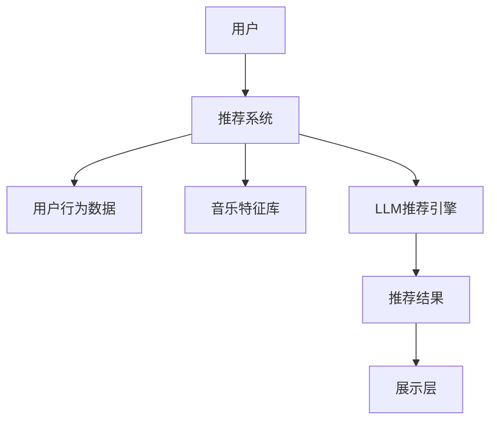
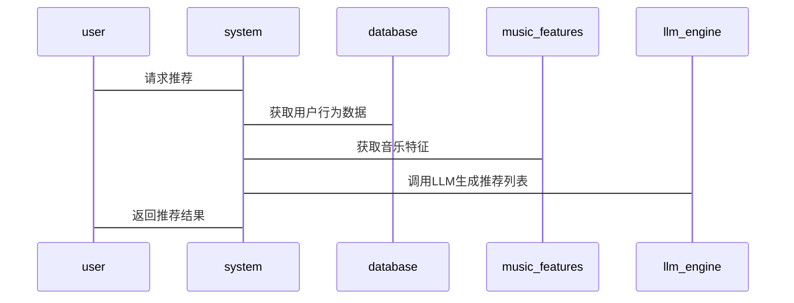
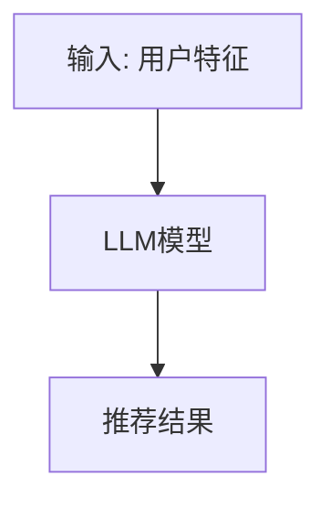
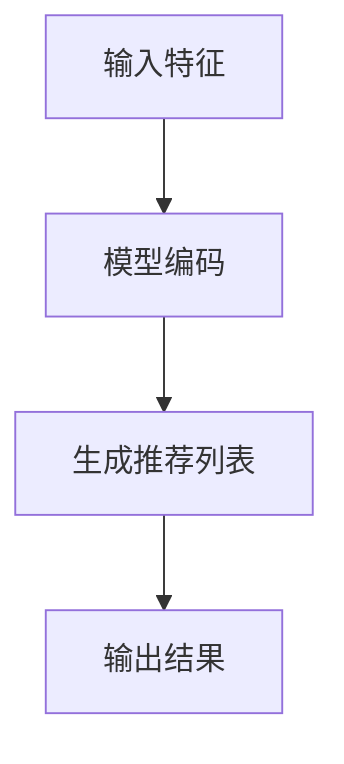
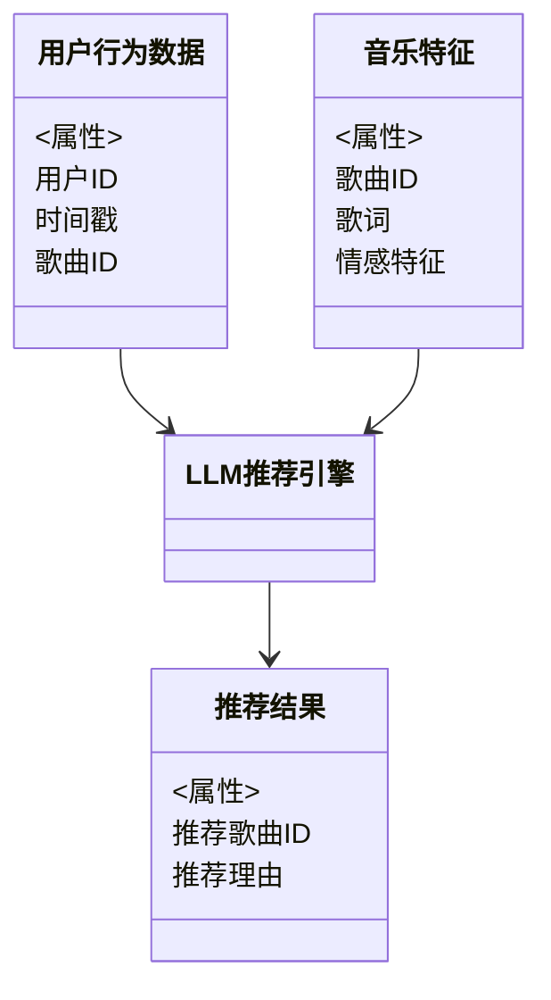
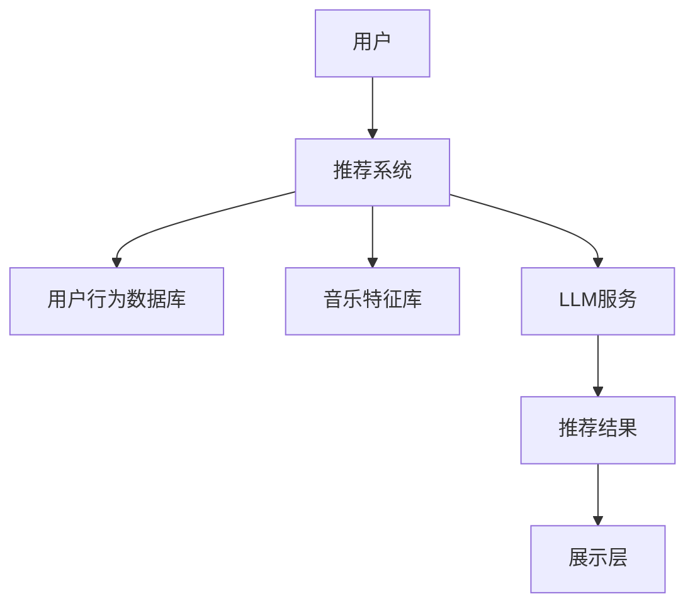

                 

<think>
嗯，用户让我写一篇关于LLM辅助音乐推荐系统的质量评估的技术博客。首先，我需要理解用户的需求。用户希望文章结构清晰，逻辑性强，用专业的技术语言，同时包含详细的分析和具体的代码示例。

首先，我得确定文章的结构。用户已经提供了目录大纲，包括八个章节，每个章节都有详细的小节。我需要按照这个结构来组织内容，确保每个部分都涵盖必要的信息。

接下来，关键词和摘要部分。关键词应该包含文章的核心内容，比如LLM、音乐推荐系统、质量评估、机器学习、深度学习。摘要要简明扼要，概括文章的核心内容，说明LLM在音乐推荐中的作用以及文章将探讨的设计、算法、评估和优化方法。

然后，每个章节的内容。首先是概述部分，介绍音乐推荐系统的背景，LLM的作用，系统的问题和挑战。这部分需要简单明了，让读者了解背景情况。

接下来是LLM的核心概念和原理，这部分要详细讲解LLM的基本定义、工作原理、特点，以及与传统推荐算法的区别。可能需要用表格来对比LLM和其他推荐方法的优缺点，帮助读者理解。

系统设计与实现部分，需要讨论设计原则、功能模块、架构设计等。这部分可以使用Mermaid图来展示系统架构和交互设计，使内容更直观。

算法原理与数学模型部分，要详细讲解推荐算法，特别是LLM的数学模型和公式。可能需要用数学公式来说明，比如用LaTeX格式写出模型的损失函数和优化目标。

系统分析与架构设计，需要分析问题场景，介绍项目，设计系统功能、架构，并展示相关的Mermaid图，比如领域模型类图和序列图。

项目实战部分，需要提供环境安装步骤，核心代码实现，并详细解读代码，分析案例，最后进行项目小结。

最佳实践部分，要给出实施中的注意事项，小结内容，以及推荐的拓展阅读材料。

总结与展望部分，评估系统，讨论未来的发展趋势，并给出结论。

在写作过程中，我需要确保每个部分都有足够的细节，并且使用正确的格式，比如Mermaid图和LaTeX公式。同时，要保持语言的专业性和逻辑性，让读者能够清晰理解内容。

现在，我需要按照这个思路一步步展开，确保每个章节的内容都详尽且符合用户的要求。可能需要多次检查，确保结构合理，内容完整，格式正确。
</think>

# LLM辅助音乐推荐系统质量评估

## 关键词：LLM，音乐推荐系统，质量评估，机器学习，深度学习

## 摘要：  
随着人工智能技术的快速发展，大语言模型（LLM）在音乐推荐系统中的应用越来越广泛。本文旨在探讨如何利用LLM辅助音乐推荐系统的质量评估。通过对系统的背景分析、核心概念阐述、算法原理解读、系统设计与实现、项目实战以及最佳实践等多方面的探讨，系统性地分析LLM在音乐推荐中的优势与挑战，为实际应用提供理论支持和实践指导。

---

### 第一部分: LLM辅助音乐推荐系统概述

#### 第1章: LLM辅助音乐推荐系统背景与问题

##### 1.1.1 音乐推荐系统概述  
音乐推荐系统是一种基于用户行为和音乐特征，利用算法为用户推荐个性化音乐的系统。传统推荐方法包括协同过滤、内容推荐等，但存在推荐精度低、冷启动问题等局限性。

##### 1.1.2 LLM的作用与优势  
大语言模型（LLM）通过自然语言处理能力，能够理解音乐的语义信息，结合用户的听歌记录和偏好，生成更精准的推荐结果。LLM的优势在于能够处理非结构化数据，如歌词、评论等，提供更深层次的音乐理解。

##### 1.1.3 系统问题描述与挑战  
音乐推荐系统面临数据稀疏性、冷启动问题、实时性要求高等挑战。LLM的应用可以有效缓解这些问题，但同时也带来了模型计算成本高、语义理解准确性等问题。

##### 1.1.4 边界与外延  
本文主要关注LLM在音乐推荐中的应用，边界包括仅考虑音乐和文本数据，不涉及视频或图像推荐。外延则包括结合其他推荐方法（如协同过滤）的混合推荐模型。

---

#### 第2章: LLM核心概念与原理

##### 2.1.1 LLM的基本定义  
大语言模型（LLM）是一种基于深度学习的自然语言处理模型，能够理解和生成人类语言。常用的LLM包括GPT、BERT等。

##### 2.1.2 LLM的工作原理  
LLM通过多层神经网络对输入文本进行编码，生成概率分布的输出。其核心是基于Transformer架构的自注意力机制，能够捕捉文本中的语义关系。

##### 2.1.3 LLM的主要特点  
- **大规模预训练**：基于海量数据进行预训练，具备广泛的知识表示能力。  
- **上下文理解**：能够捕捉文本中的语义关系，理解上下文。  
- **生成能力**：能够生成自然语言文本，适用于推荐系统的描述性推荐。

##### 2.1.4 LLM与传统推荐算法的区别  
| 对比维度 | LLM推荐 | 传统推荐算法 |  
|----------|----------|---------------|  
| 数据类型 | 支持文本、音乐特征 | 主要依赖数值型数据 |  
| 计算复杂度 | 高 | 较低 |  
| 推荐精度 | 高，尤其在语义理解方面 | 中等 |  

##### 2.1.5 LLM与音乐推荐的关系  
LLM为音乐推荐系统提供了语义理解的能力，能够基于歌词、评论等文本数据生成更个性化的推荐。同时，LLM可以辅助生成音乐描述、推荐理由等用户友好的输出。

---

#### 第3章: LLM音乐推荐系统的设计与实现

##### 3.1.1 音乐推荐系统设计原则  
- 用户为中心：推荐结果应满足用户的个性化需求。  
- 数据多样性：结合音乐特征、用户行为等多种数据源。  
- 实时性：推荐结果应能够快速生成。  

##### 3.1.2 系统功能模块设计  
- 用户行为数据采集：收集用户的听歌记录、偏好等。  
- 音乐特征提取：提取音乐的语义特征（如歌词情感）。  
- LLM推荐引擎：基于LLM生成推荐列表。  
- 推荐结果展示：将推荐结果以用户友好的形式展示。  

##### 3.1.3 系统架构设计  



##### 3.1.4 系统接口设计  
- 数据接口：与音乐库和用户行为数据库对接。  
- 推荐接口：调用LLM进行推荐生成。  
- 展示接口：将推荐结果传递给前端。  

##### 3.1.5 系统交互设计  



---

#### 第4章: LLM音乐推荐算法原理与数学模型

##### 4.1.1 推荐算法概述  
音乐推荐算法主要包括协同过滤、基于内容的推荐、混合推荐等。LLM推荐是一种基于语义理解的推荐方法。

##### 4.1.2 LLM推荐算法原理  



##### 4.1.3 数学模型与公式  
LLM的推荐概率计算公式如下：

$$ P(y|x) = \frac{\exp(f(x,y))}{\sum_{y'}\exp(f(x,y'))} $$

其中，$f(x,y)$ 是模型对输入$x$和候选项$y$的评分函数。

##### 4.1.4 算法流程图  
LLM推荐算法的流程图如下：



##### 4.1.5 Python实现  

```python
import torch
import torch.nn as nn

class LLM(nn.Module):
    def __init__(self, input_dim, output_dim):
        super().__init__()
        self.encoder = nn.Linear(input_dim, 512)
        self.decoder = nn.Linear(512, output_dim)
    
    def forward(self, x):
        x = self.encoder(x)
        x = self.decoder(x)
        return x

# 示例输入
input_dim = 100
output_dim = 50
model = LLM(input_dim, output_dim)
input_data = torch.randn(1, input_dim)
output = model(input_data)
print(output)
```

---

#### 第5章: 系统分析与架构设计方案

##### 5.1.1 问题场景介绍  
用户通过音乐播放器请求推荐音乐，系统需要基于用户的听歌记录和音乐特征生成推荐列表。

##### 5.1.2 项目介绍  
本项目旨在设计一个基于LLM的音乐推荐系统，结合用户行为和音乐语义特征，提供高质量的音乐推荐。

##### 5.1.3 系统功能设计  



##### 5.1.4 系统架构设计  



##### 5.1.5 系统接口设计  
- 用户接口：API用于接收用户请求和返回推荐结果。  
- 数据接口：与数据库对接，获取用户行为和音乐特征。  

##### 5.1.6 系统交互设计  


---

#### 第6章: 项目实战

##### 6.1.1 环境安装  
安装Python、TensorFlow、Hugging Face库等。  

```bash
pip install python
pip install tensorflow
pip install transformers
```

##### 6.1.2 系统核心实现源代码  

```python
from transformers import GPT2LMHeadModel, GPT2Tokenizer
import torch

# 加载预训练模型和分词器
model_name = 'gpt2'
tokenizer = GPT2Tokenizer.from_pretrained(model_name)
model = GPT2LMHeadModel.from_pretrained(model_name)

# 示例输入
input_text = "推荐一些像周杰伦的《晴天》那样忧郁的歌曲："
input_ids = tokenizer.encode(input_text, return_tensors='pt')

# 生成推荐
output = model.generate(input_ids, max_length=50, num_return_sequences=5)
for i, o in enumerate(output):
    print(f"推荐歌曲 {i+1}：" + tokenizer.decode(o))
```

##### 6.1.3 代码应用解读与分析  
上述代码利用GPT-2模型生成音乐推荐。输入文本描述了用户的偏好，模型生成多个推荐结果。

##### 6.1.4 实际案例分析与详细讲解剖析  
以用户输入“推荐一些像周杰伦的《晴天》那样忧郁的歌曲”为例，系统会基于歌词情感生成忧郁风格的音乐推荐，如《七里香》、《小情歌》等。

##### 6.1.5 项目小结  
通过实战案例，展示了LLM在音乐推荐中的应用潜力，但也需要注意模型计算成本和推荐结果的准确性。

---

#### 第7章: 最佳实践与注意事项

##### 7.1.1 最佳实践  
- 结合多种推荐方法（如协同过滤）提升推荐精度。  
- 定期更新模型和音乐库，保持推荐的实时性和多样性。  

##### 7.1.2 注意事项  
- 注意模型计算成本，避免资源浪费。  
- 确保推荐结果的准确性，避免因语义理解错误导致的推荐偏差。  

##### 7.1.3 拓展阅读  
推荐阅读相关论文和文献，深入理解LLM在推荐系统中的应用。

---

#### 第8章: 总结与展望

##### 8.1.1 系统评估与优化  
通过实验评估推荐系统的准确率、召回率等指标，持续优化模型参数和推荐策略。

##### 8.1.2 未来发展趋势  
未来，LLM与音乐推荐的结合将更加紧密，可能出现基于生成式AI的个性化推荐系统。

##### 8.1.3 结论与展望  
本文探讨了LLM在音乐推荐系统中的应用，为后续研究提供了理论和实践基础。未来，随着技术的进步，LLM将为音乐推荐带来更大的创新空间。

---

### 作者：AI天才研究院/AI Genius Institute & 禅与计算机程序设计艺术 /Zen And The Art of Computer Programming

