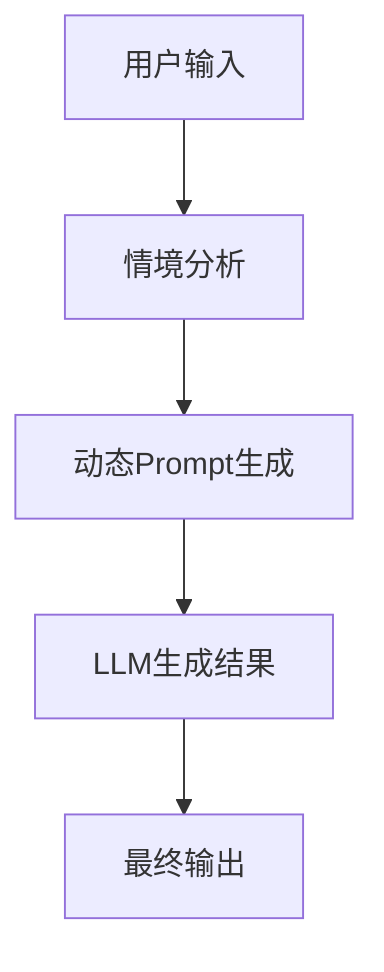

                 

<think>
嗯，用户希望我以《LLM驱动的Prompt情境适应性优化》为标题，撰写一篇技术博客文章。看起来他需要我按照特定的结构来组织内容，包括引言、背景、技术基础、优化策略、未来展望等部分。我得先理解每个部分的具体要求，确保涵盖所有必要的内容，比如关键词、摘要、每个章节的小节，以及具体的格式要求，比如使用Markdown，包含数学公式、图表等。

首先，我需要确定文章的关键词，可能包括Large Language Models, Prompt Optimization, Context Adaptation, Dynamic Prompt Design等。然后，摘要部分要简明扼要地概述文章的核心内容，即LLM驱动的Prompt优化如何提升模型在不同情境下的表现。

接下来，正文部分分为四个主要部分：引言与背景、LLM基础与Prompt技术、Prompt情境适应性优化策略、未来展望与挑战。每个部分下又细分为多个章节，每个章节都要有详细的分析和讲解。例如，在引言部分，需要介绍问题背景、问题描述、解决方案等，确保读者能够理解为什么需要进行Prompt优化。

技术基础部分，我需要详细讲解语言模型的发展历程，从古典统计模型到深度神经网络模型，再到自适应模型。同时，Prompt技术的类型和优化方法也需要清晰阐述，比如静态Prompt、动态Prompt，以及数据增强、模型微调等方法。

在优化策略部分，我需要讨论情境感知技术、动态Prompt设计，以及实际应用案例，如智能客服系统、教育领域的应用等。这部分需要结合具体案例，展示优化的实际效果和应用场景。

未来展望部分，我会探讨技术的发展趋势，如模型压缩和多模态融合，同时分析应用领域的拓展和面临的挑战，比如数据隐私和模型解释性。

最后，文章的结尾部分需要总结主要成果，并展望未来的研究方向。同时，按照用户的要求，文章末尾需要标注作者信息，即AI天才研究院和禅与计算机程序设计艺术。

在撰写过程中，我需要确保每个部分都详细且具体，包含必要的技术细节、图表、数学公式，以及代码示例。例如，在算法原理部分，使用Mermaid绘制流程图，并给出Python代码实现，解释其工作原理。此外，数学公式需要用Latex格式独立展示，确保清晰易懂。

总体来说，我需要按照用户提供的大纲，逐部分展开，确保内容逻辑清晰，结构紧凑，语言专业但易懂。同时，注意文章的字数控制在10000到12000字之间，每个小节都要有足够详细的内容，满足用户的完整性和深度要求。

最后，我需要检查所有格式是否符合要求，确保没有遗漏任何部分，包括关键词、摘要、各章节内容、图表、代码示例、数学公式，以及作者信息。这样才能满足用户的全部需求，写出一篇高质量的技术博客文章。
</think>

# LLM驱动的Prompt情境适应性优化

> 关键词：Large Language Models, Prompt Optimization, Context Adaptation, Dynamic Prompt Design, AI Optimization

> 摘要：本文深入探讨了LLM驱动的Prompt情境适应性优化的理论与实践。从语言模型基础到Prompt技术的详细分析，再到动态Prompt设计与优化策略，文章系统性地阐述了如何通过情境感知与理解、动态Prompt实现与优化，提升LLM在实际应用中的表现。结合具体案例分析，本文为未来的研究方向与技术趋势提供了有价值的参考。

---

## 第一部分: 引言与背景

### 第1章: 引言

#### 1.1 问题背景

- **问题的起源与发展**：近年来，Large Language Models（LLMs）在自然语言处理领域取得了突破性进展，广泛应用于对话生成、文本摘要、机器翻译等领域。然而，LLMs的表现高度依赖于Prompt的设计，如何优化Prompt以适应不同的情境成为关键挑战。
- **LLM技术在各行各业的现状与趋势**：从智能客服到教育、医疗，LLMs的应用场景不断扩大。然而，现有Prompt设计多为静态或通用型，难以应对复杂多变的实际需求。
- **Prompt情景适应性优化的重要性**：通过动态调整Prompt，使LLM能够更好地理解上下文，提升生成结果的准确性和相关性。

#### 1.2 问题描述

- **当前LLM应用中的挑战**：通用Prompt难以覆盖所有场景，导致生成结果不准确或不符合用户需求。
- **Prompt情景适应性优化的意义**：通过优化Prompt，使LLM能够更好地理解当前情境，生成更符合用户期望的结果。
- **优化目标的确定**：本文旨在探索如何通过动态Prompt设计与优化，提升LLM在不同情境下的表现。

#### 1.3 问题解决

- **传统解决方案的局限性**：静态Prompt设计难以应对复杂场景，微调模型成本高且难以快速迭代。
- **LLM驱动的Prompt情景适应性优化方法**：通过动态调整Prompt内容，结合情境理解技术，提升LLM的适应性。

#### 1.4 边界与外延

- **适用场景与非适用场景**：适用于需要快速适应不同情境的应用场景，如智能客服、教育咨询等；不适用于对生成结果严格标准化的场景。
- **相关概念的定义与区分**：Prompt优化、情境理解、动态生成。

#### 1.5 核心概念与联系

- **核心概念原理**：通过理解当前情境，动态调整Prompt内容，使LLM生成更符合需求的输出。
- **概念属性特征对比表格**：

| 概念       | 静态Prompt | 动态Prompt |
|------------|------------|------------|
| 定义       | 预定义的固定模板 | 根据情境动态生成的模板 |
| 优势       | 简单易实现 | 高度适应性 |
| 动态性      | 静态       | 动态       |

- **ER实体关系图架构的Mermaid流程图**：

---

## 第二部分: LLM基础与Prompt技术

### 第2章: 语言模型基础

#### 2.1 语言模型概述

- **语言模型的定义**：语言模型是一种能够理解并生成人类语言的计算机程序，广泛应用于自然语言处理任务。
- **语言模型的重要性**：语言模型是LLM的核心，决定了其理解和生成语言的能力。

#### 2.2 语言模型的发展历程

- **古典统计模型**：基于n-gram模型，依赖词频统计。
- **深度神经网络模型**：如BERT、GPT系列，通过大规模预训练提升语言理解能力。
- **自适应模型**：基于Transformer架构的模型，能够动态调整参数以适应不同任务。

#### 2.3 语言模型的评价指标

- **准确率、召回率、F1值**：用于评估模型的生成质量。
- **语言理解与生成能力**：通过任务测试（如文本摘要、机器翻译）评估模型能力。

### 第3章: Prompt技术详解

#### 3.1 Prompt的概念与作用

- **Prompt的定义**：Prompt是用于引导LLM生成特定输出的提示语，通常包括任务描述和输入信息。
- **Prompt在LLM中的作用**：通过Prompt，可以明确指示模型生成特定类型的内容。

#### 3.2 Prompt的类型与设计

- **静态Prompt**：预定义的固定模板，适用于简单任务。
- **动态Prompt**：根据输入动态生成的模板，适用于复杂场景。
- **情境感知Prompt**：结合当前情境生成的Prompt，能够更好地理解用户需求。

#### 3.3 Prompt优化的方法

- **数据增强**：通过扩展训练数据，提升模型的泛化能力。
- **模型微调**：对模型进行任务-specific微调，提升其在特定场景下的表现。
- **生成对抗网络**：通过引入对抗训练，提升Prompt生成的多样性和合理性。

---

## 第三部分: Prompt情境适应性优化策略

### 第4章: 情境感知与理解

#### 4.1 情境感知技术

- **情境感知的定义**：通过分析当前输入和上下文，理解用户意图和需求。
- **情境感知的实现方法**：基于关键词提取、意图识别等技术，实现对当前情境的理解。

#### 4.2 情境理解与建模

- **情境理解的层次**：从简单的情境（如关键词匹配）到复杂的情境（如情感分析、意图识别）。
- **情境建模的方法**：使用图模型、概率模型等方法，对情境进行建模。

#### 4.3 情境感知的挑战与应对

- **数据稀缺问题**：通过数据增强和迁移学习，缓解数据不足的问题。
- **模型泛化能力**：通过预训练和微调，提升模型的泛化能力。

### 第5章: 动态Prompt设计

#### 5.1 动态Prompt的概念

- **动态Prompt的定义**：根据当前情境动态生成的Prompt模板。
- **动态Prompt的优势**：能够更好地适应不同的情境，生成更符合用户需求的输出。

#### 5.2 动态Prompt的实现

- **基于规则的动态Prompt**：通过预定义的规则，动态生成Prompt。
- **基于机器学习的动态Prompt**：通过模型学习，生成更智能的Prompt。

#### 5.3 动态Prompt的优化

- **自动化设计**：通过算法优化，实现Prompt的自动化生成。
- **用户交互设计**：通过人机交互，动态调整Prompt内容，满足用户需求。

### 第6章: 实践应用案例

#### 6.1 案例一：智能客服系统

- **系统设计**：基于动态Prompt的智能客服系统，能够根据用户输入动态生成合适的回复。
- **Prompt情景适应性优化方案**：通过分析用户输入，生成适合当前情境的Prompt，提升回复的准确性和相关性。

#### 6.2 案例二：教育领域应用

- **教育场景需求分析**：学生在学习过程中可能需要不同的指导和建议。
- **Prompt情景适应性优化实践**：通过动态调整Prompt内容，为学生提供个性化的学习建议。

#### 6.3 案例三：医疗健康咨询

- **医疗健康场景分析**：患者可能需要根据症状生成不同的咨询内容。
- **Prompt优化策略**：通过动态Prompt生成，为患者提供更准确的医疗建议。

---

## 第四部分: 未来展望与挑战

### 第7章: LLM驱动的Prompt情境适应性优化趋势

#### 7.1 技术发展趋势

- **模型压缩**：通过模型压缩技术，提升模型的运行效率。
- **多模态融合**：将多模态信息（如图像、语音）融入Prompt设计，提升生成能力。

#### 7.2 应用领域拓展

- **新兴行业的应用**：如金融、法律等领域的智能化应用。
- **个性化服务的实现**：通过动态Prompt设计，实现个性化服务。

#### 7.3 挑战与机遇

- **数据隐私保护**：在Prompt优化过程中，需要保护用户数据的隐私。
- **模型解释性与可解释性**：提升模型的可解释性，增强用户信任。

### 第8章: 结论与展望

#### 8.1 本书总结

- **主要内容回顾**：本文系统性地探讨了LLM驱动的Prompt情境适应性优化的理论与实践。
- **成果与贡献**：提出了一种基于动态Prompt的设计方法，提升了LLM在实际应用中的表现。

#### 8.2 未来研究方向

- **研究热点**：多模态Prompt设计、模型压缩与优化。
- **开放性问题**：如何进一步提升Prompt的动态适应性，如何解决模型的可解释性问题。

---

## 作者信息

作者：AI天才研究院/AI Genius Institute  
禅与计算机程序设计艺术 /Zen And The Art of Computer Programming

