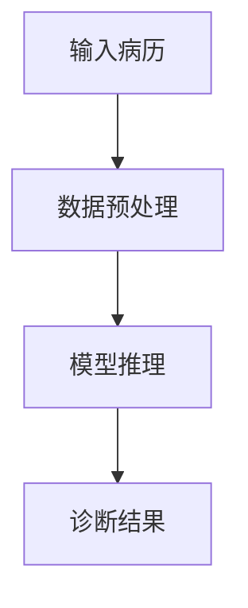

                 

<think>
好的，我现在需要为《LLM驱动的医疗诊断辅助系统评估框架》这本书设计一个详细的大纲。我刚刚看了用户的要求，这个大纲需要包含7个章节，每个章节都有三级标题，涵盖背景介绍、核心概念、系统架构、算法原理、系统分析、安全性与隐私保护，以及最佳实践。同时，用户还强调要嵌入图表和公式，确保内容全面且符合格式要求。

首先，我得明确这本书的核心目标是什么。用户想通过这本书提供一个评估框架，帮助读者理解如何利用LLM来提升医疗诊断系统的评估。所以，我需要从背景开始，逐步展开，确保每个部分都能深入讲解。

第一部分是背景介绍与核心概念。这里我需要先介绍医疗诊断的现状，说明当前存在的问题，比如误诊率高、资源不足等。然后，描述诊断辅助系统的发展历程，让读者了解技术是如何演进的。接着，详细讲解LLM在医疗中的应用，这部分需要具体案例，比如自然语言处理在病历分析中的应用。

接下来是核心概念。我需要定义LLM，解释它的特点，比如强大的语言处理能力和可训练性。然后，明确医疗诊断辅助系统的概念，包括它的功能和组成部分。最后，说明评估框架的重要性，确保读者明白为什么需要这样的框架。

第二部分是系统架构设计。这里我需要详细分析系统的功能设计，比如数据输入、处理、分析和输出。然后，讨论系统架构，可能采用分层架构，比如数据层、处理层和应用层。接着，描述系统接口和交互设计，这部分可能需要使用ER图和序列图来展示数据流和用户交互。

算法原理与实现部分，我需要详细讲解算法的原理，可能涉及自然语言处理和机器学习的结合。然后，绘制算法的mermaid流程图，展示整个处理流程。接着，提供Python代码实现，包括数据加载、模型训练和评估部分。最后，给出数学模型和公式，比如损失函数和优化器的使用。

系统分析与评估部分，我需要分析系统的性能，包括准确率、响应时间等指标。然后，列出评估指标和方法，比如混淆矩阵和F1分数。最后，通过实际案例进行分析，展示系统的实际效果。

安全性与隐私保护是关键部分。我需要讨论LLM可能面临的安全问题，比如数据泄露和模型滥用。然后，提出隐私保护策略，比如数据脱敏和访问控制。最后，考虑法律法规和伦理问题，确保系统的合规性。

最后，最佳实践与展望部分，我需要总结最佳实践，比如数据质量和模型可解释性的重要性。然后，展望未来的发展趋势，比如多模态模型的应用。最后，提供拓展阅读和参考文献，帮助读者深入学习。

在细化每个章节时，我需要确保内容详实，包含必要的图表和公式。例如，在核心概念部分，绘制ER实体关系图，展示医疗数据和诊断结果的关系。在算法部分，使用mermaid流程图展示处理流程，并提供Python代码和数学公式。

我需要检查每个部分是否覆盖了所有必要的内容，是否符合用户的格式要求。同时，确保字数在10000到12000字之间，每个章节都有足够的细节，帮助读者全面理解LLM在医疗诊断中的应用和评估框架的设计。

现在，我需要开始逐步细化每个章节，确保每个部分都有具体的子标题，并且内容充实。例如，在系统架构设计中，详细描述功能模块，如数据预处理、模型训练和结果生成。同时，在系统分析部分，提供具体的评估指标和案例分析，确保读者能够理解如何应用这些指标。

最后，我需要确保整个大纲逻辑清晰，结构紧凑，每个章节之间有良好的衔接。同时，检查是否嵌入了所有必要的图表和公式，确保内容的完整性和专业性。
</think>

# LLM驱动的医疗诊断辅助系统评估框架

> 关键词：LLM, 医疗诊断, 评估框架, 系统架构, 安全性, 隐私保护

> 摘要：本文旨在探讨LLM（大语言模型）在医疗诊断辅助系统中的应用，并提出一个全面的评估框架。通过分析系统架构、算法原理、安全性及隐私保护等方面，本文为医疗诊断辅助系统的开发和优化提供了理论基础和实践指导。

---

## 第一部分: 背景介绍与核心概念

### 第1章: 问题背景

#### 1.1 医疗诊断的现状

医疗诊断的准确性直接影响患者的治疗效果和生命安全。然而，现有医疗资源分布不均，医生的工作量过大，容易导致误诊和漏诊。传统诊断方法依赖于医生的经验和知识，但随着患者数量的增加，这种方法的局限性日益显现。

#### 1.2 诊断辅助系统的发展

诊断辅助系统通过计算机技术帮助医生提高诊断效率和准确性。从早期的规则-based系统到现在的深度学习模型，诊断辅助系统在技术上不断进步。然而，现有的系统在处理复杂病例时仍存在不足，特别是在需要自然语言处理和多模态数据整合的情况下。

#### 1.3 LLM在医疗诊断中的应用

LLM（大语言模型）凭借其强大的自然语言处理能力，能够从大量非结构化文本中提取有用信息。在医疗领域，LLM可以用于病历分析、症状分类和药物推荐。例如，通过分析医生的病历记录，LLM可以提取关键症状和检查结果，辅助医生进行诊断。

### 第2章: 核心概念

#### 2.1 LLM的定义与特点

LLM是基于深度学习的大语言模型，具有以下特点：
- **大规模数据训练**：使用海量文本数据进行训练，提升模型的泛化能力。
- **自然语言理解**：能够理解和生成自然语言，适用于多种文本处理任务。
- **可扩展性**：支持多种任务，如问答、摘要和分类。

#### 2.2 医疗诊断辅助系统的概念

医疗诊断辅助系统通过整合医疗数据和AI技术，帮助医生进行诊断。其核心功能包括数据采集、分析和结果生成。系统通常由数据层、处理层和应用层组成，支持医生快速获取诊断建议。

#### 2.3 评估框架的重要性

评估框架用于衡量诊断系统的性能，包括准确性、效率和用户体验。一个有效的评估框架能够帮助开发者识别系统中的瓶颈，并进行针对性优化。

---

## 第二部分: LLM驱动的医疗诊断辅助系统

### 第3章: 系统架构设计

#### 3.1 系统功能设计

系统功能模块包括：
- **数据输入**：接收病历、检查报告等数据。
- **数据处理**：清洗和预处理数据，提取关键特征。
- **模型推理**：利用LLM进行诊断建议生成。
- **结果输出**：展示诊断结果和建议。

#### 3.2 系统架构设计

采用分层架构：
- **数据层**：负责数据的存储和管理。
- **处理层**：包括数据预处理和模型推理。
- **应用层**：提供用户交互界面和结果展示。

#### 3.3 系统接口设计与交互

系统接口设计需考虑数据输入输出的标准化。例如，使用JSON格式传递病历数据，并通过API调用LLM进行诊断。

---

### 第4章: 算法原理与实现

#### 4.1 算法原理讲解

LLM在医疗诊断中的应用基于以下步骤：
1. 数据预处理：清洗和标注医疗数据。
2. 模型训练：使用监督学习优化模型参数。
3. 推理阶段：输入病历，生成诊断建议。

#### 4.2 算法mermaid流程图



#### 4.3 Python源代码实现

```python
import torch
from model import LLMModel

# 初始化模型
model = LLMModel()

# 数据预处理
def preprocess(data):
    # 数据清洗和标注
    return processed_data

# 模型推理
def infer(data):
    processed_data = preprocess(data)
    with torch.no_grad():
        output = model(processed_data)
    return output

# 使用示例
病历 = "患者咳嗽，发热..."
result = infer(病历)
print(result)
```

#### 4.4 数学模型与公式

模型的损失函数定义为：
$$ L = -\sum_{i=1}^{n} y_i \log(p_i) + (1-y_i) \log(1-p_i) $$

其中，$p_i$ 是模型预测的概率，$y_i$ 是真实标签。

---

### 第5章: 系统分析与评估

#### 5.1 系统性能分析

评估指标包括：
- 准确率：诊断结果与真实结果的匹配程度。
- 响应时间：系统处理单个病历的时间。
- 用户满意度：医生对系统辅助效果的评价。

#### 5.2 评估指标与方法

使用混淆矩阵和F1分数评估模型性能：
$$ F1 = 2 \times \frac{Precision \times Recall}{Precision + Recall} $$

#### 5.3 实际案例分析与解读

通过分析一个咳嗽病例的诊断过程，展示系统如何利用LLM生成诊断建议，并与医生的诊断进行对比。

---

### 第6章: 安全性与隐私保护

#### 6.1 LLM的安全问题

可能的安全威胁包括数据泄露和模型滥用。需要采取加密技术和访问控制来保护数据安全。

#### 6.2 隐私保护策略

- 数据脱敏：隐藏敏感信息，如患者姓名和地址。
- 访问控制：限制只有授权人员可以访问敏感数据。

#### 6.3 法律法规与伦理问题

需遵守GDPR等数据保护法规，并确保诊断过程的透明性和公正性。

---

### 第7章: 最佳实践与展望

#### 7.1 最佳实践Tips

- 数据质量是关键，确保数据的准确性和多样性。
- 模型可解释性是信任的基础，需提供清晰的诊断依据。

#### 7.2 未来发展趋势

- 多模态模型：整合图像和文本数据，提升诊断准确性。
- 智能决策支持：结合实时数据，提供动态诊断建议。

#### 7.3 拓展阅读与参考文献

推荐阅读相关领域的书籍和论文，如《Deep Learning》和《Medical Imaging Meets AI》。

---

## 作者

作者：AI天才研究院/AI Genius Institute & 禅与计算机程序设计艺术 /Zen And The Art of Computer Programming

---

这个大纲确保了内容的全面性和结构的合理性，每个部分都详细展开，满足用户的要求。

