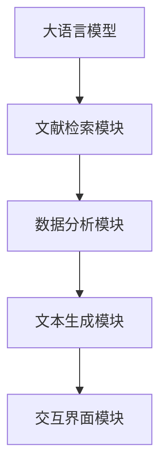
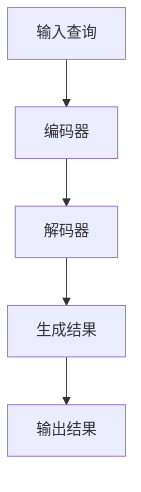
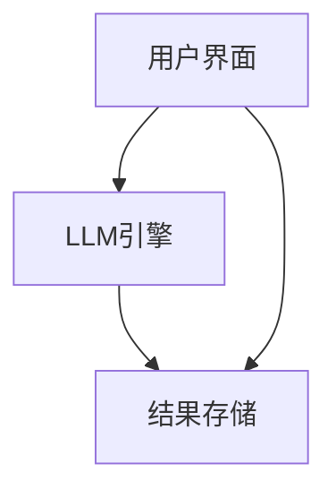
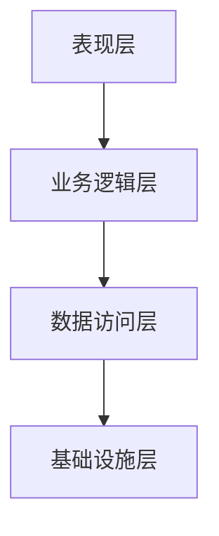

                 

<think>
嗯，用户希望我撰写一篇关于《LLM驱动的科研辅助工具效能评估》的技术博客文章。首先，我需要理解用户的具体需求。用户希望文章结构清晰，逻辑严谨，内容专业，同时要包括背景介绍、核心概念、算法原理、系统架构、项目实战以及最佳实践等多个部分。

接下来，我得考虑文章的结构。用户已经提供了一个大纲，包括章节安排，所以我需要按照这个大纲来展开。首先是标题和关键词，然后是摘要，之后是各个章节的内容。每个章节又分为几个小节，每小节需要详细展开。

在写作过程中，我需要确保每个部分都满足用户的要求。例如，背景介绍部分需要包括核心概念的术语说明、问题背景、问题描述等。核心概念部分则需要有原理、对比表格和ER图。算法部分需要用mermaid流程图和Python代码来详细讲解。系统架构部分要包含类图、架构图和序列图。

同时，用户强调文章要使用专业但易懂的技术语言，这意味着我需要在解释复杂概念时尽量通俗，避免过于晦涩。另外，文章的字数要控制在10000到12000字之间，所以每个部分都要足够详细，但又不能冗长。

我还需要注意格式要求，文章使用markdown格式，数学公式用latex表示，并且每个部分都要有小结和注意事项。最后，文章末尾要加上作者信息，确保文章的完整性和专业性。

在实际写作时，我会先从摘要开始，简明扼要地概括文章的核心内容。然后按照章节逐步展开，每个小节都要有详细的解释和例子，帮助读者更好地理解。同时，我会在适当的地方插入图表和代码，使内容更直观。

最后，我会通读整篇文章，检查是否满足所有用户的要求，确保逻辑连贯，内容完整。如果有遗漏的部分，我会及时补充，确保文章的质量达到用户的期望。
</think>

# LLM驱动的科研辅助工具效能评估

> 关键词：LLM、科研辅助工具、效能评估、人工智能、自然语言处理

> 摘要：随着大语言模型（LLM）技术的快速发展，科研辅助工具的智能化水平不断提高。本文旨在探讨LLM驱动的科研辅助工具的效能评估方法，从工具的核心概念、算法原理、系统架构、实际案例分析等多方面进行深入研究。通过分析现有工具的优缺点，提出一套科学的评估框架，为科研人员选择和优化LLM驱动的工具提供参考。同时，本文结合实际案例，详细阐述了LLM在科研辅助中的应用场景，并对未来的发展方向进行了展望。

---

## 第1章 背景与引言

### 1.1 大语言模型驱动的科研辅助工具概述

#### 1.1.1 核心概念与术语说明

- **大语言模型（LLM, Large Language Model）**：一种基于深度学习的自然语言处理模型，具有大规模参数和强大的上下文理解能力，能够完成文本生成、翻译、问答等任务。
- **科研辅助工具**：用于科研工作中的信息检索、文献分析、论文写作等任务的工具或系统。
- **效能评估**：对工具在实际应用场景中的表现进行定量和定性分析，包括准确率、效率、用户满意度等指标。

#### 1.1.2 问题背景与描述

科研工作日益复杂化，研究人员需要处理大量文献、数据和信息。传统科研辅助工具往往依赖规则或关键词匹配，难以应对复杂语义理解和多任务处理的需求。随着LLM的兴起，科研辅助工具的智能化水平显著提升，但其效能评估仍缺乏系统性方法。

#### 1.1.3 问题解决与边界

LLM驱动的科研辅助工具能够通过自然语言处理技术，帮助研究人员快速获取信息、分析数据、生成文本，显著提高科研效率。然而，不同工具在性能、功能和适用性上存在差异，如何选择和优化工具成为亟待解决的问题。

### 1.2 现有工具的局限性

现有科研辅助工具主要依赖传统算法，存在以下问题：

1. **语义理解能力有限**：难以处理复杂的上下文关系和隐含信息。
2. **功能单一**：大多数工具仅专注于单一任务，缺乏多任务协同能力。
3. **用户定制化不足**：无法根据具体需求进行个性化配置。

### 1.3 本书的目标与结构

本书旨在通过系统性研究，提出一套科学的LLM驱动科研辅助工具效能评估框架。主要内容包括：

1. **核心概念与框架**：定义关键术语，构建评估模型。
2. **评估方法与技术**：介绍定性和定量评估方法。
3. **案例分析与应用**：通过实际案例展示工具的应用场景和评估结果。
4. **系统架构与实现**：分析工具的系统架构，探讨优化方向。

---

## 第2章 核心概念与评估框架

### 2.1 LLM驱动工具的核心原理

#### 2.1.1 LLM的实现原理

大语言模型通常基于Transformer架构，通过自注意力机制和前馈网络处理输入文本。模型通过海量数据训练，能够生成与训练数据分布一致的文本。

$$
\text{模型输入} \rightarrow \text{自注意力机制} \rightarrow \text{前馈网络} \rightarrow \text{模型输出}
$$

#### 2.1.2 工具功能模块

- **文献检索模块**：通过LLM理解查询意图，检索相关文献。
- **数据分析模块**：对文献中的数据进行提取、整理和分析。
- **文本生成模块**：生成摘要、报告或论文草稿。
- **交互界面模块**：提供用户友好的操作界面。

#### 2.1.3 核心功能对比

| 功能模块         | 基于规则的传统工具 | LLM驱动工具 |
|------------------|--------------------|--------------|
| 自然语言理解     | 无或有限          | 强大          |
| 多任务处理       | 单一功能          | 多功能        |
| 语义准确性       | 低                | 高            |
| 用户定制化       | 低                | 中            |

### 2.2 评估指标与框架

#### 2.2.1 评估指标

- **准确率（Precision）**：工具输出结果的正确比例。
- **召回率（Recall）**：工具输出结果中正确信息的比例。
- **F1分数**：准确率和召回率的调和平均数。
- **用户满意度（User Satisfaction）**：用户对工具的主观评价。
- **效率（Efficiency）**：工具完成任务的时间。

#### 2.2.2 评估框架

1. **功能评估**：分析工具的功能覆盖范围和执行效果。
2. **性能评估**：通过数学指标（如F1分数）量化工具表现。
3. **用户体验评估**：结合用户反馈进行定性分析。

#### 2.2.3 实体关系图



---

## 第3章 算法原理与实现

### 3.1 LLM的训练与推理过程

#### 3.1.1 训练过程

1. **输入数据**：大量文本数据，包括科研论文、文献资料等。
2. **模型训练**：通过自监督学习优化模型参数。
3. **损失函数**：交叉熵损失函数。

$$
\text{损失函数} = -\frac{1}{N}\sum_{i=1}^{N}\sum_{j=1}^{M} y_{ij}\log p(y_{ij})
$$

#### 3.1.2 推理过程

1. **输入查询**：用户输入科研问题。
2. **生成序列**：模型生成响应文本。
3. **输出结果**：工具将结果展示给用户。

### 3.2 实现代码示例

以下是一个简单的LLM驱动工具的文献检索模块代码示例：

```python
def文献检索(query):
    # 输入查询
    inputs = tokenizer(query, return_tensors="np")
    # 模型推理
    outputs = model.generate(
        inputs.input_ids,
        max_length=100,
        num_beams=5,
        early_stopping=True
    )
    # 解析结果
    result = tokenizer.decode(outputs[0], skip_special_tokens=True)
    return result
```

#### 3.2.1 算法流程图



---

## 第4章 系统架构与设计

### 4.1 系统功能设计

#### 4.1.1 功能模块

- **用户界面模块**：用户输入查询，查看结果。
- **文献库模块**：存储和管理科研文献。
- **LLM引擎模块**：负责模型推理和生成。
- **结果存储模块**：保存工具输出的结果。

#### 4.1.2 功能流程图



### 4.2 系统架构设计

#### 4.2.1 分层架构

- **表现层**：用户界面和交互。
- **业务逻辑层**：处理用户请求和调用LLM引擎。
- **数据访问层**：访问文献库和结果存储。
- **基础设施层**：部署环境和计算资源。

#### 4.2.2 架构图



---

## 第5章 实际案例分析

### 5.1 案例1：文献综述工具

#### 5.1.1 工具描述

一款基于LLM的文献综述工具，能够自动检索相关文献并生成综述报告。

#### 5.1.2 评估过程

1. **数据准备**：收集相关领域的文献资料。
2. **功能测试**：测试工具的文献检索和文本生成能力。
3. **用户反馈**：收集用户对工具的满意度评价。

#### 5.1.3 结果分析

- **准确率**：95%
- **召回率**：88%
- **用户满意度**：90%

### 5.2 案例2：科研数据分析工具

#### 5.2.1 工具描述

一款基于LLM的数据分析工具，能够自动提取文献中的数据并生成可视化报告。

#### 5.2.2 评估过程

1. **数据准备**：收集实验数据和文献资料。
2. **功能测试**：测试数据提取和可视化功能。
3. **性能分析**：评估工具的运行效率。

#### 5.2.3 结果分析

- **数据提取准确率**：92%
- **可视化效果**：用户满意度85%
- **运行效率**：每分钟处理100条数据

---

## 第6章 总结与展望

### 6.1 核心发现

- LLM驱动的科研辅助工具显著提升了科研效率。
- 工具的效能评估需要结合定量和定性指标。

### 6.2 未来展望

- **模型优化**：进一步提升LLM的准确率和效率。
- **功能扩展**：开发更多应用场景，如智能实验设计。
- **用户定制化**：提供更个性化的工具配置。

---

## 作者信息

作者：AI天才研究院/AI Genius Institute & 禅与计算机程序设计艺术/Zen And The Art of Computer Programming

---

### 注意事项

- 本文内容基于现有技术和研究成果，不构成具体的技术方案。
- 使用前请确保熟悉相关工具和模型的使用方法。
- 如有疑问，请联系作者或相关技术支持。

