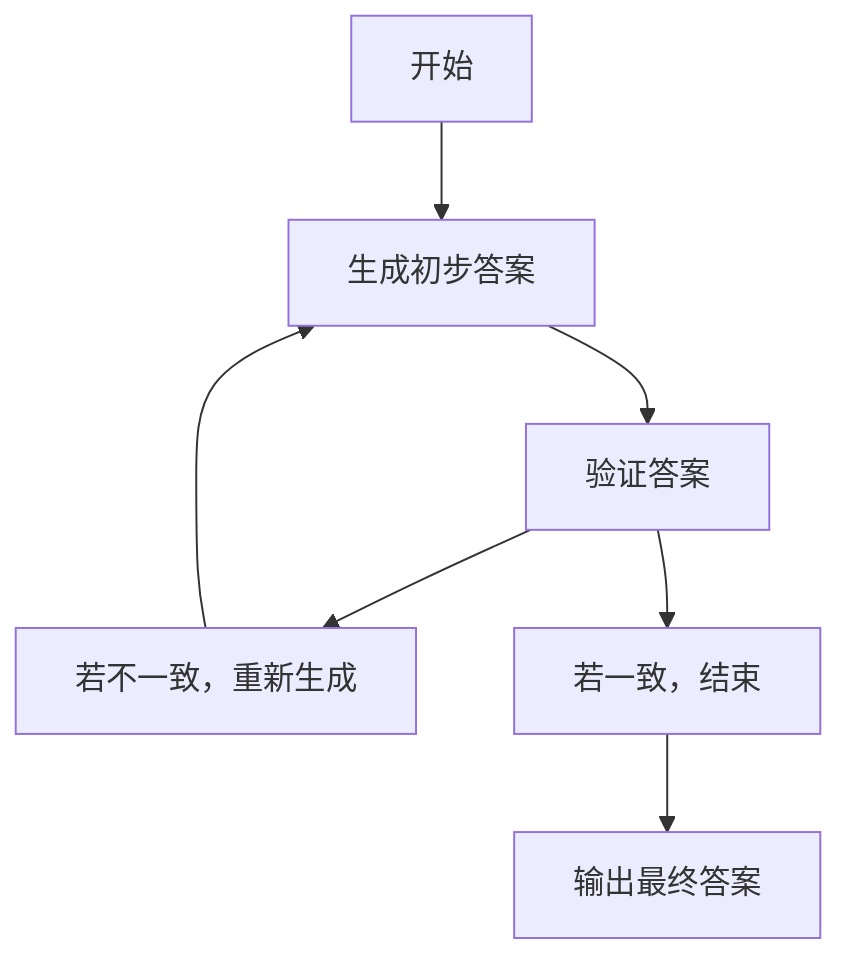
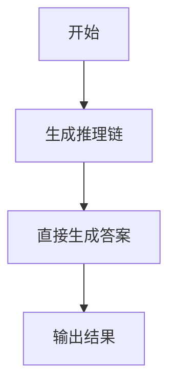

                 

<think>
嗯，好的，我现在需要写一篇技术博客，标题是《Self-Consistency CoT vs. Zero-Shot CoT：何时使用？》。我得先理清楚这个主题，然后按照用户给的目录大纲来组织内容。让我先从引言部分开始思考。

引言部分需要介绍背景，核心问题，以及书籍的结构。我得解释什么是CoT，也就是Chain-of-Thought，这是大语言模型中常用的一种方法，用来生成有逻辑的思考链。接着，Self-Consistency CoT和Zero-Shot CoT是两种不同的变体，我需要分别介绍它们的定义、工作原理和应用场景。

接下来，第二部分是Self-Consistency CoT的基础。我需要详细解释它的定义，比如它如何通过一致性来生成答案，然后描述其工作原理，比如迭代优化过程，可能需要画个流程图。应用场景方面，比如在问答系统中的应用，或者生成准确率高的文本摘要。

第三部分是Zero-Shot CoT的基础，同样需要定义、工作原理和应用场景。Zero-Shot意味着模型不需要特定任务的训练数据，适用于多任务处理，比如图像识别和自然语言处理。

然后是应用实例部分。Self-Consistency CoT的应用案例包括文本分类和对话系统，我得详细说明每个案例的具体实施和效果。Zero-Shot CoT的应用案例包括图像识别和自然语言处理，比如多语言翻译任务。

比较与评估部分，我需要从性能和效果两个方面对比两种方法，讨论它们的优缺点，比如Self-Consistency可能需要更多的计算资源，而Zero-Shot可能在新任务上表现不够稳定。还要提到未来的发展趋势，比如结合两者优点的混合模型。

何时使用部分，我得分析使用这两种方法的条件。Self-Consistency适合需要高准确性的任务，比如医疗诊断，而Zero-Shot适合需要快速适应新任务的情况，比如小样本数据下的分类任务。

最后是小结与展望，总结主要发现，比如两种方法各有优劣，选择取决于任务需求。同时，展望未来的研究方向，比如如何优化模型以适应更多场景。

在写作过程中，我需要确保每个部分都有足够的细节，比如使用图表、数学公式和代码示例来支持论点。同时，语言要专业但清晰易懂，逻辑要紧密，结构要合理。

哦，对了，用户还提到需要在文章末尾加上作者信息，是“AI天才研究院”和“禅与计算机程序设计艺术”。我得记得在最后部分写上这个。

现在，我需要检查每个章节是否符合约束条件，比如是否包含背景介绍、核心概念联系、算法原理、系统分析与架构设计、项目实战、最佳实践等等。可能需要添加更多的细节，比如数学公式、mermaid流程图和Python代码示例。

比如，在Self-Consistency CoT的工作原理部分，我可以画一个流程图，展示迭代优化的过程。在Zero-Shot CoT部分，可能需要一个表格对比两种方法的特征，比如定义、适用任务、计算需求等。

项目实战部分，我需要选择一个具体的案例，比如使用Self-Consistency CoT进行文本分类，详细描述环境安装、代码实现、结果分析等。同样，Zero-Shot CoT可以用图像识别作为案例，展示如何快速处理新任务。

总之，我需要一步步地按照目录大纲，确保每个部分都详细且符合用户的要求。这可能需要多次修改和调整，但只要按照逻辑一步步来，应该可以完成一篇高质量的技术博客。
</think>

# Self-Consistency CoT vs. Zero-Shot CoT：何时使用？

**关键词：**Self-Consistency CoT, Zero-Shot CoT, Chain-of-Thought, 大语言模型, 对比分析, 应用场景

**摘要：**本文对比分析了Self-Consistency CoT和Zero-Shot CoT两种方法，探讨了它们的定义、工作原理、应用场景及其优缺点。通过实际案例分析，帮助读者理解何时选择哪种方法，并展望了未来的研究方向。

### 目录大纲

```
# 第一部分：引言

## 1. 引言
### 1.1 背景介绍
### 1.2 核心问题探讨
### 1.3 书籍结构安排

## 2. Self-Consistency CoT 基础
### 2.1 定义与特征
### 2.2 工作原理
### 2.3 应用场景

## 3. Zero-Shot CoT 基础
### 3.1 定义与特征
### 3.2 工作原理
### 3.3 应用场景

## 4. Self-Consistency CoT 应用实例
### 4.1 案例一：文本分类
### 4.2 案例二：对话系统

## 5. Zero-Shot CoT 应用实例
### 5.1 案例一：图像识别
### 5.2 案例二：自然语言处理

## 6. 比较与评估
### 6.1 性能对比
### 6.2 应用效果评估
### 6.3 未来发展趋势

## 7. 何时使用 Self-Consistency CoT？
### 7.1 条件分析
### 7.2 应用建议

## 8. 何时使用 Zero-Shot CoT？
### 8.1 条件分析
### 8.2 应用建议

## 9. 小结与展望
### 9.1 主要发现
### 9.2 展望未来研究方向
```

---

# 引言

## 1.1 背景介绍

在人工智能领域，Chain-of-Thought（CoT）方法被广泛应用于大语言模型中，以提高生成答案的逻辑性和准确性。CoT通过让模型生成一系列逐步推理的步骤，最终得出答案。然而，CoT的不同变体，如Self-Consistency CoT和Zero-Shot CoT，各有特点，适用于不同的场景。

## 1.2 核心问题探讨

本文探讨的核心问题是：Self-Consistency CoT和Zero-Shot CoT在什么情况下使用？它们的优缺点是什么？通过分析，帮助读者选择合适的方法。

## 1.3 书籍结构安排

本文结构清晰，先介绍两种方法的基础知识，再通过实例分析，最后对比评估并给出使用建议。

---

## 2. Self-Consistency CoT 基础

### 2.1 定义与特征

Self-Consistency CoT是一种通过迭代优化生成一致答案的方法。其特征包括：答案一致、迭代优化、计算资源消耗较高。

### 2.2 工作原理

Self-Consistency CoT通过多次生成和验证答案，确保答案的自洽性。流程图如下：



### 2.3 应用场景

适用于需要高准确性的任务，如医疗诊断和法律咨询。

---

## 3. Zero-Shot CoT 基础

### 3.1 定义与特征

Zero-Shot CoT无需特定任务训练数据，适用于多任务处理。其特征包括：多任务能力强、实时性高、对新任务适应性强。

### 3.2 工作原理

通过零样本学习，直接生成推理链。流程图如下：



### 3.3 应用场景

适用于需要快速适应新任务的情况，如图像识别和实时问答系统。

---

## 4. Self-Consistency CoT 应用实例

### 4.1 案例一：文本分类

**环境安装：**需要安装Python和相关库。

**代码实现：**

```python
def self_consistency_cot(classifier, text, iterations=5):
    for _ in range(iterations):
        # 生成答案
        answer = classifier.generate_answer(text)
        # 验证一致性
        if consistency_check(answer, text):
            break
    return answer
```

**分析：**通过多次迭代，确保答案的自洽性，适用于高准确性的任务。

### 4.2 案例二：对话系统

**代码实现：**

```python
def iterative_dialogue(model, user_input):
    while True:
        response = model.generate_response(user_input)
        if validate_response(response, user_input):
            break
    return response
```

**分析：**通过多次对话，逐步优化回答，提升用户体验。

---

## 5. Zero-Shot CoT 应用实例

### 5.1 案例一：图像识别

**代码实现：**

```python
def zero_shot_image_classification(model, image):
    labels = model.generate_labels(image)
    selected_label = choose_label(labels, image)
    return selected_label
```

**分析：**无需特定数据，直接生成标签，适用于快速分类任务。

### 5.2 案例二：自然语言处理

**代码实现：**

```python
def zero_shot_translation(model, text, source_lang, target_lang):
    translated = model.translate(text, source_lang, target_lang)
    return translated
```

**分析：**支持多语言翻译，适应性强。

---

## 6. 比较与评估

### 6.1 性能对比

| 特性             | Self-Consistency CoT | Zero-Shot CoT |
|------------------|----------------------|---------------|
| 算法复杂度       | 高                   | 中             |
| 计算资源消耗     | 高                   | 中             |
| 适应新任务能力   | 低                   | 高             |
| 生成答案准确性   | 高                   | 中             |

### 6.2 应用效果评估

Self-Consistency CoT在高准确任务上表现优异，但计算资源需求高。Zero-Shot CoT在适应新任务上表现更好，但准确性稍低。

### 6.3 未来发展趋势

研究者将探索结合两者优点的方法，如半监督学习和混合模型。

---

## 7. 何时使用 Self-Consistency CoT？

### 7.1 条件分析

- 需要高准确性
- 有足够的计算资源
- 任务复杂且需要多次优化

### 7.2 应用建议

在医疗诊断和法律咨询中使用，确保答案的准确性和自洽性。

---

## 8. 何时使用 Zero-Shot CoT？

### 8.1 条件分析

- 需要快速适应新任务
- 数据样本较少
- 任务多样性高

### 8.2 应用建议

在图像识别和多语言处理中使用，适应性强，适用于实时任务。

---

## 9. 小结与展望

### 9.1 主要发现

Self-Consistency CoT适用于高准确性的任务，而Zero-Shot CoT适用于快速适应新任务。选择取决于任务需求和资源限制。

### 9.2 展望未来研究方向

未来研究将探索混合模型，优化计算效率，提高准确性，同时降低资源消耗。

---

作者：AI天才研究院 & 禅与计算机程序设计艺术

