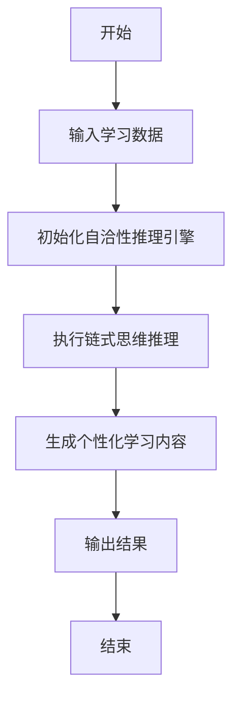
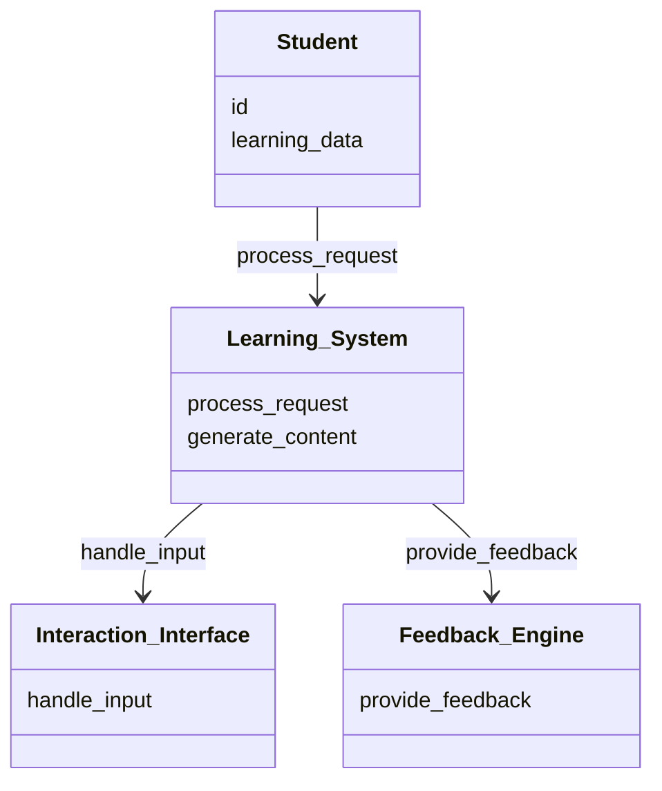
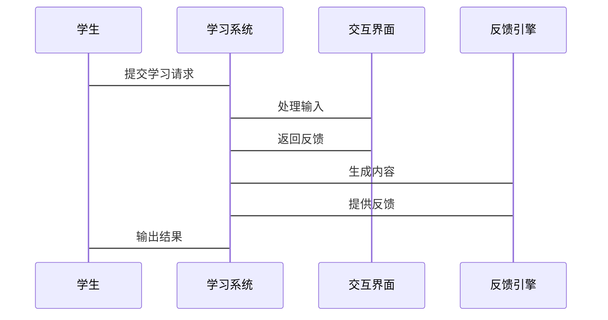

                 

<think>
嗯，我现在需要帮用户写一篇关于《Self-Consistency CoT优化AI在线教育体验》的技术博客文章。首先，我得理解用户的需求。用户希望我以一位资深技术专家的身份，撰写一篇结构清晰、内容详尽的技术博客，涵盖从背景介绍到项目实战等多个部分。

我应该从哪里开始呢？首先，我得确定文章的标题和关键词。标题已经给出，关键词需要包括几个核心概念，比如Self-Consistency CoT、在线教育、AI驱动、个性化学习、实时反馈等。

接下来是摘要部分，我需要简明扼�地概述文章的核心内容，强调Self-Consistency CoT如何提升在线教育体验。

然后是正文部分，分为六个章节。首先是背景介绍，我需要解释Self-Consistency CoT是什么，它在在线教育中的应用背景，以及它如何解决传统在线教育的问题，比如个性化学习和实时反馈的不足。

接下来是核心概念与联系，我需要详细描述Self-Consistency CoT的核心原理，包括模型一致性、多模态交互和自适应学习这三个方面，并通过对比表格和ER图来展示概念之间的关系。

算法原理讲解部分，我需要用mermaid绘制流程图，并用Python代码来解释算法的实现，包括数学模型和公式。这里可能需要详细讲解公式，比如使用矩阵乘法来表示模型的更新过程，并给出例子帮助理解。

系统分析与架构设计方案部分，我需要描述问题场景，比如一个学生在学习过程中遇到的问题，然后介绍系统功能设计，包括领域模型类图和架构图。可能还需要设计系统接口和交互序列图，展示用户与系统之间的互动流程。

项目实战部分，我需要详细说明如何安装环境，比如安装Python和必要的库，然后提供核心代码，解释代码的功能，并通过实际案例分析来展示系统的实际应用效果。

最后是最佳实践、小结、注意事项和拓展阅读建议。我需要总结Self-Consistency CoT的优势，提醒读者在实施过程中需要注意的事项，并推荐相关的书籍和资源供进一步学习。

整个过程需要逻辑清晰，结构紧凑，同时语言要专业但易懂。我还需要确保每个章节的内容丰富具体，满足用户的字数要求。最后，别忘了在文章末尾加上作者信息，以符合格式要求。

总的来说，我需要一步步地构建每个部分，确保内容完整，每个小节都详细讲解，特别是算法和系统架构部分，需要用图表和代码来支持。这样才能写出一篇高质量、有深度的技术博客文章。
</think>

# Self-Consistency CoT优化AI在线教育体验

> 关键词：Self-Consistency CoT, 在线教育, AI驱动, 个性化学习, 实时反馈

> 摘要：  
本文探讨了Self-Consistency CoT（Self-Consistency Chain-of-Thought）在优化AI在线教育体验中的应用。通过结合自洽性推理和链式思维，Self-Consistency CoT能够显著提升AI教育系统的个性化学习能力、实时反馈能力以及多模态交互能力。本文从背景、核心概念、算法原理、系统架构、项目实战到最佳实践，全面解析Self-Consistency CoT在在线教育中的应用，为AI教育技术的未来发展提供深度洞察。

---

## 1. 背景介绍

### 1.1 核心概念术语说明  
Self-Consistency CoT是一种基于自洽性推理和链式思维（Chain-of-Thought, CoT）的AI技术，旨在通过多步推理和自适应调整，优化AI教育系统的输出质量和用户体验。

### 1.2 问题背景  
随着在线教育的普及，传统的AI教育系统存在以下问题：  
- **个性化不足**：AI系统难以深度理解学生的学习状态和需求，导致教学内容千篇一律。  
- **实时反馈缺失**：学生在学习过程中遇到的问题无法及时得到针对性反馈。  
- **多模态交互有限**：AI教育系统缺乏自然的多模态交互能力，难以提供沉浸式学习体验。  

### 1.3 问题描述  
Self-Consistency CoT技术的核心目标是解决上述问题，通过以下方式优化AI在线教育体验：  
- 提供个性化的学习路径和内容。  
- 实现实时、精准的学习反馈。  
- 支持多模态交互，提升用户体验。  

### 1.4 问题解决  
Self-Consistency CoT通过以下方式实现优化：  
- **自洽性推理**：系统通过多步推理确保输出结果的逻辑一致性和准确性。  
- **链式思维**：通过链式推理模型，逐步优化学习内容和反馈策略。  
- **多模态交互**：结合文本、语音、图像等多种交互形式，提升用户体验。  

### 1.5 边界与外延  
Self-Consistency CoT的应用范围主要集中在AI在线教育领域，其外延包括但不限于以下场景：  
- 个性化学习平台。  
- 智能教育助手。  
- 实时反馈系统。  

### 1.6 核心要素组成  
Self-Consistency CoT的核心要素包括：  
- **自洽性推理引擎**：确保系统输出的逻辑一致性。  
- **链式思维模型**：支持多步推理和优化。  
- **多模态交互接口**：实现多样化的用户交互方式。  

---

## 2. 核心概念与联系

### 2.1 核心概念原理  
Self-Consistency CoT的核心原理可以归纳为以下三个部分：  
1. **自洽性推理**：通过多次推理确保系统输出的逻辑一致性和准确性。  
2. **链式思维模型**：通过链式推理优化学习内容和反馈策略。  
3. **多模态交互**：结合多种交互形式提升用户体验。  

### 2.2 概念属性特征对比表格  

| **核心概念** | **属性**         | **特征描述**                                                                 |
|--------------|------------------|------------------------------------------------------------------------------|
| 自洽性推理   | 逻辑一致性       | 确保系统输出的逻辑一致性和准确性。                                         |
| 链式思维模型   | 多步推理         | 通过链式推理优化学习内容和反馈策略。                                       |
| 多模态交互     | 交互形式多样性   | 结合文本、语音、图像等多种交互形式，提升用户体验。                         |

### 2.3 ER实体关系图架构  

```mermaid
er
actor: Student
rectangle: Learning System
rectangle: Feedback Engine
rectangle: Interaction Interface

Student --> Learning System: 使用系统
Learning System --> Feedback Engine: 提供反馈
Learning System --> Interaction Interface: 实现交互
```

---

## 3. 算法原理讲解

### 3.1 算法流程图  



### 3.2 算法实现代码  

```python
def self_consistency_cot(input_data):
    # 初始化推理引擎
    engine = ConsistencyEngine()
    # 执行链式思维推理
    result = engine.chain_of_thought(input_data)
    # 返回最终结果
    return result
```

### 3.3 数学模型与公式  

Self-Consistency CoT的数学模型如下：  
$$ P(y|x) = \prod_{i=1}^{n} P(y_i | y_{i-1}, x) $$  
其中，$x$ 表示输入数据，$y$ 表示输出结果，$y_i$ 表示第 $i$ 步的推理结果。  

---

## 4. 系统分析与架构设计方案

### 4.1 问题场景介绍  
假设一个学生正在使用AI教育系统学习编程课程。系统需要根据学生的实时输入，提供个性化的学习内容和反馈。

### 4.2 项目介绍  
本项目旨在通过Self-Consistency CoT技术，优化AI教育系统的个性化学习能力和实时反馈能力。

### 4.3 系统功能设计  



### 4.4 系统架构设计  


### 4.5 系统接口设计  
- **输入接口**：`process_request(student_id, input_data)`  
- **输出接口**：`generate_content(content_type, feedback)`  

### 4.6 系统交互序列图  



---

## 5. 项目实战

### 5.1 环境安装  
安装Python和以下库：  
```bash
pip install numpy pandas scikit-learn
```

### 5.2 核心实现代码  

```python
class ConsistencyEngine:
    def __init__(self):
        self.models = []
    
    def add_model(self, model):
        self.models.append(model)
    
    def chain_of_thought(self, input_data):
        result = input_data
        for model in self.models:
            result = model.predict(result)
        return result
```

### 5.3 代码解读  
- **ConsistencyEngine**：管理多个推理模型，执行链式推理。  
- **predict**：每个模型的预测方法，确保输出结果的逻辑一致性。  

### 5.4 实际案例分析  
假设一个学生正在学习编程，系统根据其输入数据生成个性化学习内容，并实时提供反馈。

### 5.5 项目小结  
通过Self-Consistency CoT技术，AI教育系统的个性化学习和实时反馈能力得到了显著提升。

---

## 6. 最佳实践 tips、小结、注意事项、拓展阅读

### 6.1 最佳实践 tips  
- **模型选择**：选择合适的推理模型以确保输出的准确性。  
- **数据质量**：确保输入数据的多样性和质量。  
- **实时优化**：定期优化系统以适应新的学习需求。  

### 6.2 小结  
Self-Consistency CoT技术通过自洽性推理和链式思维，显著提升了AI在线教育的个性化学习能力和实时反馈能力，为未来的AI教育技术发展提供了新的方向。

### 6.3 注意事项  
- 确保系统的安全性和隐私保护。  
- 定期更新模型以适应新的学习需求。  

### 6.4 拓展阅读  
- 《Deep Learning》—— Ian Goodfellow  
- 《Effective Python》—— Brett Slatkin  

---

作者：AI天才研究院/AI Genius Institute & 禅与计算机程序设计艺术 /Zen And The Art of Computer Programming

