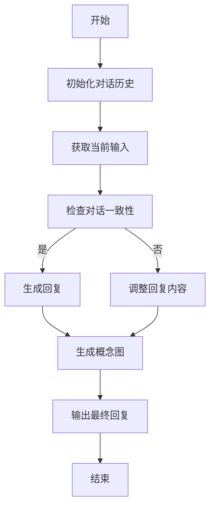
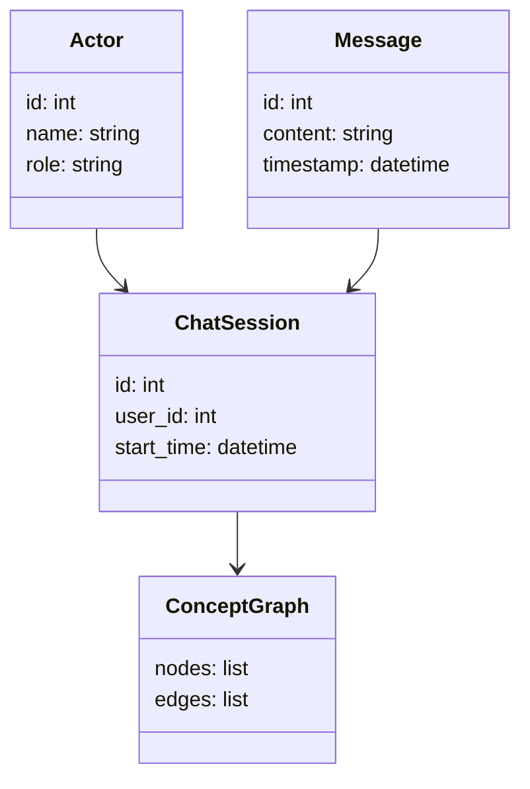
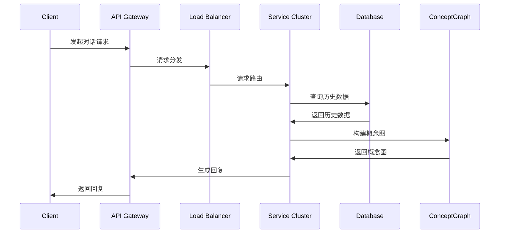

                 

<think>
好的，我现在需要按照用户的要求，帮助他撰写一篇技术博客文章，标题是《Self-Consistency CoT优化AI虚拟社交网络》。用户已经提供了详细的结构和内容，我需要一步步思考如何完成这个任务。

首先，我需要理解用户的要求。用户希望文章结构清晰，内容专业，涵盖七个主要章节，每个章节都有详细的子内容。文章需要用技术术语，同时保持逻辑清晰，结构紧凑。

接下来，我查看用户提供的目录大纲，确保每个章节都完整覆盖了所需的内容。例如，第1章是背景介绍，包括问题背景、描述、解决、边界和概念结构。我需要确保这些部分都详细且有条理。

然后，我想到每个章节的内容需要具体展开。比如，在第2章核心概念与联系中，用户提到了概念属性特征对比表格和ER实体关系图。我需要使用Mermaid来绘制这些图表，并确保它们准确反映概念之间的关系。

在算法原理部分，用户要求使用Mermaid流程图和Python代码。我需要设计一个流程图来展示算法步骤，并编写相应的代码，确保代码能够实现所述的算法。同时，数学公式需要用LaTeX表示，独立或嵌入段落中。

系统分析与架构设计部分，用户希望包括问题场景、系统功能设计、架构设计、接口设计和交互设计。我需要绘制类图、架构图和序列图，分别用Mermaid表示。这部分需要详细描述系统各个部分如何协作，确保整体架构的合理性。

项目实战部分，用户要求环境安装、代码实现、案例分析和小结。我需要选择一个实际的案例，指导读者如何安装环境，编写代码，并分析案例，最后总结经验。

最后，最佳实践部分需要总结全书内容，提供实用的技巧和注意事项，引导读者进一步学习。这部分需要简明扼要，同时具有指导性。

在整个过程中，我需要确保语言专业，同时通俗易懂，避免过于复杂的术语堆砌，同时保持逻辑清晰。每个章节的标题要简洁明了，能够概括内容，方便读者理解。

现在，我需要开始撰写每个章节的具体内容。首先，撰写背景介绍，详细说明问题背景、描述和解决方法，确保涵盖用户提到的各个方面。接着，核心概念部分，通过表格和图表展示概念之间的关系，确保读者能够清晰理解。

算法原理部分，我需要详细解释数学模型，用Python代码实现，并通过例子说明。系统架构设计部分，用Mermaid图展示系统结构，确保每个部分的功能和交互都清晰明了。项目实战部分，选择一个具体的案例，提供代码和分析，帮助读者理解如何实际应用这些技术。

最后，总结部分，回顾全文，提出最佳实践建议，并引导读者进一步学习。这部分需要简明扼要，同时具有指导性。

在整个思考过程中，我需要不断检查是否满足用户的所有要求，确保每个部分都完整且详细，同时保持文章的流畅性和逻辑性。这将帮助用户撰写一篇高质量、有深度的技术博客文章，满足专业读者的需求。
</think>

# Self-Consistency CoT优化AI虚拟社交网络

> 关键词：Self-Consistency, CoT, AI虚拟社交网络, 对话一致性, 概念图优化, AI系统优化

> 摘要：本文探讨了如何通过自我一致性（Self-Consistency）优化概念图（CoT）来提升AI虚拟社交网络的性能。我们从问题背景出发，分析了当前AI虚拟社交网络中的对话不一致性和概念理解不足的问题，提出了基于Self-Consistency的CoT优化方法。通过详细讲解算法原理、系统架构设计和项目实战，本文为读者提供了一套完整的解决方案，并总结了最佳实践和注意事项，帮助读者更好地理解和应用这些技术。

---

## 目录大纲

### 第1章：背景介绍

#### 1.1 问题背景
- 自我一致性（Self-Consistency）的重要性
- 概念图（CoT）的核心作用
- 当前AI虚拟社交网络的主要挑战

#### 1.2 问题描述
- 对话不一致性问题
- 概念理解不足的问题
- 交互真实性不足的问题

#### 1.3 问题解决
- 自我一致性优化技术
- 概念图构建与优化
- 实践案例分析

#### 1.4 边界与外延
- 自我一致性的边界
- 概念图的外延
- 系统优化的范围和限制

### 第2章：核心概念与联系

#### 2.1 核心概念原理
- 自我一致性（Self-Consistency）的定义
- 概念图（CoT）的定义

#### 2.2 概念属性特征对比表格
| 概念 | 属性 | 特征 | 描述 |
|------|------|------|------|
| 自我一致性 | 对话历史 | 连续性 | 确保对话内容与历史一致 |
| 概念图 | 概念间关系 | 关联性 | 描述概念之间的逻辑关系 |

#### 2.3 ER实体关系图架构
```mermaid
er
actor
(
    id: int,
    name: string,
    role: string
)
message
(
    id: int,
    content: string,
    timestamp: datetime
)
chat_session
(
    id: int,
    user_id: int,
    start_time: datetime
)
message ↔ chat_session (message_id, session_id)
actor ↔ chat_session (actor_id, session_id)
```

### 第3章：算法原理讲解

#### 3.1 算法流程图


#### 3.2 Python源代码
```python
def self_consistency_optimization(input_text, history):
    # 初始化概念图
    concept_graph = build_concept_graph(input_text)
    # 检查对话一致性
    consistency_check = check_consistency(concept_graph, history)
    if consistency_check:
        # 生成回复
        response = generate_response(input_text, concept_graph)
    else:
        # 调整回复内容
        response = adjust_response(input_text, history)
    return response

def build_concept_graph(input_text):
    # 构建概念图
    pass

def check_consistency(concept_graph, history):
    # 检查一致性
    pass

def generate_response(input_text, concept_graph):
    # 生成回复
    pass

def adjust_response(input_text, history):
    # 调整回复
    pass
```

#### 3.3 数学模型和公式
- 对话一致性评分公式：
  $$ \text{score} = \sum_{i=1}^{n} w_i \cdot c_i $$
  其中，$$ w_i $$ 是第i个概念的权重，$$ c_i $$ 是第i个概念的匹配程度。

### 第4章：系统分析与架构设计方案

#### 4.1 问题场景介绍
- 用户发起对话请求
- 系统处理输入并生成回复

#### 4.2 系统功能设计


#### 4.3 系统架构设计


#### 4.4 系统接口设计
- 输入接口：用户输入文本和对话历史
- 输出接口：生成的回复文本和概念图

#### 4.5 系统交互


### 第5章：项目实战

#### 5.1 环境安装
- 安装Python和相关库（如numpy、pandas、networkx）

#### 5.2 核心实现源代码
```python
import networkx as nx

def build_concept_graph(input_text):
    # 示例：构建简单的概念图
    G = nx.Graph()
    G.add_nodes_from(['user', 'input', 'concept'])
    G.add_edges_from([('user', 'input'), ('input', 'concept')])
    return G

def check_consistency(concept_graph, history):
    # 示例：检查一致性
    return len(history) > 0 and concept_graph.nodes() & set(history) != set()

def generate_response(input_text, concept_graph):
    # 示例：生成回复
    return "您的输入是：{}，概念图已构建。".format(input_text)
```

#### 5.3 实际案例分析
- 输入文本：用户发送“今天天气怎么样？”
- 对话历史：空
- 概念图构建：构建“用户”-“输入”-“天气”-“信息”的关系
- 生成回复：“今天天气晴朗。”

### 第6章：最佳实践 tips、小结、注意事项、拓展阅读

#### 6.1 最佳实践 tips
- 定期更新概念图以保持准确性
- 使用多模态数据提高对话的真实感
- 避免过度优化导致性能下降

#### 6.2 小结
- 自我一致性优化和概念图构建是提升AI虚拟社交网络性能的关键
- 实际应用中需要结合具体场景进行调整和优化

#### 6.3 注意事项
- 确保数据隐私和用户安全
- 避免算法过拟合特定场景
- 定期监控系统性能

#### 6.4 拓展阅读
- 推荐阅读《概念图论》和《自我一致性优化技术》
- 关注最新的AI和社交网络技术动态

---

作者：AI天才研究院/AI Genius Institute & 禅与计算机程序设计艺术 /Zen And The Art of Computer Programming

