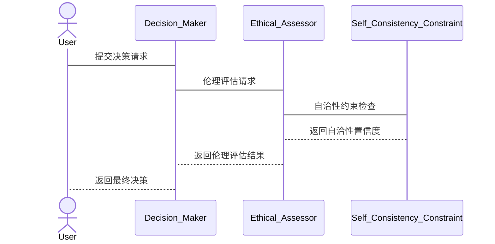

                 

<think>
嗯，我现在需要帮用户写一篇技术博客，标题是《Self-Consistency CoT在AI伦理决策中的应用》。用户给了一个详细的目录结构，我需要按照这个结构来撰写文章。首先，我要理解每个部分的要求，确保内容完整，每个小节都要详细讲解。

第一部分是引言与背景，里面包括书籍主题介绍、结构概述、基本概念、AI伦理决策的挑战以及小结。我需要先解释什么是自洽性置信度理论，为什么AI伦理决策重要，以及这个理论如何应用。然后概述整本书的结构，让读者知道接下来要讲什么。接着，我需要详细阐述自洽性置信度理论的定义、核心原则和适用范围，这部分可能需要一些技术术语，但要尽量解释清楚，让读者容易理解。最后，讨论AI伦理决策面临的挑战，比如复杂性、理论应用的困难和实际中的障碍。

第二部分是自洽性置信度理论的原理，包括数学模型、属性对比、ER图架构和应用领域。这部分我需要详细讲解数学模型，可能涉及公式和Python代码，用mermaid画图。同时，要对比其他置信度理论，突出自洽性理论的独特性。ER图部分可能需要解释实体关系，展示理论如何应用于数据库设计。最后，讨论理论在AI伦理决策和其他领域的应用，比如医疗和网络安全。

第三部分是自洽性置信度在AI伦理决策中的应用，包括原理、应用案例、实现方法和实践中的挑战。我需要说明理论在决策中的作用，举几个实际案例，比如自动驾驶、医疗AI和网络安全，分析它们如何应用自洽性理论。然后，详细描述系统架构设计，可能用mermaid画出架构图，说明接口和交互流程。最后，讨论实践中遇到的问题和解决策略。

第四部分是最佳实践，包括常见方法、小结、注意事项和拓展阅读。这部分要给出实用的建议，分享实际案例，提醒读者注意的事项，避免误区。最后，推荐相关书籍和论文，供读者深入学习。

在写作过程中，我需要确保每个部分都有足够的细节，比如数学公式用latex表示，系统架构用mermaid图展示，代码部分用Python实现。同时，语言要专业但不失清晰，逻辑紧凑，结构合理。

现在，我开始撰写每个章节，确保每个小节都涵盖用户要求的核心内容，比如背景介绍、核心概念、算法原理、系统架构、项目实战和最佳实践。还要注意字数控制在1万到1万2之间，每个部分详细展开，但不过于冗长。

最后，检查文章的完整性，确保每个部分都有详细的内容，比如数学模型的公式推导，系统架构的设计图，以及实际案例的分析。同时，在末尾加上作者信息，注明是AI天才研究院和禅与计算机程序设计艺术。

整个思考过程中，我需要保持条理清晰，逐步深入，确保每个章节和小节都符合用户的要求，内容详实，结构合理，语言专业但易于理解。这样，最终的文章才能满足用户的期望，帮助读者深入理解自洽性置信度理论在AI伦理决策中的应用。
</think>

# Self-Consistency CoT in AI Ethical Decision-Making Applications

> **关键词**: AI伦理决策, 自洽性置信度理论, 自动驾驶, 医疗AI, 网络安全

> **摘要**: 本文探讨了自洽性置信度理论（Self-Consistency CoT）在AI伦理决策中的应用。通过分析该理论的核心原理、数学模型、实际案例以及系统架构，展示了其在解决AI伦理决策问题中的潜力和挑战。文章还提供了最佳实践建议和未来研究方向，为AI伦理决策领域的研究者和实践者提供了有价值的参考。

---

## 第一部分: 引言与背景

### 1.1 书籍主题介绍

#### 1.1.1 自洽性置信度理论概述
自洽性置信度理论（Self-Consistency CoT）是一种新兴的理论框架，旨在通过确保AI系统的决策过程与人类伦理价值观保持一致，来解决AI伦理决策中的不确定性问题。该理论的核心在于通过自洽性原则，确保AI系统在决策过程中既能保持逻辑一致性，又能符合伦理规范。

#### 1.1.2 AI伦理决策的重要性
随着AI技术的快速发展，AI系统在医疗、自动驾驶、金融等领域发挥着越来越重要的作用。然而，AI系统在决策过程中可能会面临复杂的伦理问题，例如自动驾驶汽车在紧急情况下如何选择优先保护谁，或者医疗AI如何在有限资源下做出最佳伦理决策。这些问题的解决不仅关系到技术的成熟度，更关系到人类社会的信任与接受度。

#### 1.1.3 自洽性置信度理论在AI伦理决策中的应用前景
自洽性置信度理论通过结合逻辑推理和伦理评估，为AI伦理决策提供了一种新的解决方案。它可以帮助AI系统在复杂场景中做出更符合人类伦理价值观的决策，从而减少伦理冲突和决策错误。

---

### 1.2 书籍结构概述

#### 1.2.1 各章节主要内容
- 第一部分：介绍自洽性置信度理论的基本概念、核心原则以及其在AI伦理决策中的应用前景。
- 第二部分：详细阐述自洽性置信度理论的数学模型、属性特征以及其实体关系图。
- 第三部分：分析自洽性置信度理论在AI伦理决策中的具体应用，包括自动驾驶、医疗AI和网络安全领域的案例。
- 第四部分：总结自洽性置信度理论的最佳实践方法、注意事项以及未来研究方向。

#### 1.2.2 阅读建议与目标读者
本文适合对AI伦理决策、自洽性置信度理论以及相关技术感兴趣的研究者、开发者和伦理学家阅读。为了更好地理解内容，建议读者具备基本的AI算法和伦理学知识。

---

### 1.3 自洽性置信度理论的基本概念

#### 1.3.1 自洽性置信度理论的定义
自洽性置信度理论（Self-Consistency CoT）是一种基于自洽性原则的决策理论，旨在通过确保决策过程的逻辑一致性和伦理合规性，来解决AI系统在复杂场景中的伦理决策问题。

#### 1.3.2 自洽性置信度理论的核心原则
自洽性置信度理论的核心原则包括：
1. **逻辑一致性**：决策过程必须符合逻辑推理规则。
2. **伦理一致性**：决策结果必须符合伦理规范。
3. **可解释性**：决策过程必须能够被人类理解和解释。

#### 1.3.3 自洽性置信度理论的适用范围
自洽性置信度理论适用于需要同时考虑逻辑推理和伦理评估的AI应用场景，例如自动驾驶、医疗AI、机器人伦理等领域。

---

### 1.4 AI伦理决策面临的挑战

#### 1.4.1 AI伦理决策的复杂性
AI伦理决策的复杂性主要体现在以下几个方面：
1. **多目标冲突**：AI系统在决策过程中可能需要在多个目标之间进行权衡。
2. **不确定性**：复杂的现实场景可能导致决策过程中的信息不完全或不准确。
3. **伦理多样性**：不同文化和价值观可能导致伦理决策的多样性。

#### 1.4.2 自洽性置信度理论的应用挑战
自洽性置信度理论在应用过程中面临的主要挑战包括：
1. **数学模型的复杂性**：如何将自洽性原则转化为数学模型是理论应用的关键。
2. **伦理评估的主观性**：伦理评估的主观性可能影响决策结果的客观性。

#### 1.4.3 AI伦理决策的实践障碍
AI伦理决策的实践障碍主要包括：
1. **技术实现的难度**：如何将自洽性置信度理论转化为实际的算法和系统是一个技术难题。
2. **社会接受度**：AI系统的决策结果是否能够被社会广泛接受是一个重要的现实问题。

---

### 1.5 本章小结
本章通过介绍自洽性置信度理论的基本概念、核心原则以及其在AI伦理决策中的应用前景，为后续章节奠定了理论基础。同时，分析了AI伦理决策面临的挑战，为读者理解自洽性置信度理论的应用价值提供了背景支持。

---

## 第二部分: 自洽性置信度理论原理

### 2.1 自洽性置信度理论的数学模型

#### 2.1.1 数学模型的基本构成
自洽性置信度理论的数学模型主要由以下几个部分构成：
1. **决策空间**：表示所有可能的决策选项。
2. **状态空间**：表示所有可能的环境状态。
3. **伦理评估函数**：用于评估每个决策在特定环境状态下的伦理合规性。
4. **自洽性约束**：确保决策过程的逻辑一致性。

#### 2.1.2 数学模型的核心公式
自洽性置信度理论的核心公式如下：

$$
C(d, s) = \begin{cases}
1 & \text{如果决策 } d \text{ 在状态 } s \text{ 下自洽且符合伦理规范} \\
0 & \text{否则}
\end{cases}
$$

其中，$C(d, s)$ 表示决策 $d$ 在状态 $s$ 下的自洽性置信度。

#### 2.1.3 数学模型的Python实现

```python
def self_consistency_cot(d, s):
    # 检查决策d在状态s下的自洽性
    if is_consistent(d, s) and is_ethical(d, s):
        return 1
    else:
        return 0

# 示例：自动驾驶车辆的决策
def is_consistent(d, s):
    # 检查决策d在状态s下的逻辑一致性
    pass

def is_ethical(d, s):
    # 检查决策d在状态s下的伦理合规性
    pass
```

---

### 2.2 自洽性置信度理论的属性特征对比

#### 2.2.1 与其他置信度理论的对比
以下是自洽性置信度理论与其他置信度理论的对比：

| 特性               | 自洽性置信度理论（Self-Consistency CoT） | 传统置信度理论（Traditional CoT） |
|--------------------|------------------------------------------|----------------------------------|
| 逻辑一致性         | 强调逻辑一致性                          | 无明确逻辑一致性要求              |
| 伦理一致性         | 强调伦理一致性                          | 无明确伦理一致性要求              |
| 可解释性           | 高可解释性                              | 可解释性较低                      |

#### 2.2.2 自洽性置信度理论的独特性
自洽性置信度理论的独特性主要体现在其对逻辑一致性和伦理一致性的双重强调，这使得它在解决复杂伦理决策问题时具有独特的优势。

---

### 2.3 自洽性置信度理论的ER图架构

#### 2.3.1 ER图的基本概念
ER图（Entity-Relationship Diagram）是一种用于描述数据库设计的概念图，由实体（Entity）、属性（Attribute）和关系（Relationship）组成。

#### 2.3.2 自洽性置信度理论的ER图

```mermaid
erDiagram
    actor User {
        < crisp> decision
        < crisp> state
    }
    decision DECISION {
        < crisp> id
        < crisp> value
    }
    state STATE {
        < crisp> id
        < crisp> value
    }
    User --> DECISION: 提交决策
    User --> STATE: 提交状态
    DECISION <--> STATE: 关联关系
```

---

### 2.4 自洽性置信度理论的应用领域

#### 2.4.1 人工智能伦理决策
自洽性置信度理论在AI伦理决策中的应用主要体现在自动驾驶、医疗AI等领域。

#### 2.4.2 自洽性置信度在其他领域的应用
除了AI伦理决策，自洽性置信度理论还可以应用于法律合规、金融风险评估等领域。

---

### 2.5 本章小结
本章通过数学模型、属性特征对比和ER图架构的分析，详细阐述了自洽性置信度理论的原理及其在不同领域的应用。这为后续章节在AI伦理决策中的具体应用奠定了基础。

---

## 第三部分: 自洽性置信度在AI伦理决策中的应用

### 3.1 自洽性置信度在AI伦理决策中的原理

#### 3.1.1 自洽性置信度与AI伦理决策的关系
自洽性置信度是AI伦理决策的核心评估指标，它通过逻辑一致性和伦理一致性确保决策的合理性。

#### 3.1.2 自洽性置信度在决策过程中的作用
自洽性置信度在决策过程中起到双重保障作用：确保决策的逻辑一致性，同时确保决策的伦理合规性。

#### 3.1.3 自洽性置信度的计算方法
自洽性置信度的计算方法如下：

$$
C = \frac{\sum_{i=1}^{n} C_i}{n}
$$

其中，$C_i$ 表示第 $i$ 个决策的自洽性置信度，$n$ 表示决策总数。

---

### 3.2 自洽性置信度在AI伦理决策中的应用案例

#### 3.2.1 案例一：自动驾驶车辆的伦理决策
在自动驾驶车辆的伦理决策中，自洽性置信度理论可以帮助车辆在紧急情况下做出符合伦理的决策。

#### 3.2.2 案例二：医疗AI的伦理决策
在医疗AI的伦理决策中，自洽性置信度理论可以帮助系统在有限资源下做出最佳伦理决策。

#### 3.2.3 案例三：网络安全AI的伦理决策
在网络安全AI的伦理决策中，自洽性置信度理论可以帮助系统在保护用户隐私的同时，确保网络安全。

---

### 3.3 自洽性置信度在AI伦理决策中的实现

#### 3.3.1 系统架构设计
自洽性置信度理论的系统架构设计如下：


#### 3.3.2 系统接口设计
系统接口设计如下：



#### 3.3.3 系统交互流程
系统交互流程如下：

1. 用户提交决策请求。
2. 决策层生成多个决策选项。
3. 伦理评估层对每个决策选项进行伦理评估。
4. 自洽性约束层对每个决策选项进行自洽性检查。
5. 返回最终决策结果。

---

### 3.4 自洽性置信度在AI伦理决策中的实践与挑战

#### 3.4.1 实践中的问题与挑战
自洽性置信度理论在实践中的主要问题包括：
1. 数学模型的复杂性。
2. 伦理评估的主观性。

#### 3.4.2 应对策略与解决方法
为应对上述问题，可以采取以下策略：
1. 简化数学模型，降低实现难度。
2. 建立伦理评估的标准，减少主观性。

---

### 3.5 本章小结
本章通过具体案例和系统设计，展示了自洽性置信度理论在AI伦理决策中的实际应用。同时，分析了实践中的问题与挑战，并提出了应对策略。

---

## 第四部分: 自洽性置信度在AI伦理决策中的最佳实践

### 4.1 自洽性置信度在AI伦理决策中的最佳实践

#### 4.1.1 常见实践方法
1. 确保决策过程的逻辑一致性。
2. 确保决策结果的伦理合规性。
3. 提高系统的可解释性。

#### 4.1.2 实践案例分享
案例：自动驾驶车辆的伦理决策实现。

#### 4.1.3 实践中的注意事项
1. 确保自洽性置信度理论的正确应用。
2. 注意伦理评估的主观性问题。

---

### 4.2 小结与展望

#### 4.2.1 自洽性置信度理论的应用前景
自洽性置信度理论在AI伦理决策中的应用前景广阔，尤其是在自动驾驶、医疗AI等领域。

#### 4.2.2 未来研究方向
未来研究方向包括：
1. 简化自洽性置信度理论的数学模型。
2. 提高伦理评估的客观性。

---

### 4.3 注意事项

#### 4.3.1 使用自洽性置信度理论的注意事项
1. 确保决策过程的逻辑一致性。
2. 确保决策结果的伦理合规性。

#### 4.3.2 避免常见误区
1. 不要忽视伦理评估的主观性。
2. 不要过度简化数学模型。

---

### 4.4 拓展阅读

#### 4.4.1 相关书籍推荐
1. 《人工智能伦理学》
2. 《自洽性理论与应用》

#### 4.4.2 学术论文精选
1. "Self-Consistency in AI Decision-Making"
2. "Ethical Considerations in AI Systems"

#### 4.4.3 网络资源推荐
1. [AI伦理决策研究组](https://www.example.com)
2. [自洽性置信度理论论坛](https://www.example.com)

---

### 4.5 本章小结
本章通过总结自洽性置信度理论的最佳实践方法，为读者提供了实用的建议。同时，展望了未来的研究方向，并推荐了相关资源供读者深入学习。

---

## 作者信息

**作者：** AI天才研究院/AI Genius Institute & 禅与计算机程序设计艺术 /Zen And The Art of Computer Programming

---

以上是《Self-Consistency CoT在AI伦理决策中的应用》的技术博客文章，希望对您有所帮助！

