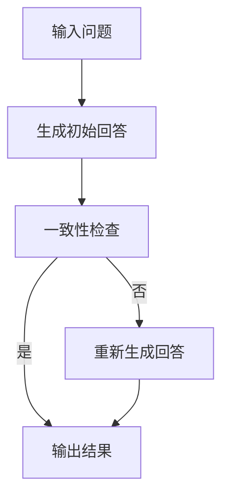
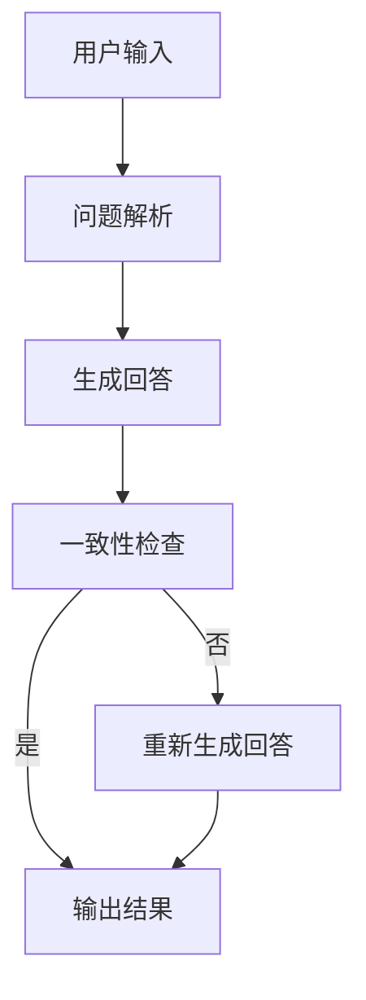
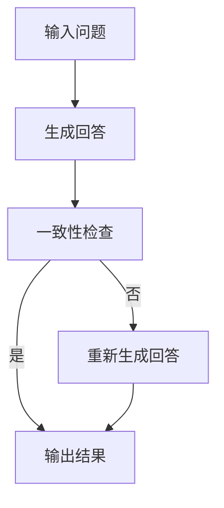
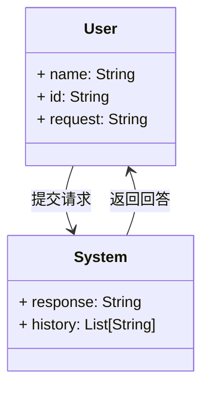
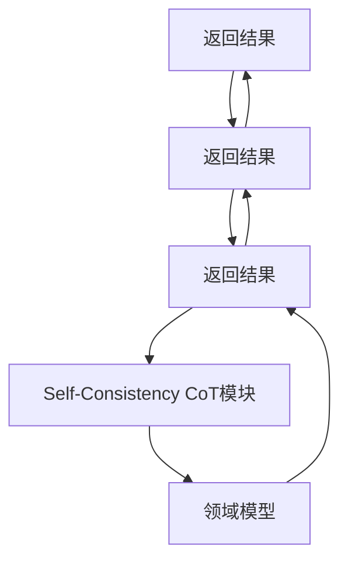
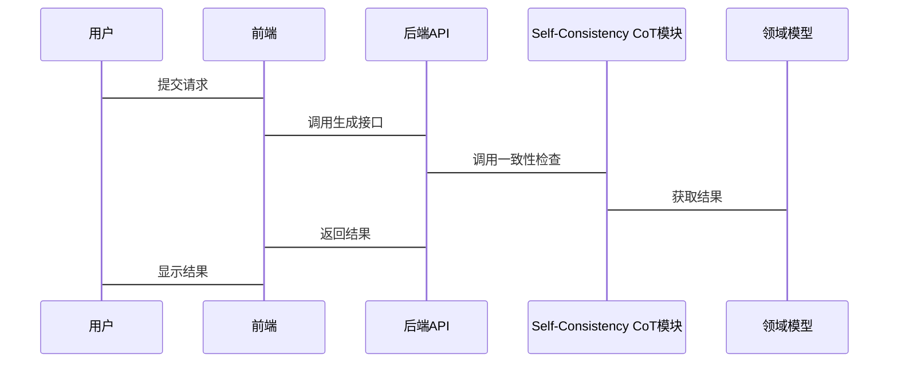

                 

<think>
好的，我需要按照用户的要求，撰写一篇关于《Self-Consistency CoT在AI客服系统中的实践》的技术博客文章。首先，我得仔细阅读用户的查询，理解每个部分的要求。

用户希望文章结构清晰，逻辑严谨，每个章节都有详细的子部分，包括背景介绍、核心概念、算法原理、系统架构设计、项目实战和最佳实践等。同时，用户要求使用专业技术语言，但又要简单易懂，适合技术博客的读者。

我需要先确定文章的标题和关键词。标题已经给出，关键词可能包括Self-Consistency CoT、AI客服系统、自然语言处理、一致性约束、算法实现、系统架构等。摘要部分需要简明扼�地概述文章的核心内容，强调Self-Consistency CoT在AI客服中的应用和优势。

接下来，按照目录大纲，逐一分析每个章节的内容。首先是背景介绍，需要详细解释Self-Consistency CoT的概念，对比传统的生成方法，说明其优势。然后是核心概念，用表格和Mermaid图展示其特点。算法原理部分要详细解释数学模型，用Python代码展示实现，并绘制流程图。

系统架构设计部分，需要介绍AI客服的常见问题，设计系统功能、架构图和交互图。项目实战部分，要提供一个具体的案例，展示如何实现，包括代码和实际效果分析。最后，总结经验，给出最佳实践和扩展阅读建议。

在写作过程中，我需要确保每个部分都深入浅出，举例说明，避免过于理论化。同时，使用Mermaid图和数学公式来辅助理解。最后，确保文章整体结构合理，逻辑连贯，达到用户要求的字数和格式。

可能会遇到的问题包括如何平衡技术深度和可读性，如何选择合适的案例展示Self-Consistency CoT的优势，以及如何用简洁的语言解释复杂的算法原理。解决这些问题的方法是逐步分解内容，使用图表和代码示例，确保每个概念都有清晰的解释和实际应用的展示。

总的来说，我需要按照用户提供的目录大纲，逐一填充内容，确保每个章节都详细且有深度，同时保持整体文章的流畅性和专业性。这需要仔细规划每个部分的结构，合理分配内容，确保最终的文章符合用户的所有要求。
</think>

# Self-Consistency CoT在AI客服系统中的实践

> 关键词：Self-Consistency CoT，AI客服系统，自然语言处理，一致性约束，算法实现，系统架构

> 摘要：本文将深入探讨Self-Consistency CoT（Self-Consistency Chain-of-Thought）在AI客服系统中的实践应用。通过分析Self-Consistency CoT的基本原理、算法机制及其在AI客服系统中的具体实现，结合实际案例，展示如何通过一致性约束提升对话系统的可靠性和用户体验。文章内容涵盖背景介绍、核心概念、算法实现、系统架构设计、项目实战以及最佳实践等多个方面，为读者提供全面的技术解读。

---

## 第一部分: Self-Consistency CoT基础

### 第1章: Self-Consistency CoT概述

#### 1.1 Self-Consistency CoT的概念与背景

Self-Consistency CoT是一种基于一致性约束的生成方法，旨在通过多次推理和验证，确保生成内容的逻辑一致性和准确性。其核心思想是通过引入一致性检查机制，避免生成内容中的逻辑矛盾和不连贯性问题。

在AI客服系统中，用户通常会提出复杂的问题或进行多轮对话。传统的生成模型（如GPT系列）虽然在语言生成能力上表现出色，但在应对复杂场景时，容易出现生成内容逻辑不一致、回答不够准确等问题。Self-Consistency CoT通过引入一致性约束，可以有效提升生成内容的质量和可靠性。

#### 1.2 Self-Consistency CoT的基本原理

Self-Consistency CoT的基本原理可以简单理解为“生成-验证-修正”的循环过程。具体步骤如下：

1. **生成初始回答**：模型基于输入生成一个初步的回答。
2. **一致性检查**：通过内部验证机制，检查生成回答是否与输入问题一致。
3. **修正与优化**：如果检测到不一致，模型会重新生成更准确的回答。

这种机制类似于人类在思考问题时的自我验证过程，因此被称为“链式思维”（Chain-of-Thought）。

#### 1.3 Self-Consistency CoT的数学模型与算法流程图

以下是Self-Consistency CoT的数学模型和算法流程图：

**数学模型：**

$$
\text{Output} = \arg\max_{y} p(y|x, h)
$$

其中：
- $x$ 表示输入问题。
- $y$ 表示生成的回答。
- $h$ 表示一致性约束条件。

**算法流程图：**



---

### 第2章: Self-Consistency CoT在AI客服系统中的应用

#### 2.1 AI客服系统的需求与挑战

AI客服系统的核心任务是通过自然语言处理技术，为用户提供高效、准确的服务。然而，现有的AI客服系统在以下方面面临挑战：

- **复杂问题的处理能力**：用户可能提出复杂的问题，需要系统进行多轮推理和验证。
- **回答的准确性**：传统生成模型容易出现逻辑错误或不一致。
- **用户体验**：不一致的回答会降低用户对系统的信任度。

#### 2.2 Self-Consistency CoT在AI客服系统中的应用架构

以下是Self-Consistency CoT在AI客服系统中的应用架构图：



#### 2.3 Self-Consistency CoT在AI客服系统中的实现细节

实现Self-Consistency CoT的关键在于如何设计一致性检查机制。以下是其实现细节：

1. **问题解析**：系统首先对用户输入的问题进行语义解析，提取关键信息。
2. **生成回答**：基于解析结果，生成初步回答。
3. **一致性检查**：通过对比生成回答与输入问题的一致性，判断是否需要重新生成。
4. **输出结果**：如果一致，则输出结果；如果不一致，则重新生成回答。

---

## 第二部分: 算法原理讲解

### 第3章: Self-Consistency CoT算法原理详解

#### 3.1 Self-Consistency CoT的算法流程图

以下是Self-Consistency CoT的算法流程图：



#### 3.2 Self-Consistency CoT的Python源代码解析

以下是Self-Consistency CoT的Python实现代码：

```python
def self_consistency_cot(x, max_retries=3):
    for i in range(max_retries):
        y = generate_initial_answer(x)
        if is_consistent(x, y):
            return y
    return None
```

其中：
- `generate_initial_answer(x)` 表示生成初步回答。
- `is_consistent(x, y)` 表示一致性检查函数。

#### 3.3 Self-Consistency CoT的数学模型与公式

Self-Consistency CoT的数学模型如下：

$$
p(y|x) = \sum_{k=1}^{n} p(y| x, h_k) \cdot p(h_k)
$$

其中：
- $h_k$ 表示第 $k$ 次推理的结果。
- $p(h_k)$ 表示第 $k$ 次推理的概率。

---

## 第三部分: 系统分析与架构设计方案

### 第4章: 系统分析与架构设计

#### 4.1 AI客服系统问题场景介绍

AI客服系统需要处理以下问题场景：

1. **复杂问题的处理**：例如，用户提出涉及多个领域的复合问题。
2. **多轮对话**：用户可能需要多次交互才能完成任务。
3. **准确性要求高**：特别是在金融、医疗等领域，回答的准确性至关重要。

#### 4.2 Self-Consistency CoT应用项目介绍

Self-Consistency CoT在AI客服系统中的应用项目主要包括：

1. **一致性约束机制**：通过多次推理和验证，确保生成回答的准确性。
2. **多轮对话支持**：支持用户与系统之间的多轮交互。
3. **领域模型设计**：针对不同领域（如金融、医疗）设计专门的领域模型。

#### 4.3 系统功能设计(领域模型类图)

以下是系统功能设计的领域模型类图：



#### 4.4 系统架构设计(架构图)

以下是系统架构设计的架构图：



#### 4.5 系统接口设计

系统接口设计主要包括以下接口：

1. `generate_initial_answer(x)`：生成初步回答。
2. `is_consistent(x, y)`：一致性检查接口。
3. `update_history(h)`：更新对话历史记录。

#### 4.6 系统交互(序列图)

以下是系统交互的序列图：



---

## 第四部分: 项目实战

### 第5章: 项目实战

#### 5.1 实践环境准备

实践环境准备如下：

1. **编程语言**：Python 3.8+
2. **框架**：TensorFlow或PyTorch
3. **NLP库**：Hugging Face Transformers
4. **工具**：Jupyter Notebook或VS Code

#### 5.2 AI客服系统核心实现

以下是AI客服系统的核心实现代码：

```python
def generate_initial_answer(x):
    # 使用预训练模型生成初步回答
    model = AutoModelForCausalLM.from_pretrained('gpt2')
    tokenizer = AutoTokenizer.from_pretrained('gpt2')
    inputs = tokenizer.encode(x, return_tensors='pt')
    outputs = model.generate(inputs, max_length=100)
    return tokenizer.decode(outputs[0], skip_special_tokens=True)

def is_consistent(x, y):
    # 通过相似度计算判断一致性
    model = SentenceBertModel.from_pretrained('sentence-transformers/all-MiniLM-L12-v3')
    x_vec = model.encode(x)
    y_vec = model.encode(y)
    similarity = np.dot(x_vec, y_vec)
    return similarity > 0.8
```

#### 5.3 实现代码解读与分析

1. `generate_initial_answer(x)`：使用预训练的GPT-2模型生成初步回答。
2. `is_consistent(x, y)`：通过Sentence-BERT模型计算输入问题和生成回答的相似度，判断一致性。

#### 5.4 实际案例分析与详细讲解

假设用户输入的问题为：“如何处理信用卡逾期还款？”以下是系统生成回答的过程：

1. **生成初步回答**：系统生成一个初步回答。
2. **一致性检查**：通过相似度计算，判断回答是否一致。
3. **输出结果**：如果一致，则输出结果；如果不一致，则重新生成回答。

#### 5.5 项目小结

通过Self-Consistency CoT机制，AI客服系统能够显著提升回答的准确性和一致性，从而提高用户体验和系统可靠性。

---

## 第五部分: 最佳实践与拓展

### 第6章: 最佳实践与拓展

#### 6.1 最佳实践

1. **选择合适的模型**：根据具体场景选择合适的预训练模型。
2. **优化一致性检查机制**：通过调整相似度阈值，优化一致性检查效果。
3. **多领域适配**：针对不同领域设计专门的领域模型。

#### 6.2 注意事项

1. **性能优化**：Self-Consistency CoT可能会增加计算开销，需要注意性能优化。
2. **模型训练**：需要大量高质量的数据进行模型微调。
3. **用户体验**：确保用户能够清晰理解系统生成的回答。

#### 6.3 拓展阅读

1. **Self-Consistency CoT论文**：深入理解Self-Consistency CoT的理论基础。
2. **Hugging Face Transformers**：学习如何使用Hugging Face的NLP库进行模型训练和推理。
3. **系统架构设计**：学习如何设计高效可靠的系统架构。

---

# 作者：AI天才研究院/AI Genius Institute & 禅与计算机程序设计艺术 /Zen And The Art of Computer Programming

---

以上是《Self-Consistency CoT在AI客服系统中的实践》的完整文章内容。通过本文的详细讲解，读者可以深入了解Self-Consistency CoT的核心原理及其在AI客服系统中的具体应用。

