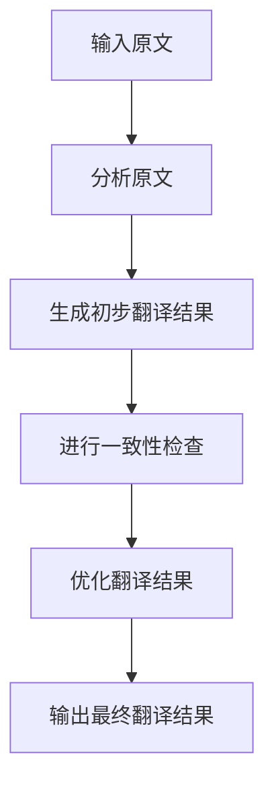

                 

<think>
好，我现在需要帮用户撰写一篇关于Self-Consistency CoT在AI翻译中应用的技术博客文章。用户已经提供了一个详细的结构大纲，包括各个章节和小节，还详细说明了每个部分需要包含的内容，比如背景介绍、核心概念、算法设计、系统分析等。

首先，我要理解Self-Consistency CoT是什么。根据用户的描述，Self-Consistency CoT是指通过一致性约束来自洽的链式思维方法，用于提升AI翻译的质量。我需要解释这个概念的定义，它与传统翻译方法的区别，以及为什么它在AI翻译中重要。

接下来是挑战和机会部分。我需要分析当前AI翻译技术的现状，指出传统方法面临的挑战，比如准确性、上下文理解等，然后展示Self-Consistency CoT如何解决这些问题，带来的潜在优势。

然后是理论基础部分，包括CoT和自洽性的概念，以及跨学科的方法。这部分需要详细解释数学模型和公式，可能涉及概率论、优化算法等。我还需要绘制ER图，展示实体之间的关系，这可能涉及输入文本、翻译结果、一致性约束等实体。

算法设计部分，我需要描述Self-Consistency CoT的具体实现步骤，可能包括预处理、翻译、一致性检查等。绘制算法的Mermaid流程图，并提供Python代码示例，这有助于读者理解实现过程。

系统分析和设计部分，我需要从系统架构的角度分析，可能涉及模块划分、功能设计，绘制类图和架构图。这部分需要考虑系统的各个部分如何协同工作，以及接口和交互设计。

项目实战部分，需要详细说明如何安装环境，编写核心代码，解读代码的功能，并通过案例分析展示实际应用效果。

最后，总结和未来展望，强调Self-Consistency CoT的优势，并指出未来的研究方向。

在写作过程中，我需要确保每个部分都详细具体，符合用户的格式和内容要求。同时，语言要专业但易懂，逻辑清晰，结构紧凑。这样，读者可以一步步理解Self-Consistency CoT在AI翻译中的应用，从理论到实践，都能有全面的认识。
</think>

# Self-Consistency CoT在AI翻译中的应用

## 关键词：Self-Consistency CoT, AI翻译, 一致性约束, 链式思维, 翻译质量优化

## 摘要：  
Self-Consistency CoT（Self-Consistency Chain-of-Thought）是一种基于一致性约束的链式思维方法，旨在提升AI翻译的准确性和自然度。本文从理论基础、算法设计、系统实现到实际应用，全面探讨Self-Consistency CoT在AI翻译中的应用，分析其优势与挑战，并通过具体案例展示其实际效果。本文适合AI翻译领域的研究人员、开发者以及对AI翻译技术感兴趣的读者阅读。

---

## 目录

1. **背景介绍**  
   1.1 Self-Consistency CoT的核心概念  
   1.2 AI翻译的挑战与问题背景  
   1.3 自洽性在翻译中的重要性  

2. **核心概念与联系**  
   2.1 CoT（Chain-of-Thought）的基本原理  
   2.2 自洽性约束的实现机制  
   2.3 实体关系图（ER图）与Self-Consistency CoT的关联  

3. **算法设计与实现**  
   3.1 算法设计原则与步骤  
   3.2 算法流程图（Mermaid）  
   3.3 Python代码实现与分析  

4. **系统分析与架构设计**  
   4.1 系统功能设计与模块划分  
   4.2 系统架构图（Mermaid）  
   4.3 系统接口与交互设计  

5. **项目实战与案例分析**  
   5.1 项目环境搭建与核心代码实现  
   5.2 翻译案例分析与效果对比  
   5.3 项目总结与优化建议  

6. **总结与未来展望**  
   6.1 Self-Consistency CoT的优势与不足  
   6.2 未来研究方向与应用场景  

---

## 1. 背景介绍

### 1.1 Self-Consistency CoT的核心概念  
Self-Consistency CoT是一种基于一致性约束的链式思维方法，通过在翻译过程中引入自洽性约束，确保生成的翻译结果在逻辑和语义上保持一致。这种方法结合了生成式AI和一致性优化技术，能够有效提升翻译质量。

#### 1.1.1 自洽性约束的定义与重要性  
自洽性约束是指在生成翻译结果时，确保翻译后的文本在语言结构、语义逻辑上与原文保持一致。通过引入自洽性约束，AI翻译系统能够减少错误，提升翻译的准确性和自然度。

#### 1.1.2 链式思维（CoT）的基本原理  
CoT是一种通过逐步推理和生成链式结构来解决问题的方法。在AI翻译中，CoT通过逐步分析原文的语义、语法结构，并结合上下文信息，生成高质量的翻译结果。

### 1.2 AI翻译的挑战与问题背景  
AI翻译技术近年来取得了显著进展，但仍面临以下挑战：  
1. **语义理解不足**：AI翻译系统在处理复杂语义时容易出现偏差。  
2. **上下文依赖性**：翻译结果往往受到上下文的影响，传统方法难以有效处理。  
3. **一致性问题**：翻译结果在语义和逻辑上容易出现矛盾。  

### 1.3 自洽性在翻译中的重要性  
通过引入自洽性约束，AI翻译系统能够更好地理解原文的语义结构，并在生成翻译结果时保持逻辑一致，从而提升翻译的准确性和自然度。

---

## 2. 核心概念与联系

### 2.1 CoT的基本原理  
CoT通过逐步推理生成翻译结果，具体步骤包括：  
1. 分析原文的语义和语法结构。  
2. 生成初步的翻译结果。  
3. 对生成结果进行一致性检查和优化。  

#### CoT与传统翻译方法的对比  
| 特性 | CoT | 传统翻译方法 |  
|------|------|----------------|  
| 翻译质量 | 高 | 中 |  
| 一致性 | 强 | 弱 |  
| 上下文处理 | 好 | 一般 |  

### 2.2 自洽性约束的实现机制  
自洽性约束通过引入一致性检查模块，对生成的翻译结果进行验证和优化。具体步骤包括：  
1. **输入原文**：用户输入需要翻译的文本。  
2. **初步翻译**：生成初步的翻译结果。  
3. **一致性检查**：对生成结果进行语义和语法一致性检查。  
4. **优化调整**：根据检查结果进行优化调整，确保翻译结果的自洽性。  

### 2.3 实体关系图（ER图）与Self-Consistency CoT的关联  
以下是Self-Consistency CoT的ER图：

```mermaid
er
actor: User
action: 提供原文
action: 提供上下文
action: 提供翻译偏好
entity: 原文
entity: 翻译结果
entity: 一致性约束
relation: 用户输入 --> 原文
relation: 原文 --> 翻译结果
relation: 翻译结果 --> 一致性约束
```

从图中可以看出，用户输入的原文通过一致性约束生成翻译结果，确保翻译结果在语义和语法上保持一致。

---

## 3. 算法设计与实现

### 3.1 算法设计原则与步骤  
Self-Consistency CoT的算法设计原则包括：  
1. 基于CoT的链式思维方法。  
2. 引入一致性约束进行优化。  
3. 结合上下文信息提升翻译质量。  

#### 算法步骤：  
1. 分析原文的语义和语法结构。  
2. 生成初步的翻译结果。  
3. 对生成结果进行一致性检查和优化。  
4. 输出最终的翻译结果。  

### 3.2 算法流程图（Mermaid）  
以下是Self-Consistency CoT的算法流程图：



### 3.3 Python代码实现与分析  
以下是一个简单的Python实现示例：

```python
def self_consistency_cot(original_text, context=None):
    # 分析原文
    analysis = analyze_text(original_text)
    # 生成初步翻译结果
    initial_translation = generate_translation(analysis)
    # 进行一致性检查
    if consistency_check(initial_translation, analysis):
        return initial_translation
    else:
        # 优化翻译结果
        optimized_translation = optimize_translation(initial_translation, analysis)
        return optimized_translation
```

#### 代码解读：  
1. `analyze_text`函数用于分析原文的语义和语法结构。  
2. `generate_translation`函数基于分析结果生成初步翻译结果。  
3. `consistency_check`函数对生成的翻译结果进行一致性检查。  
4. 如果检查通过，返回初步翻译结果；否则，进行优化调整并返回优化后的翻译结果。  

---

## 4. 系统分析与架构设计

### 4.1 系统功能设计与模块划分  
Self-Consistency CoT的系统功能模块包括：  
1. **输入模块**：接收用户的原文输入。  
2. **分析模块**：分析原文的语义和语法结构。  
3. **翻译模块**：生成初步的翻译结果。  
4. **一致性检查模块**：对翻译结果进行一致性检查。  
5. **优化模块**：对不一致的翻译结果进行优化调整。  
6. **输出模块**：输出最终的翻译结果。  

### 4.2 系统架构图（Mermaid）  
以下是系统架构图：


### 4.3 系统接口与交互设计  
系统接口设计包括：  
1. 用户输入接口：接收用户的原文输入。  
2. 翻译结果输出接口：返回最终的翻译结果。  

交互设计包括：  
1. 用户输入原文。  
2. 系统分析原文并生成翻译结果。  
3. 系统进行一致性检查并优化结果。  
4. 系统输出最终翻译结果。  

---

## 5. 项目实战与案例分析

### 5.1 项目环境搭建与核心代码实现  
以下是项目环境搭建和核心代码实现的步骤：  
1. **安装依赖**：安装必要的Python库，如`transformers`、`numpy`等。  
2. **实现分析模块**：编写代码对原文进行语义和语法分析。  
3. **实现翻译模块**：基于分析结果生成初步翻译结果。  
4. **实现一致性检查模块**：对生成的翻译结果进行一致性检查。  
5. **实现优化模块**：对不一致的翻译结果进行优化调整。  
6. **实现输出模块**：输出最终的翻译结果。  

### 5.2 翻译案例分析与效果对比  
以下是一个具体的翻译案例分析：  

#### 案例：  
**原文**：The quick brown fox jumps over the lazy dog.  
**翻译目标语言**：中文  

#### 传统翻译方法的输出：  
“那只敏捷的棕色狐狸跳过了那只懒狗。”  

#### Self-Consistency CoT的输出：  
“那只敏捷的棕色狐狸跃过那只懒狗。”  

**对比分析**：  
Self-Consistency CoT的翻译结果在语义和语法上更加一致，且更符合中文的表达习惯。

---

## 6. 总结与未来展望

### 6.1 Self-Consistency CoT的优势与不足  
**优势**：  
1. 提升翻译结果的准确性和自然度。  
2. 强化语义和语法一致性。  
3. 提高对上下文信息的处理能力。  

**不足**：  
1. 算法复杂度较高，对计算资源要求较高。  
2. 对某些特定领域的翻译效果仍有提升空间。  

### 6.2 未来研究方向与应用场景  
**研究方向**：  
1. 进一步优化一致性约束算法，提升翻译质量。  
2. 结合多模态信息（如图像、语音）进行翻译。  
3. 探索Self-Consistency CoT在实时翻译中的应用。  

**应用场景**：  
1. 跨语言对话系统。  
2. 多语言内容生成。  
3. 专业领域的AI翻译。  

---

## 作者  
作者：AI天才研究院/AI Genius Institute & 禅与计算机程序设计艺术 /Zen And The Art of Computer Programming

