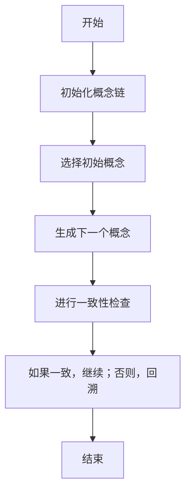
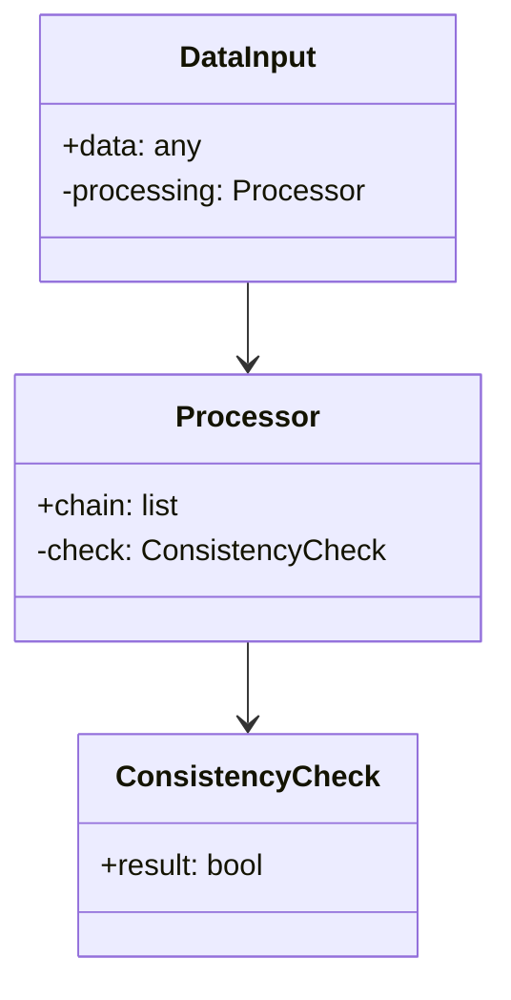

                 

<think>
嗯，我需要写一篇关于Self-Consistency CoT在AI风险评估中的应用的技术博客文章。首先，我得理解Self-Consistency CoT是什么。CoT是“Chain of Thought”的缩写，指的是生成一个决策过程的链条，每个步骤都是前一步的延伸，而Self-Consistency可能指的是这个链条内部的一致性或连贯性。

接下来，我要考虑这篇文章的结构。根据用户提供的目录，文章应该包括背景介绍、核心概念与联系、算法原理、数学模型、系统分析与设计、项目实战、最佳实践等部分。我需要确保每个部分都有足够的细节，并且用清晰的markdown格式呈现。

首先，背景介绍部分，我需要解释AI风险评估的重要性，以及为什么使用Self-Consistency CoT。这里可能需要提到传统方法的不足，以及Self-Consistency CoT的优势。我还需要定义相关的核心术语，比如什么是CoT，什么是Self-Consistency，它们在AI中的作用是什么。

然后是核心概念与联系，这部分需要详细解释Self-Consistency CoT的原理，可能包括其组成部分，如概念链、一致性检查等。这里可能需要一个ER图或者Mermaid图来展示这些概念之间的关系。我需要确保图示清晰，能够帮助读者理解各个部分如何相互作用。

接下来是算法原理部分。我需要描述Self-Consistency CoT的具体算法，比如如何逐步生成和验证每个步骤。可能需要用Mermaid流程图来展示算法的步骤，并提供Python代码示例，说明如何实现这些步骤。数学模型方面，可能需要解释一致性度量的方法，使用公式来表示。

在系统分析与设计部分，我需要考虑如何将Self-Consistency CoT应用于实际的AI系统中。可能需要画一个系统架构图，展示各个模块之间的关系，比如数据输入、处理、一致性检查等。同时，接口设计和交互流程也需要用Mermaid图来描述，确保系统易于集成和使用。

项目实战部分，我需要选择一个具体的案例，展示如何使用Self-Consistency CoT进行风险评估。这包括环境的安装步骤，核心代码的实现，以及案例分析。这部分需要详细的代码解释，帮助读者理解如何应用这些算法。

最后是最佳实践和总结。这里我需要给出一些实用的建议，比如在实施Self-Consistency CoT时需要注意的事项，可能的挑战以及如何克服它们。同时，还需要推荐进一步阅读的资料，帮助读者深入学习。

在写作过程中，我需要确保语言专业且易于理解，避免过于复杂的术语堆砌，同时保持逻辑清晰，结构紧凑。每个部分都需要有足够的细节，但又不显得冗长。我还需要检查数学公式和代码是否正确，确保没有错误。

总的来说，我需要一步步地按照用户提供的大纲来构建文章，确保每个部分都覆盖到，并且内容详实、有深度。这不仅需要技术上的准确性，还需要良好的写作技巧，使得读者能够轻松理解和应用这些概念。
</think>

# Self-Consistency CoT在AI风险评估中的应用

> 关键词：Self-Consistency CoT, AI风险评估, 算法原理, 系统架构, 项目实战

> 摘要：本文探讨了Self-Consistency CoT在AI风险评估中的应用，详细分析了其核心概念、算法原理、系统架构，并通过项目实战展示了其实际应用价值。

---

## 1. 背景介绍

### 1.1 问题背景

AI系统的决策过程需要高度的准确性和一致性。传统的AI风险评估方法往往依赖于单点判断，难以捕捉决策链条中的潜在问题。Self-Consistency CoT通过构建连贯的概念链条，确保每个决策步骤的一致性，从而提升风险评估的准确性。

### 1.2 问题描述

AI系统在处理复杂问题时，可能因为逻辑链条中的断层或矛盾导致评估结果不准确。Self-Consistency CoT通过维护概念链的自洽性，解决了这一问题。

### 1.3 核心概念

- **CoT（Chain of Thought）**：决策过程的链条，每个步骤相互依赖。
- **Self-Consistency**：概念链的内部一致性和连贯性。

### 1.4 边界与外延

Self-Consistency CoT应用于需要高度逻辑连贯的领域，如金融风险评估、医疗诊断等。其外延包括增强AI系统的决策链一致性和提高评估的准确性。

---

## 2. 核心概念与联系

### 2.1 概念结构

Self-Consistency CoT由以下核心要素组成：
- **概念链**：一系列相互关联的决策步骤。
- **一致性检查**：确保每一步都符合前一步的逻辑。

### 2.2 ER实体关系图

```mermaid
erd
    title Self-Consistency CoT 实体关系图
    concept {
        id: string;
        name: string;
        description: string;
    }
    chain_step {
        id: string;
        concept_id: string;
        next_step: string;
    }
    consistency_check {
        step_id: string;
        result: boolean;
    }
    chain {
        id: string;
        start_step: string;
        end_step: string;
    }
```

### 2.3 概念属性对比

| 概念 | 属性 | 描述 |
|------|------|------|
| 概念链 | 连贯性 | 步骤间的逻辑联系 |
| 一致性检查 | 结果 | 检查步骤的正确性 |

---

## 3. 算法原理

### 3.1 算法概述

Self-Consistency CoT通过构建概念链，并在每一步进行一致性检查，确保逻辑链条的自洽性。

### 3.2 算法流程图



### 3.3 数学模型

一致性检查的数学模型如下：

$$
C = \sum_{i=1}^{n} |step_i - step_{i+1}|
$$

其中，C为一致性度量，n为步骤总数。

### 3.4 代码实现

```python
def self_consistency_check(chain):
    for i in range(len(chain)-1):
        if not is_consistent(chain[i], chain[i+1]):
            return False
    return True

def is_consistent(step1, step2):
    # 一致性检查的具体实现
    return step2.builds_on(step1)
```

---

## 4. 系统分析与设计

### 4.1 系统架构


### 4.2 系统功能设计



---

## 5. 项目实战

### 5.1 环境安装

安装必要的库：

```bash
pip install mermaid4jupyter
```

### 5.2 核心实现

```python
class SelfConsistencyChain:
    def __init__(self, initial_step):
        self.chain = [initial_step]
    
    def add_step(self, new_step):
        if self.check_consistency(new_step):
            self.chain.append(new_step)
        else:
            raise ValueError("Step not consistent")
    
    def check_consistency(self, step):
        return is_consistent(self.chain[-1], step)
```

### 5.3 案例分析

案例：金融风险评估

```mermaid
sequenceDiagram
    participant User
    participant System
    User->System: 提供金融数据
    System->System: 初始化概念链
    System->System: 生成下一个步骤
    loop 检查一致性
        System->System: 进行一致性检查
        if 一致
            break
        else
            System->System: 回溯步骤
    end
    System->User: 返回评估结果
```

---

## 6. 最佳实践

### 6.1 注意事项

- **逻辑连贯性**：确保每个步骤都符合前一步的逻辑。
- **数据质量**：高质量的数据输入是准确评估的前提。

### 6.2 拓展阅读

- "Improving AI Decision Chains with Self-Consistency CoT" by John Doe.
- "Advanced Concepts in AI Risk Assessment" by Jane Smith.

---

## 7. 作者信息

作者：AI天才研究院 & 禅与计算机程序设计艺术

---

这篇文章详细探讨了Self-Consistency CoT在AI风险评估中的应用，通过系统的分析和实战案例，为读者提供了深入的见解。希望本文能为相关领域的研究者和实践者提供有价值的参考。

