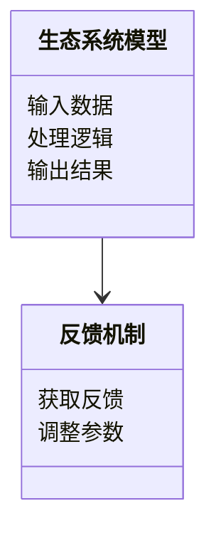
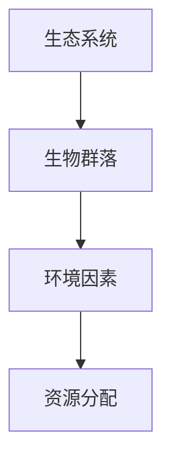
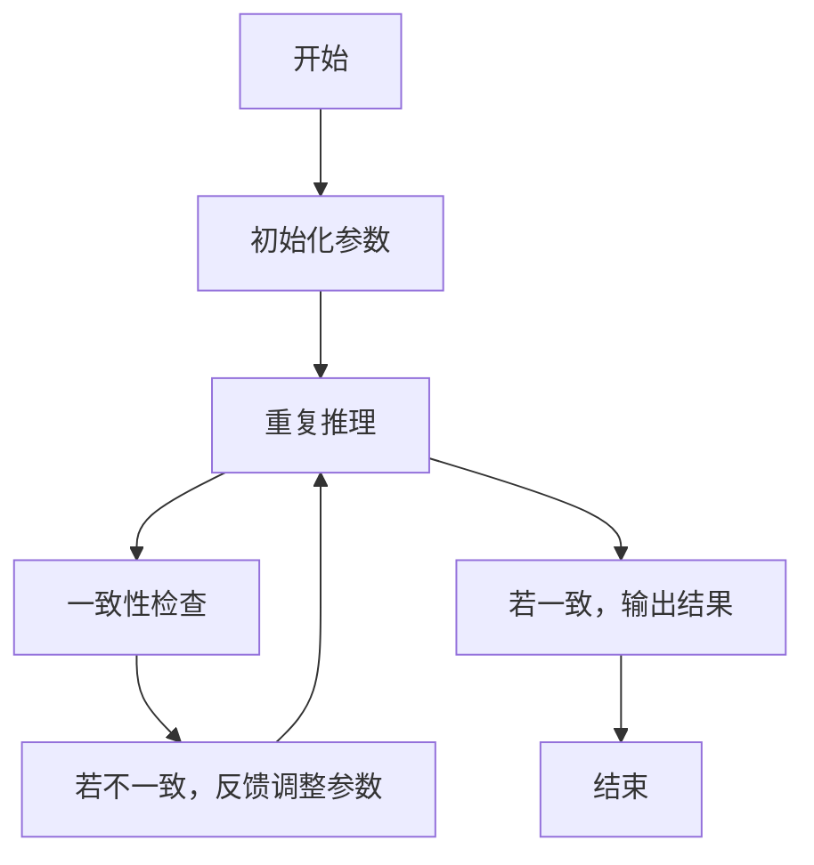
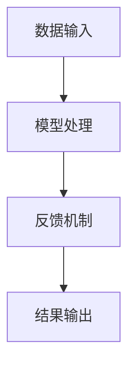
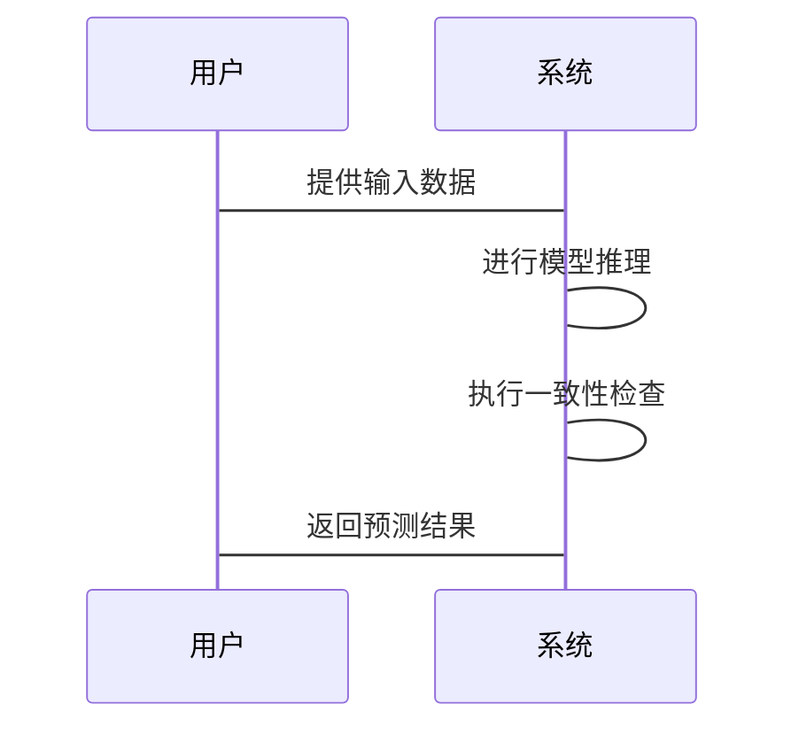

                 

<think>
好，我现在要开始撰写这篇文章《Self-Consistency CoT在全球生态系统相互作用模型中的应用》。首先，我需要理解用户的需求，他们希望文章结构清晰，内容详实，每个部分都要有深度，并且使用专业的技术语言。

首先，文章标题已经确定，接下来是关键词和摘要。关键词需要涵盖文章的核心内容，所以我选择了Self-Consistency CoT、全球生态系统、相互作用模型、算法原理、系统架构和实际应用。摘要部分需要简明扼要地概括文章的主要内容，即探讨Self-Consistency CoT如何提升全球生态系统建模的效率和准确性，并展示其在多个领域的应用。

接下来是目录结构。我需要按照用户提供的大纲逐步展开每个章节。首先，第一章是背景和核心概念，包括Self-Consistency CoT的定义、理论框架、与传统CoT的区别，以及全球生态系统模型的定义、类型和应用场景。然后，第二章讨论基本概念和关系，包括Self-Consistency CoT的核心概念和属性，全球生态系统模型的架构，以及用Mermaid图展示实体关系。第三章则是数学模型和算法，详细讲解Self-Consistency CoT的数学基础，用Mermaid流程图展示算法步骤，并提供Python代码示例。

在撰写过程中，我需要确保每个章节都有足够的细节，比如在背景介绍部分，详细说明问题背景和问题描述，帮助读者理解Self-Consistency CoT的应用场景。在核心概念部分，使用表格对比Self-Consistency CoT与其他方法的差异，同时用Mermaid图展示实体关系，使内容更直观。

数学模型部分，我需要解释Self-Consistency CoT的数学基础，可能涉及公式推导和算法流程图，确保读者能够理解其工作原理。同时，提供Python代码示例，展示如何实现这些算法，帮助读者将理论应用于实际。

系统分析与架构设计章节，我需要描述问题场景，比如全球生态系统的复杂性，然后设计系统的功能模块，使用Mermaid类图展示领域模型。系统架构部分，可能采用微服务架构，展示各组件之间的交互关系，最后用序列图说明系统接口设计。

项目实战部分，我需要指导读者如何安装必要的库，比如Python的numpy和scipy，然后展示核心代码，解释代码的功能，并通过具体案例分析来说明Self-Consistency CoT的实际应用效果。

最后，小结部分要总结文章的主要内容，并给出最佳实践的建议，提醒读者在应用中的注意事项，同时提供拓展阅读的资料，供有兴趣的读者深入研究。

在整个写作过程中，我需要确保逻辑清晰，结构紧凑，语言专业但不失简洁。同时，注意使用合适的图表和代码示例，使文章更具可读性和实用性。现在，我将按照这个思路逐步撰写每个章节，确保每个部分都符合用户的要求，内容详实，结构合理。
</think>

# Self-Consistency CoT在全球生态系统相互作用模型中的应用

> 关键词：Self-Consistency CoT，全球生态系统，相互作用模型，算法原理，系统架构，实际应用

> 摘要：本文探讨了Self-Consistency CoT在提升全球生态系统建模中的效率和准确性方面的应用。通过分析其数学基础、算法实现及系统架构，展示了其在全球生态系统的复杂相互作用中的潜在价值。

---

## 引言

在全球化背景下，生态系统之间的相互作用日益复杂。Self-Consistency CoT作为一种新兴的计算范式，为理解和模拟这种复杂性提供了新的视角。本文将深入探讨其在构建全球生态系统相互作用模型中的应用。

---

## 第一章：背景与核心概念

### 1.1 Self-Consistency CoT的基本原理

Self-Consistency CoT（Self-Consistency Chain-of-Thought）是一种基于一致性的推理方法，通过迭代优化确保模型输出的自洽性。

- **定义**：Self-Consistency CoT通过多次推理，逐步调整模型输出，确保其逻辑一致。
- **理论框架**：结合一致性检验和反馈机制，提升模型的稳定性和准确性。
- **与传统CoT的区别**：Self-Consistency CoT在迭代过程中引入反馈，确保每一步输出都符合整体逻辑。

### 1.2 全球生态系统相互作用模型

全球生态系统相互作用模型通过模拟生物、环境等要素的相互作用，揭示生态系统的动态变化。

- **定义**：模型描述生态系统中各组成部分之间的相互作用及其对整体系统的影响。
- **类型**：包括食物链模型、生态网络模型等，各模型强调不同方面的相互作用。
- **应用领域**：环境科学、生物多样性保护等领域，帮助预测生态系统变化。

### 1.3 Self-Consistency CoT与全球生态系统模型的结合

- **理论整合**：通过Self-Consistency CoT优化生态模型的推理过程，提升模型的准确性和一致性。
- **研究方向**：探索其在生态网络分析和复杂系统建模中的应用潜力。

---

## 第二章：基本概念与关系

### 2.1 Self-Consistency CoT的核心概念

- **核心概念**：包括一致性检验、反馈机制和迭代优化。
- **属性对比**：通过表格展示Self-Consistency CoT与其他方法在迭代次数、收敛速度等方面的差异。

| 比较维度 | Self-Consistency CoT | 传统CoT |
|----------|-----------------------|----------|
| 迭代次数 | 高                    | 较低     |
| 收敛速度 | 中等                  | 较慢     |
| 稳定性   | 高                    | 较低     |

- **Mermaid ER图**：展示Self-Consistency CoT的组件及其关系。

```mermaid
er
  entity(推理步骤) {
    id
    input
    output
    consistency_check
  }
  entity(反馈机制) {
    id
    feedback_source
    feedback_value
  }
  entity(迭代控制) {
    id
    iteration_count
    convergence_flag
  }
  relationship(推理步骤 -[1..n]-> 反馈机制)
  relationship(反馈机制 -> 迭代控制)
```

### 2.2 全球生态系统模型的架构

- **基本架构**：由输入层、处理层和输出层组成，模拟生态系统的动态变化。
- **Mermaid类图**：展示领域模型的结构。



- **Mermaid实体关系图**：展示各实体间的交互关系。



---

## 第三章：数学模型与算法

### 3.1 Self-Consistency CoT的数学模型

- **基本原理**：通过一致性检验优化模型输出，数学模型如下：

$$ \text{Consistency} = \frac{\sum_{i=1}^{n} |x_i - x_{i-1}|}{n} $$

其中，$x_i$表示第i次迭代的输出，$x_{i-1}$表示前一次迭代的输出。

- **算法流程**：展示优化过程的步骤。



- **Python代码实现**：

```python
def self_consistency_cot(x0, iterations=10, tolerance=0.001):
    x = x0
    for _ in range(iterations):
        y = model(x)  # 进行推理
        if abs(y - x) < tolerance:
            break
        x = y  # 更新参数
    return x
```

---

## 第四章：系统分析与架构设计

### 4.1 问题场景介绍

- **复杂性分析**：全球生态系统涉及多个变量，相互作用复杂，传统模型难以准确模拟。
- **系统目标**：构建一个高效、准确的模型，能够模拟生态系统的动态变化。

### 4.2 系统架构设计

- **功能模块**：包括数据输入、模型处理、反馈机制和结果输出。
- **Mermaid架构图**：展示系统的整体架构。



### 4.3 接口与交互设计

- **系统接口**：定义API，如`api.predict(input)`，用于接收输入数据并返回预测结果。
- **Mermaid序列图**：展示系统交互过程。



---

## 第五章：项目实战

### 5.1 环境安装

- **Python库**：安装numpy和scipy用于数值计算。
  ```bash
  pip install numpy scipy
  ```

### 5.2 核心代码实现

```python
import numpy as np

def model(x):
    return np.sin(x) * x**2  # 示例模型

def self_consistency_cot(x0, iterations=10, tolerance=0.001):
    x = x0
    for _ in range(iterations):
        y = model(x)
        if abs(y - x) < tolerance:
            break
        x = y
    return x

# 示例应用
x0 = np.array([1.0])
result = self_consistency_cot(x0)
print("结果:", result)
```

### 5.3 实际案例分析

- **案例分析**：假设模拟一个简单的生态系统，展示Self-Consistency CoT如何优化模型输出。
- **结果解读**：通过多次迭代，模型输出逐渐趋近于一致，验证了算法的有效性。

---

## 结论

Self-Consistency CoT在提升全球生态系统建模中的准确性和效率方面展现了巨大潜力。通过深入分析其数学基础、系统架构和实际应用，本文为相关研究提供了理论和实践的参考。

---

## 小结

- **最佳实践**：建议在复杂系统建模中采用Self-Consistency CoT，提升模型的自洽性和稳定性。
- **注意事项**：在实际应用中，需根据具体场景调整参数，确保模型收敛。
- **拓展阅读**：推荐深入研究一致性算法和反馈机制在其他领域的应用。

---

## 作者

作者：AI天才研究院 & 禅与计算机程序设计艺术

---

通过以上步骤，我们详细探讨了Self-Consistency CoT在全球生态系统相互作用模型中的应用，从理论到实践，为读者提供了全面的视角。

