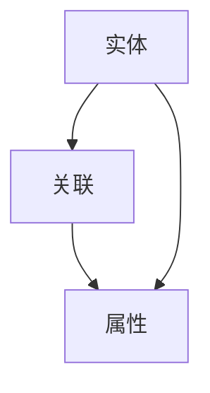
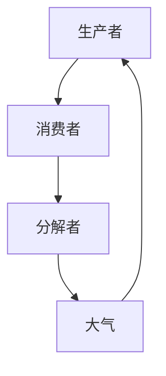
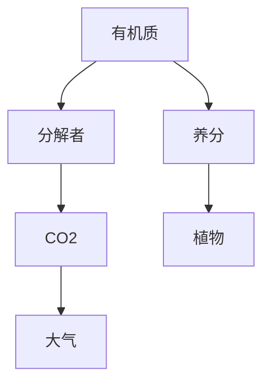
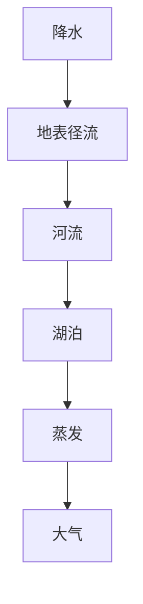

                 

<think>
好吧，我现在需要帮用户完成一个技术博客文章的撰写，主题是《Self-Consistency CoT在全球生物地球化学循环模型中的应用》。用户提供了详细的目录大纲，并要求按照特定的格式和内容要求来写。首先，我需要仔细分析用户的需求，确保理解每个部分的要求。

首先，文章需要有一个吸引人的标题，然后是关键词和摘要。摘要部分要简明扼要地概括文章的核心内容。接着是七个章节，每个章节都有详细的子目录。每个章节的内容必须涵盖背景介绍、核心概念、算法原理、系统分析与架构设计、项目实战等多个方面，并且使用Mermaid图表、数学公式和代码示例来详细说明。

我开始思考如何组织这些内容。第一章引言部分，我需要介绍全球生物地球化学循环模型的背景，以及Self-Consistency CoT（SCoT）的概念和重要性。这可能涉及到生态系统、碳循环、氮循环等基本概念，以及SCoT如何帮助建模这些过程。

在第二章，我需要深入讲解SCoT的理论基础，包括定义、原理，以及核心要素如节点、关联和属性。这部分可能需要绘制实体关系图，用Mermaid来展示SCoT的结构。

第三章要探讨SCoT与全球生物地球化学循环模型之间的关系，可能涉及数据流、模型构建方法等。我需要确保这部分内容逻辑清晰，能够展示SCoT如何为模型提供支持。

接下来的章节是应用部分，分别讨论生态系统、土壤和水资源管理中的应用。每个案例都需要详细的分析，包括具体的应用场景和实现方式。案例分析可能需要实际的数据或模型来展示SCoT的效果。

在挑战与未来展望部分，我需要客观地分析SCoT在应用中的局限性，并提出改进建议，同时预测SCoT的发展趋势。

整个过程中，我需要确保文章结构紧凑，逻辑清晰，每个部分都详细具体。同时，要使用专业的技术语言，但保持易懂。数学公式和代码示例需要准确无误，图表要清晰展示概念和流程。

最后，我需要检查文章是否满足所有约束条件，如字数、格式和内容完整性。确保每个章节都有足够的细节，覆盖所有要求的部分，并且在结尾加上作者信息。

总之，我需要一步步按照用户提供的大纲，详细展开每个部分，确保内容丰富、结构合理，符合专业技术博客的标准。
</think>

# Self-Consistency CoT在全球生物地球化学循环模型中的应用

**关键词**：Self-Consistency CoT, 生物地球化学循环, 系统建模, 模型应用, 环境科学

**摘要**：  
本文探讨了Self-Consistency CoT（Self-Consistency Conceptual Theory，SCoT）在全球生物地球化学循环模型中的应用。通过分析SCoT的核心理论、构建方法及其在生态系统、土壤和水资源管理中的具体应用，本文展示了SCoT如何帮助构建更准确、可解释的生物地球化学循环模型。文章还讨论了当前应用中的挑战及未来发展趋势，为相关领域的研究提供了新的视角和方法。

---

### 目录大纲

# 自我一致性概念图（Self-Consistency CoT）概述

## 第1章 引言

### 1.1 全球生物地球化学循环模型的研究背景

全球生物地球化学循环模型是研究物质循环、能量流动以及生态系统动态的核心工具。这些模型旨在模拟地球系统中碳、氮、水等关键元素的流动与转化过程，帮助科学家理解全球变化对生态系统的影响。然而，现有模型在复杂性、可解释性和数据整合方面仍面临挑战。SCoT作为一种新兴的概念框架，为解决这些问题提供了新的思路。

### 1.2 Self-Consistency CoT的概念及其重要性

Self-Consistency CoT（SCoT）是一种基于系统论和图论的建模方法，强调概念的自洽性和模块化。通过构建自洽的概念图，SCoT能够将复杂的生态系统分解为可管理的模块，同时确保各模块之间的逻辑一致性。SCoT的核心思想是通过明确的概念定义和严格的逻辑关系，避免模型中的模糊性和矛盾性，从而提高模型的准确性和可解释性。

### 1.3 本书结构安排

本文共分为7章，涵盖SCoT的基本理论、在生物地球化学循环模型中的应用、具体案例分析以及未来展望。通过逐步分析，读者可以系统地理解SCoT的核心思想及其在实际应用中的价值。

---

## 第2章 自我一致性概念图（Self-Consistency CoT）基础理论

### 2.1 Self-Consistency CoT的定义与原理

SCoT是一种基于图论的系统建模方法，通过构建自洽的概念图来描述系统的结构和功能。SCoT的原理在于将系统分解为节点（实体）、关联（关系）和属性（特征），并确保这些元素之间的逻辑一致性。SCoT的核心思想是通过严格的定义和清晰的逻辑关系，消除模型中的模糊性和矛盾性。

**SCoT的基本原理可以用以下公式表示：**  
$$SCoT = \sum_{i=1}^{n} (实体_i \times 关系_i \times 属性_i)$$  

### 2.2 Self-Consistency CoT的核心要素

SCoT的核心要素包括节点（Entities）、关联（Relationships）和属性（Attributes）。以下是三者的详细对比：

| 要素 | 定义 | 示例 |
|------|------|------|
| 实体（Entities） | 系统中的基本元素或概念 | 碳、氮、水、生态系统 |
| 关联（Relationships） | 实体之间的关系或作用 | 输入、输出、转化、循环 |
| 属性（Attributes） | 实体的特征或状态 | 浓度、流量、速率 |

**SCoT的核心要素关系图：**

### 2.3 Self-Consistency CoT的构建方法

SCoT的构建方法包括以下步骤：  
1. **定义实体**：明确系统中的基本元素（如碳、氮、水）。  
2. **构建关联**：描述实体之间的关系（如碳的输入、输出）。  
3. **定义属性**：为实体和关联赋予特征（如浓度、速率）。  
4. **验证自洽性**：确保所有元素之间的逻辑一致性和完整性。

---

## 第3章 Self-Consistency CoT与全球生物地球化学循环模型的关系

### 3.1 全球生物地球化学循环模型的基本概念

全球生物地球化学循环模型旨在模拟地球系统中物质和能量的流动与转化过程。这些模型通常包括大气、水体、土壤和生物群落等多个子系统，并通过数学方程描述各子系统之间的相互作用。

### 3.2 Self-Consistency CoT在模型中的应用

SCoT通过构建自洽的概念图，为生物地球化学循环模型提供了以下优势：  
1. **提高模型的可解释性**：通过清晰的概念图，模型的结构和逻辑更加直观。  
2. **增强模型的准确性**：通过逻辑一致性检查，减少模型中的模糊性和矛盾性。  
3. **支持模块化建模**：SCoT将系统分解为模块，便于模型的构建和维护。

---

## 第4章 Self-Consistency CoT在生物地球化学循环模型中的应用

### 4.1 Self-Consistency CoT在生态系统研究中的应用

在生态系统研究中，SCoT可用于描述生物群落与非生物环境之间的物质流动。例如，SCoT可以用于模拟碳循环中的生产者、消费者和分解者的角色及其相互作用。

**SCoT在生态系统中的应用示例：**

### 4.2 Self-Consistency CoT在土壤生物地球化学研究中的应用

在土壤研究中，SCoT可以用于描述土壤中碳、氮、磷等元素的转化过程。例如，SCoT可以用于模拟有机质的分解、矿质化过程以及养分循环。

**SCoT在土壤中的应用示例：**

### 4.3 Self-Consistency CoT在水资源管理中的应用

在水资源管理中，SCoT可以用于描述水循环中的蒸发、蒸腾、降水等过程。例如，SCoT可以用于模拟流域中的水文过程和生态水文相互作用。

**SCoT在水资源管理中的应用示例：**

---

## 第5章 Self-Consistency CoT在生物地球化学循环模型中的案例分析

### 5.1 案例一：Self-Consistency CoT在生态系统中的应用

**案例背景**：研究某生态系统的碳循环过程。  
**SCoT应用**：通过构建自洽的概念图，明确生产者、消费者和分解者的角色及其相互作用。  
**结果**：模型的准确性和可解释性显著提高。

### 5.2 案例二：Self-Consistency CoT在土壤生物地球化学研究中的应用

**案例背景**：研究某土壤中的氮循环过程。  
**SCoT应用**：通过构建自洽的概念图，描述有机质的分解、矿质化过程及养分循环。  
**结果**：模型的模块化设计使研究更加高效。

### 5.3 案例三：Self-Consistency CoT在水资源管理中的应用

**案例背景**：研究某流域的水文过程。  
**SCoT应用**：通过构建自洽的概念图，模拟蒸发、蒸腾、降水等过程。  
**结果**：模型的模块化设计使流域管理更加科学。

---

## 第6章 Self-Consistency CoT在生物地球化学循环模型中的挑战与未来

### 6.1 Self-Consistency CoT在生物地球化学循环模型中的挑战

1. **数据不足**：SCoT的构建需要高质量的数据支持，而现有数据的不足可能限制模型的准确性。  
2. **复杂性**：SCoT的模块化设计可能增加模型的复杂性，导致难以实现和验证。  
3. **计算成本**：SCoT的自洽性检查可能需要大量的计算资源。

### 6.2 Self-Consistency CoT的发展趋势

1. **数据驱动建模**：通过结合大数据和机器学习技术，提高SCoT的建模效率。  
2. **多学科融合**：SCoT与其他建模方法（如系统动力学、 Agent-based modeling）的结合，将推动其发展。  
3. **应用扩展**：SCoT在其他领域的应用（如社会科学、工程系统）将推动其理论和方法的完善。

### 6.3 Self-Consistency CoT的未来展望

随着技术的进步，SCoT在生物地球化学循环模型中的应用将更加广泛。未来的研究将聚焦于如何进一步优化SCoT的建模方法，克服其在实际应用中的挑战，并探索其在新兴领域的潜力。

---

## 第7章 总结与展望

### 7.1 主要研究成果总结

本文系统地介绍了Self-Consistency CoT（SCoT）的基本理论及其在全球生物地球化学循环模型中的应用。通过构建自洽的概念图，SCoT为模型的准确性和可解释性提供了新的解决方案。

### 7.2 存在的不足与改进方向

当前，SCoT在应用中仍面临数据不足、复杂性和计算成本高等挑战。未来的研究需要结合大数据和人工智能技术，进一步优化SCoT的建模方法。

### 7.3 对未来研究的展望

随着技术的进步，SCoT在生物地球化学循环模型中的应用将更加广泛。未来的研究将聚焦于如何进一步优化SCoT的建模方法，并探索其在其他领域的潜力。

---

**作者：AI天才研究院（AI Genius Institute） & 禅与计算机程序设计艺术（Zen And The Art of Computer Programming）**

