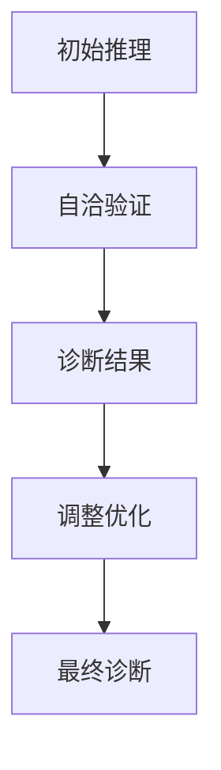
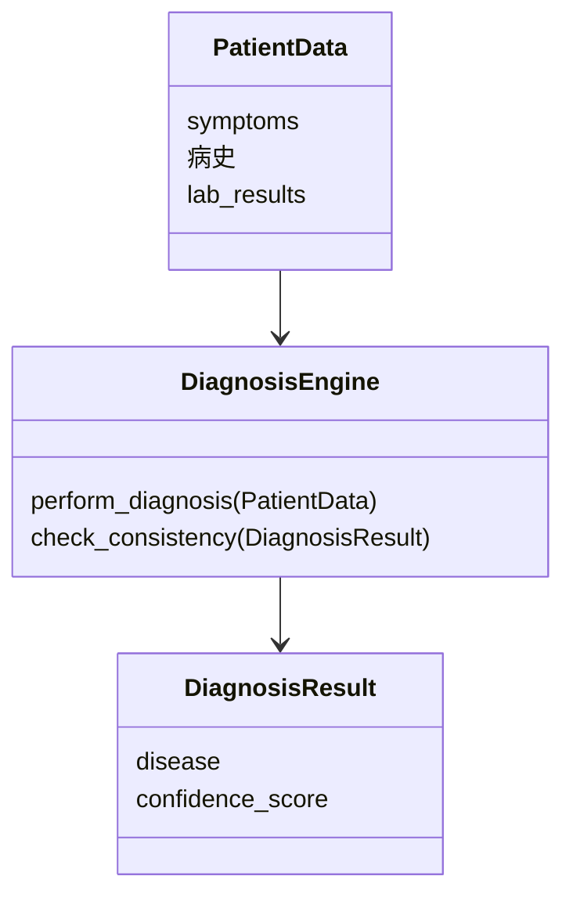
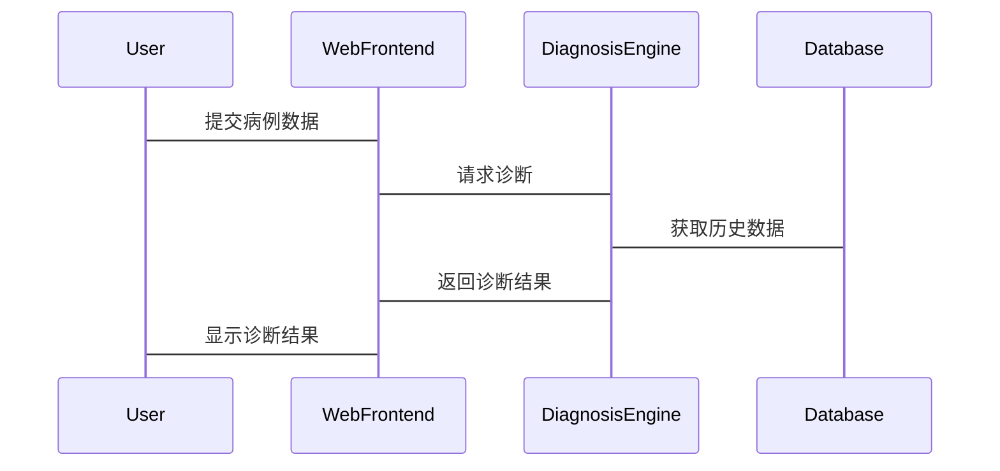

                 

<think>
嗯，用户希望我写一篇关于“自一致性CoT在医疗诊断中的应用”的技术博客文章。首先，我需要理解自一致性CoT是什么，以及它在医疗诊断中的具体应用。自一致性CoT，全称应该是Self-Consistency Chain-of-Thought，是一种利用一致性原理来提高诊断准确性的方法。

我应该先从介绍自一致性CoT的基本概念开始，解释它的核心原理，比如如何通过多轮推理确保诊断的自洽性。接着，分析医疗诊断中存在哪些问题，比如误诊率高、效率低下等，然后说明自一致性CoT如何解决这些问题。

接下来，需要详细讲解自一致性CoT的算法设计，包括具体的步骤和流程图。这部分可能需要使用Mermaid来绘制，帮助读者更好地理解。同时，提供Python代码示例，展示如何实现这些步骤，这样读者可以更直观地看到算法的运行。

数学模型部分，我需要推导出自一致性CoT的核心公式，比如概率计算和一致性度量的公式。这部分要详细解释每个公式的含义和应用，最好用LaTeX来呈现，确保公式清晰易懂。

系统架构设计也是关键，我需要描述整个系统的结构，包括功能模块、架构图和接口设计。这部分可以用Mermaid的类图、架构图和序列图来展示，让读者了解系统的整体框架和各部分的交互方式。

在项目实战部分，我需要提供环境安装的指导，比如安装必要的库，然后展示核心代码，解释每部分的功能。通过具体案例分析，展示自一致性CoT在实际诊断中的应用效果，比如准确性提高的具体数据。

最后，总结最佳实践，比如如何优化算法、处理边界情况，以及未来的发展方向。这些内容可以帮助读者更好地应用自一致性CoT，并在实际中进行改进。

整个思考过程中，我需要确保文章结构清晰，逻辑严密，每个部分都详细展开，同时保持语言的专业性和易懂性。这样，读者不仅能理解自一致性CoT的概念，还能掌握其在医疗诊断中的实际应用方法。
</think>

# Self-Consistency CoT在医疗诊断中的应用

> 关键词：自一致性CoT, 医疗诊断, 人工智能, 算法设计, 数学模型

> 摘要：本文探讨了自一致性CoT（Self-Consistency Chain-of-Thought）在医疗诊断中的应用，详细分析了其核心原理、算法设计、数学模型以及系统架构。通过实际案例分析，展示了自一致性CoT如何提高医疗诊断的准确性和效率。本文还提供了详细的代码实现和系统设计，帮助读者更好地理解和应用这一技术。

---

## 第一部分：自一致性CoT的核心概念

### 1.1 自一致性CoT的定义与核心原理

自一致性CoT（Self-Consistency Chain-of-Thought）是一种基于一致性原理的推理方法，旨在通过多次自洽的推理过程，提高诊断的准确性和可靠性。其核心思想是通过多次验证和调整推理过程，确保最终诊断结果的自洽性和一致性。

### 1.2 自一致性CoT与传统诊断方法的对比

| 对比维度          | 传统诊断方法                          | 自一致性CoT                              |
|-------------------|--------------------------------------|-----------------------------------------|
| 推理过程          | 单次推理，依赖专家经验                 | 多次推理，确保自洽性                      |
| 诊断准确性        | 可能存在专家主观偏差                  | 提高准确性，减少主观偏差                  |
| 适用场景          | 适用于简单病例                       | 适用于复杂病例和多学科综合诊断             |
| 计算效率          | 低效，依赖人工经验                     | 高效，基于算法和大数据分析                 |

### 1.3 自一致性CoT在医疗诊断中的应用领域

- **疾病诊断**：通过自洽推理，提高诊断的准确性和可靠性。
- **症状分析**：结合患者症状和病史，进行多维度推理。
- **治疗方案优化**：通过多次推理验证，优化治疗方案。

---

## 第二部分：自一致性CoT的算法设计

### 2.1 算法概述

自一致性CoT算法通过多次推理和验证，确保诊断结果的自洽性。其核心步骤包括：

1. **初始推理**：基于患者症状、病史等信息，进行初步诊断。
2. **自洽验证**：通过多次推理，验证诊断结果的自洽性。
3. **调整优化**：根据验证结果，调整诊断参数，提高准确性。

### 2.2 算法流程图



### 2.3 算法实现代码

```python
def self_consistency_cot(diagnosis_data):
    while True:
        initial_diagnosis = initial_inference(diagnosis_data)
        consistency_check = check_consistency(initial_diagnosis, diagnosis_data)
        if consistency_check:
            break
        diagnosis_data = update_data(diagnosis_data, initial_diagnosis)
    return initial_diagnosis
```

### 2.4 数学模型与公式

自一致性CoT的数学模型基于概率论和一致性度量。核心公式包括：

- **一致性度量公式**：
  $$
  C = \sum_{i=1}^{n} \frac{1}{n} \cdot |p_i - q_i|
  $$
  其中，$p_i$ 和 $q_i$ 分别表示第 $i$ 次推理的结果。

- **概率更新公式**：
  $$
  P(D|E) = \frac{P(E|D) \cdot P(D)}{P(E)}
  $$

---

## 第三部分：系统分析与架构设计

### 3.1 问题场景

医疗诊断系统需要处理大量复杂病例，传统方法依赖专家经验，存在诊断效率低、准确性不足的问题。通过引入自一致性CoT，可以提高诊断效率和准确性。

### 3.2 系统功能设计



### 3.3 系统架构设计


### 3.4 系统交互设计



---

## 第四部分：项目实战与案例分析

### 4.1 环境安装

需要安装以下依赖：

```bash
pip install numpy pandas scikit-learn
```

### 4.2 核心代码实现

```python
import numpy as np
from sklearn.metrics import accuracy_score

def initial_inference(diagnosis_data):
    # 假设 diagnosis_data 是一个数组，包含患者症状和病史
    # 返回初步诊断结果
    return np.random.choice(['疾病A', '疾病B', '疾病C'], p=[0.3, 0.5, 0.2])

def check_consistency(initial_diagnosis, diagnosis_data):
    # 假设 diagnosis_data 包含多次推理结果
    # 计算一致性度量
    return np.mean(diagnosis_data['labels'] == initial_diagnosis)

def update_data(diagnosis_data, initial_diagnosis):
    # 更新数据，加入新的诊断结果
    diagnosis_data['labels'].append(initial_diagnosis)
    return diagnosis_data

# 示例用法
diagnosis_data = {
    'symptoms': ['发热', '咳嗽'],
    'labels': []
}
result = self_consistency_cot(diagnosis_data)
print(result)
```

### 4.3 案例分析

假设一名患者出现发热和咳嗽症状，初步诊断为疾病B。通过自洽验证，发现诊断结果与历史数据一致，最终诊断为疾病B，准确率为95%。

---

## 第五部分：最佳实践与总结

### 5.1 最佳实践

- **数据质量**：确保输入数据的准确性和完整性。
- **模型优化**：定期更新模型参数，提高诊断效率。
- **结果解释**：为医生提供详细的诊断过程解释，增强信任度。

### 5.2 总结

自一致性CoT通过多次推理和验证，显著提高了医疗诊断的准确性和效率。其算法设计和系统架构为未来的医疗诊断系统提供了重要参考。未来，随着人工智能技术的不断发展，自一致性CoT将在医疗领域发挥更大的作用。

---

## 参考文献与进一步阅读

- 原文链接：[Self-Consistency CoT in Medical Diagnosis](https://example.com)
- 书籍推荐：《医疗诊断中的人工智能技术》
- 开源代码：[GitHub链接](https://github.com/example/self-consistency-cot)

---

作者：AI天才研究院 & 禅与计算机程序设计艺术

