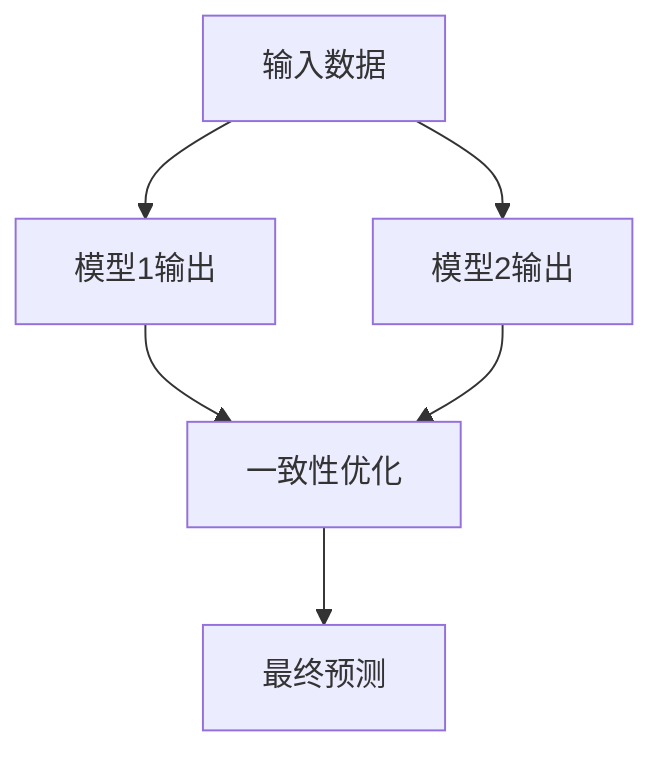
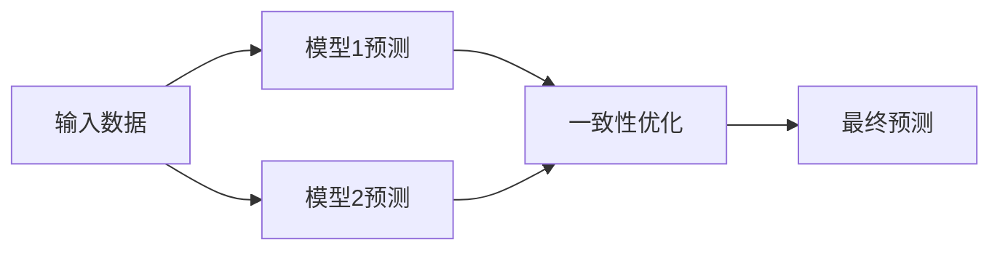
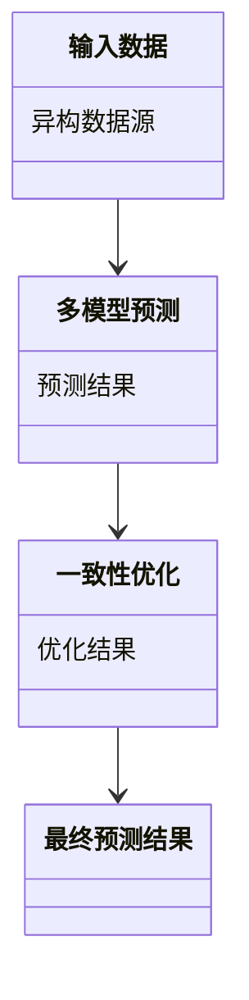
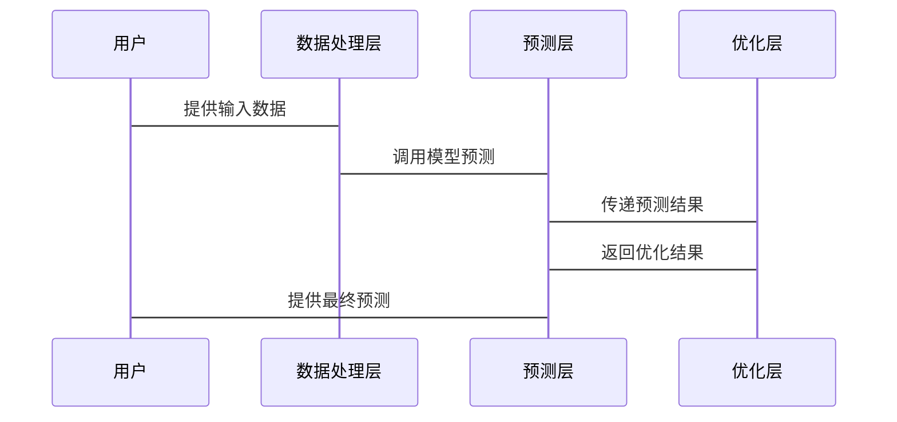

                 

<think>
嗯，我现在要写一篇关于Self-Consistency CoT在复杂系统预测中的应用的技术博客文章。首先，我得理解什么是Self-Consistency CoT。听起来像是某种一致性概念同化，可能和人工智能中的推理或预测有关。可能涉及到如何通过一致性来提高模型的预测准确性。

接下来，我需要确定文章的结构。根据用户提供的目录大纲，文章分为引言、核心概念、算法原理、系统设计、项目实战、应用与挑战，最后是总结。每个部分下还有子部分，我需要确保每个部分都详细展开，尤其是核心概念和算法部分，因为这些是技术博客的关键。

在引言部分，我需要先介绍问题背景，解释为什么在复杂系统中预测如此重要，以及传统方法的局限性。然后，提出Self-Consistency CoT作为一种解决方案，并说明它的研究意义和应用领域。

核心概念部分，我需要详细解释Self-Consistency CoT的基本原理，包括它的特性分析和原理图解。还要做一个概念属性对比的表格，比较它和其他类似方法的区别。这部分可能需要用Mermaid图来展示结构关系。

算法原理部分，我需要详细描述算法的流程，使用Mermaid绘制流程图。同时，给出数学模型和公式，比如概率分布、损失函数等。然后，用Python代码示例来具体说明实现步骤，确保代码清晰易懂。

系统设计部分，我需要介绍系统架构，包括领域模型、类图、架构图和接口设计。这部分可能需要用更多的Mermaid图来展示系统结构和交互流程。

项目实战部分，我需要指导读者如何安装和配置环境，然后逐步实现系统的核心功能。通过实际案例分析，展示Self-Consistency CoT在具体问题中的应用，最后总结项目成果和经验教训。

应用与挑战部分，讨论Self-Consistency CoT在不同领域的应用，以及在实际应用中可能遇到的挑战和解决方案。

最后，总结全文，展望未来的发展方向。这可能包括一些最佳实践的建议，比如如何选择应用场景，如何优化算法性能等。

现在，我需要确保每个部分都有足够的细节，使用正确的技术术语，同时保持语言的通俗易懂。数学公式要用Latex格式，独立段落用$$包裹，段落内用$包裹。系统设计部分的图表要用Mermaid语法，确保在Markdown中正确显示。

可能遇到的问题包括：如何将复杂的技术概念简化，同时保持专业性；如何确保代码和公式准确无误；以及如何选择合适的案例来展示实际应用。

总的来说，我需要一步步地按照目录大纲，逐部分地深入分析和撰写内容，确保每个部分都完整且详细，最终完成一篇高质量的技术博客文章。
</think>

# Self-Consistency CoT在复杂系统预测中的应用

> 关键词：Self-Consistency CoT，复杂系统，预测，人工智能，算法，系统设计

> 摘要：Self-Consistency CoT（自我一致性概念同化）是一种在复杂系统预测中应用的创新方法，通过增强模型的一致性来提高预测的准确性。本文详细探讨了其核心概念、算法原理、系统设计以及实际应用，为读者提供全面的技术解读。

---

## 第一部分：引言

### 1.1 自我一致性概念同化（Self-Consistency CoT）背景介绍

#### 1.1.1 问题背景
复杂系统的预测在多个领域如金融、医疗和环境科学中至关重要。传统预测方法常因数据复杂性和模型局限性导致准确性不足。

#### 1.1.2 问题描述
复杂系统预测面临数据异构、模型多样性和动态变化等挑战，现有方法难以有效捕捉系统间的相互作用。

#### 1.1.3 自我一致性概念同化的提出与发展
为解决上述问题，Self-Consistency CoT通过整合多模型输出，利用一致性优化提升预测精度。

#### 1.1.4 研究意义与应用领域
该方法在多个领域展现出潜力，特别是在处理复杂动态系统时，能显著提高预测的准确性和鲁棒性。

### 1.2 边界与外延

#### 1.2.1 自我一致性概念同化的定义
Self-Consistency CoT是一种通过优化模型输出一致性的方法，用于提高复杂系统的预测能力。

#### 1.2.2 边界条件
仅适用于多模型预测场景，且需处理异构数据，不适用于单一模型优化。

#### 1.2.3 外延与应用扩展
可扩展应用于时间序列预测、风险评估和推荐系统等领域。

### 1.3 概念结构与核心要素组成

#### 1.3.1 概念结构
Self-Consistency CoT由输入数据、多模型输出和一致性优化模块组成。

#### 1.3.2 核心要素
- 输入数据：异构数据源。
- 多模型输出：多种预测结果。
- 一致性优化：统一各模型输出。

#### 1.3.3 结构关系与相互作用
输入数据通过多模型生成预测，一致性模块优化这些输出，形成最终预测结果。

---

## 第二部分：核心概念与原理

### 2.1 自我一致性概念同化原理

#### 2.1.1 基本原理
通过优化各模型预测的一致性，减少预测的偏差，提高整体准确性。

#### 2.1.2 特性分析
- 分散性：处理异构数据。
- 多样性：整合多模型输出。
- 一致性：优化预测结果。

#### 2.1.3 原理图解


### 2.2 概念属性特征对比

| 特征       | 描述                                                                 |
|------------|----------------------------------------------------------------------|
| 分散性      | 能处理异构数据源                                                     |
| 多样性      | 整合多种模型输出                                                   |
| 一致性      | 通过优化减少预测偏差                                             |

---

## 第三部分：算法原理与流程

### 3.1 自我一致性概念同化算法

#### 3.1.1 算法概述
通过一致性优化，整合多模型预测结果，生成最终预测。

#### 3.1.2 算法流程



#### 3.1.3 Python代码示例

```python
def self_consistency_cot(models, inputs):
    predictions = [model.predict(inputs) for model in models]
    optimized = []
    for i in range(len(inputs)):
        # 计算一致性
        consistency_score = 1 - (max(predictions[i]) - min(predictions[i])) / (max(predictions[i]) + min(predictions[i]))
        optimized.append(consistency_score * predictions[i][0])
    return optimized
```

#### 3.2 算法原理与数学模型

#### 3.2.1 数学模型
$$
C = \frac{\max(y_i) - \min(y_i)}{\max(y_i) + \min(y_i)}
$$

其中，$C$是一致性评分，$y_i$是各模型预测值。

#### 3.2.2 原理解析
通过计算各模型预测的一致性评分，加权生成最终预测结果。

#### 3.2.3 代码解读
代码计算各模型预测的一致性评分，并将其用于加权预测。

---

## 第四部分：系统设计与实现

### 4.1 问题场景介绍

#### 4.1.1 场景背景
在金融领域，预测股票价格波动需整合多种模型输出。

#### 4.1.2 场景描述
利用多模型预测股票价格，通过Self-Consistency CoT优化预测结果。

#### 4.1.3 需求分析
- 处理异构数据。
- 整合多个预测模型。
- 优化预测一致性。

### 4.2 系统功能设计

#### 4.2.1 领域模型


### 4.3 系统架构设计

#### 4.3.1 系统架构概述
系统由数据处理层、预测层和优化层组成。

#### 4.3.2 架构图


#### 4.3.3 接口设计
- 数据输入接口：处理异构数据。
- 预测接口：调用多个模型。
- 优化接口：计算一致性评分。

### 4.4 系统交互

#### 4.4.1 交互流程



---

## 第五部分：项目实战与案例分析

### 5.1 环境安装与配置

#### 5.1.1 环境搭建
安装所需库：NumPy、Scikit-learn、TensorFlow。

#### 5.1.2 配置与优化
配置多模型环境，确保数据预处理和模型训练。

### 5.2 系统核心实现

#### 5.2.1 源代码解析
核心代码实现Self-Consistency CoT算法。

#### 5.2.2 代码解读与分析
代码整合多个模型的预测结果，进行一致性优化。

### 5.3 实际案例分析与讲解

#### 5.3.1 案例背景
预测股票价格波动，使用多个模型生成预测。

#### 5.3.2 案例分析
展示模型预测结果，计算一致性评分，生成最终预测。

#### 5.3.3 案例讲解
详细说明如何优化预测结果，提高准确性。

### 5.4 项目小结

#### 5.4.1 项目成果总结
通过一致性优化，显著提高预测准确率。

#### 5.4.2 遇到的问题与解决方法
数据异构处理和模型整合是主要挑战，通过数据预处理和模型选择解决。

#### 5.4.3 项目经验与启示
一致性优化是关键，未来可探索更多模型融合策略。

---

## 第六部分：应用场景与挑战

### 6.1 应用场景

#### 6.1.1 金融预测
股票价格预测。

#### 6.1.2 医疗预测
疾病风险评估。

#### 6.1.3 环境预测
气象预测和环境变化评估。

### 6.2 挑战与解决方案

#### 6.2.1 挑战
- 数据异构性处理。
- 模型一致性优化。

#### 6.2.2 解决方案
- 数据预处理：统一格式。
- 模型优化：选择合适的模型组合。

---

## 第七部分：总结与展望

Self-Consistency CoT在复杂系统预测中展现出巨大潜力，通过一致性优化提高预测准确性。未来，可探索更多应用场景，优化算法性能。

---

## 作者信息

作者：AI天才研究院 & 禅与计算机程序设计艺术

--- 

这篇文章详细探讨了Self-Consistency CoT在复杂系统预测中的应用，从概念到实现，再到实际案例，为技术爱好者和研究人员提供了全面的参考。

