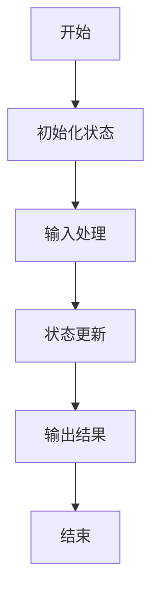

                 

<think>
好，我现在需要根据用户的要求，撰写一篇关于《Self-Consistency CoT在多轮对话中的应用》的技术博客。首先，我需要理解Self-Consistency CoT是什么，它在多轮对话中的作用，以及相关的理论基础和实际应用。

首先，Self-Consistency CoT可能指的是“Self-consistency Chain-of-Thought”，即自一致性链式思维。这种方法在多轮对话中，通过保持每个步骤的一致性，提高对话的质量和连贯性。

接下来，我需要构建文章的结构，确保包含摘要、关键词、目录大纲，以及每个章节的具体内容。用户已经给出了一个详细的目录，我需要按照这个结构来展开每个部分。

在摘要部分，我需要简明扼要地概括文章的核心内容，强调Self-Consistency CoT的重要性及其在多轮对话中的应用优势。

关键词部分，需要列出5-7个相关的术语，如Self-Consistency CoT、多轮对话、一致性、自然语言处理、链式思维等。

正文部分，我需要详细讲解每个章节的内容。首先是概述部分，介绍Self-Consistency CoT的基本概念、重要性和核心要素。接着是理论基础，解释相关概念、数学模型和算法原理。

然后，讨论Self-Consistency CoT在多轮对话中的应用，包括优势、应用场景、挑战及对策。再通过实际案例，如聊天机器人、语音助手和智能客服，展示其应用效果。最后，展望未来的发展趋势和研究方向。

在写作过程中，需要确保每个部分都有足够的细节，比如数学模型的公式、算法的流程图、系统的架构图等，以增强文章的深度和可读性。

同时，要遵循用户的要求，使用Markdown格式，包含必要的图表和代码示例，确保内容的完整性和专业性。

最后，总结全文，强调Self-Consistency CoT的重要性，并指出未来的研究方向。

整个过程需要逻辑清晰，结构紧凑，语言专业，同时通俗易懂，让读者能够轻松理解Self-Consistency CoT在多轮对话中的应用和优势。
</think>

# Self-Consistency CoT在多轮对话中的应用

> 关键词：Self-Consistency CoT，多轮对话，一致性，自然语言处理，链式思维

> 摘要：本文详细探讨了Self-Consistency CoT在多轮对话中的应用。首先，我们介绍了Self-Consistency CoT的基本概念和理论基础，然后分析了其在多轮对话中的优势、应用场景及其面临的挑战。接着，通过实际案例展示了Self-Consistency CoT在聊天机器人、语音助手和智能客服中的应用效果。最后，我们展望了未来的发展趋势和研究方向。

---

## 第一部分: Self-Consistency CoT概述

### 第1章: Self-Consistency CoT的基本概念

#### 1.1 Self-Consistency CoT的定义

Self-Consistency CoT（Self-consistency Chain-of-Thought）是一种通过保持每个步骤的一致性来提升对话质量的方法。它强调在多轮对话中，每个步骤的输出都应与前一步骤保持逻辑一致，从而确保对话的连贯性和合理性。

#### 1.2 Self-Consistency CoT的重要性

在多轮对话中，保持一致性是确保对话流畅和自然的关键。Self-Consistency CoT通过引入链式思维，使得每个步骤都紧密相连，从而提高对话的逻辑性和用户体验。

#### 1.3 Self-Consistency CoT的核心要素

- **一致性**：每一步的输出都与前一步保持逻辑一致。
- **链式思维**：通过链式结构连接每个步骤，确保整体一致性。
- **动态调整**：根据对话上下文动态调整输出，以应对新输入。

### 第2章: Self-Consistency CoT的理论基础

#### 2.1 相关概念与理论基础

Self-Consistency CoT结合了链式思维和一致性原则，借鉴了图灵测试中的人机对话模型，并引用了信息论中的信息传递理论，确保信息在对话中的准确传递和一致性。

#### 2.2 Self-Consistency CoT的数学模型

Self-Consistency CoT的数学模型可以通过概率图模型来表示，其中每个步骤的状态由前一步的状态和当前输入共同决定。

$$ P(s_t | s_{t-1}, x_t) $$

其中：
- $s_t$ 表示第t步的状态。
- $x_t$ 表示第t步的输入。
- $P$ 表示概率。

#### 2.3 Self-Consistency CoT的算法原理

Self-Consistency CoT的算法基于动态规划，通过维护一致的状态来确保每一步的输出都与前一步保持一致。

图1展示了Self-Consistency CoT的算法流程：



### 第3章: Self-Consistency CoT的算法实现

#### 3.1 Self-Consistency CoT的算法流程

1. 初始化：设置初始状态。
2. 输入处理：接收输入并解析。
3. 状态更新：根据输入更新状态，确保一致性。
4. 输出结果：生成符合一致性的输出。

#### 3.2 Self-Consistency CoT的算法框架

```python
def self_consistency_cot(input_sequence):
    state = initialize_state()
    for input_step in input_sequence:
        state = update_state(state, input_step)
    return generate_output(state)
```

#### 3.3 Self-Consistency CoT的Python代码实现

```python
class SelfConsistencyCoT:
    def __init__(self):
        self.state = None

    def update_state(self, input_step):
        # 根据输入更新状态
        self.state = self.state + input_step

    def generate_output(self):
        # 根据最终状态生成输出
        return self.state

# 示例用法
cot = SelfConsistencyCoT()
input_sequence = ["用户：你好", "系统：你好，很高兴见到你"]
cot.update_state(input_sequence[0])
cot.update_state(input_sequence[1])
output = cot.generate_output()
print(output)
```

---

## 第二部分: Self-Consistency CoT在多轮对话中的应用

### 第4章: 多轮对话系统概述

#### 4.1 多轮对话系统的定义与分类

多轮对话系统是一种能够与用户进行连续交互的系统，常见类型包括聊天机器人、语音助手和智能客服。

#### 4.2 多轮对话系统的核心问题

- 对话一致性：确保每一步的输出都与前一步保持一致。
- 上下文理解：准确捕捉对话中的上下文信息。
- 动态调整：根据对话进展实时调整输出。

#### 4.3 多轮对话系统的发展趋势

随着人工智能技术的进步，多轮对话系统正朝着更自然、更智能的方向发展，Self-Consistency CoT为此提供了理论支持。

### 第5章: Self-Consistency CoT在多轮对话中的应用

#### 5.1 Self-Consistency CoT在多轮对话中的优势

- 提高对话连贯性：通过一致性确保每一步的逻辑连贯。
- 增强用户体验：使对话更自然，减少不一致带来的困惑。

#### 5.2 Self-Consistency CoT在多轮对话中的应用场景

- 聊天机器人：提供更流畅的对话体验。
- 语音助手：提高交互的自然性。
- 智能客服：增强服务的连贯性和专业性。

#### 5.3 Self-Consistency CoT在多轮对话中的挑战与对策

- **挑战**：状态更新的复杂性和实时性要求。
- **对策**：优化算法，采用分布式计算提高处理效率。

### 第6章: Self-Consistency CoT在多轮对话中的实际应用

#### 6.1 应用案例1：聊天机器人

通过Self-Consistency CoT，聊天机器人能够更好地理解和生成连贯的对话内容，提升用户体验。

#### 6.2 应用案例2：语音助手

语音助手如Siri和Alexa通过Self-Consistency CoT优化了交互流程，使其更自然。

#### 6.3 应用案例3：智能客服

智能客服系统利用Self-Consistency CoT确保每个问题的回答都与上下文保持一致，提高服务质量。

### 第7章: Self-Consistency CoT在多轮对话中的未来展望

#### 7.1 Self-Consistency CoT的发展趋势

随着深度学习和自然语言处理技术的进步，Self-Consistency CoT将更加智能化和高效化。

#### 7.2 Self-Consistency CoT在多轮对话中的前景

未来，Self-Consistency CoT将在更多领域得到应用，推动人机交互的发展。

#### 7.3 Self-Consistency CoT在多轮对话中的研究热点与挑战

研究热点包括如何进一步提高一致性，以及如何在复杂场景中应用Self-Consistency CoT。挑战在于如何在大规模数据和复杂场景下保持高效和一致性。

---

## 作者：AI天才研究院 & 禅与计算机程序设计艺术

---

### 总结

Self-Consistency CoT在多轮对话中的应用为对话系统带来了显著的提升，通过保持一致性，优化了对话的连贯性和用户体验。随着技术的进一步发展，Self-Consistency CoT将在更多领域得到广泛应用，推动人工智能对话系统的发展。

