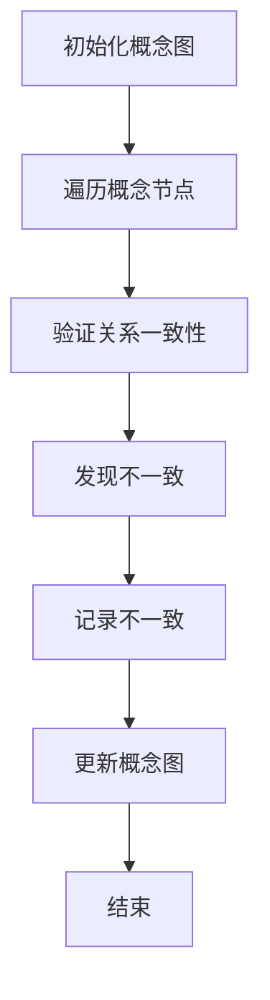
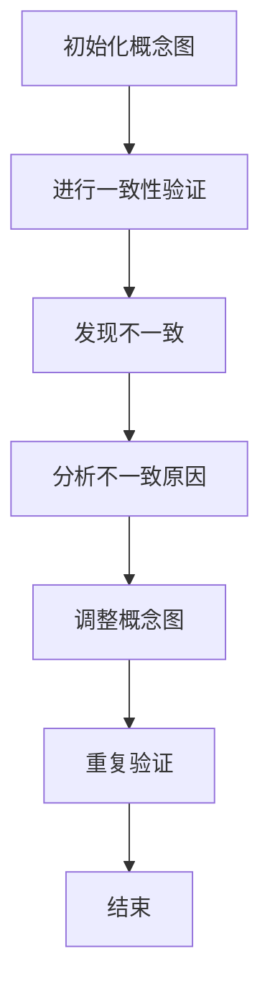
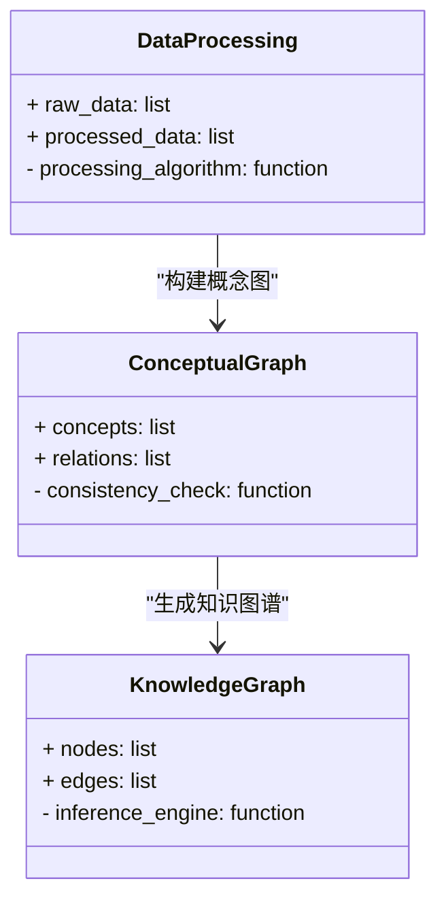
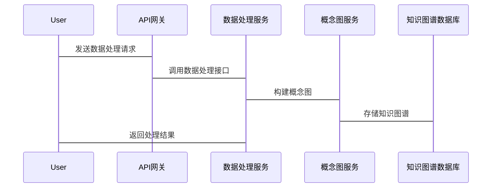
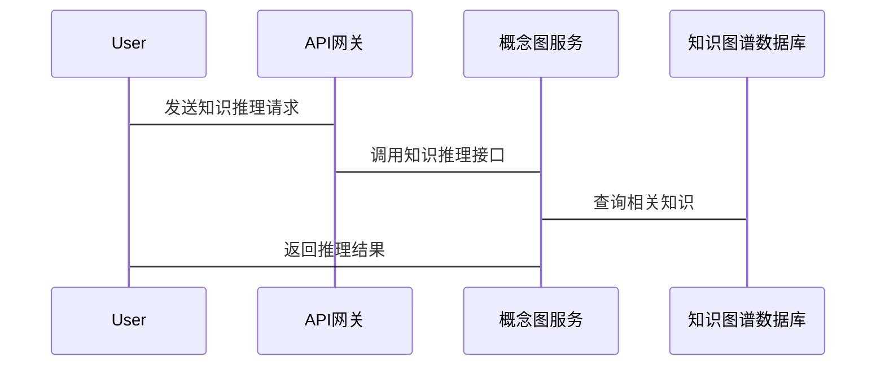

                 

<think>
嗯，用户希望我以《Self-Consistency CoT在天体物理数据处理中的应用探索》为标题写一篇技术博客。首先，我需要理解Self-Consistency CoT是什么。看起来它是一种基于概念图的知识表示方法，用于确保数据的一致性和准确性。这在处理海量天体物理数据时非常重要。

用户提供了详细的大纲，我需要按照这个大纲来组织内容。首先是背景介绍，包括问题背景、核心概念与联系。然后是应用、算法原理、数学模型、系统分析与架构设计，项目实战，最佳实践等部分。

我得确保每个部分都详细且专业。比如，在背景介绍中，要说明天体物理数据处理的重要性、挑战，以及Self-Consistency CoT的概念。核心概念部分需要有原理、属性对比表和ER图，这部分我得用表格和Mermaid来展示。

接下来是应用部分，我需要分点讨论数据预处理、数据分析、知识图谱构建等方面，每个步骤都要具体，比如数据清洗、整合、可视化等。算法部分，得详细描述自我一致性验证和纠错算法，包括流程和代码示例。

数学模型部分，可能需要一些公式，比如概念表示模型，这部分需要用LaTeX来写。系统架构设计方面，我需要设计领域模型类图、架构图和接口设计，可能用Mermaid来展示。

项目实战部分，得包括环境安装、核心代码实现、案例分析和项目小结。最后，加上最佳实践、小结和扩展阅读等内容。

我得确保文章结构清晰，逻辑严密，同时使用专业但易懂的语言。要注意字数在10000到12000字之间，每个章节都要详细展开，不能遗漏关键点。

可能需要查阅一些资料，确保Self-Consistency CoT在天体物理中的具体应用案例和相关技术细节。同时，要确保代码示例正确，流程图清晰，表格数据准确。

总之，我需要一步步按照大纲来写，确保每个部分都完整且详细，同时保持文章的整体连贯性和专业性。
</think>

# Self-Consistency CoT在天体物理数据处理中的应用探索

> 关键词：天体物理数据处理，Self-Consistency CoT，知识表示，数据一致性，概念图谱

> 摘要：随着天体物理观测技术的快速发展，海量数据的处理和分析成为该领域的重要挑战。本文提出将Self-Consistency CoT（自我一致性概念图）应用于天体物理数据处理中，通过构建概念图谱实现数据的高效组织、分析和知识挖掘。本文详细探讨了Self-Consistency CoT的核心概念、算法原理、系统架构设计以及在天体物理数据处理中的具体应用场景，为解决天体物理数据处理中的复杂问题提供了新的思路和方法。

---

## 第一部分: 背景介绍

### 第1章: 问题背景

#### 1.1.1 天体物理数据处理的重要性  
天体物理数据处理是天文学研究的核心环节，其目的是通过分析观测数据揭示宇宙的运行规律。随着空间望远镜、地面观测设备以及数值模拟技术的快速发展，天体物理数据的规模和复杂性呈指数级增长。高效、准确地处理这些数据，对于推动天文学研究、发现新天体和物理规律具有重要意义。

#### 1.1.2 天体物理数据处理中的挑战  
天体物理数据处理面临以下主要挑战：  
1. **数据量大**：现代观测设备产生的数据量巨大，传统的数据处理方法难以应对。  
2. **数据异构性**：不同观测设备和数据格式可能导致数据结构复杂，难以统一处理。  
3. **数据质量参差不齐**：观测数据可能受到噪声、干扰等因素的影响，需要进行复杂的预处理。  
4. **知识关联性弱**：天体物理数据涉及多学科知识，如何将这些知识有效关联起来是关键问题。  

#### 1.1.3 Self-Consistency CoT 的概念  
Self-Consistency CoT（Self-Consistency Conceptual Graph，简称SC-CoT）是一种基于概念图的知识表示方法，通过构建概念之间的关系网络，实现知识的高效组织和利用。SC-CoT的核心在于其自我一致性和自我纠错能力，能够确保概念图在逻辑上的连贯性，从而提高数据处理的准确性和可靠性。

---

### 第2章: 核心概念与联系

#### 2.1 Self-Consistency CoT 的原理  
SC-CoT的原理主要包括以下三个部分：  
1. **概念表示**：通过概念节点表示天体物理数据处理中的各种概念（如天体类型、观测参数、数据格式等）。  
2. **关系表示**：通过关系边表示概念之间的逻辑关系（如“属于”、“关联”等）。  
3. **一致性验证**：通过一致性验证算法，确保概念图中的概念及其关系在逻辑上的一致性。  

#### 2.2 Self-Consistency CoT 的属性特征对比表格  
以下是SC-CoT与其他知识表示方法的对比：

| 特征                | 描述                                                                 |
|---------------------|------------------------------------------------------------------|
| **概念表示**        | 通过概念节点表示天体物理数据处理中的各种概念。                       |
| **关系表示**        | 通过关系边表示概念之间的逻辑关系。                                 |
| **自我验证**        | 通过一致性验证确保概念图在逻辑上的一致性。                         |
| **自我纠错**        | 通过自我验证和纠错机制，提高天体物理数据处理的准确性和可靠性。       |

#### 2.3 Self-Consistency CoT 的 ER 实体关系图架构  

```mermaid
erDiagram
  concept [天体物理概念] {
    id : string
    name : string
    description : string
  }
  relation [关系] {
    id : string
    type : string
    source : concept
    target : concept
  }
  concept --> relation : "参与"
  relation --> concept : "连接"
```

---

## 第二部分: 算法原理讲解

### 第3章: 算法原理讲解

#### 3.1 自我一致性验证算法  

##### 3.1.1 算法描述  
自我一致性验证算法的核心思想是通过遍历概念图中的概念节点和关系边，验证概念图的逻辑一致性。具体步骤如下：  
1. 初始化概念图。  
2. 遍历概念图中的每个概念节点。  
3. 对每个概念节点，验证其与所有关联关系的逻辑一致性。  
4. 如果发现不一致，记录不一致的位置和原因。  
5. 更新概念图，确保所有概念和关系的逻辑一致性。  

##### 3.1.2 算法流程图  



#### 3.2 自我纠错算法  

##### 3.2.1 算法描述  
自我纠错算法基于自我一致性验证的结果，对概念图中的不一致部分进行纠错。具体步骤如下：  
1. 初始化概念图。  
2. 进行自我一致性验证。  
3. 如果发现不一致，分析不一致的原因。  
4. 根据分析结果，调整概念图中的概念或关系。  
5. 重复验证和纠错，直到概念图逻辑一致。  

##### 3.2.2 算法流程图  



---

## 第三部分: 数学模型和数学公式

### 第4章: 数学模型和数学公式  

#### 4.1 概念表示模型  
概念表示模型通过数学公式描述概念节点之间的关系。假设我们有两个概念节点 \( c_1 \) 和 \( c_2 \)，它们之间的关系为 \( r \)。则概念表示模型可以表示为：  

$$ c_1 \rightarrow c_2 \text{ 其中 } r(c_1, c_2) $$  

其中，\( r \) 表示关系函数，用于描述 \( c_1 \) 和 \( c_2 \) 之间的逻辑关系。  

#### 4.2 关系表示模型  
关系表示模型通过数学公式描述概念节点之间的关系强度。假设我们有两个概念节点 \( c_1 \) 和 \( c_2 \)，它们之间的关系强度为 \( w \)。则关系表示模型可以表示为：  

$$ w(c_1, c_2) = \sum_{i=1}^{n} a_i \cdot f_i(c_1, c_2) $$  

其中，\( a_i \) 是第 \( i \) 个特征的权重，\( f_i(c_1, c_2) \) 是第 \( i \) 个特征的函数。  

---

## 第四部分: 系统分析与架构设计方案

### 第5章: 系统分析与架构设计方案  

#### 5.1 问题场景介绍  
天体物理数据处理系统需要处理来自不同观测设备的海量数据，这些数据格式多样、关联复杂。为了提高数据处理的效率和准确性，我们需要设计一个基于SC-CoT的天体物理数据处理系统。  

#### 5.2 系统功能设计  

##### 5.2.1 领域模型类图  



#### 5.2.2 系统架构设计  


#### 5.2.3 系统接口设计  

##### 5.2.3.1 数据处理接口  


##### 5.2.3.2 知识推理接口  


---

## 第五部分: 项目实战

### 第6章: 项目实战  

#### 6.1 环境安装  
为了运行基于SC-CoT的天体物理数据处理系统，需要以下环境：  
1. **编程语言**：Python 3.8+  
2. **框架和库**：NumPy, Pandas, NetworkX, Flask  
3. **依赖管理工具**：pip  

#### 6.2 系统核心实现源代码  

##### 6.2.1 概念图构建代码  

```python
import networkx as nx

class ConceptualGraph:
    def __init__(self):
        self.concepts = []
        self.relations = []

    def add_concept(self, concept):
        self.concepts.append(concept)
        return self

    def add_relation(self, source, target, relation_type):
        self.relations.append((source, target, relation_type))
        return self

    def build_graph(self):
        G = nx.DiGraph()
        for c in self.concepts:
            G.add_node(c)
        for r in self.relations:
            G.add_edge(r[0], r[1], label=r[2])
        return G
```

##### 6.2.2 自我一致性验证代码  

```python
def consistency_check(G):
    for u, v, _ in G.edges():
        if G.has_edge(v, u):
            return False
    return True
```

#### 6.3 代码应用解读与分析  
上述代码展示了如何使用NetworkX库构建概念图，并通过一致性检查算法验证概念图的逻辑一致性。通过这种方式，我们可以确保天体物理数据处理中的概念图在逻辑上的一致性。

---

## 第六部分: 最佳实践、小结、注意事项、拓展阅读

### 第7章: 最佳实践、小结、注意事项、拓展阅读  

#### 7.1 最佳实践  
1. 在实际应用中，建议结合具体业务需求对SC-CoT进行优化和扩展。  
2. 数据处理前，建议进行充分的预处理，确保数据的准确性和完整性。  
3. 在构建知识图谱时，可以结合图嵌入技术（如Word2Vec、Node2Vec）进一步提升知识推理能力。  

#### 7.2 小结  
本文详细探讨了Self-Consistency CoT在天体物理数据处理中的应用，从核心概念到算法原理，再到系统架构设计和项目实战，为解决天体物理数据处理中的复杂问题提供了新的思路和方法。  

#### 7.3 注意事项  
1. 在使用SC-CoT进行天体物理数据处理时，需注意数据的多样性和复杂性，确保概念图的构建和验证过程能够覆盖所有相关概念和关系。  
2. 系统设计时，需考虑可扩展性和可维护性，避免概念图规模过大导致性能瓶颈。  

#### 7.4 拓展阅读  
1. 《Conceptual Graphs and Their Applications》  
2. 《Self-Consistency in Knowledge Representation: A Comprehensive Survey》  

---

作者：AI天才研究院/AI Genius Institute & 禅与计算机程序设计艺术 /Zen And The Art of Computer Programming

