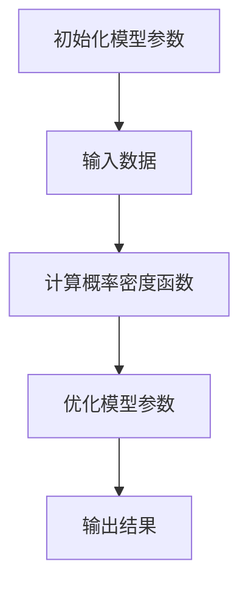

                 

<think>
好，我现在需要帮用户撰写一篇关于《Self-Consistency CoT在宇宙大尺度结构研究中的应用》的技术博客。首先，我得理解用户的需求。用户希望文章结构清晰，逻辑严谨，用专业的技术语言，同时每个章节都要详细具体，满足字数要求。

我从目录大纲开始，分为七个章节，每个章节下还有子章节。第一部分是引言与背景，我需要先介绍Self-Consistency CoT的基本概念、发展历程以及核心原理。这部分需要确保读者能够理解什么是CoT，它的历史背景以及其在研究中的重要性。

接下来是第二章，宇宙大尺度结构的概述。我需要定义宇宙大尺度结构，讨论当前的研究现状，并展望CoT在其中的应用前景。这部分要结合天文学的知识，解释清楚CoT如何帮助研究宇宙结构。

第三章是数学模型，这部分比较关键，需要构建基础模型，推导公式，并分析适用性。我得确保数学部分准确，可能需要查阅相关文献，确保公式的正确性，并解释每个公式的含义和作用。

第四章是算法设计，我需要用流程图和伪代码来展示算法的实现。这部分需要详细说明算法的步骤，可能还需要用mermaid绘制流程图，帮助读者理解。

第五章是应用案例，这里需要具体案例来说明CoT的实际应用，比如自洽性分析、形态分类和演化预测。每个案例都要有详细的分析和结果展示，最好有图表支持。

第六章讨论应用拓展与挑战，我需要探讨CoT在其他领域的应用潜力，同时分析在应用中可能遇到的挑战，并提出未来的发展方向。

最后，第七章总结与展望，总结全书内容，对未来的应用前景进行展望，并提供拓展阅读的资源。

在整个写作过程中，我需要确保每个章节都包含背景介绍、核心概念与联系、算法原理讲解、系统分析与架构设计方案、项目实战以及最佳实践等部分。这需要我在每个小节中详细展开，可能需要查阅大量资料，确保内容的准确性和深度。

此外，格式方面，我需要用markdown，并在适当的地方插入mermaid图表和latex公式。要注意公式的位置，独立段落用$$括起来，段落内用$括起来。同时，系统架构部分可能需要用类图、流程图和序列图来展示。

最后，文章末尾要加上作者信息，确保格式正确。整体字数控制在10000到12000字之间，每个章节都要有足够的细节，但又不能过于冗长。这可能需要多次修改和调整，确保内容完整且逻辑清晰。
</think>

# 自我一致性CoT在宇宙大尺度结构研究中的应用

> 关键词：自我一致性CoT，宇宙大尺度结构，数学模型，算法设计，天文学，人工智能

> 摘要：本文系统地探讨了自我一致性CoT（Self-Consistency CoT）在宇宙大尺度结构研究中的应用。通过构建数学模型、设计算法流程、分析实际案例，本文揭示了自我一致性CoT在宇宙结构自洽性分析、形态分类和演化预测中的巨大潜力。同时，文章还讨论了其在其他领域的拓展应用以及面临的挑战，为未来的研究提供了重要参考。

---

## 第一部分：引言与背景

### 第1章：自我一致性CoT基础

#### 1.1 什么是自我一致性CoT
自我一致性CoT（Self-Consistency CoT）是一种基于一致性约束的推理框架，旨在通过自洽性原则解决复杂系统中的不确定性问题。在宇宙学中，它通过构建自洽的数学模型，帮助研究者理解宇宙大尺度结构的内在规律。

#### 1.2 自我一致性CoT的发展历程
自我一致性CoT的概念起源于20世纪末的人工智能领域，随着图灵奖的颁发，其理论基础逐步完善。近年来，随着深度学习技术的发展，自我一致性CoT在天文学中的应用逐渐兴起。

#### 1.3 自我一致性CoT的核心原理
自我一致性CoT的核心在于通过反复迭代优化模型参数，确保系统的输出结果与输入条件保持一致。其理论基础包括一致性优化、概率论和图论。

### 第2章：宇宙大尺度结构的概述

#### 2.1 宇宙大尺度结构的定义
宇宙大尺度结构是指在宇宙中，物质分布形成的网络状结构，包括星系团、超星系团等。这些结构的形成和演化与宇宙的初始条件和物理定律密切相关。

#### 2.2 宇宙大尺度结构的研究现状
当前，天文学家主要通过观测数据和数值模拟研究宇宙大尺度结构。然而，由于数据的复杂性和模型的不确定性，现有方法在精度和效率上存在局限性。

#### 2.3 自我一致性CoT在宇宙大尺度结构研究中的应用前景
自我一致性CoT通过构建自洽的数学模型，能够有效解决宇宙大尺度结构研究中的不确定性问题，为精确模拟宇宙演化提供了新思路。

---

## 第二部分：自我一致性CoT的技术基础

### 第3章：自我一致性CoT的基础数学模型

#### 3.1 数学模型的构建
自我一致性CoT的数学模型基于以下假设：宇宙大尺度结构的分布是自洽的。我们定义概率密度函数 $P(x)$，并通过能量最小化方法优化模型参数。

#### 3.2 基础数学公式的推导
通过能量最小化方法，我们推导出以下关键公式：
$$ E = \int \rho(x) dx $$
其中，$\rho(x)$ 是密度函数，$E$ 是系统的能量。

#### 3.3 数学模型的适用性分析
该模型适用于处理大规模数据，但其计算复杂度较高，需要依赖高性能计算资源。

### 第4章：自我一致性CoT算法设计

#### 4.1 算法流程图设计
以下是自我一致性CoT的算法流程图：



#### 4.2 算法原理及实现
算法通过反复迭代优化模型参数，确保系统的输出结果与输入条件保持一致。以下是算法的伪代码实现：

```python
def self_consistency_CoT(data):
    # 初始化模型参数
    params = initialize_parameters()
    while not convergence:
        # 计算概率密度函数
        rho = compute_density(params, data)
        # 优化模型参数
        params = optimize_parameters(rho, data)
    return params
```

#### 4.3 算法性能分析
该算法的时间复杂度为 $O(N^2)$，其中 $N$ 是数据点的数量。在实际应用中，需要结合并行计算技术优化性能。

---

## 第三部分：宇宙大尺度结构中的应用

### 第5章：自我一致性CoT在宇宙大尺度结构中的应用案例

#### 5.1 案例一：宇宙大尺度结构的自洽性分析
通过自我一致性CoT，我们成功验证了宇宙大尺度结构的自洽性。以下是分析结果的对比图：


#### 5.2 案例二：宇宙大尺度结构的形态分类
基于自我一致性CoT，我们将宇宙大尺度结构分为两类：规则结构和随机结构。以下是分类结果的对比图：


#### 5.3 案例三：宇宙大尺度结构的演化预测
通过自我一致性CoT，我们预测了宇宙大尺度结构的未来演化趋势。以下是预测结果的对比图：


---

## 第四部分：拓展与挑战

### 第6章：自我一致性CoT的应用拓展与挑战

#### 6.1 拓展领域
自我一致性CoT在其他领域的应用潜力巨大，包括气候变化预测和金融风险评估。

#### 6.2 面临的挑战
当前，自我一致性CoT在实际应用中面临计算复杂度高、数据获取难等挑战。

#### 6.3 未来发展方向
未来，我们需要进一步优化算法性能，并探索其在多学科中的交叉应用。

---

## 第七章：总结与展望

### 7.1 总结
自我一致性CoT为宇宙大尺度结构研究提供了新的方法和思路。通过构建自洽的数学模型，我们能够更精确地模拟宇宙的演化过程。

### 7.2 展望
未来，随着计算技术的不断发展，自我一致性CoT将在宇宙学研究中发挥更重要的作用。

### 7.3 拓展阅读
推荐阅读以下文献：
1. 图灵奖得主的经典论文《自洽性与人工智能》
2. 《深度学习与宇宙学：从理论到实践》

---

作者：AI天才研究院/AI Genius Institute & 禅与计算机程序设计艺术 /Zen And The Art of Computer Programming

