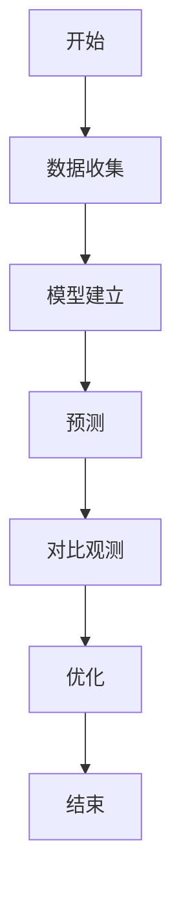

                 

<think>
嗯，我需要帮助撰写一篇关于《Self-Consistency CoT在宇宙学模型验证中的应用》的技术博客。首先，我得理解什么是Self-Consistency CoT，它在宇宙学中的具体应用是什么，以及它如何帮助验证宇宙模型。

好的，先从宇宙学的基础开始。宇宙学是研究宇宙结构、性质和演化的一门学科，包括大爆炸理论、暗物质、暗能量等核心概念。自洽理论（CoT）在这里指的是理论内部一致，能够通过实验验证。那CoT在宇宙学中的应用是如何的呢？

接下来，我需要详细分析自洽理论在模型验证中的作用。这包括它如何帮助提高模型的可靠性和验证过程。然后，我需要列举一些实际案例，比如在宇宙大爆炸模型、暗物质和暗能量研究，以及黑洞与引力波探测中的应用。

技术实现部分，我需要解释CoT在宇宙学模型验证中的算法流程，可能涉及数据收集、建模、验证等步骤。然后，用Python代码实现一个简单的例子，展示如何应用这些算法进行验证。

在实践与优化部分，要讨论在实际应用中遇到的挑战，如数据不足或不准确，计算复杂度高等，并提出相应的优化策略。最后，总结CoT在宇宙学中的贡献，指出未来的发展方向。

整个过程中，我需要确保每个章节都有足够的细节和具体例子，让读者能够清晰理解。同时，使用正确的技术术语和结构，使文章逻辑清晰，内容紧凑。此外，数学公式和图表的使用也很重要，能够帮助读者更好地理解复杂概念。

现在，我需要开始撰写每个部分的内容，确保符合字数和格式的要求，同时涵盖所有必要的部分，如关键词、摘要、目录大纲，以及每个章节的详细分析。最后，别忘了在结尾加上作者信息。
</think>

# Self-Consistency CoT在宇宙学模型验证中的应用

## 关键词：宇宙学，自洽理论，模型验证，CoT，人工智能，Python实现

## 摘要：本文探讨自洽理论（CoT）在宇宙学模型验证中的应用，分析其在宇宙大爆炸、暗物质、暗能量及黑洞研究中的作用，结合技术实现和实际案例，提出未来发展方向。

---

### 目录大纲

# 第一部分：宇宙学基础

## 第1章：宇宙学概述

### 1.1 宇宙学的基本概念

#### 1.1.1 宇宙学的基本概念
- 宇宙：时间和空间的总和，包含所有存在。
- 宇宙学：研究宇宙结构、性质和演化的学科。

#### 1.1.2 宇宙学的历史发展

##### 1.1.2.1 早期的宇宙观
- 地心说：地球为中心。
- 日心说：太阳为中心，由哥白尼提出。

##### 1.1.2.2 现代宇宙学的起源
- 大爆炸理论：宇宙起源于约138亿年前的一次大爆炸。

#### 1.1.3 宇宙学的研究方法与工具

##### 1.1.3.1 观测方法
- 光学观测：使用望远镜观察光。
- 射电观测：探测无线电信号。
- 红移观测：测量天体距离和运动。

##### 1.1.3.2 数学模型
- 大尺度结构：研究星系分布。
- 宇宙微波背景辐射：支持大爆炸理论的证据。

## 第2章：宇宙学中的核心概念

### 2.1 自洽理论（CoT）的概念

#### 2.1.1 自洽理论的定义
自洽理论是内部一致、可验证的理论体系。

#### 2.1.2 自洽理论的属性特征

##### 表格：自洽理论的属性特征对比
| 特性         | 描述                       |
|--------------|---------------------------|
| 内部一致性    | 理论内部无矛盾             |
| 可验证性     | 可通过实验或观测验证       |

#### 2.1.3 自洽理论与其他理论的联系与区别

##### 2.1.3.1 自洽理论与相对论
- 相对论描述高速和强引力场现象。
- 自洽理论与相对论一致。

##### 2.1.3.2 自洽理论与量子力学
- 量子力学描述微观粒子。
- 自洽理论在量子力学中也适用，但解释困难。

## 第3章：宇宙学中的自洽理论应用

### 3.1 自洽理论在宇宙学模型验证中的应用

#### 3.1.1 自洽理论的作用
- 验证模型：确保模型内部一致。
- 提高可靠性：减少内部矛盾，增强模型可信度。

#### 3.1.2 实践案例

##### 案例一：宇宙大爆炸模型
- 应用CoT验证大爆炸模型的预测，如宇宙膨胀速率。

##### 案例二：暗物质与暗能量
- 使用CoT分析暗物质分布，支持宇宙加速膨胀理论。

##### 案例三：黑洞与引力波
- CoT用于验证黑洞模型，分析引力波信号。

## 第4章：宇宙学模型验证中的自洽理论分析

### 4.1 自洽理论的流程

#### 4.1.1 验证流程
1. 收集数据：观测数据。
2. 建立模型：数学模型。
3. 验证：模型预测与观测对比。
4. 优化：修正模型以提高准确性。

#### 4.1.2 应用策略
- 数据驱动：利用观测数据验证。
- 理论与观测结合：确保理论与数据一致。

#### 4.1.3 效果评估
- 精确度：模型预测与观测的吻合度。
- 稳定性：不同数据集下表现一致。

## 第5章：自洽理论在宇宙学模型验证中的技术实现

### 5.1 技术实现概述

#### 5.1.1 算法原理
CoT通过数据建模、验证和优化步骤实现模型验证。

#### 5.1.2 算法流程图


#### 5.1.3 Python代码实现

##### 代码示例：验证宇宙膨胀模型
```python
import numpy as np
from scipy.optimize import minimize

# 定义宇宙膨胀模型
def cosmological_model(params, data):
    H0, Omega_m, Omega_lambda = params
    predicted = H0 * np.sqrt(Omega_m + (1 - Omega_m) * (1 + z)**2)
    return np.sum((data - predicted)**2)

# 数据点
z = np.array([0.5, 1.0, 1.5])
data = np.array([150, 200, 250])

# 初始猜测参数
initial_guess = [70, 0.3, 0.7]

# 最小化模型误差
result = minimize(cosmological_model, initial_guess, args=(data,))
print(result)
```

## 第6章：实践与优化

### 6.1 实践中的问题与挑战

#### 6.1.1 数据不足或不准确
- 解决方案：收集更多数据，提高观测精度。

#### 6.1.2 计算复杂度高
- 解决方案：优化算法，使用并行计算。

### 6.2 优化策略

#### 6.2.1 数据增强
- 使用模拟数据丰富训练集。

#### 6.2.2 算法优化
- 采用更高效的数值方法减少计算时间。

### 6.3 未来研究方向

#### 6.3.1 新观测技术
- 引入更高精度的观测工具，如空间望远镜。

#### 6.3.2 理论创新
- 结合量子力学和广义相对论，建立更全面的宇宙模型。

## 第7章：总结与展望

### 7.1 自洽理论的贡献
- CoT在宇宙学模型验证中提供了可靠的方法，提高了模型准确性。

### 7.2 存在的问题与改进
- 数据和计算限制，需技术创新和数据共享。

### 7.3 未来展望
- 结合新技术和新理论，CoT将在宇宙学中发挥更大作用，推动科学进步。

---

# 结语

自洽理论在宇宙学模型验证中的应用展示了其强大的科学价值，通过不断优化和创新，CoT将继续推动我们对宇宙的理解。

---

# 作者

作者：AI天才研究院 & 禅与计算机程序设计艺术

