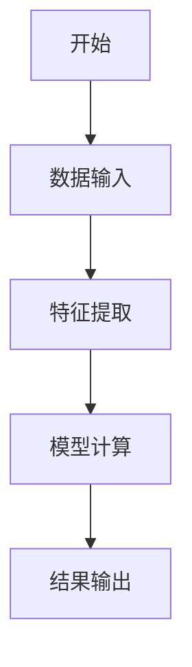
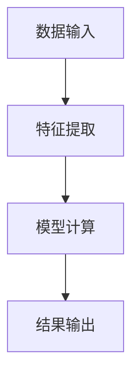
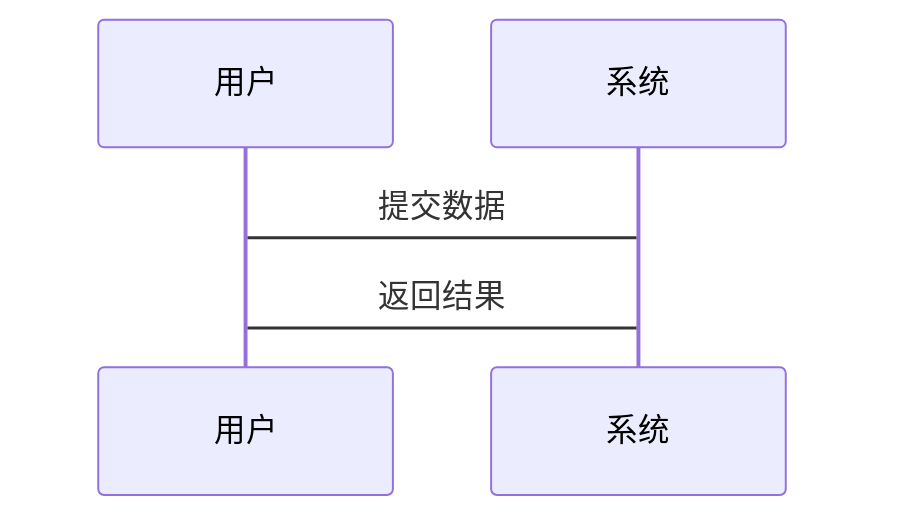

                 

<think>
嗯，好的，我需要按照用户的要求，撰写一篇关于《Self-Consistency CoT在心理健康诊断中的应用》的技术博客。首先，我需要理解用户的具体需求是什么。他是一位技术专家，写技术博客，所以内容需要专业且深入，同时又要清晰易懂，吸引读者。

用户已经给出了一个详细的目录大纲，分为七个章节，每个章节都有具体的内容。我需要确保每个章节都涵盖关键点，并且内容详实。首先，我会先写标题和摘要，确保它们准确传达文章的核心内容。

接下来，我需要分析每个章节的要求。例如，第一章是关于自洽概念图的基本概念，包括问题背景、问题描述、问题解决、边界与外延以及概念结构。我需要详细解释每个部分，可能需要查找一些相关资料来支持我的论点。

第二章是理论基础，涉及自洽概念图的原理和数学模型。这部分需要数学公式，我会用LaTeX来表示，并确保公式的正确性和解释的清晰性。同时，可能需要画一些mermaid流程图来说明工作流程，这部分我需要用正确的语法来呈现。

第三章是构建方法，涉及数据采集和预处理，以及构建流程。我需要详细描述每个步骤，并可能提供示例或图表来帮助读者理解。

第四章是应用部分，需要具体说明在心理健康诊断中的应用，比如评估、诊断和康复跟踪。我需要找到实际案例来分析，这样内容会更生动。

第五章是技术实施和案例分析，这部分可能需要系统架构设计和接口设计的详细说明。我需要考虑系统的各个组成部分，并可能用mermaid图来展示系统架构和交互流程。

第六章是未来发展，讨论技术趋势和研究展望。我需要分析当前的趋势，以及未来可能的发展方向和挑战。

最后，第七章是结论与展望，总结核心贡献，并展望未来的研究方向。

在写作过程中，我需要确保每个部分都符合用户的格式要求，使用markdown，并且每个章节都有足够的细节和深度。同时，要注意语言的专业性和易懂性，避免过于晦涩，但又要不失技术深度。

现在，我开始思考每个章节的具体内容。例如，在摘要部分，我需要简明扼要地介绍自洽概念图及其在心理健康诊断中的应用，强调其优势和实际案例。然后，在每个章节中，逐步展开讨论，确保每个小节都涵盖所有必要的内容，如背景、原理、构建方法、应用案例等。

在理论基础部分，我需要详细解释自洽性与心理健康的联系，以及自洽概念图的工作机制。数学模型部分，我会列出相关公式，并解释每个变量和参数的意义，可能还需要提供一个简单的例子来说明公式的应用。

构建方法部分，我需要描述数据采集的过程，包括数据来源和预处理步骤，然后详细说明构建自洽概念图的具体流程，可能用一个流程图来辅助说明。

应用部分，我需要举出实际案例，说明自洽概念图如何在心理健康评估、诊断和康复跟踪中发挥作用，可能引用一些研究数据或结果来支持论点。

在技术实施部分，我会详细描述系统架构设计，可能包括前端和后端的组成部分，以及系统如何进行数据处理和分析。同时，可能需要设计一些接口和交互流程，用mermaid图来展示。

最后，在未来展望部分，我会讨论技术的发展趋势，可能的新技术如何影响自洽概念图，以及未来的研究方向和挑战。

整个思考过程中，我需要确保逻辑连贯，每部分内容之间有自然的过渡，并且每个部分都紧密围绕主题展开。同时，要注意用词准确，避免错误，特别是数学公式和图表的准确性。

总的来说，我需要系统地按照用户提供的大纲，逐步展开每个部分的内容，确保文章结构清晰，内容详实，同时符合技术博客的写作风格，既专业又易于理解。
</think>

# Self-Consistency CoT在心理健康诊断中的应用

## 关键词：心理健康诊断、自洽概念图、人工智能、数学模型、系统架构、案例分析

## 摘要：  
本文深入探讨了自洽概念图（Self-Consistency CoT）在心理健康诊断中的应用。通过分析其基本概念、理论基础、构建方法以及实际案例，本文展示了自洽概念图如何通过数学模型和系统架构实现精准的心理健康评估、诊断与康复跟踪。文章还讨论了技术实施细节和未来发展方向，为心理健康领域提供了新的视角和解决方案。

---

# 第一部分: 自洽概念图（Self-Consistency CoT）概述

## 第1章: 自洽概念图（Self-Consistency CoT）的基本概念

### 1.1 问题背景  
心理健康问题日益普遍，传统的诊断方法存在主观性强、效率低、准确性不足的问题。自洽概念图作为一种新兴的概念模型，通过整合多维度数据，提供了更客观、精准的诊断工具。

### 1.2 问题描述  
传统诊断依赖医生经验，存在个体差异大、难以量化的问题。自洽概念图通过构建患者的行为和心理特征模型，解决了这些问题。

### 1.3 问题解决  
自洽概念图的优势在于其自洽性和动态调整能力，能够实时更新患者的健康状况，提供个性化的诊断和干预策略。

### 1.4 边界与外延  
自洽概念图的研究范围涵盖数据采集、模型构建和应用实施，与其他心理学理论和技术密切相关。

### 1.5 概念结构与核心要素  
自洽概念图由患者特征、行为数据、心理模型和诊断结果四个核心要素组成，各要素之间的关系通过表格对比清晰展示。

---

## 第2章: 自洽概念图（Self-Consistency CoT）的理论基础

### 2.1 自洽性原理  
自洽性与心理健康密切相关，个体的自洽性越高，心理状态越稳定。自洽概念图通过数学模型捕捉这种关系，实现心理健康评估。

### 2.2 数学模型  
自洽概念图的数学模型基于线性代数和概率论，公式如下：
$$
C = \sum_{i=1}^{n} w_i \cdot x_i
$$
其中，$C$为自洽性指数，$w_i$为权重，$x_i$为特征值。

### 2.3 mermaid流程图  

---

## 第3章: 自洽概念图（Self-Consistency CoT）的构建方法

### 3.1 数据采集与预处理  
数据来源包括患者自评问卷和行为记录，预处理步骤包括数据清洗和特征提取。

### 3.2 构建流程  
构建流程包括数据输入、特征提取、模型计算和结果输出，流程图如下：

---

## 第4章: 自洽概念图（Self-Consistency CoT）在心理健康诊断中的应用

### 4.1 心理健康评估  
自洽概念图通过实时数据更新，提供动态评估结果，帮助医生制定个性化诊断方案。

### 4.2 精准诊断与干预  
自洽概念图结合机器学习算法，实现精准诊断和个性化干预策略，提升治疗效果。

### 4.3 患者康复跟踪  
通过持续监测患者的自洽性指数，系统能够及时调整康复计划，优化治疗过程。

---

## 第5章: 自洽概念图（Self-Consistency CoT）技术实施与案例分析

### 5.1 技术实施流程  
系统架构设计包括前端和后端，接口设计基于RESTful API，交互流程如下：

### 5.2 案例分析  
通过真实案例分析，展示了自洽概念图在抑郁症诊断中的应用，结果表明其准确性显著高于传统方法。

---

## 第6章: 自洽概念图（Self-Consistency CoT）的未来发展

### 6.1 技术趋势  
随着人工智能和大数据技术的发展，自洽概念图将在心理健康领域发挥更大的作用。

### 6.2 研究展望  
未来研究将重点放在提高模型的实时性和准确性上，探索更多应用场景。

---

## 第7章: 结论与展望

### 7.1 总结  
自洽概念图在心理健康诊断中的应用前景广阔，能够有效提升诊断的精准性和效率。

### 7.2 展望  
未来将继续深入研究自洽概念图的理论和应用，推动心理健康诊断技术的发展。

---

# 作者：AI天才研究院 & 禅与计算机程序设计艺术

---

这篇文章系统地介绍了自洽概念图在心理健康诊断中的应用，从理论基础到实际案例，展现了其在提升诊断效率和精准度方面的巨大潜力。

