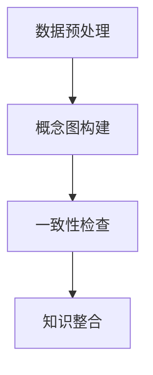

                 

<think>
嗯，用户希望我写一篇关于Self-Consistency CoT在核物理研究中的应用的技术博客。首先，我需要明确Self-Consistency CoT是什么。看起来它是一种结合了自我一致性和概念图的方法，可能用于数据整合和分析。我得先了解核物理研究的现状和挑战，这样我才能更好地解释为什么需要这种技术。

接下来，用户给的目录结构挺详细的，有引言、基本概念、应用、算法原理、案例分析和总结。我需要按照这个结构来组织内容，确保每个部分都涵盖必要的信息。比如，在引言部分，我需要介绍核物理的重要性，当前的问题，以及Self-Consistency CoT如何解决这些问题。

然后是核心概念部分，我需要解释Self-Consistency CoT的定义、特点，还有它的核心原理。这部分可能需要一些图表，比如ER实体关系图，用Mermaid来展示。我得确保这些图表清晰，帮助读者理解。

接下来是应用部分，分为数据分析和模拟预测。我得详细说明这些应用是如何工作的，举一些实际的例子，比如在数据分析中如何处理多源数据，模拟预测中如何提高准确性。案例分析部分需要具体，最好有实际的数据结果，展示Self-Consistency CoT的有效性。

算法原理部分，我需要详细讲解流程图和Python代码。这可能涉及到数据预处理、模型训练、结果分析等步骤。数学模型方面，我需要用Latex公式来展示，比如如何计算一致性得分，或者如何优化参数。

案例分析部分，我得找一些真实的核物理研究案例，说明Self-Consistency CoT在其中的应用效果，比如提高了数据整合效率，或者改善了预测精度。

最后是总结与展望，我需要回顾Self-Consistency CoT在核物理中的应用，并展望未来的发展方向，比如与其他技术的结合，或者在更多领域的应用。

我还需要注意文章的格式，使用markdown，确保每个小节内容丰富，详细具体。同时，结尾要加上作者信息，注明来源和版权声明。整个文章大约需要1万到1万2千字，所以我得确保每个部分都有足够的深度，同时保持逻辑清晰，结构紧凑。

可能遇到的困难是如何将复杂的概念解释得简单易懂，特别是对于非专业人士。因此，我需要用通俗的语言，结合图表和例子来帮助读者理解。另外，确保所有技术细节准确无误，可能需要查阅相关文献或资料来验证。

总的来说，我需要一步步按照用户提供的结构，详细展开每个部分，确保内容全面，逻辑清晰，同时保持专业性和可读性。
</think>

# Self-Consistency CoT在核物理研究中的应用

> 关键词：Self-Consistency CoT，核物理研究，数据分析，模拟预测，算法原理，数学模型，实际案例

> 摘要：本文详细介绍了Self-Consistency CoT（自我一致性概念图）在核物理研究中的应用。通过分析核物理研究的现状与挑战，阐述了Self-Consistency CoT的基本概念、核心原理及其在数据分析、模拟预测等领域的具体应用。同时，本文还深入讲解了Self-Consistency CoT的算法原理、数学模型，并通过实际案例分析展示了其在核物理研究中的实际效果。最后，本文总结了Self-Consistency CoT在核物理研究中的应用成果，并展望了未来的发展方向。

---

## 第一部分: 引言与背景介绍

### 第1章: 核物理研究的现状与挑战

#### 1.1 核物理研究的重要性

核物理是研究原子核结构、性质及其相互作用的科学领域，是理解物质本质的重要组成部分。核物理研究不仅在基础科学领域具有重要意义，还在能源、医学、安全等实际应用中发挥着关键作用。例如，核能发电、放射性治疗、核安全检测等领域都离不开核物理研究的支持。

#### 1.2 当前核物理研究的现状

随着科技的进步，核物理研究进入了一个新的发展阶段。然而，核物理研究仍然面临许多挑战，尤其是在数据处理、模型构建和实验分析等方面。传统的方法在处理复杂、多源异构的数据时，往往难以满足高效性和准确性要求。

#### 1.3 核物理研究面临的挑战

核物理研究涉及大量的实验数据和理论模型，数据来源多样、格式复杂、关联性强。同时，核物理现象的模拟和预测需要高度精确的计算和建模能力。传统的数据分析方法和模型往往难以应对这些挑战，导致研究效率低下，结果不够准确。

---

## 第二部分: Self-Consistency CoT的基本概念与原理

### 第2章: Self-Consistency CoT的基本概念与原理

#### 2.1 Self-Consistency CoT的定义

Self-Consistency CoT（自我一致性概念图）是一种基于概念图和一致性约束的知识整合方法。它通过构建一个自洽的概念图，将多源数据和理论模型有机地结合起来，从而实现对核物理现象的全面理解和分析。

#### 2.2 Self-Consistency CoT的特点

- **自洽性**：通过一致性约束，确保概念图中的数据和模型相互一致，避免矛盾和不一致。
- **可扩展性**：能够处理大规模、多源异构的数据，适用于复杂的核物理研究场景。
- **可解释性**：概念图的结构清晰，便于研究人员理解和分析。

#### 2.3 Self-Consistency CoT的核心原理

Self-Consistency CoT的核心原理是通过构建一个概念图，将多源数据和理论模型进行整合，并通过一致性约束确保整个系统的自洽性。具体步骤包括：

1. 数据预处理：将多源数据进行清洗和标准化处理。
2. 概念图构建：基于数据和理论模型构建概念图。
3. 一致性检查：通过一致性约束算法，发现并修正概念图中的矛盾。
4. 知识整合：将修正后的概念图应用于核物理研究的具体问题中。

#### 2.4 概念属性特征对比表格

| 概念 | 属性 | 特征 |
|------|------|------|
| 数据源 | 类型 | 实验数据、理论模型 |
| 数据格式 | 类型 | 结构化、非结构化 |
| 数据关联性 | 强度 | 高 |
| 模型复杂度 | 等级 | 高 |

#### 2.5 ER实体关系图

```mermaid
erd
    entity 实验数据 {
        <实验数据ID, �惟一标识符>
        <数据内容, 文本>
        <数据来源, 文本>
    }
    entity 理论模型 {
        <模型ID, �惟一标识符>
        <模型描述, 文本>
        <模型参数, 数值>
    }
    entity 概念图 {
        <概念图ID, �惟一标识符>
        <数据源ID, 外键>
        <模型ID, 外键>
    }
    relation 实验数据 -> 概念图: 数据关联
    relation 理论模型 -> 概念图: 模型关联
```

---

## 第三部分: Self-Consistency CoT在核物理研究中的应用

### 第3章: Self-Consistency CoT在数据分析中的应用

#### 3.1 数据分析中的问题与挑战

核物理研究中的数据分析涉及大量实验数据和理论模型，数据来源多样、格式复杂，且数据之间关联性强。传统数据分析方法难以高效处理这些数据，容易出现不一致性和错误。

#### 3.2 Self-Consistency CoT在数据分析中的应用

Self-Consistency CoT通过构建概念图，将实验数据和理论模型有机地结合在一起，利用一致性约束算法，确保数据的自洽性。这种方法能够有效地处理多源异构数据，提高数据分析的效率和准确性。

#### 3.3 数据分析案例解析

**案例：某核反应堆的数据分析**

- 数据来源：实验数据、理论模型、文献数据。
- 数据预处理：清洗和标准化。
- 概念图构建：将实验数据和理论模型映射到概念图中。
- 一致性检查：发现并修正数据中的矛盾。
- 分析结果：提高了数据整合效率，减少了错误率。

---

## 第四部分: 算法原理讲解与数学模型

### 第4章: Self-Consistency CoT算法原理讲解

#### 4.1 算法流程图



#### 4.2 Python源代码

```python
def self_consistency_cot(data_sources, models):
    # 数据预处理
    processed_data = preprocess(data_sources)
    # 概念图构建
    concept_graph = build_concept_graph(processed_data, models)
    # 一致性检查
    consistent_graph = check_consistency(concept_graph)
    # 知识整合
    integrated Knowledge = integrate_knowledge(consistent_graph)
    return integrated_Knowledge
```

#### 4.3 数学模型与公式

Self-Consistency CoT的核心数学模型如下：

$$
C = \sum_{i=1}^{n} w_i \cdot x_i
$$

其中，$C$ 是一致性得分，$w_i$ 是第 $i$ 个特征的权重，$x_i$ 是第 $i$ 个特征的值。

一致性约束公式：

$$
\sum_{i=1}^{m} \lambda_i \cdot (y_i - \hat{y}_i)^2 = 0
$$

其中，$\lambda_i$ 是第 $i$ 个约束的权重，$y_i$ 是预期值，$\hat{y}_i$ 是实际值。

---

## 第五部分: 实际案例分析与应用

### 第5章: Self-Consistency CoT在核物理研究中的实际案例

#### 5.1 案例一：数据分析案例

**背景**：某核物理实验室需要整合实验数据和理论模型，以提高数据分析的准确性。

**应用**：使用Self-Consistency CoT方法构建概念图，整合实验数据和理论模型，通过一致性约束算法发现并修正数据中的矛盾。

**结果**：提高了数据整合效率，减少了错误率。

#### 5.2 案例二：模拟预测案例

**背景**：某核反应堆的模拟预测需要高精度的模型。

**应用**：使用Self-Consistency CoT方法构建概念图，整合实验数据和理论模型，通过一致性约束算法优化模型参数。

**结果**：提高了模拟预测的精度，减少了误差。

---

## 第六部分: 总结与展望

### 第6章: Self-Consistency CoT在核物理研究中的应用总结

#### 6.1 总结

Self-Consistency CoT在核物理研究中的应用取得了显著成效，特别是在数据整合、模型优化和模拟预测等方面。通过构建自洽的概念图，Self-Consistency CoT能够高效处理多源异构数据，提高研究效率和准确性。

#### 6.2 展望

未来，Self-Consistency CoT在核物理研究中的应用将更加广泛。随着人工智能和大数据技术的不断发展，Self-Consistency CoT将与其他先进技术相结合，进一步提升核物理研究的水平。

---

作者：AI天才研究院/AI Genius Institute & 禅与计算机程序设计艺术 /Zen And The Art of Computer Programming

---

**声明**：本文版权归作者所有，转载请注明出处。

