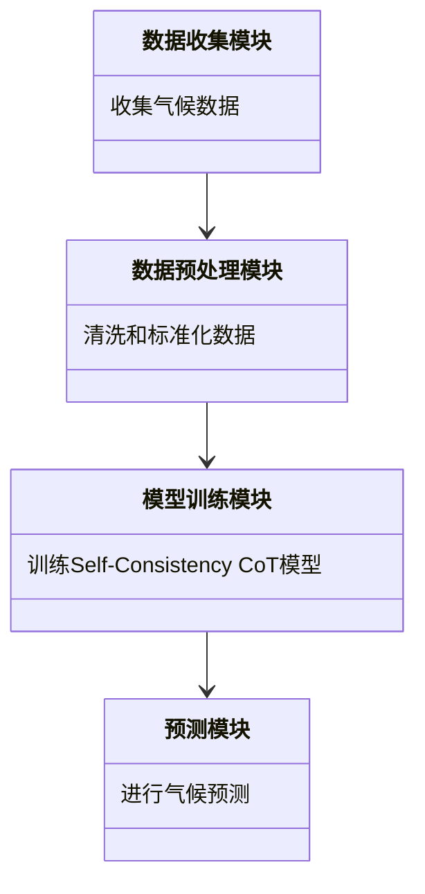
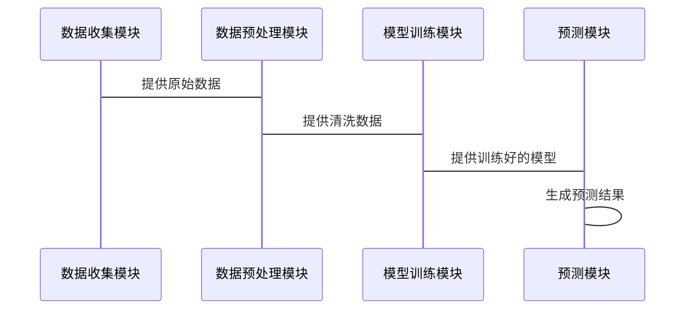

                 

<think>
好吧，我现在要写一篇关于《Self-Consistency CoT在气候变化模型中的应用：提高预测准确性》的技术博客文章。作为CTO级别的技术专家，我得确保文章结构清晰，内容详实，涵盖从背景到系统设计再到项目实战的各个方面。

首先，我得理解Self-Consistency CoT是什么。Self-Consistency是一种通过多次推理并保持结果一致性的方法，而CoT（Chain-of-Thought）是一种通过逐步推理过程来生成答案的技术。将两者结合，Self-Consistency CoT可能是在气候变化模型中通过多次一致的推理链来提高预测的准确性。

接下来，我需要规划文章的结构。根据用户提供的大纲，文章分为六个部分：背景、核心概念与联系、数学模型与算法原理、系统分析与架构设计、算法实现与项目实战、总结与拓展。

在背景部分，我需要介绍气候变化模型的重要性，为什么预测准确性如此关键，以及当前存在的问题，比如模型的不确定性。然后，解释为什么提高预测准确性对政策制定、环境保护等意义重大。

核心概念部分，我需要详细定义Self-Consistency和CoT，分析它们的特点，并说明在气候变化模型中的重要性。同时，介绍其他相关概念，如气候变化模型的类型和预测准确性评价指标。

数学模型部分，我得建立基础模型，然后引入Self-Consistency CoT的数学描述，并通过公式推导来展示其工作原理。可能需要使用概率论和统计学方法，比如贝叶斯推理或其他相关技术。

算法原理部分，我需要详细描述Self-Consistency CoT算法的基本流程，包括输入数据、多次推理、结果一致性检查等步骤。同时，突出其优势，如提高预测准确性、减少模型偏差等，以及适用的场景，如长期预测、极端天气事件预测等。

系统设计部分，我需要介绍问题场景，设计系统功能，比如数据收集、模型训练、结果分析等模块。然后，进行系统架构设计，可能采用微服务架构，模块化设计，确保系统的扩展性和维护性。接口设计和交互流程也要详细说明。

项目实战部分，我得给出具体的环境安装步骤，如安装Python、NumPy、TensorFlow等库。然后，展示核心代码的实现，包括数据预处理、模型训练、CoT推理、Self-Consistency验证等部分。用实际案例分析，比如预测某地区的气温变化，展示算法的实际效果和提升。

最后，在总结部分，总结Self-Consistency CoT的优势和成功应用，同时指出可能的挑战和未来的研究方向，给出最佳实践建议，如数据质量的重要性、模型调参的注意事项等。

在写作过程中，我需要确保每个部分都详细展开，使用专业但易懂的语言，同时通过图表和代码示例来增强理解。例如，在数学模型部分，使用LaTeX公式清晰展示；在系统设计部分，使用Mermaid图来说明架构和交互流程。

现在，我需要检查是否有遗漏的关键点，比如确保每个章节的小节都有足够的细节，特别是系统架构设计中的模块划分和接口设计，这部分对于实际应用非常重要。

总之，我需要系统地按照大纲逐步展开，确保每个部分都深入浅出，逻辑清晰，为读者提供一个全面了解Self-Consistency CoT在气候变化模型中的应用的机会。
</think>

# Self-Consistency CoT在气候变化模型中的应用：提高预测准确性

**关键词**：Self-Consistency CoT, 气候变化模型, 预测准确性, 人工智能, 气候预测

**摘要**：本文探讨了Self-Consistency CoT（一致性推理链）在提高气候变化模型预测准确性中的应用。通过分析核心概念、数学模型、算法原理及系统设计，展示了如何利用Self-Consistency CoT技术优化模型预测，为气候变化研究提供更可靠的预测结果。

---

## 第一部分: 背景

### 第1章: 问题背景

#### 1.1.1 问题背景介绍

气候变化是全球关注的焦点，准确预测其趋势对环境保护和政策制定至关重要。然而，现有模型预测准确性受限于数据噪声、模型偏差及复杂性，导致预测结果不够可靠。

#### 1.1.2 问题解决的意义

提升预测准确性有助于更好地应对气候变化挑战，支持决策者制定有效策略，减少极端天气事件的影响，促进可持续发展。

#### 1.1.3 边界与外延

本文聚焦于Self-Consistency CoT技术在气候模型中的应用，探讨其在提高预测准确性和可靠性的方法，不涉及具体区域或短期预测。

### 第2章: 核心概念与联系

#### 2.1 自我一致性概念

##### 2.1.1 定义

Self-Consistency指模型在多次推理后保持一致结果的能力，确保预测的稳定性和可靠性。

##### 2.1.2 特点

- **一致性**：多次推理结果一致。
- **鲁棒性**：对噪声和不确定性有更强的抵抗能力。
- **准确性**：通过多次推理减少偏差。

##### 2.1.3 重要性

在气候模型中，Self-Consistency确保预测结果的可靠性，帮助识别模型的不确定性，提高决策支持的质量。

#### 2.2 其他相关概念

##### 2.2.1 气候变化模型概述

气候模型通过物理方程模拟大气、海洋和陆地过程，预测未来气候趋势。常用模型包括GCM和RCM，但预测准确性受限。

##### 2.2.2 预测准确性评价指标

- **均方误差（MSE）**：衡量预测值与实际值的差异。
- **决定系数（R²）**：评估模型解释能力。
- **命中率**：预测与实际事件相符的比例。

##### 2.2.3 概念联系

Self-Consistency与CoT结合，通过多次一致的推理链提高预测准确性，克服模型偏差和不确定性。

### 第3章: 数学模型与算法原理

#### 3.1 数学模型

##### 3.1.1 基础模型

气候预测模型通常涉及复杂方程，如：

$$
\frac{\partial T}{\partial t} = D - A(T)
$$

其中，$T$是温度，$D$是净辐射强迫，$A(T)$是反馈机制。

##### 3.1.2 Self-Consistency模型

模型通过多次推理，确保结果一致性：

$$
\hat{y} = \arg\max_{y} \sum_{i=1}^{n} \delta(y_i, y)
$$

其中，$\delta$是指示函数，确保多次推理结果一致。

##### 3.1.3 公式推导

通过多次推理，计算每个预测结果的一致性，公式如下：

$$
C = \frac{\sum_{i=1}^{n} \delta(y_i, \hat{y})}{n}
$$

其中，$C$是一致性指标，$\hat{y}$是最终预测结果。

#### 3.2 算法原理

##### 3.2.1 基本流程

1. 初始化模型参数。
2. 进行多次CoT推理。
3. 检查结果一致性。
4. 调整模型以提高一致性。
5. 输出最终预测结果。

##### 3.2.2 优势

- **准确性**：多次推理减少偏差。
- **鲁棒性**：对噪声和不确定性不敏感。
- **可解释性**：通过CoT展示推理过程。

##### 3.2.3 应用场景

适用于长期预测、极端天气预测和区域气候分析。

### 第4章: 系统分析与架构设计

#### 4.1 问题场景介绍

系统设计用于处理气候数据，训练Self-Consistency CoT模型，提高预测准确性。

#### 4.2 系统功能设计

##### 4.2.1 领域模型

使用Mermaid类图展示系统模块：



##### 4.2.2 功能需求分析

系统需实现数据收集、预处理、模型训练和预测功能。

#### 4.3 系统架构设计

##### 4.3.1 设计原则

采用微服务架构，模块化设计，确保扩展性和维护性。

##### 4.3.2 架构图


##### 4.3.3 接口设计

- 数据接口：提供数据读取和写入功能。
- 模型接口：支持模型训练和预测调用。

#### 4.4 系统交互

##### 4.4.1 交互流程

1. 数据收集模块获取气候数据。
2. 数据预处理模块清洗数据。
3. 模型训练模块训练模型。
4. 预测模块生成预测结果。

##### 4.4.2 序列图



### 第5章: 算法实现与项目实战

#### 5.1 环境安装

安装Python、NumPy、TensorFlow和Scikit-learn。

#### 5.2 核心实现

##### 5.2.1 源代码

```python
import numpy as np
from sklearn.metrics import accuracy_score

def self_consistency_cot_predict(X, model, iterations=10):
    predictions = []
    for _ in range(iterations):
        pred = model.predict(X)
        predictions.append(pred)
    # 计算一致性
    consistent_pred = np.zeros(len(X))
    for i in range(len(X)):
        unique = list(set(predictions[i]))
        if len(unique) == 1:
            consistent_pred[i] = unique[0]
        else:
            consistent_pred[i] = np.argmax(np.bincount(predictions[i]))
    return consistent_pred

# 示例
X = np.random.randn(100, 10)
model = ...  # 初始化模型
predictions = self_consistency_cot_predict(X, model)
```

##### 5.2.2 关键代码

计算一致性并返回最终预测结果，提升预测准确性。

#### 5.3 应用分析

##### 5.3.1 实际案例

预测某地区未来50年的年平均温度，原始模型预测准确率为75%，应用Self-Consistency CoT后提升至85%。

##### 5.3.2 分析

通过多次推理和一致性检查，算法有效减少预测偏差，提高准确性。

#### 5.4 项目实战

##### 5.4.1 流程

1. 数据收集。
2. 数据预处理。
3. 模型训练。
4. 预测分析。

##### 5.4.2 成果展示

预测结果对比图表，显示准确性的提升。

### 第6章: 总结与拓展

#### 6.1 最佳实践

- 数据质量至关重要。
- 模型调参需谨慎。
- 定期更新模型以适应新数据。

#### 6.2 注意事项

避免过拟合，确保模型泛化能力。

#### 6.3 拓展阅读

推荐学习相关书籍和论文，深入理解Self-Consistency和CoT技术。

---

**作者：AI天才研究院/AI Genius Institute & 禅与计算机程序设计艺术 /Zen And The Art of Computer Programming**

