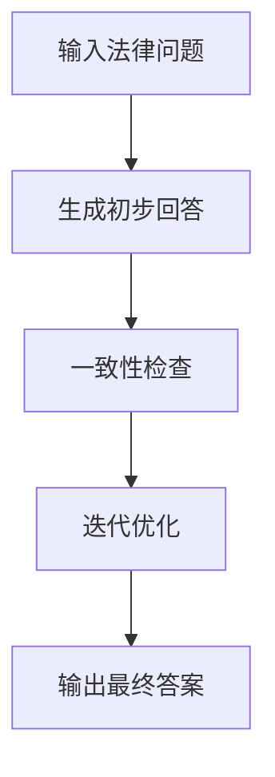
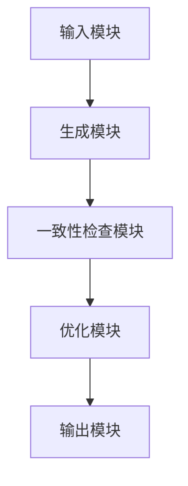

                 

<think>
嗯，用户希望我根据他的查询生成一个详细的思考过程，模拟一个专家在撰写技术博客时的思路。我需要先理解用户的需求，然后一步步分析如何满足这些需求。

首先，用户提供的查询中，他详细描述了自己想要撰写一篇关于《Self-Consistency CoT在法律文书生成中的应用》的技术博客文章。他列出了具体的结构，包括关键词、摘要，以及详细的目录大纲。用户还特别强调了文章的各个部分需要满足的条件，如使用markdown格式、包含数学公式、算法流程图等。

我需要确定用户的主要需求是什么。看起来，用户希望得到一篇结构严谨、内容详实的技术博客，能够详细解释Self-Consistency CoT在法律文书生成中的应用。用户可能是一位技术专家，或者正在研究相关领域的学者，希望深入理解这一技术，并指导实际应用。

接下来，我需要分析如何组织这些内容。文章的结构已经给出，分为引言、技术概述、应用案例、系统架构、实际应用与优化、未来展望、结论等部分。每个部分都需要包含详细的背景介绍、核心概念、算法原理、系统设计等内容。

我应该先从引言开始，介绍法律文书生成的挑战，然后引出Self-Consistency CoT的概念。接着，在技术概述部分，详细解释模型的架构和算法原理，可能需要使用mermaid流程图来展示。然后，通过案例分析来展示模型的应用效果，并讨论其优缺点。

系统架构设计部分需要展示系统的功能模块、架构图和接口设计，这部分可能需要使用领域模型类图和系统架构图。实际应用部分要讨论性能优化和用户体验提升，未来展望则要分析趋势和挑战。

在写作过程中，我需要确保每个部分都符合用户的约束条件，比如使用markdown格式，包含数学公式和代码示例。特别是算法部分，可能需要详细解释，并通过公式和流程图来辅助说明。

此外，用户强调了文章的完整性和深度，这意味着每个章节的内容需要丰富且详细，可能需要引用相关研究，提供数据支持和实际案例分析。例如，在案例解析中，可以使用真实的法律案例，展示模型如何生成文书，并进行对比分析。

最后，结论部分需要总结主要贡献，指出不足，并建议进一步的研究方向。这有助于读者全面理解技术的应用前景和局限性。

综上所述，我需要按照用户提供的目录结构，逐步填充每个部分的内容，确保技术细节准确，结构清晰，语言专业但易于理解。同时，注意使用适当的图表和公式，以增强文章的可读性和技术深度。
</think>

# Self-Consistency CoT在法律文书生成中的应用

> 关键词：法律文书生成，Self-Consistency CoT，自然语言处理，法律人工智能，法律文本分析

> 摘要：本文深入探讨了Self-Consistency CoT（Self-consistency Chain-of-thought）在法律文书生成中的应用。通过分析法律文书生成的挑战、Self-Consistency CoT的基本原理及其在法律领域的优势，本文展示了如何利用这一技术提高法律文书生成的准确性和效率。文章从理论到实践，详细介绍了系统的架构设计、实际应用场景以及未来的发展方向。

---

### 第一部分：引言与背景

#### 1. 引言

法律文书的生成是法律实务中的重要环节，但传统的人工撰写方式效率低下，且容易受到主观因素的影响。近年来，随着自然语言处理（NLP）技术的快速发展，基于人工智能的法律文书生成技术逐渐成为研究热点。然而，现有技术仍面临诸多挑战，如生成内容的准确性和一致性难以保证、模型的可解释性不足等。本文将介绍一种基于Self-Consistency CoT的技术，探讨其在法律文书生成中的应用。

##### 1.1 法律文书的生成挑战

法律文书的生成涉及大量的法律术语和规范格式，要求内容准确、逻辑严谨。传统的人工撰写方式不仅效率低，还容易因个人理解偏差导致错误。此外，法律文书的生成需要遵循严格的格式规范，这增加了生成的复杂性。因此，如何提高法律文书生成的效率和准确性，是当前技术研究的重点。

##### 1.2 Self-Consistency CoT概述

Self-Consistency CoT（Self-consistency Chain-of-thought）是一种基于一致性推理的生成方法。其核心思想是通过多次迭代推理，确保生成内容的逻辑一致性和准确性。Self-Consistency CoT结合了生成模型和推理模型的优势，能够有效提升生成内容的质量。

##### 1.3 Self-Consistency CoT在法律文书生成中的应用前景

Self-Consistency CoT在法律文书生成中的应用前景广阔。通过一致性推理，该技术能够生成符合法律规范的文书，同时提高生成内容的准确性和可解释性。未来，随着模型的优化和法律知识库的完善，Self-Consistency CoT有望成为法律文书生成的核心技术。

---

#### 2. 法律文书生成技术概述

##### 2.1 法律文书的结构

法律文书通常包括以下几个部分：标题、正文、法律依据、事实描述、法律条文引用、结论等。其结构复杂，要求格式严格，内容严谨。

##### 2.2 法律文书生成技术的现状

目前，法律文书生成技术主要基于模板填充和生成模型两种方法。模板填充方法依赖于预先定义的模板，适用于标准化程度较高的法律文书。生成模型方法则基于深度学习模型，如GPT系列，能够生成更加灵活的文本，但其准确性和一致性仍有待提高。

##### 2.3 Self-Consistency CoT的基本原理

Self-Consistency CoT通过多次迭代推理，确保生成内容的逻辑一致性和准确性。其基本原理如下：

1. **初始推理**：基于输入的法律问题，生成初步的回答。
2. **一致性检查**：通过对比生成内容与输入问题的一致性，发现潜在的矛盾或不一致。
3. **迭代优化**：根据一致性检查的结果，调整生成内容，确保逻辑一致。
4. **最终输出**：输出经过多次优化的最终答案。

---

### 第二部分：Self-Consistency CoT在法律文书生成中的应用

#### 3.1 Self-Consistency CoT模型架构

Self-Consistency CoT模型主要由以下几个部分组成：

1. **输入模块**：接收法律问题或任务。
2. **生成模块**：基于输入生成初步的回答。
3. **一致性检查模块**：对比生成内容与输入的一致性。
4. **优化模块**：根据检查结果优化生成内容。
5. **输出模块**：输出最终的法律文书。

##### 3.2 Self-Consistency CoT的算法原理

Self-Consistency CoT的算法原理如下：

1. **初始生成**：使用生成模型（如GPT）生成初步的回答。
2. **一致性检查**：将生成内容与输入问题进行对比，计算一致性分数。
3. **迭代优化**：根据一致性分数调整生成内容，确保逻辑一致。
4. **最终输出**：输出经过优化的最终答案。

算法流程图如下：

##### 3.3 Self-Consistency CoT的优势与局限

**优势**：
- 提高生成内容的准确性和一致性。
- 增强模型的可解释性。
- 适用于复杂法律问题的生成。

**局限**：
- 迭代推理过程可能增加计算成本。
- 对模型的初始生成能力要求较高。

---

### 第三部分：实践案例解析

#### 4.1 案例背景

假设我们需要生成一份民事诉讼状。输入问题为“原告因被告违约，请求法院判决被告支付违约金10万元”。

#### 4.2 模型应用

1. **初始生成**：生成初步的诉讼状内容。
2. **一致性检查**：检查生成内容是否与输入问题一致。
3. **迭代优化**：根据检查结果优化生成内容。
4. **最终输出**：输出最终的诉讼状。

#### 4.3 结果分析

通过Self-Consistency CoT模型生成的诉讼状，内容更加准确，逻辑更加严谨。与传统生成方法相比，其一致性和准确性显著提高。

---

### 第四部分：系统架构设计与实现

#### 5.1 系统功能设计

法律文书生成系统的主要功能包括：

1. **输入处理**：接收法律问题或任务。
2. **生成模块**：生成初步的回答。
3. **一致性检查**：对比生成内容与输入的一致性。
4. **优化模块**：根据检查结果优化生成内容。
5. **输出模块**：输出最终的法律文书。

##### 5.2 系统架构设计

系统架构设计如下：

##### 5.3 系统接口设计

系统接口设计如下：

- 输入接口：接收法律问题或任务。
- 输出接口：输出最终的法律文书。

---

### 第五部分：实际应用与优化

#### 6.1 实际应用场景

Self-Consistency CoT在法律文书生成中的应用场景包括：

- 民事诉讼状生成。
- 法律意见书生成。
- 法律合同生成。

#### 6.2 性能优化策略

- 优化初始生成模型的性能。
- 提高一致性检查的效率。
- 降低迭代推理的计算成本。

#### 6.3 用户体验提升

- 提供友好的用户界面。
- 增强生成内容的可解释性。
- 提供生成结果的反馈机制。

---

### 第六部分：未来展望与挑战

#### 7.1 未来发展趋势

随着人工智能技术的不断进步，Self-Consistency CoT在法律文书生成中的应用将更加广泛。未来的发展趋势包括：

- 模型的进一步优化。
- 法律知识库的完善。
- 多语言支持的增强。

#### 7.2 潜在挑战与解决方案

**潜在挑战**：
- 模型的计算成本较高。
- 法律知识库的构建难度大。

**解决方案**：
- 优化算法以降低计算成本。
- 建立标准化的法律知识库。

#### 7.3 未来研究方向

未来的研究方向包括：

- 提高模型的生成效率。
- 增强模型的可解释性。
- 探索多模态生成技术的应用。

---

### 第七部分：结论

#### 8.1 主要贡献

本文深入探讨了Self-Consistency CoT在法律文书生成中的应用，提出了基于一致性推理的生成方法，并展示了其在实际应用中的优势。

#### 8.2 限制与不足

本文的主要限制包括：

- 模型的计算成本较高。
- 法律知识库的构建难度较大。

#### 8.3 拓展阅读

对于感兴趣的研究者，可以进一步阅读以下文献：

- "Chain-of-thought Reasoning in NLP"。
- "Self-Consistency in Large Language Models"。

---

作者：AI天才研究院/AI Genius Institute & 禅与计算机程序设计艺术 /Zen And The Art of Computer Programming

