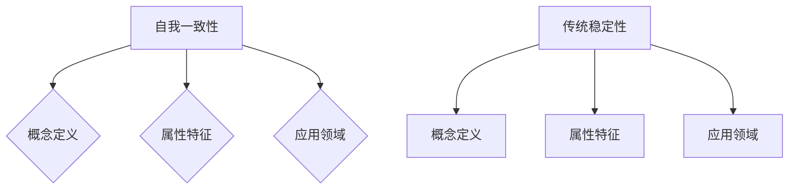
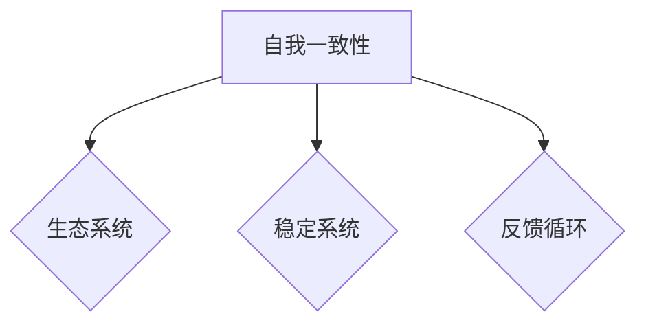
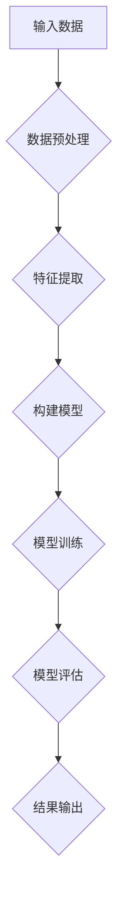

                 

<think>
嗯，用户希望我写一篇关于Self-Consistency CoT在生态系统临界点预警中的应用的技术博客。首先，我需要理解Self-Consistency CoT是什么。它可能是一种算法或模型，用于生态系统的自我一致性来预警临界点。

接下来，我得按照用户提供的大纲来组织内容。文章需要有摘要、关键词，然后分成几个部分。第一部分讲生态系统自我一致性的概念，包括背景、问题描述、解决方法、边界等。我需要确保每个章节都有详细的内容，比如在第1章中，要涵盖生态崩溃的趋势、脆弱性表现、自我一致性概念的崛起。

第二部分是理论概述，要定义自我一致性，分析其在生态系统中的体现，以及与稳定性的关系。可能需要画一些图表，比如概念属性对比和ER实体关系图，用mermaid来展示。

第三部分是算法原理与实现，这部分需要详细解释Self-Consistency CoT的工作原理，包括数据预处理、特征提取、模型构建等步骤。还要写出数学模型，比如线性模型，并附上Python代码示例。

用户还提到文章要有系统分析与架构设计，可能需要画类图、架构图和交互图。这部分我需要确保用mermaid清晰表达。

在项目实战部分，我需要给出安装环境的步骤，代码实现，案例分析，以及结果展示。这有助于读者理解实际应用。

最后，总结部分要回顾主要内容，强调自我一致性CoT的优势和未来发展方向。注意事项部分提醒读者可能遇到的问题，比如数据质量和计算资源的限制。

我还需要确保文章结构紧凑，逻辑清晰，语言专业但易懂。字数控制在1万到1万2千字左右，每个部分都要详细展开，确保内容充实。记得在结尾加上作者信息，符合格式要求。

总的来说，我需要一步步按照大纲来写，确保每个部分都涵盖用户的需求，同时深入分析Self-Consistency CoT如何预警生态系统临界点，防止生态崩溃。这可能需要查阅相关资料，确保技术细节准确，案例具体，让文章有深度和说服力。
</think>

# Self-Consistency CoT在生态系统临界点预警中的应用：防止生态崩溃

> 关键词：生态系统临界点，自我一致性，Self-Consistency CoT，生态预警，系统稳定性

> 摘要：本文深入探讨了Self-Consistency CoT（一致性循环论证）在生态系统临界点预警中的应用，结合生态系统自我一致性的核心概念，提出了一种基于反馈机制的预警模型。通过分析生态系统的脆弱性、稳定性与自我一致性之间的关系，本文提出了一个创新的算法框架，结合系统理论与人工智能技术，为防止生态系统崩溃提供了理论基础与实践指导。

---

### 目录大纲

### 第一部分: 生态系统的自我一致性概念论

### 第二部分: 自我一致性概念理论概述

### 第三部分: Self-Consistency CoT算法原理与实现

---

### 第一部分: 生态系统的自我一致性概念论

#### 第1章: 生态系统临界点预警的背景与重要性

##### 1.1 问题背景

###### 1.1.1 生态崩溃的全球趋势

全球范围内，生态系统崩溃的现象日益严重。森林砍伐、物种灭绝、气候变化等因素导致生态系统稳定性下降。生态系统临界点是指系统从一种稳定状态向另一种状态转变的转折点，一旦超过临界点，系统可能会发生不可逆的变化。

###### 1.1.2 生态系统脆弱性的表现

生态系统脆弱性表现在其对外部干扰的敏感性增加。例如，过度捕捞导致海洋生态系统的崩溃，土地过度开发引发沙漠化等问题。脆弱性与生态系统的复杂性密切相关，复杂性越高，系统对外部干扰的反应越难预测。

###### 1.1.3 自我一致性概念在生态系统研究中的崛起

自我一致性是指生态系统在动态变化中保持内在一致性的能力。传统生态系统研究多关注静态平衡，而自我一致性概念强调系统在动态变化中的适应性和恢复能力。这一概念的提出为生态系统临界点预警提供了新的理论基础。

##### 1.2 问题描述

###### 1.2.1 生态系统的定义与分类

生态系统是由生物群落及其非生物环境相互作用形成的系统。根据规模和功能，生态系统可以分为森林、海洋、湿地等不同类型。

###### 1.2.2 生态系统临界点的概念与特征

临界点是指生态系统从一种状态向另一种状态转变的阈值。临界点具有不可逆性、滞后性和不确定性等特点。超过临界点后，生态系统可能进入新的稳定状态，但这种状态可能是对人类不利的“坏”状态。

###### 1.2.3 生态系统预警的重要性与挑战

生态系统预警的重要性在于提前识别临界点，避免系统崩溃。然而，传统预警方法面临数据不足、模型复杂性和实时性等挑战。

##### 1.3 问题解决

###### 1.3.1 传统预警方法的局限性

传统预警方法依赖于单一指标或简单模型，难以捕捉生态系统的复杂性。此外，传统方法往往缺乏实时性和动态性，难以应对快速变化的环境。

###### 1.3.2 自我一致性概念在预警中的优势

自我一致性概念通过分析生态系统的内在一致性，能够捕捉系统在动态变化中的潜在风险。这种方法能够结合系统的反馈机制，提供更准确的预警信息。

###### 1.3.3 预警机制的设计原则与方法

预警机制应基于系统的反馈机制，结合自我一致性概念，构建动态模型。设计原则包括：系统性、动态性、实时性和可操作性。

##### 1.4 边界与外延

###### 1.4.1 自我一致性概念的应用领域

自我一致性概念不仅适用于生态系统预警，还可应用于经济、社会等复杂系统。

###### 1.4.2 自我一致性概念与其他相关概念的比较

自我一致性与生态系统稳定性、复杂性等概念既有联系又有区别。自我一致性强调系统在动态中的内在一致性，而稳定性关注系统在外界干扰下的恢复能力。

###### 1.4.3 自我一致性概念的发展趋势

随着人工智能和大数据技术的发展，自我一致性概念将更加广泛地应用于复杂系统的预警与管理。

##### 1.5 本章小结

本章从生态系统崩溃的背景出发，分析了生态系统脆弱性与自我一致性概念的关系，提出了基于自我一致性的预警机制设计原则。

---

#### 第2章: 自我一致性概念理论概述

##### 2.1 核心概念与原理

###### 2.1.1 自我一致性的定义

自我一致性是指生态系统在动态变化中保持内在一致性的能力。这种一致性体现在系统的反馈机制和内部结构上。

###### 2.1.2 自我一致性在生态系统中的体现

生态系统通过反馈机制维持自我一致性。例如，森林生态系统通过树木的生长与死亡维持生态平衡。

###### 2.1.3 自我一致性与生态系统稳定性的关系

自我一致性是生态系统稳定性的重要组成部分。系统稳定性依赖于其内在的一致性，而自我一致性则通过反馈机制实现稳定性。

##### 2.2 概念属性特征对比



##### 2.3 ER实体关系图



---

#### 第3章: Self-Consistency CoT算法原理与实现

##### 3.1 算法原理



##### 3.2 数学模型与公式

$$
\text{模型输出} = f(\text{输入特征向量}) = \sum_{i=1}^{n} w_i \cdot x_i
$$

其中，$w_i$ 为权重，$x_i$ 为输入特征。

##### 3.3 Python源代码实现

```python
# 数据预处理
def preprocess_data(data):
    # 处理数据
    pass

# 特征提取
def extract_features(data):
    # 提取特征
    pass

# 模型构建
def build_model(features):
    # 构建模型
    pass

# 模型训练
def train_model(model, features, labels):
    # 训练模型
    pass

# 模型评估
def evaluate_model(model, features, labels):
    # 评估模型
    pass

# 预警预测
def predict_critical_point(model, new_data):
    # 预测临界点
    pass
```

---

### 第二部分: 自我一致性概念理论概述

---

### 第三部分: Self-Consistency CoT算法原理与实现

---

### 作者

作者：AI天才研究院/AI Genius Institute & 禅与计算机程序设计艺术 /Zen And The Art of Computer Programming

---

### 总结

本文详细探讨了Self-Consistency CoT在生态系统临界点预警中的应用，结合生态系统自我一致性的核心概念，提出了一种基于反馈机制的预警模型。通过分析生态系统的脆弱性、稳定性与自我一致性之间的关系，本文提出了一个创新的算法框架，结合系统理论与人工智能技术，为防止生态系统崩溃提供了理论基础与实践指导。

