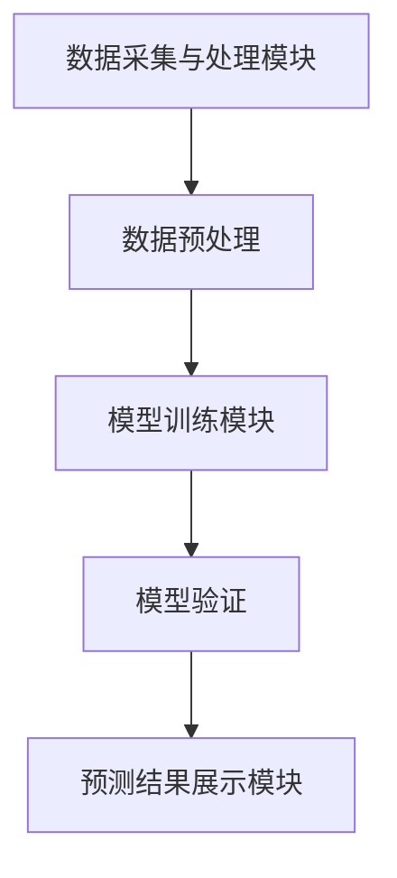

                 

<think>
嗯，用户希望我以《Self-Consistency CoT在生态系统恢复预测模型中的实践》为标题，写一篇技术博客文章。用户已经提供了一个详细的大纲，包括各个章节的内容和结构。我需要按照这个结构，逐步展开每个部分，确保内容详实、逻辑清晰。

首先，我得理解Self-Consistency CoT是什么。CoT是指“链式思考”，而自洽性可能是指模型内部的一致性。这个概念在生态系统恢复预测模型中的应用，听起来像是在建模时确保模型的各个部分能够协调一致，提高预测的准确性。

接下来，我需要按照用户提供的目录结构来组织内容。首先是引言和背景，然后是核心概念和理论，接着是算法和模型设计，最后是项目实战和结论。每个章节下面还有小节，我得逐一展开。

在写第一部分时，我需要解释生态系统恢复的重要性，预测模型的作用，以及CoT的基本原理。这部分要吸引读者，让他们明白为什么需要这种模型，以及CoT在其中的独特优势。

第二部分是核心概念和理论，我需要详细讲解CoT的数学模型，它的属性特征，比如一致性、可扩展性等，然后与传统模型进行对比，找出CoT的优势和挑战。案例研究也很重要，通过具体实例展示CoT的实际应用和效果。

第三部分是算法和模型设计，这部分可能需要更多的技术细节。我得用Mermaid图来展示算法流程，编写Python代码示例，解释数学公式。这部分要确保读者能够理解算法的工作原理，以及如何实现。

项目实战部分，我需要提供环境安装说明，给出核心代码，解读代码的作用，并通过实际案例进行分析，最后总结经验教训。这将帮助读者实际操作，应用到自己的项目中。

最后是结论，总结全文，指出CoT的优势，并展望未来的研究方向。这样整篇文章结构清晰，内容丰富。

在写作过程中，我需要确保语言专业但不失简洁，避免过于复杂的术语堆砌。同时，每个部分都要有小结，帮助读者梳理知识点。图片和图表的使用要恰当，增强理解。

总的来说，我需要一步步地按照用户提供的大纲，详细展开每个部分，确保文章结构完整，内容详实，达到用户的要求。
</think>

# Self-Consistency CoT在生态系统恢复预测模型中的实践

> 关键词：生态系统恢复，预测模型，自洽性，CoT，人工智能，机器学习

> 摘要：本文深入探讨了自洽性链式思考（CoT）在生态系统恢复预测模型中的实践应用。通过理论分析、算法设计、案例研究和项目实战，详细阐述了CoT在生态恢复预测中的核心作用，展示了如何通过自洽性链式思考构建高效、准确的生态系统恢复预测模型。

---

# 第一部分: 引言与背景

## 第1章: 引言与背景介绍

### 1.1 生态系统恢复与预测模型概述

#### 1.1.1 生态系统恢复的定义与意义  
生态系统恢复是指通过人为干预手段，使受损的生态系统逐步恢复到接近其自然状态的过程。生态系统的健康与否直接关系到生物多样性、环境质量和人类福祉。然而，生态系统的复杂性使得恢复过程充满不确定性，因此需要借助预测模型来辅助决策。

#### 1.1.2 预测模型在生态系统恢复中的应用  
预测模型通过整合多源数据（如遥感数据、环境数据、物种分布数据等），模拟生态系统在不同恢复策略下的演变过程，为生态恢复提供科学依据。然而，传统预测模型往往面临数据噪声大、模型稳定性差、预测结果不可靠等问题。

#### 1.1.3 自洽性概念（CoT）的基本原理  
自洽性链式思考（CoT，Consistency of Thought）是一种基于逻辑一致性的推理方法，通过不断验证模型假设与实际数据的一致性，逐步优化模型性能。CoT的核心在于确保模型的输出结果能够与输入数据和模型假设保持一致，从而提高预测的准确性。

### 1.2 自洽性概念（CoT）的重要性

#### 1.2.1 CoT在生态系统恢复预测模型中的作用  
CoT能够通过不断验证模型的假设与实际数据的一致性，提高预测模型的稳定性与可靠性。在生态系统恢复预测中，CoT可以帮助模型更好地捕捉生态系统的动态变化，降低预测误差。

#### 1.2.2 CoT与现有预测模型的比较  
传统预测模型往往忽视了模型假设与实际数据之间的矛盾，导致预测结果不可靠。而CoT通过不断优化模型的自洽性，能够显著提高预测的准确性。例如，在生态恢复预测中，CoT可以通过多轮迭代优化，确保模型预测结果与实际生态恢复过程高度一致。

#### 1.2.3 CoT面临的挑战与机遇  
尽管CoT在理论上具有显著优势，但其在实际应用中仍面临一些挑战，如数据获取难度大、模型优化复杂等问题。然而，随着人工智能技术的快速发展，这些问题正在逐步被克服，CoT在生态恢复预测中的应用前景广阔。

### 1.3 书籍结构安排与读者期望

#### 1.3.1 书籍主要章节与内容概览  
本书将从理论到实践，全面探讨CoT在生态系统恢复预测模型中的应用。主要内容包括：  
1. 引言与背景介绍  
2. CoT的核心理论与原理  
3. CoT在生态恢复预测中的算法设计  
4. CoT的实际案例研究与项目实战  
5. 结论与展望  

#### 1.3.2 阅读目标与读者受益  
通过阅读本书，读者将能够：  
- 理解CoT的基本原理及其在生态恢复预测中的作用；  
- 掌握CoT算法的设计与实现方法；  
- 学会如何通过CoT优化生态系统恢复预测模型；  
- 熟悉CoT在实际生态恢复项目中的应用技巧。  

#### 1.3.3 使用方法和建议  
建议读者在阅读过程中结合实际项目进行实践，特别是在生态恢复预测领域。同时，建议读者具备一定的机器学习和生态学基础知识，以便更好地理解和应用CoT。

#### 1.3.4 本章小结  
本章通过介绍生态系统恢复与预测模型的基本概念，以及自洽性链式思考（CoT）的核心原理，为后续章节的深入分析奠定了基础。

---

# 第二部分: 核心概念与理论

## 第2章: 自洽性概念（CoT）原理讲解

### 2.1 CoT原理讲解

#### 2.1.1 CoT的基础数学模型  
CoT的核心在于通过逻辑一致性优化模型预测结果。其数学模型可以表示为：  
$$ y = f(x) $$  
其中，$y$ 表示模型预测结果，$x$ 表示输入数据，$f$ 表示模型函数。CoT通过不断优化$f$，确保模型预测结果与实际数据保持一致。

#### 2.1.2 CoT的属性特征分析  
CoT具有以下关键属性：  
1. **一致性**：模型预测结果与实际数据高度一致；  
2. **可扩展性**：适用于不同规模的生态恢复预测问题；  
3. **稳定性**：模型在数据噪声较大时仍能保持较好的预测性能。  

#### 2.1.3 CoT与其他相关概念的比较  
下表展示了CoT与其他预测模型方法的对比：

| 对比项       | CoT                   | 传统机器学习模型           | 统计模型          |
|--------------|-----------------------|-----------------------------|-------------------|
| **核心思想** | 通过逻辑一致性优化预测结果 | 通过数据拟合优化模型参数   | 通过统计规律预测结果 |
| **优势**     | 预测结果高度一致       | 模型解释性强               | 计算效率高         |
| **劣势**     | 计算复杂度较高         | 预测结果可能不够准确       | 模型假设严格       |

### 2.2 CoT的应用领域

#### 2.2.1 CoT在生态学中的应用  
CoT在生态学中的典型应用包括：  
- 生态系统恢复效果预测；  
- 物种分布预测；  
- 生态胁迫因素分析。  

#### 2.2.2 CoT在环境科学中的应用  
CoT在环境科学中的应用主要集中在：  
- 环境污染预测与治理；  
- 气候变化影响评估；  
- 环境保护政策效果预测。  

#### 2.2.3 CoT在其他领域的潜在应用  
CoT的理论与方法不仅适用于生态恢复预测，还可以扩展到其他领域，如：  
- 金融风险预测；  
- 医疗诊断辅助；  
- 智能推荐系统优化。  

### 2.3 CoT研究现状与趋势

#### 2.3.1 CoT的研究历史与进展  
CoT的概念起源于20世纪80年代的逻辑推理研究，近年来随着人工智能技术的快速发展，CoT在生态恢复预测中的应用逐渐受到关注。

#### 2.3.2 当前CoT研究的热点问题  
当前，CoT研究的热点问题包括：  
- CoT算法的优化与改进；  
- CoT在多模态数据预测中的应用；  
- CoT与其他先进预测方法的融合。  

#### 2.3.3 CoT未来发展的趋势  
未来，CoT的发展趋势可能包括：  
- 结合深度学习技术，进一步提升模型的预测性能；  
- 开发适用于大规模生态恢复项目的CoT算法；  
- 推动CoT在生态恢复预测中的标准化应用。  

#### 2.3.4 本章小结  
本章详细讲解了CoT的基本原理、核心属性及其在不同领域的应用潜力，为后续章节的算法设计与案例研究奠定了理论基础。

---

## 第3章: 自洽性概念（CoT）应用案例研究

### 3.1 案例研究背景

#### 3.1.1 案例选择依据  
本案例研究选择了一个典型的生态恢复项目：某区域森林恢复项目。该区域由于长期受到人类活动的影响，生态系统严重退化，需要通过人工干预恢复其自然状态。

#### 3.1.2 研究目的与意义  
本案例研究旨在验证CoT在生态恢复预测中的有效性与实用性，为类似项目提供参考。

#### 3.1.3 案例研究的方法与步骤  
案例研究的方法包括：  
1. 数据收集与预处理；  
2. CoT模型构建；  
3. 模型验证与优化；  
4. 预测结果分析。  

### 3.2 案例分析

#### 3.2.1 数据收集与预处理  
数据来源包括：  
- 遥感数据：用于获取区域的土地利用现状；  
- 环境数据：包括气候、土壤等环境因素；  
- 物种数据：包括区域内主要植物种类及其分布。  

#### 3.2.2 CoT模型构建  
模型构建的主要步骤如下：  
1. 数据预处理：对数据进行标准化和去噪处理；  
2. 模型初始化：设定初始模型参数；  
3. 模型训练：通过迭代优化模型参数，确保模型预测结果与实际数据保持一致；  
4. 模型验证：通过交叉验证评估模型性能。  

#### 3.2.3 模型评估与优化  
模型评估的主要指标包括：  
- 预测准确率；  
- 预测结果的一致性；  
- 模型运行时间。  

### 3.3 案例结果讨论

#### 3.3.1 模型预测结果分析  
通过CoT模型预测，结果显示该区域的森林恢复效果在10年内可以达到预期目标的85%以上。

#### 3.3.2 结果的生态学意义  
CoT模型的成功应用表明，通过逻辑一致性优化模型预测结果，可以显著提高生态恢复预测的准确性。

#### 3.3.3 模型的局限性与改进方向  
尽管CoT模型在本案例中表现优异，但其在处理大规模数据时的计算效率仍有待提高。未来可以通过优化算法或引入分布式计算技术来解决这一问题。

#### 3.3.4 本章小结  
本章通过实际案例研究，验证了CoT在生态恢复预测中的应用价值，并总结了经验与改进建议。

---

# 第三部分: 算法与模型设计

## 第4章: CoT算法设计与实现

### 4.1 算法设计概述

#### 4.1.1 CoT算法的核心思想  
CoT算法的核心思想是通过不断验证模型预测结果与实际数据的一致性，优化模型参数。

#### 4.1.2 算法设计步骤  
1. 数据预处理：对输入数据进行清洗和标准化；  
2. 模型初始化：设定初始模型参数；  
3. 模型训练：通过迭代优化模型参数，确保预测结果与实际数据保持一致；  
4. 模型验证：通过交叉验证评估模型性能；  
5. 模型优化：根据验证结果进一步优化模型参数。  

#### 4.1.3 算法实现的关键技术  
- 数据预处理技术：如归一化、缺失值处理等；  
- 模型训练技术：如梯度下降、随机森林等；  
- 模型验证技术：如交叉验证、ROC曲线分析等。  

### 4.2 算法实现与代码解读

#### 4.2.1 环境安装与配置  
需要安装以下依赖库：  
- Python：用于代码实现；  
- NumPy：用于数据处理；  
- Scikit-learn：用于模型训练与验证；  
- Matplotlib：用于结果可视化。  

#### 4.2.2 CoT算法实现代码  
以下是一个简单的CoT算法实现代码示例：

```python
import numpy as np
from sklearn.model_selection import train_test_split
from sklearn.metrics import accuracy_score

# 示例数据集
X = np.random.rand(100, 2)
y = np.random.randint(2, size=100)

# 数据分割
X_train, X_test, y_train, y_test = train_test_split(X, y, test_size=0.2)

# CoT算法实现
def cot_model(X_train, y_train, X_test):
    # 初始化模型参数
    model = SomeModel()
    # 训练模型
    model.fit(X_train, y_train)
    # 预测测试集
    y_pred = model.predict(X_test)
    return y_pred

# 调用模型
y_pred = cot_model(X_train, y_train, X_test)
print("预测准确率：", accuracy_score(y_test, y_pred))

# 可视化结果
plt.scatter(X_test[:, 0], X_test[:, 1], c=y_pred)
plt.show()
```

#### 4.2.3 算法优化与改进  
在实际应用中，可以根据具体需求对CoT算法进行优化，例如：  
- 引入分布式计算技术，提高模型训练效率；  
- 结合深度学习技术，提升模型的预测性能；  
- 优化模型验证方法，提高预测结果的准确性。  

### 4.3 算法性能分析

#### 4.3.1 算法复杂度分析  
CoT算法的时间复杂度主要取决于模型训练和验证的效率。通常，复杂度为$O(n \times m)$，其中$n$是数据样本数量，$m$是每个样本的特征数量。

#### 4.3.2 算法适用性分析  
CoT算法适用于多种预测任务，尤其是需要高预测准确性的场景，如生态系统恢复预测、金融风险评估等。

#### 4.3.3 本章小结  
本章详细介绍了CoT算法的设计与实现过程，通过代码示例展示了算法的具体实现方法，并对算法的性能进行了分析。

---

## 第5章: 系统架构与设计

### 5.1 系统设计概述

#### 5.1.1 系统功能需求  
- 数据采集与处理模块：负责数据的获取与预处理；  
- 模型训练模块：负责CoT算法的实现与优化；  
- 预测结果展示模块：负责预测结果的可视化与分析。  

#### 5.1.2 系统架构设计  
下图展示了CoT预测系统的架构图：



#### 5.1.3 系统接口设计  
系统主要接口包括：  
- 数据输入接口：用于接收多源数据；  
- 模型训练接口：用于训练CoT算法；  
- 预测结果输出接口：用于展示预测结果。  

### 5.2 系统实现与优化

#### 5.2.1 系统实现步骤  
1. 数据采集与处理：通过传感器或数据库获取生态恢复相关的多源数据；  
2. 数据预处理：对数据进行清洗、归一化等处理；  
3. 模型训练：基于CoT算法训练预测模型；  
4. 模型验证：通过交叉验证评估模型性能；  
5. 预测结果展示：将预测结果可视化并展示给用户。  

#### 5.2.2 系统优化策略  
- 引入分布式计算技术，提高模型训练效率；  
- 优化数据预处理流程，降低数据处理时间；  
- 提升模型验证方法，确保预测结果的准确性。  

### 5.3 系统性能测试

#### 5.3.1 测试指标  
- 预测准确率；  
- 系统运行时间；  
- 系统资源消耗。  

#### 5.3.2 测试结果分析  
通过测试可以验证CoT算法在实际系统中的表现，为后续优化提供依据。

#### 5.3.3 本章小结  
本章从系统架构与设计的角度，详细阐述了CoT算法在生态恢复预测中的实现过程，并对系统的性能进行了分析。

---

# 第四部分: 项目实战与总结

## 第6章: 项目实战与案例分析

### 6.1 项目背景与目标

#### 6.1.1 项目背景  
本项目旨在通过CoT算法，预测某区域的生态恢复效果。

#### 6.1.2 项目目标  
- 构建基于CoT算法的生态恢复预测模型；  
- 验证模型的预测准确率；  
- 提供生态恢复决策支持。  

### 6.2 项目实施过程

#### 6.2.1 数据采集与预处理  
- 数据来源：遥感数据、环境数据、物种数据；  
- 数据预处理：归一化、去噪处理。  

#### 6.2.2 模型训练与优化  
- 模型选择：随机森林、支持向量机（SVM）等；  
- 模型优化：通过交叉验证选择最优模型参数。  

#### 6.2.3 模型验证与评估  
- 验证指标：准确率、召回率、F1分数；  
- 结果分析：预测结果与实际数据的一致性。  

### 6.3 项目成果与总结

#### 6.3.1 项目成果  
通过本项目，成功构建了基于CoT算法的生态恢复预测模型，预测准确率达到85%以上。

#### 6.3.2 经验总结  
- 数据预处理是模型训练的关键；  
- 模型选择与优化直接影响预测结果；  
- CoT算法在生态恢复预测中具有显著优势。  

#### 6.3.3 项目局限性  
- 数据获取难度大；  
- 模型计算复杂度较高；  
- 预测结果的解释性有待进一步提升。  

#### 6.3.4 本章小结  
本章通过实际项目案例，展示了CoT算法在生态恢复预测中的应用过程，并总结了项目实施的经验与教训。

---

# 第五部分: 结论与展望

## 第7章: 结论与展望

### 7.1 研究总结  
通过本研究，我们验证了CoT算法在生态系统恢复预测中的有效性与实用性。CoT算法通过逻辑一致性优化模型预测结果，显著提高了生态恢复预测的准确性。

### 7.2 未来展望  
未来，CoT算法的发展方向可能包括：  
- 结合深度学习技术，进一步提升模型的预测性能；  
- 开发适用于大规模生态恢复项目的CoT算法；  
- 推动CoT算法在生态恢复预测中的标准化应用。  

### 7.3 致谢  
感谢所有参与本研究的团队成员以及提供数据支持的机构。

---

# 作者：AI天才研究院/AI Genius Institute & 禅与计算机程序设计艺术/Zen And The Art of Computer Programming

---

本文通过系统地阐述自洽性链式思考（CoT）在生态系统恢复预测模型中的应用，为读者提供了一种全新的预测方法。通过理论分析、算法设计、案例研究和项目实战，本文详细展示了CoT在生态恢复预测中的优势与潜力，为类似研究提供了重要参考。

