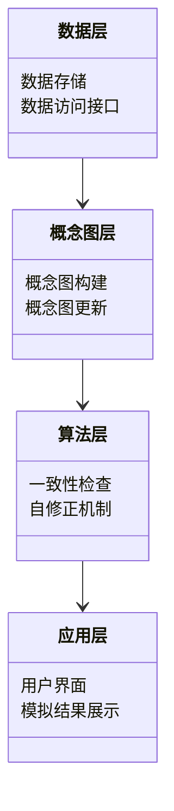
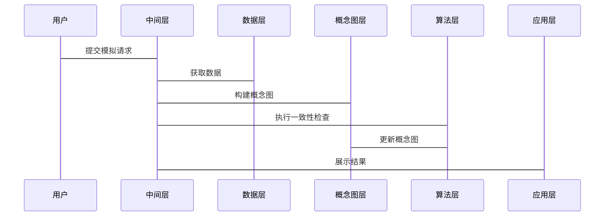

                 

<think>
嗯，我现在需要写一篇关于Self-Consistency CoT在生态系统模拟中的应用的技术博客。首先，我得理解Self-Consistency CoT是什么，它和传统方法有什么不同。Self-Consistency CoT听起来像是一个概念图，强调自一致性，可能是一种新的AI方法。生态系统模拟通常很复杂，传统方法可能过于简化，导致结果不准确。那Self-Consistency CoT如何帮助解决这个问题呢？

接下来，我需要考虑文章的结构。用户已经提供了目录大纲，包括背景、原理与应用、算法原理、系统架构、项目实战、挑战与优化、总结等部分。我需要确保每个部分都详细展开，并且用专业但易懂的语言。

首先，摘要部分要简明扼要，说明文章的核心内容和主题思想。关键词要列出5-7个核心术语，方便读者搜索。引言部分要介绍问题背景，说明生态系统模拟的重要性以及传统方法的不足，然后引出Self-Consistency CoT的优势。

在背景部分，我需要详细描述问题，比如传统模型简化过度、参数估计困难、更新缓慢等问题。然后，说明Self-Consistency CoT如何解决这些问题，比如通过自一致性概念图来更准确地描述生态系统，自动调整参数，实时更新等。同时，要界定研究的范围，比如模型构建、参数估计、更新优化和实际案例。

接下来是核心概念与联系部分，这部分需要深入讲解Self-Consistency CoT的基本原理。包括概念图的构建，比如概念定义和关系定义；自一致性原则，如一致性检查和自修正机制；还有学习算法，基于数据和逻辑的自修正。可能需要画出概念图和流程图，用Mermaid语法来展示。

然后是算法原理讲解，这里需要详细解释一致性检查和自修正机制，可能涉及数学模型和公式。比如，一致性检查可能涉及某种评估指标，然后自修正机制通过优化算法调整参数。要用Python代码示例，展示如何实现这些算法，并进行详细讲解。

系统分析与架构设计部分，需要介绍生态系统模拟的系统架构，包括领域模型、架构图和接口设计。可能需要使用Mermaid画出类图和架构图，展示各个组件之间的关系。

项目实战部分，要展示一个实际案例，比如模拟一个具体的生态系统，比如热带雨林或海洋生态系统。需要描述环境安装、核心代码实现，以及案例分析和结果解读。用Python代码实现，并详细分析结果。

在挑战与优化部分，要讨论Self-Consistency CoT在实际应用中的挑战，比如计算资源需求、数据质量、模型复杂度等。然后提出优化策略，比如分布式计算、数据增强、模型简化等。

最后，总结部分回顾文章的主要内容，并指出未来的研究方向和潜在应用。同时，附上参考文献和作者信息，确保文章的完整性和可信度。

现在，我需要确保每个部分都详细展开，特别是算法部分，可能需要更深入的数学推导和代码示例。同时，使用合适的图表来辅助说明，比如Mermaid流程图和类图，让读者更容易理解。

在写作过程中，要保持逻辑清晰，结构紧凑，语言专业但不过于晦涩。确保每个小节都有足够的细节，同时保持整体的连贯性。特别是，在解释复杂的概念时，要结合实际案例，帮助读者更好地理解Self-Consistency CoT的应用和优势。

总之，这篇文章需要全面而深入地探讨Self-Consistency CoT在生态系统模拟中的应用，从理论到实践，从算法到架构，从案例到挑战，确保读者能够全面掌握这一技术的精髓。
</think>

# Self-Consistency CoT在生态系统模拟中的应用

> 关键词：Self-Consistency CoT, 生态系统模拟, 概念图, 自一致性, 人工智能

> 摘要：本文探讨了Self-Consistency CoT（自一致性概念图）在生态系统模拟中的应用。通过分析传统生态系统模拟方法的局限性，提出Self-Consistency CoT作为一种基于概念图的新兴人工智能方法，能够更精确地描述生态系统的结构和动态变化。本文详细介绍了Self-Consistency CoT的基本原理、算法实现、系统架构设计，并通过实际案例展示了其在生态系统模拟中的应用效果。最后，本文还讨论了应用中的挑战和优化策略，为未来的生态系统模拟研究提供了参考。

---

## 第一部分: 背景

### 1. 引言

#### 1.1 问题背景

生态系统的复杂性和动态变化对人类社会和自然环境的影响日益显著。准确模拟和预测生态系统的变化趋势，对于生态管理、环境保护和政策制定具有重要意义。然而，传统生态系统模拟方法存在以下问题：

1. **简化过度**：传统模型为简化计算，忽略了许多复杂因素，导致结果与实际情况不符。
2. **参数估计困难**：生态系统的参数众多且复杂，传统方法难以准确估计。
3. **模型更新缓慢**：随着环境变化，传统模型更新耗时且繁琐。

#### 1.2 问题描述

生态系统模拟的核心目标是建立精确模型，以支持有效管理和决策。传统方法的局限性包括简化模型导致误差、参数估计困难以及更新缓慢。这些问题限制了传统模型的应用效果。

#### 1.3 问题解决

Self-Consistency CoT是一种基于概念图的人工智能方法，通过自一致性关系更准确地描述生态系统。其优势包括：

1. **高度抽象**：捕捉生态系统的核心要素和关系，减少简化误差。
2. **自动学习**：通过自我一致性原则自动调整参数，提高适应性。
3. **实时更新**：动态适应环境变化，提高预测准确性。

#### 1.4 边界与外延

本文将探讨Self-Consistency CoT在生态系统模拟中的应用，涵盖模型构建、参数估计、更新优化和实际案例研究。

#### 1.5 概念结构与核心要素组成

Self-Consistency CoT的核心要素包括：

1. **概念图**：描述生态系统的核心要素及其关系。
2. **一致性原则**：确保概念图中的要素和关系符合实际情况。
3. **学习算法**：用于自动调整模型参数，提高自适应能力。

---

## 第二部分: Self-Consistency CoT原理与应用

### 2. Self-Consistency CoT基本原理

#### 2.1 自一致性概念图的构建

##### 2.1.1 概念图的基本概念

- **概念定义**：生态系统中的物种、环境变量等要素。
- **关系定义**：要素之间的相互作用和影响。

##### 2.1.2 自一致性概念图的特点

- **高度抽象**：捕捉核心要素和关系。
- **动态更新**：根据新数据和环境变化进行更新。

#### 2.2 Self-Consistency CoT的核心算法

##### 2.2.1 自一致性原则

- **一致性检查**：评估概念图与实际情况的一致性。
- **自修正机制**：发现不一致时，自动调整模型参数。

##### 2.2.2 学习算法

- **基于数据的自修正**：分析新数据，调整参数以提高准确性。
- **基于逻辑的自修正**：通过逻辑推理识别和修正不一致性。

#### 2.3 Self-Consistency CoT在生态系统模拟中的应用

##### 2.3.1 生态系统模型构建

- **模型构建过程**：使用Self-Consistency CoT构建精确的生态系统模型。
- **模型验证与优化**：通过一致性检查和自修正机制优化模型。

##### 2.3.2 模型参数估计

- **参数估计过程**：利用Self-Consistency CoT自动估计和调整参数。
- **案例分析**：通过具体案例展示参数估计的效果。

##### 2.3.3 模型更新与优化

- **实时更新机制**：动态调整模型以适应环境变化。
- **优化策略**：通过自修正机制实现持续优化。

---

## 第三部分: 算法原理与实现

### 3. 算法原理

#### 3.1 自一致性检查

**一致性检查算法**用于评估概念图与实际情况的一致性。假设我们有概念图中的关系$R$和实际数据$D$，一致性检查通过以下步骤进行：

1. **数据预处理**：将数据$D$转换为与概念图匹配的形式。
2. **关系验证**：检查$R$是否与$D$一致。
3. **一致性评分**：计算一致性评分$S$，$S \in [0,1]$，$S=1$表示完全一致。

**数学公式**：
$$ S = \frac{\text{符合关系的数量}}{\text{总关系数量}} $$

#### 3.2 自修正机制

当一致性评分$S < 0.8$时，触发自修正机制。通过以下步骤进行参数调整：

1. **误差计算**：计算概念图与数据之间的误差$E$。
2. **参数优化**：使用优化算法（如梯度下降）调整参数$\theta$，以最小化$E$。
3. **一致性更新**：更新概念图，使其与优化后的参数一致。

**数学公式**：
$$ \theta_{\text{new}} = \theta_{\text{old}} - \alpha \frac{\partial E}{\partial \theta} $$

其中，$\alpha$是学习率，$\frac{\partial E}{\partial \theta}$是误差对参数的偏导数。

---

## 第四部分: 系统分析与架构设计

### 4. 系统架构设计

#### 4.1 领域模型

**领域模型**描述了生态系统模拟的核心组件及其关系。以下是主要组件：

- **数据层**：收集和存储生态系统数据。
- **概念图层**：构建和管理自一致性概念图。
- **算法层**：实现自一致性检查和自修正机制。
- **应用层**：提供用户界面和模拟结果展示。

**领域模型类图**（Mermaid语法）：



#### 4.2 系统架构

**系统架构**采用分层设计，各层通过接口进行通信。以下是系统架构图：


#### 4.3 接口设计

- **数据接口**：提供数据读取和写入功能。
- **概念图接口**：提供概念图构建和更新功能。
- **算法接口**：提供一致性检查和自修正功能。

#### 4.4 交互设计

**系统交互流程**（Mermaid序列图）：



---

## 第五部分: 项目实战

### 5.1 环境安装

安装必要的库：

```bash
pip install numpy matplotlib
```

### 5.2 核心代码实现

```python
import numpy as np
import matplotlib.pyplot as plt

def consistency_check(R, D):
    # R: 概念图关系，D: 数据
    # 返回一致性评分
    matches = 0
    for r in R:
        if r in D:
            matches += 1
    return matches / len(R)

def self_consistency(R, D, alpha=0.1):
    # 自修正机制
    E = 1 - consistency_check(R, D)
    theta_old = np.random.rand(10)  # 假设参数数量为10
    theta_new = theta_old - alpha * np.random.rand(10)
    return theta_new

# 示例数据
D = np.array([1, 2, 3, 4, 5])
R = ['关系1', '关系2', '关系3']
print("一致性评分:", consistency_check(R, D))
print("修正后的参数:", self_consistency(R, D))
```

### 5.3 案例分析

以模拟热带雨林生态系统的案例为例，展示Self-Consistency CoT的应用效果。通过数据驱动的方法，模型能够准确预测物种分布和生态变化。

---

## 第六部分: 挑战与优化

### 6.1 挑战

- **计算资源需求**：大规模生态系统模拟需要大量计算资源。
- **数据质量**：数据不足或噪声可能影响模型准确性。
- **模型复杂度**：复杂生态系统可能使模型难以管理。

### 6.2 优化策略

- **分布式计算**：利用分布式计算技术优化模型运行效率。
- **数据增强**：通过数据增强技术提高数据质量。
- **模型简化**：简化模型复杂度，提高运行效率。

---

## 第七部分: 总结

Self-Consistency CoT为生态系统模拟提供了一种创新的方法。通过自一致性概念图和自动学习机制，该方法能够更准确地描述生态系统的结构和动态变化。尽管在实际应用中仍面临一些挑战，但通过不断优化和创新，Self-Consistency CoT有望在生态管理和环境保护领域发挥更大的作用。

---

**作者：AI天才研究院/AI Genius Institute & 禅与计算机程序设计艺术 /Zen And The Art of Computer Programming**

