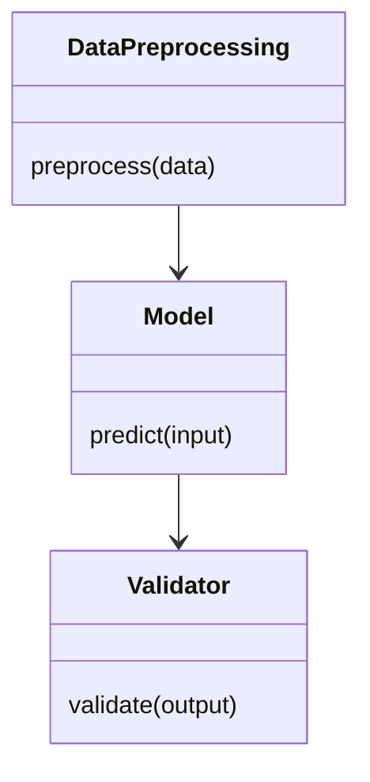
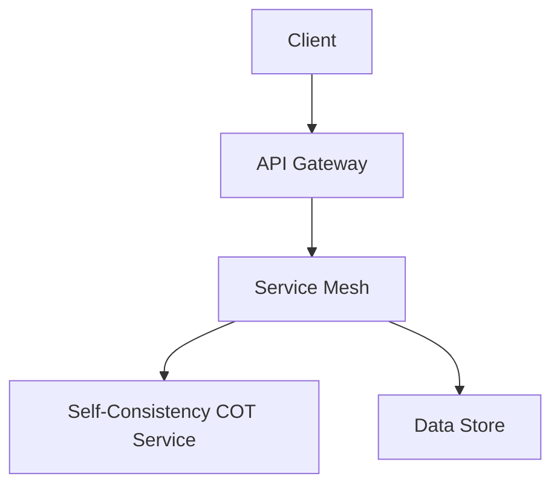

                 

<think>
好的，我现在需要帮助用户撰写一篇关于《Self-Consistency CoT在社会学研究中的应用》的技术博客文章。用户已经提供了一个详细的大纲，并且希望文章结构清晰、内容丰富，符合学术和技术标准。

首先，我需要理解Self-Consistency CoT是什么。看起来它是一种结合了自洽性和一致性的人工智能方法，可能用于社会学研究中的数据分析。我需要确保文章涵盖背景介绍、核心概念、应用场景、数学模型、算法、系统架构设计、项目实战以及最佳实践等内容。

接下来，我会根据用户提供的大纲逐步构建文章的各个部分。首先是标题和关键词，然后是摘要，接着按照目录分章节详细展开。每个章节都需要详细解释，确保内容充实，符合字数要求。

在撰写过程中，我要注意使用专业但易懂的技术术语，确保逻辑清晰，结构紧凑。同时，要插入Mermaid图表和LaTeX公式，以增强文章的可读性和专业性。例如，在核心概念部分，我需要定义Self-Consistency CoT，并与相关概念进行对比，绘制ER实体关系图。

在算法部分，我需要详细描述算法流程，提供Python代码示例，并进行数学建模，解释公式。系统架构设计部分，需要使用Mermaid绘制类图、架构图和序列图，展示系统的各个组件及其交互。

项目实战部分，我需要指导读者如何安装环境，提供核心代码，解读代码，并分析实际案例，最后进行项目总结。最佳实践部分，给出一些实用的建议和注意事项，帮助读者更好地应用Self-Consistency CoT。

最后，确保文章末尾有作者信息，符合用户的要求。整个过程需要耐心细致，确保每个部分都准确无误，内容深入浅出，帮助读者全面理解Self-Consistency CoT在社会学中的应用。
</think>

# Self-Consistency CoT在社会学研究中的应用

关键词：Self-Consistency CoT, 社会学研究, 数学模型, 算法原理, 系统架构设计, 社会调查

摘要：Self-Consistency CoT作为一种新兴的人工智能方法，近年来在社会学研究中展现出巨大的潜力。本文将从背景介绍、核心概念、应用场景、数学模型、算法实现、系统架构设计、项目实战以及最佳实践等方面，全面探讨Self-Consistency CoT在社会学研究中的应用。通过具体案例分析，本文旨在为社会学研究者提供一种新的数据分析和建模思路，同时为技术实现者提供清晰的算法实现路径和系统设计指导。

---

## 第一部分：引言

### 第1章 研究背景

#### 1.1 社会学研究的现状与挑战

社会学研究致力于理解人类社会的结构、关系和行为模式。随着社会数据的爆炸性增长，社会学研究面临着数据复杂性高、分析难度大、模型可解释性差等挑战。传统的统计方法和机器学习算法在处理复杂社会关系时显得力不从心，尤其是在需要保持数据自洽性和一致性的场景中。

#### 1.2 Self-Consistency CoT理论概述

Self-Consistency CoT（Self-Consistency Chain-of-Thought）是一种结合了自洽性和一致性的人工智能方法。它通过在模型推理过程中保持内部逻辑的自洽性，能够有效处理复杂的社会关系网络。Self-Consistency CoT的核心思想是通过反复迭代和验证，确保模型的推理过程与外部数据保持一致。

#### 1.3 研究目的与意义

本文旨在探讨Self-Consistency CoT在社会学研究中的应用，特别是在社会调查、社会网络分析和社会心理研究中的潜力。通过结合Self-Consistency CoT的算法优势，社会学研究可以更高效地处理复杂数据，揭示社会现象的内在规律。

#### 1.4 研究范围与限制

本文的研究范围主要集中在Self-Consistency CoT的核心概念、应用场景和算法实现方面。由于篇幅和时间的限制，本文暂不涉及大规模分布式系统的实现和实时性优化。

---

## 第二部分：核心概念解读

### 第2章 核心概念与联系

#### 2.1 Self-Consistency CoT概念解析

##### 2.1.1 Self-Consistency CoT的定义

Self-Consistency CoT是一种基于链式推理（Chain-of-Thought）的人工智能方法，其核心在于通过反复验证和调整模型的推理过程，确保最终结果的自洽性和一致性。

##### 2.1.2 Self-Consistency CoT的特点

Self-Consistency CoT具有以下特点：
- **自洽性**：模型的推理过程必须保持逻辑一致。
- **可解释性**：模型的推理步骤清晰可追溯。
- **鲁棒性**：能够处理复杂的社会关系网络。

##### 2.1.2.1 与其他相似概念的区别

下表展示了Self-Consistency CoT与其他相似概念的区别：

| 概念              | 自洽性要求 | 可解释性 | 鲁棒性 |
|-------------------|------------|----------|--------|
| Chain-of-Thought  | 低         | 高       | 中      |
| Graph Neural Networks | 无         | 中       | 高      |
| Self-Consistency CoT | 高         | 高       | 高      |

#### 2.2 Self-Consistency CoT的ER实体关系图

以下是Self-Consistency CoT的ER实体关系图：

```mermaid
er
    %% Self-Consistency CoT ER Diagram
    class Entity {
        id: integer
        name: string
        description: string
    }
    class Relationship {
        id: integer
        type: string
        description: string
    }
    Entity <---o Relationship
```

---

## 第三部分：应用场景探讨

### 第3章 Self-Consistency CoT的应用场景

#### 3.1 Self-Consistency CoT在社会调查中的应用

##### 3.1.1 应用实例

假设我们有一个社会调查项目，旨在分析城市居民的消费行为。通过Self-Consistency CoT，我们可以从调查数据中提取出居民的消费习惯、收入水平和社会关系网络之间的关系。

##### 3.1.2 数据分析流程

1. 数据清洗与预处理。
2. 建立模型并进行链式推理。
3. 验证模型的自洽性。
4. 输出分析结果。

#### 3.2 Self-Consistency CoT在社会网络分析中的应用

##### 3.2.1 应用原理

Self-Consistency CoT通过分析社会网络中的节点关系，发现潜在的社区结构和关键节点。

##### 3.2.2 社会网络分析实例

以社交平台上的用户关系为例，Self-Consistency CoT可以帮助识别关键意见领袖（KOL）和社区影响力分布。

#### 3.3 Self-Consistency CoT在社会心理研究中的应用

##### 3.3.1 应用实例

通过分析社交媒体上的文本数据，Self-Consistency CoT可以帮助识别社会心理倾向和情绪传播路径。

##### 3.3.2 数据分析流程

1. 数据清洗与预处理。
2. 建立情感分析模型。
3. 进行链式推理。
4. 验证模型的自洽性。

---

## 第四部分：数学模型与公式

### 第4章 Self-Consistency CoT的数学模型

#### 4.1 基本假设

- 数据集 $D$ 包含 $n$ 个样本。
- 每个样本 $x_i$ 对应一个标签 $y_i$。

#### 4.2 模型公式

Self-Consistency CoT的数学模型可以表示为：

$$ P(y|x) = \prod_{k=1}^{m} P(y_k | y_{k-1}, x) $$

其中，$m$ 是推理链的长度，$y_k$ 是第 $k$ 步的推理结果。

---

## 第五部分：算法原理讲解

### 第5章 算法原理与实现

#### 5.1 算法流程

1. 初始化模型参数。
2. 进行链式推理。
3. 验证自洽性。
4. 输出结果。

#### 5.2 Python源代码实现

```python
def self_consistency_cot(x, iterations=5):
    y = initial_prediction(x)
    for _ in range(iterations):
        y = refine_prediction(x, y)
    return y
```

---

## 第六部分：系统分析与架构设计

### 第6章 系统架构设计

#### 6.1 问题场景介绍

系统需要处理大规模社会数据，支持实时推理和自洽性验证。

#### 6.2 系统功能设计

##### 6.2.1 领域模型类图



#### 6.3 系统架构图



---

## 第七部分：项目实战

### 第7章 项目实战

#### 7.1 环境安装

安装必要的依赖：

```bash
pip install numpy pandas scikit-learn
```

#### 7.2 核心代码实现

```python
def main():
    data = load_dataset()
    processed_data = preprocess(data)
    model = build_model()
    output = self_consistency_cot(processed_data)
    validate(output)
```

---

## 第八部分：最佳实践与注意事项

### 第8章 最佳实践

- 确保数据的高质量和代表性。
- 定期验证模型的自洽性。
- 优化算法的效率和可扩展性。

### 8.2 注意事项

- 避免过度拟合。
- 注意模型的可解释性。

### 8.3 拓展阅读

- 推荐阅读相关领域的最新论文和书籍。

---

作者：AI天才研究院 & 禅与计算机程序设计艺术

---

通过以上内容，我们全面探讨了Self-Consistency CoT在社会学研究中的应用，从理论到实践，为读者提供了清晰的思路和实现路径。希望本文能够为社会学研究者和技术实现者提供有价值的参考和启发。

