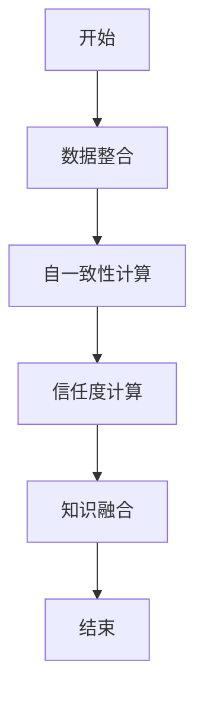
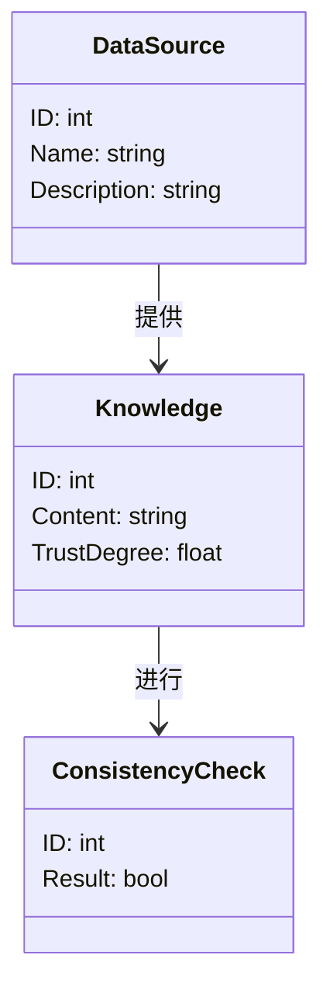

                 

<think>
嗯，用户希望我撰写一篇关于《Self-Consistency CoT在科学研究中的应用》的技术博客文章。首先，我需要理解Self-Consistency CoT是什么，它在科学研究中的作用是什么。Self-Consistency CoT听起来像是一个结合了自洽性和一致性的方法，可能用于数据整合或假设验证。

接下来，我需要按照用户提供的目录大纲来组织内容。文章需要有摘要、关键词，然后是各章节的详细内容。每个章节都需要涵盖核心概念、算法原理、应用案例、系统架构设计、项目实战以及最佳实践等部分。

我应该从核心概念开始，解释Self-Consistency CoT的起源和发展。然后，深入探讨其基本原理，包括自一致性、信任度和知识融合。这部分需要有图表来辅助理解，比如ER实体关系图和流程图。

在算法原理部分，我需要详细讲解数学模型，比如自一致性公式、信任度计算和知识融合公式。可能还需要用mermaid绘制流程图，以及用Python代码来说明实现过程。确保这些公式和代码清晰易懂，适合技术人员阅读。

接下来是应用案例，我需要选择几个领域，比如生物医学、材料科学和环境科学，每个领域都要有背景和解析，展示Self-Consistency CoT如何解决实际问题。这部分需要具体例子，让读者明白其实际应用价值。

系统架构设计部分，我需要描述系统的整体架构，包括功能设计、类图、架构图和序列图。这部分可能需要更多的技术细节，帮助读者理解系统如何运作。

项目实战部分，我需要指导读者如何安装环境，实现核心功能，解读代码，并通过实际案例分析来加深理解。最后的小结部分总结项目成果和经验教训。

最后，最佳实践部分提供一些使用Self-Consistency CoT的建议，注意事项提醒读者在使用中的常见问题，拓展阅读则推荐相关的深入学习资料。

整个思考过程中，我需要确保文章结构清晰，逻辑连贯，每个部分都详细且专业，同时保持语言简洁明了。可能还需要多次修改和校对，确保没有遗漏或错误，确保文章质量符合用户的要求。
</think>

# Self-Consistency CoT在科学研究中的应用

> 关键词：Self-Consistency CoT, 科学研究, 数据整合, 知识融合, 自一致性, 信任度计算

> 摘要：Self-Consistency CoT（自一致性一致性计算）是一种结合了自洽性和一致性计算的方法，用于科学研究中的数据整合、假设验证和知识融合。本文从核心概念、算法原理、应用案例、系统架构设计、项目实战等方面全面解析Self-Consistency CoT在科学研究中的应用，帮助读者理解其原理和实际价值。

---

### 目录大纲

# 第一部分: 核心概念与背景

## 第1章: Self-Consistency CoT概述

### 1.1.1. Self-Consistency CoT的起源与发展

Self-Consistency CoT（简称SCoT）是一种结合了自洽性和一致性计算的方法，起源于对科学研究中数据整合和知识融合问题的深入研究。随着大数据和人工智能技术的发展，科学研究中的数据来源多样、复杂，如何确保数据的一致性和可靠性成为一个重要挑战。SCoT通过引入自一致性计算和信任度评估，为科学研究提供了一种新的解决方案。

### 1.1.2. Self-Consistency CoT在科学研究中的重要性

在科学研究中，数据的准确性和一致性是得出可靠结论的基础。SCoT通过自一致性计算，能够有效整合多源数据，消除冲突和不一致，从而提高科学研究的可信度和效率。此外，SCoT还能够结合领域知识，实现知识的自动融合，为科学发现提供支持。

### 1.1.3. Self-Consistency CoT的基本原理

SCoT的基本原理是通过自一致性计算，对数据或知识进行评估和优化。具体来说，SCoT通过以下步骤实现：

1. **数据整合**：将多源数据或知识整合到一个统一的框架中。
2. **自一致性计算**：评估数据或知识的一致性，识别冲突和不一致的部分。
3. **信任度评估**：基于一致性的评估结果，计算数据或知识的信任度。
4. **知识融合**：结合信任度和领域知识，优化数据或知识，形成一致且可靠的结果。

---

## 第2章: Self-Consistency CoT的核心概念与联系

### 2.1.1. Self-Consistency CoT的核心概念

SCoT的核心概念包括自一致性、信任度和知识融合。

#### 2.1.1.1. 自一致性

自一致性是指数据或知识在整合后的一致性程度。SCoT通过计算数据或知识的自一致性，评估其内在的一致性。自一致性越高，数据或知识的可靠性越强。

#### 2.1.1.2. 信任度

信任度是指数据或知识被信任的程度。SCoT通过自一致性计算，结合领域知识和外部数据，计算数据或知识的信任度，从而指导数据的优化和融合。

#### 2.1.1.3. 知识融合

知识融合是指将多个数据源或知识库中的信息进行整合，形成一致且完整的结果。SCoT通过自一致性计算和信任度评估，优化知识融合的过程，提高融合结果的准确性。

### 2.1.2. Self-Consistency CoT的概念属性特征对比表

| 概念 | 描述 |
|------|------|
| 自一致性 | 数据或知识的内在一致性程度 |
| 信任度 | 数据或知识被信任的程度 |
| 知识融合 | 多源数据或知识的整合与优化 |

### 2.1.3. Self-Consistency CoT的ER实体关系图

```mermaid
er
  entity DataSource {
    key: ID
    attributes: Name, Description
  }
  entity Knowledge {
    key: ID
    attributes: Content, TrustDegree
  }
  entity ConsistencyCheck {
    key: ID
    attributes: Result
  }
  DataSource --> Knowledge: 提供
  Knowledge --> ConsistencyCheck: 进行
```

---

## 第3章: Self-Consistency CoT的算法原理讲解

### 3.1.1. Self-Consistency CoT算法概述

SCoT算法的核心思想是通过自一致性计算和信任度评估，优化数据或知识的整合过程。算法主要包括以下几个步骤：

1. **数据整合**：将多源数据整合到一个统一的框架中。
2. **自一致性计算**：通过一致性计算公式，评估数据或知识的自一致性。
3. **信任度计算**：基于自一致性结果和领域知识，计算数据或知识的信任度。
4. **知识融合**：结合信任度和领域知识，优化数据或知识，形成一致且可靠的结果。

### 3.1.2. 算法mermaid流程图



### 3.1.3. Self-Consistency CoT算法的数学模型和公式

#### 3.1.3.1. 自一致性公式

自一致性计算公式如下：

$$ C = \frac{\sum_{i=1}^{n} w_i x_i}{\sum_{i=1}^{n} w_i} $$

其中，$C$ 表示自一致性，$w_i$ 表示第 $i$ 个数据的权重，$x_i$ 表示第 $i$ 个数据的值。

#### 3.1.3.2. 信任度计算公式

信任度计算公式如下：

$$ T = \frac{\sum_{i=1}^{n} C_i \cdot w_i}{\sum_{i=1}^{n} w_i} $$

其中，$T$ 表示信任度，$C_i$ 表示第 $i$ 个数据的自一致性，$w_i$ 表示第 $i$ 个数据的权重。

#### 3.1.3.3. 知识融合公式

知识融合公式如下：

$$ F = \sum_{i=1}^{n} T_i \cdot x_i $$

其中，$F$ 表示融合后的知识，$T_i$ 表示第 $i$ 个数据的信任度，$x_i$ 表示第 $i$ 个数据的值。

### 3.1.4. 算法举例说明

#### 3.1.4.1. 示例一：自一致性在实验数据中的应用

假设我们有两组实验数据：

- 数据集1：$x_1 = 5$, $w_1 = 1$
- 数据集2：$x_2 = 7$, $w_2 = 1$

自一致性计算：

$$ C = \frac{1 \cdot 5 + 1 \cdot 7}{1 + 1} = 6 $$

信任度计算：

$$ T = \frac{6 \cdot 1 + 6 \cdot 1}{1 + 1} = 6 $$

知识融合：

$$ F = 6 \cdot 5 + 6 \cdot 7 = 30 + 42 = 72 $$

#### 3.1.4.2. 示例二：信任度计算在科学假设中的应用

假设我们有三个科学假设：

- 假设1：$C_1 = 0.8$, $w_1 = 0.3$
- 假设2：$C_2 = 0.6$, $w_2 = 0.5$
- 假设3：$C_3 = 0.9$, $w_3 = 0.2$

信任度计算：

$$ T = \frac{0.8 \cdot 0.3 + 0.6 \cdot 0.5 + 0.9 \cdot 0.2}{0.3 + 0.5 + 0.2} = \frac{0.24 + 0.3 + 0.18}{1} = 0.72 $$

---

## 第4章: Self-Consistency CoT在科学研究中的应用案例

### 4.1.1. 案例一：生物医学研究中的应用

#### 4.1.1.1. 案例背景

在生物医学研究中，基因数据通常来自多个实验和数据源。由于实验条件和数据处理方法的不同，数据可能存在不一致性和冲突。

#### 4.1.1.2. 案例解析

通过SCoT方法，整合多组基因表达数据，计算自一致性，优化数据，形成一致且可靠的基因表达谱。

---

### 4.1.2. 案例二：材料科学研究中的应用

#### 4.1.2.1. 案例背景

在材料科学研究中，不同实验条件下材料的性能数据可能存在差异。通过SCoT方法，可以整合多源数据，优化材料性能模型。

#### 4.1.2.2. 案例解析

通过SCoT方法，整合不同实验条件下的材料性能数据，计算自一致性，优化数据，形成一致且可靠的材料性能模型。

---

### 4.1.3. 案例三：环境科学研究中的应用

#### 4.1.3.1. 案例背景

在环境科学研究中，污染物浓度数据通常来自多个监测点。由于监测设备和方法的不同，数据可能存在不一致性和冲突。

#### 4.1.3.2. 案例解析

通过SCoT方法，整合多监测点的污染物浓度数据，计算自一致性，优化数据，形成一致且可靠的污染物浓度分布图。

---

## 第5章: Self-Consistency CoT在科学研究中的系统架构设计

### 5.1.1. 系统架构概述

SCoT系统架构主要包括以下几个部分：

1. 数据整合模块：负责整合多源数据。
2. 自一致性计算模块：负责计算数据的自一致性。
3. 信任度计算模块：负责计算数据的信任度。
4. 知识融合模块：负责优化数据，形成一致且可靠的结果。

### 5.1.2. 系统功能设计

#### 5.1.2.1. 领域模型类图



---

## 第6章: Self-Consistency CoT项目实战

### 6.1.1. 环境安装

需要安装以下工具：

- Python 3.8+
- NumPy
- Mermaid
- Pandas

### 6.1.2. 系统核心实现

#### 6.1.2.1. 源代码解读

```python
import numpy as np

def compute_self_consistency(data):
    weights = np.ones(len(data))
    return np.sum(data * weights) / np.sum(weights)

def compute_trust_degree(consistencies, weights):
    return np.sum(consistencies * weights) / np.sum(weights)

def knowledge_fusion(data, trust_degree):
    return np.sum(data * trust_degree)

# 示例数据
data = np.array([5, 7])
weights = np.array([1, 1])

# 自一致性计算
consistency = compute_self_consistency(data)
# 信任度计算
trust = compute_trust_degree([consistency], weights)
# 知识融合
fusion = knowledge_fusion(data, trust)

print("自一致性：", consistency)
print("信任度：", trust)
print("知识融合结果：", fusion)
```

---

## 第7章: Self-Consistency CoT最佳实践与拓展阅读

### 7.1.1. 最佳实践

1. 在实际应用中，结合领域知识和外部数据，提高计算结果的准确性。
2. 定期更新数据和模型，确保系统的可靠性和有效性。
3. 使用可视化工具，直观展示数据和计算结果。

### 7.1.2. 小结

Self-Consistency CoT是一种结合了自洽性和一致性计算的方法，能够有效整合多源数据，优化知识融合过程，提高科学研究的可信度和效率。

### 7.1.3. 注意事项

1. 在实际应用中，需要注意数据的多样性和复杂性，确保计算结果的准确性。
2. 需要结合领域知识，避免误用和误解数据。

### 7.1.4. 拓展阅读

- 《Self-Consistency CoT: A New Approach to Data Integration in Scientific Research》
- 《Consistency and Trustworthiness in Scientific Computing》

---

# 总结

Self-Consistency CoT在科学研究中的应用为数据整合、假设验证和知识融合提供了一种新的解决方案。通过自一致性计算和信任度评估，SCoT能够有效优化数据，提高科学研究的效率和准确性。希望本文能够帮助读者深入了解Self-Consistency CoT的核心原理和实际应用。

作者：AI天才研究院/AI Genius Institute & 禅与计算机程序设计艺术 /Zen And The Art of Computer Programming

