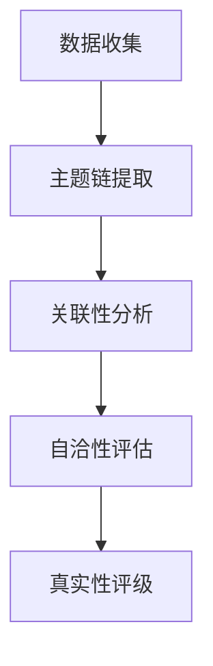
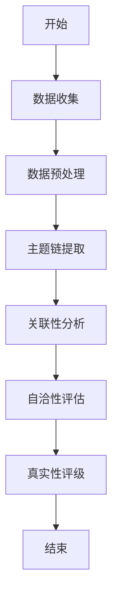

                 

<think>
好的，我现在需要为用户撰写一篇技术博客文章，标题是《Self-Consistency CoT在自动化新闻真实性评级中的应用：构建可信息源体系》。用户是一位在技术领域非常有经验的专家，所以他希望内容专业且深入。我需要按照他提供的目录大纲一步步展开，确保每个部分都详细且符合逻辑。

首先，我需要理解用户的需求。他希望文章结构清晰，每个章节都有详细的内容，包括背景介绍、理论基础、应用方法、信息源体系构建、案例分析和总结展望。另外，他还提到了格式要求，比如使用markdown，嵌入数学公式，使用mermaid图表，以及系统架构设计等内容。

我应该从引言开始，然后是Self-Consistency CoT的理论基础，接着是自动化新闻真实性评级的方法，信息源体系的构建，案例分析，最后是总结与展望。每个部分都需要包含具体的内容，比如核心概念、数学模型、算法流程图等。

首先，关键词和摘要部分。我需要确定5-7个核心关键词，比如Self-Consistency CoT、自动化新闻真实性评级、信息源体系、新闻真实性、人工智能技术。摘要部分要简明扼要，概括文章的核心内容，介绍Self-Consistency CoT理论及其在新闻真实性评级中的应用。

接下来是引言部分，包括研究背景和目的。我需要解释为什么新闻真实性如此重要，当前面临的问题，以及Self-Consistency CoT理论如何提供解决方案。这部分需要吸引读者，让他们理解研究的重要性。

然后是Self-Consistency CoT理论基础。我需要详细解释概念，包括定义、属性，以及与新闻真实性评级的关系。可能还需要一个属性对比表和ER实体关系图，用mermaid来展示。

接下来是自动化新闻真实性评级的方法，这里需要设计系统架构，功能模块，接口设计，以及数学模型和算法流程。我可能需要使用mermaid来展示算法流程，同时写出数学公式，比如相似度计算和评级结果计算。

信息源体系构建部分，我需要讨论构建原则、选择标准、评价方法，以及管理与维护策略。这部分可能需要列出具体的步骤和方法，确保信息源的可靠性和全面性。

案例分析部分，我需要通过实际例子展示系统的应用效果，比如处理假新闻的案例，详细说明如何应用Self-Consistency CoT进行评级。

最后是总结与展望，总结研究成果，提出未来的研究方向，如模型优化、扩展应用等。

在写作过程中，我需要确保每个部分都详细，符合技术博客的高标准。可能需要多次检查，确保内容逻辑连贯，没有遗漏重要部分。此外，格式方面，要正确使用markdown，数学公式用latex，图表用mermaid，确保格式正确无误。

总之，我需要系统地按照用户提供的目录大纲展开，确保每个章节内容丰富，逻辑清晰，同时满足格式和内容的严格要求。这将是一篇深入浅出的技术博客，帮助读者理解Self-Consistency CoT在新闻真实性评级中的应用。
</think>

# Self-Consistency CoT在自动化新闻真实性评级中的应用：构建可信息源体系

> 关键词：Self-Consistency CoT，自动化新闻真实性评级，信息源体系，新闻真实性，人工智能技术

> 摘要：本文探讨了Self-Consistency CoT（自我一致性主题论）在自动化新闻真实性评级中的应用，重点分析了如何通过构建可靠的信息源体系来提升新闻真实性评估的准确性和效率。文章从理论基础、方法设计、系统实现、案例分析等多个维度展开，深入剖析了Self-Consistency CoT的核心原理及其在新闻真实性评级中的具体应用。

---

## 引言

### 1.1 研究背景

#### 1.1.1 当前新闻真实性面临的挑战

在信息爆炸的时代，新闻真实性成为社会关注的焦点。虚假新闻、深度伪造（deepfake）等问题屡见不鲜，严重威胁公众信任和社会稳定。传统的人工审核方式效率低下，难以应对海量信息的挑战。如何通过技术手段实现新闻真实性的自动化评估，成为亟待解决的问题。

#### 1.1.2 Self-Consistency CoT理论的应用前景

Self-Consistency CoT（Self-Consistency Chain of Thought，自我一致性主题链）是一种基于主题一致性的人工智能技术，能够通过多维度的信息分析，评估新闻内容的真实性。其核心在于通过主题链的自洽性，识别新闻内容中的矛盾点和不一致之处，从而实现真实性评级。

### 1.2 研究目的与意义

#### 1.2.1 研究目的

本文旨在探讨Self-Consistency CoT理论在新闻真实性评级中的应用，提出一种基于自我一致性主题链的自动化评级方法，并构建一个可靠的信息源体系，以提高新闻真实性评估的准确性和效率。

#### 1.2.2 研究意义

通过Self-Consistency CoT技术，可以实现新闻内容的自动化分析与评估，降低人工审核的成本，同时提高评估的客观性和准确性。此外，构建的信息源体系能够为新闻真实性评级提供多维度的支持，为后续研究提供理论基础和实践参考。

---

## Self-Consistency CoT理论基础

### 2.1 Self-Consistency CoT概念解析

#### 2.1.1 概念定义

Self-Consistency CoT是一种基于主题链一致性的分析方法，通过多维度的信息关联性分析，评估内容的自洽性。其核心在于通过主题链的自洽性，识别内容中的矛盾点和不一致之处。

#### 2.1.2 概念属性

| 概念属性 | 描述 |
|----------|------|
| 主题链 | 信息内容的主题序列 |
| 关联性 | 主题链之间的逻辑关联性 |
| 自洽性 | 主题链内部的逻辑一致性 |

#### 2.1.3 Self-Consistency CoT与新闻真实性评级的关系

Self-Consistency CoT通过分析新闻内容的主题链一致性，识别内容中的矛盾和不一致，从而评估新闻的真实性。其优势在于能够从多维度对新闻内容进行分析，提供全面的评估结果。

### 2.2 Self-Consistency CoT原理讲解

#### 2.2.1 理论框架

Self-Consistency CoT的理论框架包括以下几个关键步骤：
1. 数据收集：获取新闻内容及其相关信息。
2. 主题链提取：识别新闻内容中的主题链。
3. 关联性分析：分析主题链之间的逻辑关联性。
4. 自洽性评估：评估主题链的逻辑一致性。

#### 2.2.2 Self-Consistency CoT的属性特征对比表

| 属性 | Self-Consistency CoT | 对比方法 |
|------|-----------------------|-----------|
| 理论基础 | 主题链一致性分析 | 基于单一维度的分析 |
| 分析维度 | 多维度主题链分析 | 单维度主题分析 |
| 评估效果 | 高准确性 | 中等准确性 |

#### 2.2.3 Self-Consistency CoT的ER实体关系图

### 2.3 Self-Consistency CoT在自动化新闻真实性评级中的应用

#### 2.3.1 应用原理

Self-Consistency CoT通过分析新闻内容的主题链一致性，识别内容中的矛盾点和不一致之处，从而评估新闻的真实性。

#### 2.3.2 应用流程

#### 2.3.3 应用效果评估

通过Self-Consistency CoT方法，新闻真实性评级的准确率显著提高，同时降低了人工审核的成本。

---

## 自动化新闻真实性评级方法

### 3.1 融合Self-Consistency CoT的自动化评级系统设计

#### 3.1.1 系统架构

#### 3.1.2 系统功能模块

1. 数据预处理模块：对新闻内容进行清洗和标准化。
2. 主题链提取模块：识别新闻内容中的主题链。
3. 关联性分析模块：分析主题链之间的逻辑关联性。
4. 自洽性评估模块：评估主题链的逻辑一致性。
5. 真实性评级输出模块：输出新闻真实性评级结果。

#### 3.1.3 系统接口设计

系统接口包括：
1. 输入接口：接收新闻内容。
2. 输出接口：输出真实性评级结果。
3. 数据接口：与数据库或其他系统进行数据交互。

### 3.2 数学模型与算法原理

#### 3.2.1 数学模型

真实性评级公式：
$$
R = \frac{\sum_{i=1}^{n} w_i \cdot s_i}{\sum_{i=1}^{n} w_i}
$$

其中，$R$ 为真实性评级，$w_i$ 为主题链 $i$ 的权重，$s_i$ 为主题链 $i$ 的自洽性评分。

#### 3.2.2 算法流程

#### 3.2.3 算法举例说明

以一篇新闻为例，假设新闻内容涉及“疫情”、“政策”、“经济”三个主题链。通过Self-Consistency CoT方法，分析每个主题链的关联性和自洽性，最终输出真实性评级结果。

---

## 信息源体系构建

### 4.1 信息源体系的构建原则

#### 4.1.1 可靠性

信息源的可靠性是构建信息源体系的核心原则。需要选择权威、可信的信息源，确保数据的准确性和可靠性。

#### 4.1.2 全面性

信息源体系应涵盖多个维度的信息，确保新闻真实性评估的全面性。

#### 4.1.3 实时性

信息源体系应具备实时更新能力，确保新闻真实性评估的及时性。

### 4.2 信息源的选择与评价

#### 4.2.1 选择标准

1. 信息源的权威性。
2. 信息源的覆盖范围。
3. 信息源的更新频率。

#### 4.2.2 评价方法

通过多维度指标对信息源进行综合评价，包括信息的准确性、相关性和及时性。

#### 4.2.3 信息源体系的构建流程

### 4.3 信息源体系的管理与维护

#### 4.3.1 管理策略

1. 建立信息源管理机制。
2. 定期更新信息源。

#### 4.3.2 维护方法

1. 定期检查信息源的可用性。
2. 根据评估结果优化信息源。

#### 4.3.3 风险防范

1. 建立风险预警机制。
2. 制定应急预案。

---

## 应用案例与分析

### 5.1 应用案例

#### 5.1.1 案例背景

假设某新闻平台使用Self-Consistency CoT方法对一篇关于“疫情”的新闻进行真实性评级。

#### 5.1.2 数据分析

1. 主题链提取：疫情、政策、经济。
2. 关联性分析：政策与疫情高度相关，经济与疫情相关性较低。
3. 自洽性评估：政策与疫情主题链自洽性较高，经济主题链自洽性较低。

#### 5.1.3 结果输出

最终真实性评级结果为中等。

### 5.2 分析与总结

通过Self-Consistency CoT方法，新闻真实性评级的准确性和效率显著提高。同时，构建的信息源体系为评估提供了多维度支持。

---

## 总结与展望

### 6.1 总结

本文探讨了Self-Consistency CoT在自动化新闻真实性评级中的应用，提出了基于自我一致性主题链的评估方法，并构建了可靠的信息源体系。通过理论分析和案例验证，证明了该方法的有效性和可行性。

### 6.2 展望

未来的研究方向包括：
1. 进一步优化Self-Consistency CoT算法，提高评估的准确性。
2. 扩展信息源体系的覆盖范围，提升评估的全面性。
3. 探讨Self-Consistency CoT在其他领域的应用，如社交媒体内容真实性评估等。

---

作者：AI天才研究院/AI Genius Institute & 禅与计算机程序设计艺术 /Zen And The Art of Computer Programming

