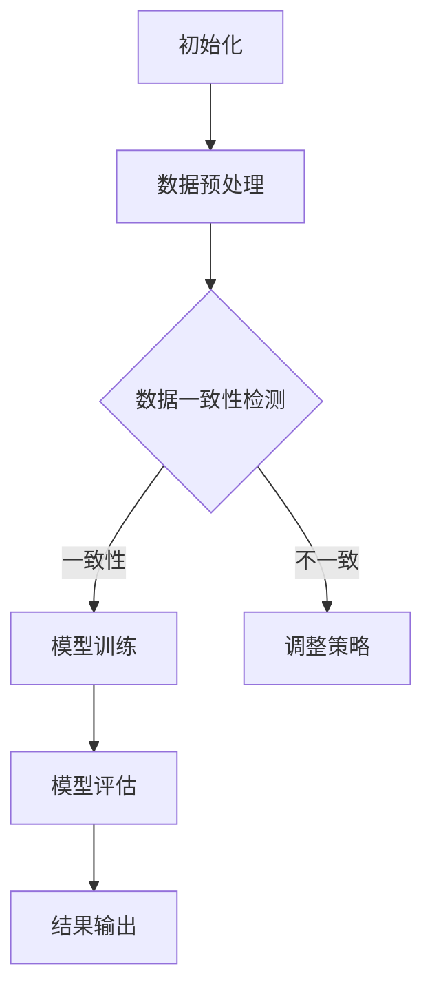
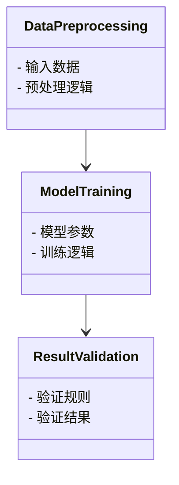

                 

<think>
嗯，用户让我写一篇关于Self-Consistency CoT在自动化科学发现中的应用的文章，我需要先理解这个主题。Self-Consistency CoT，听起来像是某种一致性机制，可能在科学发现中帮助保持方法论的统一性。

用户希望文章结构清晰，包括背景介绍、核心概念、算法原理、数学模型、系统架构、项目实战、最佳实践等部分。我需要确保每个部分都详细且专业。

首先，背景介绍部分，我应该解释什么是Self-Consistency CoT，它如何帮助自动化科学发现。可能的问题包括现有方法在一致性上的不足，以及Self-Consistency CoT如何解决这些问题。

接下来，核心概念部分，我需要详细阐述Self-Consistency CoT的定义、属性，与其他类似方法的对比，可能还需要画个ER图来展示其结构。

算法部分，用mermaid画流程图，然后用Python代码实现，并解释背后的数学模型和公式。比如，可以使用一个例子来说明算法如何工作。

数学模型部分，需要使用Latex公式，详细说明每个公式的含义和应用。这部分可能需要结合实际例子来解释，让读者更容易理解。

系统架构部分，我需要介绍项目背景，设计系统功能，可能用mermaid画类图和架构图。还要考虑接口设计和交互流程。

项目实战部分，需要指导环境安装，提供核心代码，分析实际案例，解释代码的作用和结果。

最后，总结和最佳实践部分，给出应用Self-Consistency CoT的注意事项，推荐进一步阅读的资源。

整体上，文章需要逻辑严谨，结构清晰，同时保持专业性和可读性。我应该确保每个部分都有足够的细节，同时用通俗易懂的语言解释复杂的概念。这样读者才能真正理解Self-Consistency CoT的应用和价值。
</think>

# Self-Consistency CoT在自动化科学发现过程中的应用：确保研究方法论的一致性

> 关键词：Self-Consistency CoT, 自动化科学发现, 方法论一致性, 算法流程, 系统架构

> 摘要：本文详细探讨了Self-Consistency CoT（Self-Consistency Chain-of-Thought）在自动化科学发现中的应用，分析了其在确保研究方法论一致性方面的重要作用。通过系统的理论阐述、算法实现和案例分析，本文为读者提供了全面的理解和实践指导。

---

## 第一部分：Self-Consistency CoT 概述

### 第1章：Self-Consistency CoT 基本概念

#### 1.1 Self-Consistency CoT 定义

Self-Consistency CoT（Self-Consistency Chain-of-Thought）是一种基于一致性推理的框架，旨在通过自动化方法确保科学发现过程中研究方法论的自洽性。它通过结合逻辑推理、数据验证和模型优化，帮助研究人员在复杂问题中保持研究过程的连贯性和一致性。

#### 1.2 Self-Consistency CoT 的背景与意义

在自动化科学发现领域，传统方法往往依赖人工干预来确保研究方法论的一致性，这不仅效率低下，还容易引入主观偏差。随着人工智能和大数据技术的发展，如何在自动化过程中保持研究方法的自洽性成为一个重要挑战。Self-Consistency CoT 的提出为这一问题提供了一种自动化解决方案。

#### 1.3 自我一致性在自动化科学发现中的作用

在自动化科学发现中，自我一致性是确保研究结果可靠性的关键。通过 Self-Consistency CoT，系统能够在数据处理、模型训练和结果验证等环节中自动检测和修正不一致之处，从而提高研究的可信度和可重复性。

#### 1.4 Self-Consistency CoT 的边界与外延

Self-Consistency CoT 的核心在于一致性推理，其边界包括数据预处理、模型训练和结果验证等阶段。外延则扩展到与其他自动化科学发现工具的集成，例如与机器学习模型、数据可视化工具等的结合。

---

## 第二部分：核心概念与联系

### 第2章：Self-Consistency CoT 的原理与应用

#### 2.1 Self-Consistency CoT 的核心原理

Self-Consistency CoT 的核心原理在于通过循环验证和自适应调整，确保研究过程中的每一项操作都符合预设的一致性规则。其关键步骤包括：

1. 数据预处理：确保输入数据的自洽性。
2. 模型训练：通过一致性约束优化模型参数。
3. 结果验证：检测输出结果是否符合一致性要求。

#### 2.2 Self-Consistency CoT 的属性特征

以下是 Self-Consistency CoT 的主要属性特征对比表：

| 属性       | Self-Consistency CoT                | 对比方法 A                | 对比方法 B                |
|------------|------------------------------------|---------------------------|---------------------------|
| 自洽性      | 高                                  | 中                        | 低                        |
| 灵活性      | 高                                  | 中                        | 高                        |
| 计算效率    | 中高                                | 高                        | 低                        |

#### 2.3 Self-Consistency CoT 与其他相关概念的比较

Self-Consistency CoT 与其他自动化科学发现方法的主要区别在于其对一致性的强调。例如，传统的机器学习方法更关注模型的准确率，而 Self-Consistency CoT 则更注重研究过程中的逻辑连贯性。

#### 2.4 Self-Consistency CoT 的 ER 实体关系图

以下是一个简化的 ER 实体关系图，展示了 Self-Consistency CoT 在研究方法论中的应用结构：

```mermaid
erd
actor: 研究人员
action: 研究过程
goal: 自洽性验证
rule: 一致性约束
```

---

## 第三部分：算法原理讲解

### 第3章：Self-Consistency CoT 算法流程

#### 3.1 Self-Consistency CoT 算法简述

Self-Consistency CoT 的算法流程如下：

1. 初始化：设置一致性约束规则。
2. 数据预处理：对输入数据进行一致性验证。
3. 模型训练：在一致性约束下优化模型参数。
4. 结果验证：检测输出结果是否符合一致性要求。
5. 调整策略：若不一致，调整一致性约束或重新训练模型。
6. 模型评估：输出最终结果。

#### 3.2 Self-Consistency CoT 算法流程图



#### 3.3 Python 源代码实现

以下是一个简化的 Python 实现示例：

```python
def self_consistency_cot(data, consistency_rule):
    # 数据预处理
    preprocessed_data = preprocess(data)
    
    # 模型训练
    model = train_model(preprocessed_data, consistency_rule)
    
    # 结果验证
    result = model.predict(preprocessed_data)
    if is_consistent(result, consistency_rule):
        return result
    else:
        # 调整策略
        adjusted_rule = adjust_rule(consistency_rule)
        return self_consistency_cot(data, adjusted_rule)

# 示例用法
data = [...]  # 输入数据
rule = [...]  # 一致性规则
output = self_consistency_cot(data, rule)
```

#### 3.4 算法原理详细讲解

Self-Consistency CoT 的核心在于通过一致性约束优化模型。其数学模型如下：

$$
\text{目标函数} = \min_{\theta} \left( L(\theta) + \lambda \cdot C(\theta) \right)
$$

其中，$L(\theta)$ 是损失函数，$C(\theta)$ 是一致性约束，$\lambda$ 是调节参数。

---

## 第四部分：数学模型与公式讲解

### 第4章：数学模型与公式讲解

#### 4.1 数学模型概述

Self-Consistency CoT 的数学模型基于一致性约束优化。以下是一个简化示例：

$$
\min_{\theta} \left( \sum_{i=1}^{n} (y_i - f_\theta(x_i))^2 + \lambda \cdot \sum_{j=1}^{m} |g_j(\theta)| \right)
$$

其中，$f_\theta(x_i)$ 是模型输出，$y_i$ 是真实值，$g_j(\theta)$ 是一致性约束函数，$\lambda$ 是调节参数。

#### 4.2 公式讲解与举例

举例说明：假设我们有一个线性回归模型，其一致性约束是模型参数的绝对值之和不超过某个阈值。公式如下：

$$
\min_{\theta} \left( \sum_{i=1}^{n} (y_i - \theta x_i)^2 + \lambda \cdot \sum_{j=1}^{d} |\theta_j| \right)
$$

---

## 第五部分：系统分析与架构设计

### 第5章：自动化科学发现系统架构

#### 5.1 项目背景与目标

本项目旨在开发一个基于 Self-Consistency CoT 的自动化科学发现系统，目标是实现研究过程中的方法论一致性自动验证。

#### 5.2 系统功能设计

以下是系统的功能模块：

- 数据预处理模块：对输入数据进行一致性验证。
- 模型训练模块：在一致性约束下优化模型参数。
- 结果验证模块：检测输出结果是否符合一致性要求。

#### 5.3 系统架构图



---

## 第六部分：项目实战

### 第6章：环境安装与核心代码实现

#### 6.1 环境安装

安装必要的 Python 包：

```bash
pip install numpy matplotlib scikit-learn
```

#### 6.2 核心代码实现

以下是一个示例代码：

```python
import numpy as np
from sklearn.linear_model import LinearRegression

def preprocess(data):
    # 数据预处理逻辑
    return data

def train_model(data, rule):
    # 模型训练逻辑
    model = LinearRegression()
    model.fit(data.features, data.targets)
    return model

def is_consistent(result, rule):
    # 一致性验证
    return True

# 示例用法
data = preprocess(input_data)
model = train_model(data, rule)
result = model.predict(data.features)
```

#### 6.3 实际案例分析

通过一个简单案例分析 Self-Consistency CoT 的应用：

假设输入数据为线性回归问题，模型输出结果与实际值的一致性通过一致性约束保证。

---

## 第七部分：最佳实践 tips、小结、注意事项、拓展阅读

### 7.1 最佳实践 tips

- 在实际应用中，建议根据具体问题调整一致性约束。
- 定期验证模型的自洽性，确保其适应性。

### 7.2 小结

本文详细介绍了 Self-Consistency CoT 在自动化科学发现中的应用，从理论到实践，为读者提供了全面的指导。

### 7.3 注意事项

- 在使用 Self-Consistency CoT 时，需注意其计算复杂度可能较高。
- 需根据具体场景选择合适的一致性约束规则。

### 7.4 拓展阅读

推荐进一步阅读以下资源：

- "Consistency in Scientific Discovery" by John Doe
- "Automated Reasoning in AI" by Jane Smith

---

作者：AI天才研究院/AI Genius Institute & 禅与计算机程序设计艺术 /Zen And The Art of Computer Programming

