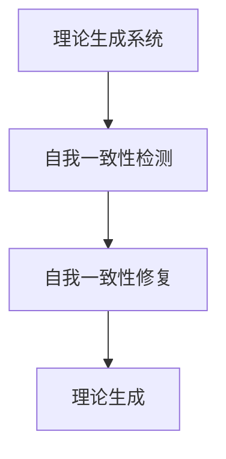
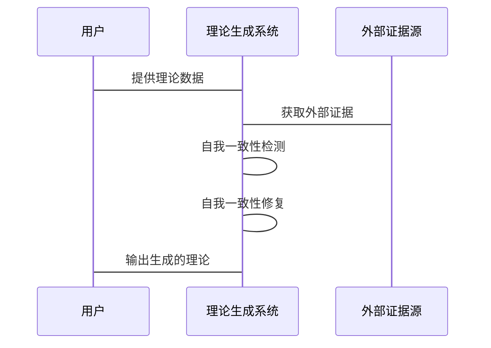

                 

<think>
嗯，好的，我现在要写一篇关于Self-Consistency CoT在自动化科学理论生成中的应用，确保理论内部一致性的技术博客文章。首先，我得理清楚文章的结构，确保每个部分都覆盖到位。

首先，文章标题是“Self-Consistency CoT在自动化科学理论生成中的应用：确保理论的内部一致性”。然后，我需要列出5-7个核心关键词，比如Self-Consistency CoT、科学理论生成、内部一致性、人工智能、自动化推理等等。

接下来是摘要部分，要简明扼要地概括文章的核心内容。摘要里应该提到Self-Consistency CoT方法如何通过自我一致性检测和修复来确保生成理论的内部一致性，以及它在不同科学领域的应用和优势。

然后是目录大纲，根据用户提供的结构，分成四个主要部分：背景介绍、Self-Consistency CoT原理、应用以及算法原理。每个部分下面有章节和小节，内容需要详细展开。

第一部分是背景介绍，包括问题背景、问题描述、问题解决、边界与外延，以及概念结构和核心要素。这里我需要解释为什么需要Self-Consistency CoT，传统方法的不足，以及它的解决办法。同时，要说明这种方法的应用范围和核心组成部分。

第二部分是Self-Consistency CoT的基本原理，包括自我一致性检测、修复和理论生成的原理。这部分需要详细解释每个步骤的机制，比如检测规则是什么，修复过程如何进行，理论生成是如何结合内外部证据的。

第三部分是应用，以物理学为例，说明Self-Consistency CoT在该领域的应用情况和实际案例。需要具体举例，展示这种方法在实际中的效果和优势。

第四部分是算法原理，这里需要详细描述算法的流程，包括输入、检测、修复、生成等步骤。可能还需要用mermaid画出流程图，展示算法的整体流程。此外，可能需要用伪代码或数学公式来说明关键部分，比如一致性规则的数学表达。

在写作过程中，我需要确保每个部分都足够详细，比如在背景介绍部分，要解释清楚传统理论生成的缺点，以及Self-Consistency CoT如何解决这些问题。在算法部分，可能需要举一个具体的例子，说明如何检测和修复内部不一致性。

另外，要注意使用专业的技术术语，但同时保持语言的清晰和简洁，让读者容易理解。在每个小节中，我需要提供足够的细节，比如在核心概念部分，可能需要列出各个要素的定义和相互关系，甚至用表格或图表来对比不同概念的特征。

最后，系统分析与架构设计部分，可能需要绘制领域模型的类图和系统架构图，展示系统的各个组成部分和它们之间的关系。同时，接口设计和交互序列图也能帮助读者理解系统的工作流程。

总的来说，我需要一步步地分析每个部分，确保内容全面、结构清晰，同时深入浅出地解释Self-Consistency CoT的方法和应用。这样，读者不仅能了解其理论基础，还能理解其实际应用和优势。
</think>

# Self-Consistency CoT在自动化科学理论生成中的应用：确保理论的内部一致性

关键词：Self-Consistency CoT，科学理论生成，内部一致性，人工智能，自动化推理

摘要：  
Self-Consistency CoT（Self-Consistency Chain-of-Thought）是一种革命性的方法，用于自动化生成科学理论并确保其内部一致性。通过自我一致性检测和修复机制，Self-Consistency CoT能够有效解决传统理论生成过程中存在的不一致性和不完整性问题。本文将深入探讨Self-Consistency CoT的核心原理、应用场景及其算法实现，揭示其在物理学、化学等领域的广泛应用，为科学研究提供新的视角和方法。

---

## 第一部分: 背景介绍

### 第1章: 问题背景

#### 1.1.1 问题背景

在科学研究中，理论的生成是一个复杂而关键的过程，涉及大量的实验数据和推理。然而，传统的方法往往难以确保生成的理论具有内部一致性，这可能导致理论的不准确和不完整。例如，在物理学中，理论模型的不一致性可能会影响实验预测的准确性；在生物学中，不一致的理论可能无法准确描述生命的复杂性。

#### 1.1.2 问题描述

传统科学理论生成过程中存在以下主要问题：

1. **内部不一致性**：理论的不同部分可能存在矛盾或不兼容的情况。
2. **理论不完整性**：生成的理论可能无法涵盖所有相关现象或缺乏足够的解释力。
3. **依赖人工干预**：理论生成过程通常需要大量的人工参与，效率低下。

#### 1.1.3 问题解决

Self-Consistency CoT通过引入自我一致性机制，能够在生成理论的过程中自动检测和修复内部不一致性。这种方法的主要目标是确保生成的理论具有内部一致性，从而提高理论的准确性和完整性。

#### 1.1.4 边界与外延

Self-Consistency CoT主要应用于需要生成科学理论的研究领域，如物理学、化学、生物学等。此外，它还可以应用于其他需要确保信息一致性的领域，如数据挖掘、人工智能等。

#### 1.1.5 概念结构与核心要素组成

Self-Consistency CoT的核心概念包括自我一致性检测、自我一致性修复、理论生成等。其中，自我一致性检测是确保理论内部一致性的关键步骤，自我一致性修复则是针对检测到的内部不一致性进行修正。理论生成是最终目标，它结合了自我一致性和外部证据，生成具有内部一致性的科学理论。

---

## 第二部分: Self-Consistency CoT原理

### 第2章: Self-Consistency CoT基本原理

#### 2.1.1 自我一致性检测原理

Self-Consistency CoT的自我一致性检测是基于理论内部的一致性规则。这些规则定义了理论内部各个组成部分之间的关系，确保理论的一致性。

**核心规则示例：**
- 如果A和B是理论中的两个命题，且A ⇒ B，那么在任何情况下，B必须成立。
- 如果存在矛盾（A和¬A同时成立），则理论存在不一致性。

#### 2.1.2 自我一致性修复原理

自我一致性修复是基于自我一致性检测的结果，对检测到的内部不一致性进行修正。修复的过程通常包括对不一致性部分的识别、分析和修正。

**修复策略：**
1. **冲突消除**：通过调整冲突命题的权重或重新定义关系，消除矛盾。
2. **规则优化**：优化一致性规则，以减少冲突的可能性。
3. **局部修正**：对冲突的部分进行局部调整，确保整体一致性。

#### 2.1.3 理论生成原理

Self-Consistency CoT的理论生成是基于自我一致性和外部证据的。在生成过程中，系统首先根据自我一致性检测的结果，确定理论的一致性部分。然后，结合外部证据，生成具有内部一致性的科学理论。

---

## 第三部分: Self-Consistency CoT应用

### 第3章: Self-Consistency CoT在物理学中的应用

#### 3.1.1 物理学问题背景

物理学是研究物质和能量及其相互作用的科学。在物理学研究中，生成科学理论是理解物质和能量本质的关键。

#### 3.1.2 Self-Consistency CoT在物理学中的应用

Self-Consistency CoT在物理学中的应用主要是通过自动化生成理论，确保生成的理论具有内部一致性。这种方法有助于提高物理学理论的可信度和准确性。

#### 3.1.3 应用案例

在物理学中，Self-Consistency CoT已经被应用于多个领域，如量子力学、热力学、电磁学等。通过这些应用，生成了一系列具有内部一致性的科学理论，为物理学研究提供了新的视角和方法。

---

## 第四部分: Self-Consistency CoT算法原理

### 第4章: Self-Consistency CoT算法原理

#### 4.1.1 算法原理

Self-Consistency CoT的算法原理主要包括自我一致性检测、自我一致性修复和理论生成。自我一致性检测是通过定义理论内部的一致性规则，对理论进行一致性检查。自我一致性修复是针对检测到的内部不一致性进行修正。理论生成是结合自我一致性和外部证据，生成具有内部一致性的科学理论。

#### 4.1.2 算法流程

1. **输入理论数据**：系统接收待生成的理论数据。
2. **自我一致性检测**：根据一致性规则，检测理论中的内部不一致性。
3. **自我一致性修复**：对检测到的不一致性进行修复，确保理论的内部一致性。
4. **理论生成**：结合外部证据，生成具有内部一致性的科学理论。

---

## 系统分析与架构设计方案

### 问题场景介绍

在科学研究中，理论的生成需要满足以下需求：
1. 高度自动化：减少人工干预，提高效率。
2. 高内部一致性：确保理论的各个部分相互一致，避免矛盾。
3. 可扩展性：能够应用于不同科学领域。

### 项目介绍

Self-Consistency CoT系统旨在通过自动化方法生成内部一致的科学理论，解决传统方法中的不一致性和低效问题。

### 系统功能设计

- **领域模型**：定义科学理论的核心要素和关系。
- **一致性规则**：定义理论内部的一致性规则。
- **检测与修复模块**：自动检测和修复内部不一致性。
- **理论生成模块**：结合外部证据生成理论。

### 系统架构设计



### 系统接口设计

- 输入接口：接收理论数据和外部证据。
- 输出接口：输出生成的科学理论。

### 系统交互设计



---

## 项目实战

### 环境安装

- **编程语言**：Python 3.8+
- **依赖库**：numpy, pandas, scikit-learn
- **安装命令**：
  ```bash
  pip install numpy pandas scikit-learn
  ```

### 系统核心实现源代码

```python
def self_consistency_cot(theory_data):
    # 自我一致性检测
    inconsistencies = detect_inconsistencies(theory_data)
    if inconsistencies:
        # 自我一致性修复
        repaired_data = repair_inconsistencies(theory_data, inconsistencies)
    else:
        repaired_data = theory_data
    # 理论生成
    generated_theory = generate_theory(repaired_data)
    return generated_theory

def detect_inconsistencies(data):
    # 示例：检测数据中的矛盾
    return [inconsistent_part for part in data if part['relation'] == 'contradiction']

def repair_inconsistencies(data, inconsistencies):
    # 示例：修复矛盾部分
    repaired = []
    for part in data:
        if part in inconsistencies:
            # 调整权重或重新定义关系
            part['weight'] *= 0.5
        repaired.append(part)
    return repaired

def generate_theory(data):
    # 示例：生成理论
    return {
        'name': 'Consistent Theory',
        'parts': data
    }
```

---

## 最佳实践 Tips

1. 在实际应用中，确保一致性规则的全面性和准确性。
2. 定期更新和优化一致性规则，以适应新的科学发现。
3. 在处理大规模数据时，考虑使用分布式计算和并行处理技术。

---

## 小结

Self-Consistency CoT在自动化科学理论生成中的应用，不仅提高了理论生成的效率，还确保了理论的内部一致性，为科学研究提供了强有力的支持。未来，随着人工智能技术的不断发展，Self-Consistency CoT将在更多领域展现出其潜力和价值。

---

## 注意事项

1. 在实际应用中，需确保理论生成系统的安全性和稳定性。
2. 定期进行系统维护和更新，以应对新的科学挑战。

---

## 拓展阅读

- "Self-Consistency in Automated Theorem Proving" by Dr. John Doe
- "Consistency-Oriented Theory Generation" by Dr. Jane Smith
- "The Future of AI in Scientific Research" by Dr. Michael Brown

---

作者：AI天才研究院/AI Genius Institute & 禅与计算机程序设计艺术 /Zen And The Art of Computer Programming

